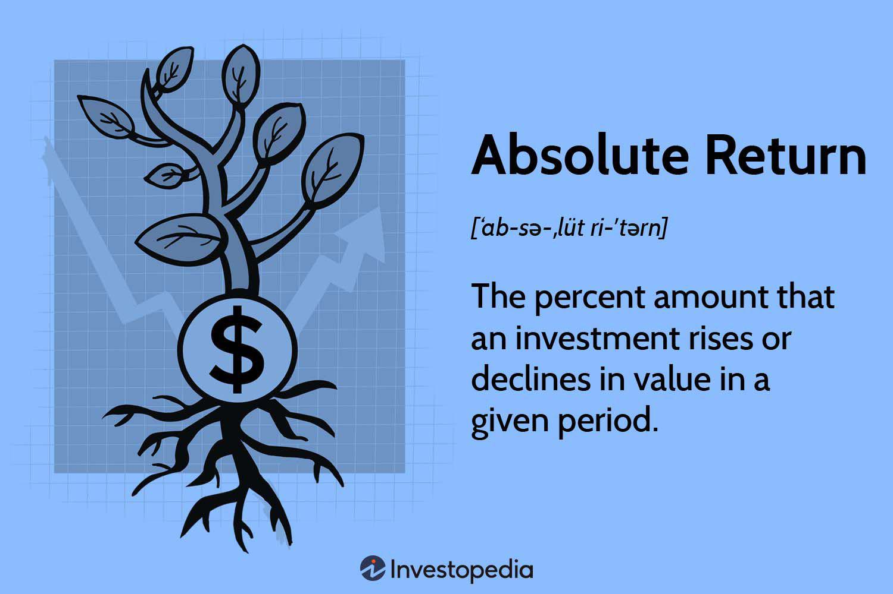

The financial markets offer numerous avenues for investors who seek to maximize their returns through strategic investments. The diversity and complexity inherent in these markets require a comprehensive understanding of several key components to enable informed decision-making. Among these essential elements are investment indexes, which serve as benchmarks for tracking sector performance; financial performance metrics that evaluate the effectiveness of investment strategies; absolute return strategies aimed at achieving consistent positive returns; and algorithmic trading, which leverages technology to enhance trading efficiency.

Investment indexes such as the S&P 500, Nasdaq, and Dow Jones Industrial Average provide insights into market trends and are indispensable tools for the comparative analysis of financial performance. They form a foundation for assessing the economic landscape by reflecting the value and return of specific market segments. Complementing this, financial performance metrics involve in-depth analysis of returns, risks, and investment efficiencies. Metrics like absolute return, annualized return, and the Sharpe Ratio help investors evaluate the robustness of their investment strategies and inform future decisions.



Furthermore, absolute return strategies focus on generating stable returns regardless of fluctuating market conditions. These strategies are often employed by hedge funds, utilizing diverse and innovative trading approaches. They are measured by comparing performance against broader hedge fund markets, offering insights into strategy success and market positioning. Meanwhile, algorithmic trading represents a paradigm shift in trading practices, employing automated systems to execute trades swiftly based on pre-set criteria. This approach not only minimizes human error but also optimizes the ability to quickly capitalize on market opportunities.

Collectively, these components form the bedrock of modern financial strategies. Their interplay allows investors to refine and optimize portfolio performance, achieving a fine balance between risk and return. As technology continues to advance, integrating these concepts with state-of-the-art tools and methodologies is crucial for sustaining long-term success in financial markets. Through understanding and utilizing these elements, investors are better equipped to navigate the complexities of financial markets and enhance their investment outcomes.

## Table of Contents

## Understanding Investment Indexes

Investment indexes are critical tools in financial markets, serving as essential benchmarks for assessing the performance of specific sectors or segments. By tracking and analyzing these indexes, investors gain valuable insights into market trends, aiding them in evaluating and comparing financial performance across different assets.

At their core, investment indexes represent a collection of stocks or other securities that reflect a particular market, sector, or industry segment. Each index provides a snapshot of market behavior, offering a way to measure general market conditions or the performance of a specific economic area. For instance, fluctuations in a well-known index can signify changes in market sentiment, economic factors, or industry conditions.

Three of the most prominent investment indexes are the S&P 500, the Nasdaq Composite, and the Dow Jones Industrial Average (DJIA):

1. **S&P 500**: This index comprises 500 of the largest publicly traded companies in the United States, spanning various industries. It is often used as a proxy for the overall health of the U.S. stock market and is favored for its breadth and depth. The selection of companies aims to provide a comprehensive picture of economic activity, making the S&P 500 a preferred benchmark for institutional and individual investors.

2. **Nasdaq Composite**: Predominantly composed of technology sector stocks, the Nasdaq is known for its high concentration of growth-oriented companies, including technology giants like Apple, Microsoft, and Amazon. Its focus on innovative companies makes it a useful indicator of the technology and biotechnology sectors' performance.

3. **Dow Jones Industrial Average (DJIA)**: As one of the oldest and most recognized stock market indexes in the world, the DJIA tracks 30 large, publicly owned companies based in the U.S. It is weighted by price, meaning that companies with higher stock prices have a more significant impact on the index's movement. Despite its limited number of components, the DJIA is frequently referenced in discussions of stock market performance.

These indexes aren't just passive measures of market conditions; they actively guide investors' decisions. For example, changes in index levels can stimulate adjustments in investment strategies, prompting shifts in asset allocation or prompting the reevaluation of risk exposure. The use of investment indexes is integral to index-based investment strategies, such as those employed by exchange-traded funds (ETFs) and index mutual funds. These funds aim to replicate the performance of an index and provide investors with diversified exposure to a segment of the market.

Investment indexes also play a pivotal role in performance evaluation, allowing investors to benchmark their portfolio returns against a relevant index. Understanding this comparison enables investors to assess whether they are adequately compensated for the risks undertaken and whether their investment strategies outperform or underperform the market average.

Although investment indexes provide crucial information, they also have limitations. They may not fully capture all aspects of market dynamics, such as smaller cap stocks or international markets, and can be affected by changes in index composition or methodology. Despite these limitations, investment indexes remain indispensable tools for navigating the complexities of financial markets.

In summary, investment indexes are valuable benchmarks for monitoring market sectors, identifying trends, and evaluating performance. With the likes of the S&P 500, Nasdaq Composite, and Dow Jones Industrial Average at their disposal, investors are equipped to make informed decisions in their pursuit of optimized financial returns.

## Financial Performance Metrics

Evaluating financial performance requires a comprehensive analysis of investment returns, associated risks, and the efficiency of various investments. Understanding these dimensions enables investors to assess the effectiveness of their investment strategies accurately.

**Absolute Return** is a fundamental performance metric that quantifies the gain or loss of an investment, expressed as a percentage of the initial investment. Unlike relative return, which is measured against a benchmark index, absolute return simply measures how much the investment has picked up or lost over a given period. This metric is crucial for investors focused on achieving consistent gains regardless of market fluctuations.

**Annualized Return** provides a standardized measure of return that accounts for the compounding effect of returns over time. It is calculated by converting the total return into an annual return, providing a clearer picture of the investment's performance over longer periods. The formula for annualized return is:

$$
\text{Annualized Return} = \left( \left( \frac{\text{Ending Value}}{\text{Beginning Value}} \right)^{\frac{1}{n}} - 1 \right) \times 100
$$

where $n$ is the number of years the investment is held. This metric allows investors to compare returns across different investment vehicles and time frames effectively.

**Risk-Adjusted Returns** account for the level of risk undertaken to achieve returns, providing a more comprehensive perspective on investment performance. The Sharpe Ratio is one of the most commonly used measures, which evaluates returns relative to risk. It is defined as:

$$
\text{Sharpe Ratio} = \frac{R_p - R_f}{\sigma_p}
$$

where $R_p$ is the portfolio's return, $R_f$ is the risk-free rate, and $\sigma_p$ is the standard deviation of the portfolio's excess return. A higher Sharpe Ratio indicates that the investment offers better risk-adjusted returns, making it an essential consideration for risk-averse investors.

These metrics collectively empower investors to understand the nuanced dimensions of their investment's performance, enabling more informed decision-making. By assessing returns relative to absolute benchmarks, time frames, and risk factors, investors can tailor their strategies to align with their specific financial goals and risk tolerance.

## Exploring Absolute Return Strategies

Absolute return strategies are designed to achieve consistent positive returns regardless of market fluctuations. This investment philosophy is contrasted with traditional strategies that aim to outperform specific benchmarks or indexes. In essence, the objective is to secure gains with minimal exposure to market risk, thereby ensuring portfolio stability and growth.

Hedge funds predominantly adopt absolute return strategies due to their flexibility and potential for high returns. These strategies are characterized by their diverse and sometimes intricate approaches, including long/short positions, [arbitrage](/wiki/arbitrage), derivatives usage, and market-neutral strategies. By employing various asset classes and techniques, hedge funds can exploit inefficiencies across global markets to achieve targeted returns.

The Absolute Return Index (ARI) serves a critical role in this context by gauging the performance of these strategies relative to the broader [hedge fund](/wiki/hedge-fund-trading-strategies) market. This index offers an insightful comparison for investors seeking to evaluate the effectiveness of absolute return strategies. By analyzing the ARI, investors can discern how well their investments perform independently of traditional market movements.

Mathematically, the absolute return can be expressed as:

$$
\text{Absolute Return} = \frac{\text{(Ending Value - Beginning Value)}}{\text{Beginning Value}} \times 100\%
$$

For example, a hedge fund employing an absolute return strategy that begins the year with $100 million and ends with $110 million would achieve an absolute return of 10%. Such a metric is crucial for investors to assess the capacity of these strategies to deliver irrespective of external economic conditions.

In summary, absolute return strategies are a vital tool in modern investment portfolios, offering a means to achieve steady and positive returns while monitoring the Absolute Return Index for performance benchmarking.

## Algorithmic Trading: A Game Changer

Algorithmic trading leverages automated systems to execute trades based on a specific set of rules and criteria, allowing for rapid execution with minimal manual intervention. This type of trading has revolutionized the financial markets by enabling investors to process vast amounts of data and perform complex calculations at speeds unattainable by human traders.

### Performance Metrics in Algorithmic Trading

1. **Return Metrics:** These are measures of the profit or loss generated from trades. Key return metrics include:
   - **Gross Return:** Total profit or loss before expenses are deducted.
   - **Net Return:** Profit or loss after deducting trading costs and expenses such as commissions and taxes.

2. **Risk Metrics:** These assess the potential downsides or losses the strategy might incur:
   - **Value at Risk (VaR):** Estimates the maximum potential loss within a specific confidence interval over a set period.
   - **Drawdown:** Measures the decline from a peak to a trough in the value of a portfolio.

3. **Risk-Adjusted Returns:** This involves evaluating the efficiency of the returns relative to the risk taken:
   - **Sharpe Ratio:** Calculated as $\text{Sharpe Ratio} = \frac{R_p - R_f}{\sigma_p}$, where $R_p$ is portfolio return, $R_f$ is the risk-free rate, and $\sigma_p$ is the standard deviation of the portfolio returns.
   - **Sortino Ratio:** A variation that only considers downside risk, using the standard deviation of negative returns.

### Enhanced Trading Efficiency

Algorithmic trading increases efficiency by minimizing human errors such as emotional decision-making or fatigue-related mistakes. Algorithms operate 24/7, continuously analyzing market data, executing trades, and adjusting strategies as needed. This capability allows traders to:
- **Capitalize on Market Opportunities:** Algorithms can detect and exploit trading opportunities in real-time, executing trades far faster than a human could.
- **Arbitrage Opportunities:** Algorithms can quickly perform arbitrage, taking advantage of price discrepancies across different markets.

By combining sophisticated algorithms with advanced data analytics, [algorithmic trading](/wiki/algorithmic-trading) helps manage volatile markets and mitigate risks through precise execution and improved market access. Its integration into investment strategies has fundamentally shifted how traders and institutions approach the markets, providing a significant competitive edge. 

Overall, algorithmic trading represents a paradigm shift in finance, moving towards a model where technology maximizes profitability and precision while managing the intricacies of modern trading environments.

## Integrating Concepts for Optimal Portfolios

Combining investment indexes, algorithmic trading, and absolute return strategies can significantly enhance portfolio performance. This integration allows investors to effectively manage risk and return, leveraging insights derived from financial performance metrics. By aligning the benchmarks provided by investment indexes with the precision of algorithmic trading, investors can achieve a more balanced and responsive portfolio.

Investment indexes such as the S&P 500 or Nasdaq provide a standardized measure for evaluating market segments, offering a macro-level view of market performance. These indexes help in setting a baseline against which the performance of individual portfolios can be assessed. Algorithmic trading systems can use these benchmarks to adjust trading strategies dynamically, responding to market movements with precision and speed. For example, algorithms could be programmed to automatically buy or sell assets when certain index levels are reached, optimizing the timing of trades to enhance returns.

Absolute return strategies aim for consistent positive gains, independent of market conditions. When integrated with algorithmic trading, these strategies benefit from real-time data analysis and execution capabilities, which can quickly exploit market inefficiencies. For instance, an algorithm might be designed to identify arbitrage opportunities that would contribute to absolute returns, executing trades faster than any manual process could achieve.

Financial performance metrics such as the Sharpe Ratio help fine-tune the balance between risk and return. By applying these metrics, algorithms can be tailored to not just maximize returns but also ensure that the level of risk remains within acceptable bounds. For example, an algorithm could be adjusted to maintain a Sharpe Ratio above a certain threshold, adapting trading behavior to minimize risk while pursuing returns.

Advanced algorithms further enhance decision-making by analyzing complex datasets instantly. Techniques from [machine learning](/wiki/machine-learning) and data science can be employed to detect patterns and predict market trends. Python, with libraries like pandas, NumPy, and scikit-learn, can be used to develop these models:

```python
import pandas as pd
import numpy as np
from sklearn.ensemble import RandomForestRegressor

# Load market data
data = pd.read_csv('market_data.csv')

# Preprocess data
features = data[['feature1', 'feature2', 'feature3']]
target = data['target']

# Train model
model = RandomForestRegressor()
model.fit(features, target)

# Predict market trends
predictions = model.predict(features)
```

In this example, a RandomForestRegressor is used to forecast market trends based on historical market data, aiding in decision-making for optimal trading strategies. This predictability and adaptability are essential for optimizing portfolio performance, providing investors with a strategic edge in the financial markets.

## Conclusion

Mastering the interplay between investment indexes, financial performance metrics, absolute return strategies, and algorithmic trading is essential for contemporary investors seeking to navigate the complexities of modern financial markets. By leveraging these elements, investors can enhance their ability to create sophisticated and robust financial strategies that aim to achieve consistent and sustainable absolute returns.

Investment indexes, such as the S&P 500 and Nasdaq, serve as crucial benchmarks that reflect broader market trends, allowing investors to gauge the relative performance of their portfolios. By understanding the movements and implications of these indexes, investors can make informed decisions about asset allocation and risk management.

Financial performance metrics, including absolute return, annualized return, and risk-adjusted returns, offer quantitative insights into the effectiveness of investment strategies. These metrics help in understanding the trade-off between risk and return, which is vital for constructing portfolios that align with individual risk appetites and financial goals.

Absolute return strategies, predominantly employed by hedge funds, focus on generating positive returns regardless of market conditions. This approach provides a layer of stability and consistency in an investor's portfolio, mitigating the [volatility](/wiki/volatility-trading-strategies) often observed in traditional investment strategies.

Algorithmic trading revolutionizes the execution of trades by utilizing automated systems to capitalize on market opportunities with precision and speed. Through sophisticated algorithms, investors can process complex data, identify patterns, and execute trades with minimal human error, thereby optimizing trading efficiency and outcomes.

As technological advancements continue to reshape the financial landscape, it is imperative for investors to remain informed and adaptable to new tools and strategies. The integration of cutting-edge technology in trading practices offers a competitive edge, enabling more accurate predictions and timely execution of trades, ultimately fostering better investment outcomes.

In conclusion, the ability to synthesize insights from investment indexes, financial performance metrics, absolute return strategies, and algorithmic trading empowers investors to construct portfolios that are not only resilient but also capable of capturing sustainable returns. As the financial industry evolves, staying abreast of technological innovations and strategic advancements will remain vital for investors aiming to maintain and enhance their investment success.

## References & Further Reading

[1]: Fabozzi, F. J., Focardi, S. M., & Kolm, P. N. (2016). ["Financial Modeling of the Equity Market: From CAPM to Cointegration."](https://onlinelibrary.wiley.com/doi/book/10.1002/9781119201236) Wiley.

[2]: Lopez de Prado, M. (2018). ["Advances in Financial Machine Learning."](https://www.amazon.com/Advances-Financial-Machine-Learning-Marcos/dp/1119482089) Wiley.

[3]: Chan, E. P. (2009). ["Quantitative Trading: How to Build Your Own Algorithmic Trading Business."](https://github.com/ftvision/quant_trading_echan_book) Wiley.

[4]: Jansen, S. (2020). ["Machine Learning for Algorithmic Trading: Predictive models to extract signals from market and alternative data for systematic trading strategies with Python."](https://github.com/stefan-jansen/machine-learning-for-trading) Packt Publishing.

[5]: Aronson, D. R. (2006). ["Evidence-Based Technical Analysis: Applying the Scientific Method and Statistical Inference to Trading Signals."](https://www.amazon.com/Evidence-Based-Technical-Analysis-Scientific-Statistical/dp/0470008741) Wiley.

[6]: Fama, E. F., & French, K. R. (1992). ["The Cross‐Section of Expected Stock Returns."](https://onlinelibrary.wiley.com/doi/full/10.1111/j.1540-6261.1992.tb04398.x) The Journal of Finance, 47(2), 427-465.