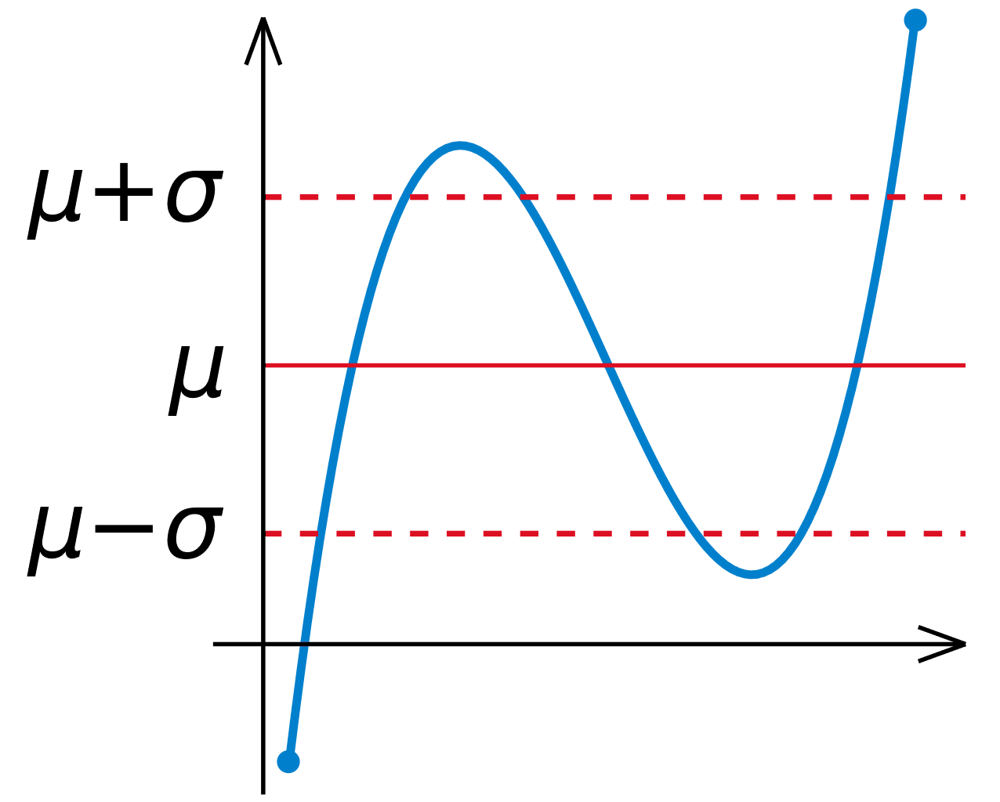

In the world of investing, understanding the different methods of measuring investment returns is crucial for both novice and seasoned investors. Absolute and relative returns serve as fundamental metrics that provide unique insights into the performance of investments. Absolute return measures the total gain or loss of an investment over a specific period without comparing it to any external benchmark, thereby offering a straightforward evaluation of an investment's performance. On the other hand, relative return assesses the performance of an investment compared to a benchmark index or market standard, highlighting how well an investment has performed in relation to the broader market.

Algorithmic trading is an advanced strategy that leverages these concepts of absolute and relative returns to potentially enhance returns. By utilizing complex algorithms and high-speed data processing, investors can execute trades with precision and at scale, seeking to exploit market inefficiencies and price discrepancies. This article aims to explore the intricacies surrounding absolute and relative returns and their practical application in algorithmic trading. We will discuss how these metrics can guide investment decisions, optimize trading strategies, and ultimately contribute to achieving desirable financial outcomes.



## Table of Contents

## Understanding Absolute Return

Absolute return is a metric used to evaluate the total return an investment generates over a specific period, without regard to any external benchmarks or indices. This metric offers a straightforward assessment of performance by focusing exclusively on the actual gains or losses, representing the net change in the investment’s value.

Unlike relative return, which measures how an investment performs against a benchmark, absolute return is centered on the raw performance. This focus allows investors and fund managers to appraise investment decisions based on their specific outcomes, irrespective of broader market movements. This is especially favorable when analyzing the performance of diversified portfolios and hedge funds, where the emphasis is often on achieving consistent, positive returns.

Fund managers who adopt absolute return strategies target a steady stream of profits, regardless of prevailing market conditions. This approach requires a versatile toolbox, often deploying techniques such as short selling, derivatives, and leverage to hedge against potential losses and to capitalize on various market scenarios.

1. **Short Selling**: This involves selling securities not currently owned, with the expectation of buying them back at a lower price in the future. This strategy profits from price declines and is a common tool in absolute return strategies to mitigate risk during market downturns.

2. **Derivatives**: Financial contracts whose value is dependent on an underlying asset, index, or rate are extensively used to enhance returns or protect against volatility. Options, futures, and swaps provide flexibility and potential for profit in different market environments.

3. **Leverage**: Borrowing capital to invest more than what is available from equity alone can amplify returns. While leverage increases the potential return on investment, it also elevates the risk, hence its application requires careful management within an absolute return framework.

For example, a simplified Python calculation of absolute return on an investment could look like this:

```python
def calculate_absolute_return(initial_investment, final_value):
    absolute_return = final_value - initial_investment
    return absolute_return

# Example usage:
initial_investment = 10000  # Initial value of the investment
final_value = 12000        # Value of the investment at the end of the period
absolute_return = calculate_absolute_return(initial_investment, final_value)
print(f"Absolute return: ${absolute_return}")  # Output: Absolute return: $2000
```

In this example, the absolute return is $2,000, indicating the total profit made over the investment period without considering any market benchmarks. Understanding and utilizing absolute return measurements can be vital for investors who prioritize achieving stable, market-independent returns over traditional market-relative strategies.

## Exploring Relative Return

Relative return assesses an investment's performance by comparing it to a benchmark index or market standard. This comparison helps to determine how well a particular investment or portfolio has performed in relation to the overall market or a specific sector, providing valuable insights into the fund manager's effectiveness.

1. **Indicator of Outperformance**: Relative return is directly linked to the concept of alpha, which represents the excess return of an investment over the return of a benchmark index. In formulaic terms, alpha ($\alpha$) can be expressed as:
$$
   \alpha = R_i - (\beta \times R_b)

$$
   where $R_i$ is the return of the investment, $R_b$ is the return of the benchmark, and $\beta$ is the measure of the investment's risk in relation to the market. A positive alpha indicates that the investment has outperformed the benchmark, thereby showcasing the manager's prowess in generating value beyond the market's average returns.

2. **Justifying Management Costs**: For actively managed funds, achieving positive relative returns is critical because it justifies the higher management fees compared to passive indexing strategies. Active managers aim to leverage their expertise to exceed market averages, and consistent positive relative returns can substantiate the rationale for these additional costs.

3. **Measuring Performance**: When an investment shows a positive relative return, it signifies that it has outperformed the chosen benchmark. Conversely, a negative relative return implies underperformance. This measure is crucial for investors as it provides context to the performance, allowing them to understand whether the investment met its objectives in relation to the broader market conditions.

4. **Investment Contextualization**: Evaluating relative returns helps investors contextualize their investment success beyond absolute numbers. By comparing the returns against a benchmark, investors gain insights into the efficiency and effectiveness of their investments, even when market conditions vary. This evaluation is essential for making informed decisions, allowing investors to adjust their portfolios in alignment with the pursuit of outperforming relevant market indices.

## Absolute vs. Relative Return: Key Differences

Absolute return focuses on measuring the performance of an investment by examining the actual gains or losses realized over a specified time period. It does not consider external market conditions or benchmarks, offering a straightforward assessment of how much value an investment has gained or lost in absolute terms. For example, if an investment grows from $1,000 to $1,100 over a year, the absolute return is 10%. This measure is particularly valuable for investors who prioritize knowing the definitive increase or decrease in their investment's value, independent of broader market dynamics.

In contrast, relative return evaluates the performance of an investment by comparing it against a predefined benchmark or index, such as the S&P 500. This comparison offers insights into how well the investment has performed relative to the broader market or its peers. Relative return is crucial for assessing the effectiveness of active fund managers who aim to outperform market indices. If the same investment of $1,000 growing to $1,100 is benchmarked against a market index that increased by 15% in the same period, the relative return would be -5%, suggesting underperformance.

The strategic purposes of absolute and relative returns differ significantly. Absolute return strategies focus on achieving positive gains regardless of market conditions, often aiming for steady growth with minimal [volatility](/wiki/volatility-trading-strategies). In contrast, relative return strategies highlight market outperformance and are often associated with higher volatility and risk, as fund managers seek to exceed the benchmark's performance.

Investors who understand both absolute and relative return metrics can make more informed investment decisions by choosing strategies that align with their financial goals and risk tolerance. These metrics each provide unique insights—absolute return offers a clear picture of profit or loss, while relative return contextualizes performance within broader market trends. By integrating both approaches, investors can develop robust strategies that accommodate diverse market conditions and objectives.

## Algorithmic Trading and Investment Returns

Algorithmic trading uses computer algorithms to automatically execute trades based on predefined instructions derived from quantitative data analysis. This method seeks to enhance efficacy by leveraging absolute and relative return metrics. These metrics are crucial as they provide insights into market performance and investment returns, thus aiding the optimization of algorithms.

In [algorithmic trading](/wiki/algorithmic-trading), performance metrics such as alpha, beta, and Sharpe ratio are paramount. Alpha measures an investment's performance in excess of a market index or benchmark, indicating the value a trader adds beyond the market return. Beta quantifies the volatility or systemic risk of an investment compared to the market as a whole. The Sharpe ratio evaluates risk-adjusted returns by calculating the excess return per unit of risk, expressed as:

$$
\text{Sharpe Ratio} = \frac{E[R] - R_f}{\sigma}
$$

where $E[R]$ is the expected return, $R_f$ is the risk-free rate, and $\sigma$ is the standard deviation of the investment's excess return.

Through these metrics, traders adjust their strategies to maximize gains and manage risks effectively. Algorithmic trading often exploits short-term price discrepancies and market inefficiencies. High-frequency trading ([HFT](/wiki/high-frequency-trading-strategies)), a subtype of algorithmic trading, executes numerous orders at extremely fast speeds and small time-level scales. HFT demands a deep understanding of both metrics to capitalize on fleeting market opportunities.

An essential aspect of algorithmic trading is understanding risk-adjusted returns to enhance trading strategies and mitigate risks. This involves analyzing both the potential risks and returns, modifying trading strategies accordingly. Machine learning and advanced statistical models can further refine these algorithms by predicting future price movements and adjusting strategies in real-time.

For instance, using Python, one might utilize libraries such as `pandas` for data manipulation, and `numpy` for numerical calculations, to conduct a detailed analysis of historical data and identify patterns that can inform trading algorithms:

```python
import pandas as pd
import numpy as np

# Load historical data
data = pd.read_csv('market_data.csv')

# Calculate returns
data['Returns'] = data['Price'].pct_change()

# Calculate rolling Sharpe Ratio
risk_free_rate = 0.01
data['Excess_Return'] = data['Returns'] - risk_free_rate / 252
data['Rolling_Sharpe'] = data['Excess_Return'].rolling(window=252).mean() / data['Excess_Return'].rolling(window=252).std()

# Find times to buy when Sharpe is at its peak
buy_signals = data[data['Rolling_Sharpe'] > data['Rolling_Sharpe'].quantile(0.95)]
```

In summary, algorithmic trading effectively integrates insights from absolute and relative performance metrics to streamline financial strategies, potentially enhancing returns and minimizing risks. Employing a structured approach melds quantitative analysis with advanced trading tactics, aiming for sustained profitability in dynamic market conditions.

## Implementing a Balanced Investment Strategy

A balanced investment strategy integrates both absolute and relative return methodologies to achieve comprehensive portfolio management. By diversifying assets across various classes such as equities, bonds, and commodities, investors can manage risk effectively while optimizing returns. Diversification mitigates the impact of individual asset volatility on the overall portfolio, thereby stabilizing returns over time.

Portfolio managers should continuously assess their strategies using both absolute and relative return metrics. Absolute return provides clarity on the total gains or losses of an investment independent of external factors, allowing managers to evaluate the effectiveness of their strategies in generating positive outcomes. Meanwhile, relative return, which measures performance against benchmark indices, can highlight the managerial ability to achieve alpha and outperform the market. This dual analysis offers a comprehensive performance review, enabling managers to adjust their strategies according to market conditions and individual asset performance.

Advanced technological tools and platforms play a crucial role in monitoring and adjusting trading algorithms. These tools can analyze vast datasets and market trends efficiently, providing real-time analytics that facilitate timely decision-making. For instance, using Python's data analysis libraries like pandas and NumPy, managers can simulate various scenarios and adjust their portfolios based on insights derived from these simulations. Moreover, [machine learning](/wiki/machine-learning) algorithms can be employed to predict market movements and optimize trading strategies further.

When implementing a balanced investment strategy, investors must align their approach with their financial goals and risk tolerance. Assessing risk tolerance involves understanding the degree of variability in returns that an investor is willing to withstand. Those with a higher risk tolerance might lean towards strategies with substantial exposure to equities, whereas conservative investors might prefer a higher allocation in bonds.

For example, a Python code snippet could simulate portfolio outcomes based on different risk scenarios:

```python
import numpy as np
import pandas as pd

# Simulating portfolio returns
np.random.seed(42)
simulated_returns = np.random.normal(0.05, 0.1, 1000)

# Creating a DataFrame for analysis
portfolio_df = pd.DataFrame(data=simulated_returns, columns=["Returns"])

# Analyzing the portfolio
mean_return = portfolio_df["Returns"].mean()
risk = portfolio_df["Returns"].std()

print(f"Mean Return: {mean_return:.2%}")
print(f"Risk (Standard Deviation): {risk:.2%}")
```

In summary, a balanced investment strategy leverages the strengths of both absolute and relative return approaches, enhanced by technology and aligned with the investor's objectives and risk appetite. This integration is essential for developing resilient strategies that can adapt to market dynamics effectively.

## Conclusion

Understanding absolute and relative returns is crucial in assessing the effectiveness of investment strategies and implementing data-driven decision-making processes. Absolute returns provide a straightforward metric, reflecting the actual financial gains or losses of an investment without comparison to market benchmarks. This information is invaluable when evaluating portfolios that aim for consistent positive results or when the goal is to achieve returns independent of market conditions.

In contrast, relative returns offer insights into an investment’s performance relative to an index or another standard. This perspective is particularly significant for active fund managers tasked with outperforming market benchmarks. The distinction emphasizes the importance of understanding both return types, as they serve different strategic purposes and offer varied insights into investment success.

Algorithmic trading stands out as a sophisticated approach to leveraging these return concepts. By employing computer algorithms capable of executing trades based on pre-defined criteria, algorithmic trading seeks to enhance financial outcomes by optimizing strategies in light of both absolute and relative returns. This method is further supported by performance metrics such as alpha, beta, and the Sharpe ratio, which are crucial for evaluating risk-adjusted returns and refining trading strategies.

In integrating absolute and relative return measures, investors can craft robust strategies capable of weathering market fluctuations. A balanced approach ensures that investment strategies are not only striving for absolute gains but also achieving favorable results relative to the broader market. Such integration provides a comprehensive understanding of portfolio performance and guides strategic adjustments as necessary.

For investors and traders, equipping themselves with knowledge of these return metrics means gaining a competitive edge in the financial landscape. As market dynamics continue to evolve, continuous learning and adaptation are essential. New technologies and financial instruments present both opportunities and challenges, underscoring the importance of staying informed and adaptable to achieve sustained investment success.

## References & Further Reading

[1]: Falkenstein, E. G. (2009). ["Finding Alpha: The Search for Alpha When Risk and Return Break Down."](https://www.semanticscholar.org/paper/Finding-Alpha%3A-The-Search-for-Alpha-When-Risk-and-Falkenstein/1fbb17c01fb6bcb7a5113100592e40abeab91ac1) Wiley Finance.

[2]: Narang, R. K. (2013). ["Inside the Black Box: A Simple Guide to Quantitative and High Frequency Trading."](https://onlinelibrary.wiley.com/doi/book/10.1002/9781118662717) Wiley.

[3]: Gu, S., Kelly, B., & Xiu, D. (2020). ["Empirical Asset Pricing via Machine Learning."](https://www.nber.org/papers/w25398) Review of Asset Pricing Studies.

[4]: Chan, E. (2009). ["Quantitative Trading: How to Build Your Own Algorithmic Trading Business."](https://github.com/ftvision/quant_trading_echan_book) Wiley Trading.

[5]: Lopez de Prado, M. (2018). ["Advances in Financial Machine Learning."](https://www.amazon.com/Advances-Financial-Machine-Learning-Marcos/dp/1119482089) Wiley.