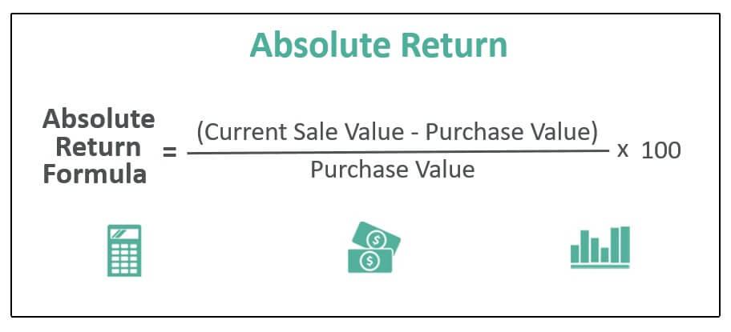

Understanding different methods of measuring investment success is crucial for investors aiming to maximize returns and manage risks effectively. Among the various approaches, absolute return and relative return are two fundamental metrics that provide different perspectives on investment performance. Absolute return measures the gain or loss of an investment over a specified period, regardless of market movements, offering a straightforward assessment of profitability. In contrast, relative return evaluates performance by comparing an investment's returns to a benchmark or market index, providing context about how well the investment fares against the broader market.

Alongside these traditional measures, algorithmic trading has emerged as a transformative force in the investment landscape. By leveraging data, advanced algorithms, and technology, algorithmic trading facilitates more efficient and strategic decision-making in financial markets. It enables the automation of trading strategies, allowing for the rapid execution of trades with precision and reduced human error. This advancement is increasingly significant for investors who adopt both absolute and relative return strategies, as algorithmic trading can enhance strategy implementation and optimize trade execution.



This article explores the distinctions between absolute and relative returns, and examines how algorithmic trading is reshaping the investment landscape. By comparing these return metrics and understanding the role of technology, investors can better align their strategies with market dynamics and optimize their portfolios for success.

## Table of Contents

## What is Absolute Return?

Absolute return refers to the gain or loss on an investment over a specified period, expressed as a percentage. It measures the performance of an asset independently of any benchmark or index. This method of evaluation is particularly beneficial in that it provides a clear indication of the actual monetary gains or losses an investor can expect, without comparing the performance to external factors such as market indices.

In financial terms, if an investment initially valued at $1000 grows to $1100 over a year, the absolute return is calculated as:

$$
\text{Absolute Return} = \left( \frac{\text{Final Value} - \text{Initial Value}}{\text{Initial Value}} \right) \times 100
$$

Applying the formula:

$$
\text{Absolute Return} = \left( \frac{1100 - 1000}{1000} \right) \times 100 = 10\%
$$

Absolute returns are frequently associated with investment strategies utilized by hedge funds. These funds often focus on achieving positive returns in a variety of market conditions, whether they are bullish, bearish, or neutral. By not tying investment performance to a benchmark, hedge funds aim to generate consistent, positive outcomes, a strategy that can appeal to investors seeking stability and predictability in returns.

The concept of absolute return was pioneered by Alfred Winslow Jones, who established the first known absolute return fund in 1949, effectively marking the inception of hedge funds. Jones employed a unique approach that combined long and short positions with leverage to mitigate risk and enhance returns. This approach allowed hedge funds to pursue absolute return targets irrespective of market fluctuations, setting a foundation for similar strategies that many funds continue to employ today.

## Understanding Relative Return

Relative return is a metric that evaluates the performance of an investment relative to a specific benchmark or market index. The main objective of assessing relative returns is to determine whether an asset or portfolio has outperformed or underperformed compared to the broader market or a designated benchmark, such as the Standard & Poor's 500 Index (S&P 500) or a relevant sector index.

This concept is widely used to evaluate the performance of fund managers, as it provides a contextual measure of their ability to add value over passive investment strategies. By comparing an investment's return to a benchmark, investors can gain insights into how well the manager is performing in navigating market conditions.

Mathematically, the relative return ($R_r$) can be expressed as:

$$
R_r = R_i - R_b
$$

where $R_i$ is the return of the investment, and $R_b$ is the return of the benchmark. For example, if a mutual fund achieves a return of 7% over a particular period while its benchmark gains 5%, the relative return would be:

$$
R_r = 7\% - 5\% = 2\%
$$

This positive relative return indicates that the fund has outperformed its benchmark by 2%.

Relative return strategies are prevalent in mutual fund management, where the goal is often to exceed benchmark returns while adhering to specified investment mandates. Such strategies are typically employed by active fund managers who utilize a variety of analytical techniques and market insights to identify opportunities that will generate excess returns.

The emphasis on relative return is also crucial in periods of market [volatility](/wiki/volatility-trading-strategies). While absolute returns provide a straightforward measure of profit or loss, relative returns adjust for broader market movements, offering a more nuanced perspective of investment performance. In this way, relative return strategies can offer a measure of skill by determining whether returns are due to managerial decision-making rather than simply market trends.

Integrating relative return analysis into investment strategies allows for more informed decisions, helping investors to understand and evaluate the effectiveness of their investment approaches in achieving long-term financial goals.

## Absolute Return vs. Relative Return

The key difference between absolute and relative return lies in the methodology of performance measurement. Absolute return focuses on the total gain or loss of an investment over a specific period, without taking into account external factors or market movements. It is expressed as a percentage and provides a clear picture of an investment's performance on its own merit. This type of measurement is particularly valuable in volatile markets where traditional benchmarks may not accurately reflect an asset's performance. Investors who prioritize absolute returns typically aim for positive returns regardless of broader market conditions.

In contrast, relative return evaluates an investment's performance in relation to a benchmark or market index, providing a comparative perspective. This method assesses whether an investment has outperformed or underperformed the market or a pre-determined standard. For instance, if a mutual fund achieves a 7% increase while its benchmark index rises by 5%, the relative return is 2%. This calculation underscores the fund manager's effectiveness in providing value over the selected index. Relative return strategies are predominantly used in the context of fund management, where the goal is to consistently surpass the chosen benchmark.

The choice between focusing on absolute or relative return depends on investor goals and market conditions. Absolute returns are advantageous when markets are unstable, allowing investors to gauge an investment's true performance independent of market trends. Conversely, during stable market periods, relative returns offer essential insights by evaluating performance against market movements, thus aiding investors in decision-making processes by highlighting active management quality. 

In summary, absolute and relative returns serve distinct purposes: the former stands on its own, offering an independent view of an asset's performance, while the latter contextualizes the performance against broader market metrics, offering insight into relative effectiveness. Investment strategies often weigh these approaches according to market conditions and investor objectives, seeking an optimal balance to achieve desired outcomes.

 to Algorithmic Trading

Algorithmic trading leverages automated systems to execute trading orders based on predefined criteria, revolutionizing the investment landscape by offering speed and efficiency. These systems employ computer programs to analyze vast amounts of market data, executing trades at speeds and frequencies that are impossible for human traders. This capability allows [algorithmic trading](/wiki/algorithmic-trading) to capitalize on even the smallest price discrepancies or trends, enhancing both the potential gains and minimization of costs.

A key feature of algorithmic trading is its ability to implement strategies with precision. Common strategies used include:

1. **Arbitrage:** This strategy exploits price differences of the same asset across different markets or forms. When a stock is priced lower on one exchange compared to another, an algorithmic system can simultaneously buy low and sell high, profiting from the discrepancy.

2. **Trend Following:** This strategy is based on the assumption that assets which have been moving in a particular direction will continue to do so. Algorithms track historical and delayed market data to create predictive analytics models that guide buying and selling decisions in response to upward or downward trends.

3. **Market Making:** This involves placing both buy and sell orders for a security, simultaneously providing liquidity to the market. The algorithm adjusts orders based on market conditions and demand, often profiting from the bid-ask spread.

Algorithmic trading is particularly useful in implementing both absolute and relative return strategies. For absolute returns, algorithms focus on generating profits irrespective of market benchmarks, often adapting to real-time data to seize profitable opportunities. Relative return strategies, in contrast, aim to outperform specific benchmarks, necessitating precise execution to maintain a competitive edge over market averages.

By automating processes, these algorithms significantly reduce the emotional and psychological influences in trading. Moreover, they optimize trade execution, ensuring that transactions occur under optimal market conditions, which is crucial in volatile markets. For instance, by minimizing human intervention, algorithms can execute trades milliseconds after favorable conditions arise, an advantage that can convert fleeting opportunities into realized gains.

Programming languages like Python are popular choices for developing trading algorithms due to their robust libraries and flexibility. The use of Python enables the integration of complex mathematical models and data science techniques, helping refine trading strategies further. This technological capability underlines the vital role of algorithmic trading in modern financial markets.

## Benefits and Risks of Algorithmic Trading

Algorithmic trading is characterized by its ability to offer significant advantages in the trading environment, primarily through speed, precision, and the capacity for [backtesting](/wiki/backtesting) trading strategies. These benefits stem from the automated nature of algorithmic systems, which can process complex mathematical models and execute trades in fractions of a second. This high-speed execution is particularly advantageous in markets with high volatility, where price discrepancies can occur rapidly and unexpectedly.

Backtesting is a crucial element of algorithmic trading, permitting traders to evaluate the potential success of a strategy by applying it to historical market data. This capability helps in refining trading strategies before they are deployed in real-time, thus minimizing potential losses and optimizing gains. For instance, an algorithm might use a rolling average crossover strategy to identify profitable trade opportunities. By backtesting the historical data, traders can assess and adjust parameters such as the length of the moving averages to enhance strategy performance.

Despite its benefits, algorithmic trading is not without risks. Technological failures, such as internet outages or malfunctioning hardware, can lead to significant losses, as the automated systems rely on a consistent and fast connection to the trading platform. Moreover, market volatility poses a risk as rapid price movements can lead to slippage, where the actual execution price deviates from the expected price, potentially worsening trade outcomes.

To mitigate these risks, traders must ensure that their algorithms align with their broader investment objectives and risk tolerances. This often involves setting stop-loss limits and maximum exposure levels within the algorithm to prevent excessive losses. Furthermore, robust error-checking mechanisms and real-time monitoring systems are essential to promptly identify and address any technical issues that could arise during trading.

Algorithmic systems enhance the implementation of both absolute and relative return strategies by optimizing market conditions. For absolute return strategies, algorithms aim to consistently generate profits regardless of market direction by exploiting opportunities such as statistical [arbitrage](/wiki/arbitrage). In contrast, relative return strategies benefit from algorithms that focus on outperforming specific benchmarks, utilizing techniques like pairs trading to capitalize on market inefficiencies.

In summary, while algorithmic trading significantly advances trading efficacy through speed and precision, it requires careful consideration of risks associated with technology and market dynamics. The strategic implementation of these algorithms can optimize both absolute and relative return strategies, providing significant advantages in a competitive trading environment.

## Implementing Absolute and Relative Returns in Algorithmic Trading

To integrate absolute return strategies within algorithmic trading, algorithms are designed to generate consistent gains irrespective of market directions. This approach involves leveraging data-driven models that focus on identifying opportunities for profit in various market conditions. By employing techniques such as [statistical arbitrage](/wiki/statistical-arbitrage), market-neutral strategies, or volatility trading, algorithms can execute trades that aim to achieve positive returns regardless of the broader market movements. This ensures that the algorithm remains profitable even when the market experiences downturns, aligning with the overarching goal of absolute return strategies.

Relative return strategies, on the other hand, require algorithms to consistently outperform specific benchmarks. This involves setting predefined criteria that measure the algorithm's performance against these benchmarks over time. By using methods such as [momentum](/wiki/momentum) trading or [pair trading](/wiki/pair-trading), algorithms can dynamically adjust their positions to capitalize on assets that are likely to outperform the market indices. The primary objective is to yield returns that exceed those of the benchmark, thereby demonstrating superior performance.

Combining absolute and relative return strategies in a diversified portfolio can enhance stability and performance across different market phases. This involves allocating capital to algorithmic systems tailored for both strategies, thereby hedging against market volatility while also striving for benchmark outperformance. Such a combined approach allows investors to benefit from both the safety net provided by absolute returns and the potential for higher gains associated with relative returns.

Algorithmic trading tools provide precise control over trade execution, optimizing the effectiveness of each return approach. By utilizing advanced order types, risk management algorithms, and real-time data analytics, traders can fine-tune their strategies to respond promptly to market changes. For instance, employing [machine learning](/wiki/machine-learning) models can improve the accuracy of predictions regarding asset price movements, thus enhancing the implementation of both absolute and relative return strategies.

Python is frequently used in algorithmic trading due to its robust libraries and frameworks like Pandas, NumPy, and scikit-learn, which facilitate data analysis, numerical computations, and machine learning.

Here is a basic Python code snippet illustrating how one might start implementing a simple algorithm focusing on relative returns by comparing asset performances against a benchmark:

```python
import yfinance as yf
import numpy as np

# Define a benchmark and a list of assets
benchmark = yf.Ticker('^GSPC')  # S&P 500 Index
assets = ['AAPL', 'MSFT', 'GOOGL']

# Download historical data
benchmark_data = benchmark.history(period='1y')
asset_data = {asset: yf.Ticker(asset).history(period='1y') for asset in assets}

# Calculate daily returns
benchmark_returns = benchmark_data['Close'].pct_change().dropna()
asset_returns = {asset: data['Close'].pct_change().dropna() for asset, data in asset_data.items()}

# Calculate relative returns
relative_returns = {asset: (asset_returns[asset] - benchmark_returns).cumsum() for asset in assets}

print("Relative Returns of Assets Over One Year:")
for asset, returns in relative_returns.items():
    print(f"{asset}: {returns[-1]:.2f}")
```

This code downloads historical price data for a benchmark index and selected assets, calculates their daily returns, and computes the cumulative relative return, providing insights into which assets have outperformed the benchmark. By leveraging algorithmic strategies to manage this data effectively, traders can systematically exploit market inefficiencies for both absolute and relative return strategies.

## Conclusion

Understanding absolute and relative returns is an essential component in crafting a robust investment strategy. Absolute return strategies focus on achieving positive returns irrespective of market conditions, while relative return strategies aim to outperform specific benchmarks. Both approaches offer unique insights and advantages, highlighting the importance of balancing these strategies in a diversified investment portfolio.

Algorithmic trading has become a powerful tool in implementing and optimizing these strategies within real-time market conditions. Algorithms enable precise execution and monitoring of trades, allowing for quick adaptations to market movements. The speed and efficiency of algorithmic trading make it well-suited for managing both absolute and relative return strategies, facilitating increased precision and potentially higher profits.

Investors should carefully consider the proportion of absolute return focus versus relative return performance when designing their portfolios. A portfolio that effectively integrates these strategies can navigate a variety of market conditions, leveraging the strengths of each approach. As technology continues to advance, the role of algorithmic trading in achieving desired investment outcomes is likely to expand, offering new opportunities and efficiencies in the financial markets.

The integration of algorithms in portfolio management not only enhances execution but also provides investors with tools to backtest and refine strategies, diminishing risks associated with human errors. As such, the ongoing evolution of technology will likely see a more pronounced use of algorithmic trading in ensuring consistent application of absolute and relative return strategies, which can greatly influence the success of investment portfolios.

## References & Further Reading

[1]: Bergstra, J., Bardenet, R., Bengio, Y., & Kégl, B. (2011). ["Algorithms for Hyper-Parameter Optimization."](https://dl.acm.org/doi/10.5555/2986459.2986743) Advances in Neural Information Processing Systems 24.

[2]: ["Advances in Financial Machine Learning"](https://www.amazon.com/Advances-Financial-Machine-Learning-Marcos/dp/1119482089) by Marcos Lopez de Prado

[3]: ["Evidence-Based Technical Analysis: Applying the Scientific Method and Statistical Inference to Trading Signals"](https://www.amazon.com/Evidence-Based-Technical-Analysis-Scientific-Statistical/dp/0470008741) by David Aronson

[4]: ["Machine Learning for Algorithmic Trading"](https://github.com/stefan-jansen/machine-learning-for-trading) by Stefan Jansen

[5]: ["Quantitative Trading: How to Build Your Own Algorithmic Trading Business"](https://github.com/LucindaYa/quant-resources/blob/master/Quantitative%20Trading%20How%20to%20Build%20Your%20Own%20Algorithmic%20Trading%20Business.pdf) by Ernest P. Chan