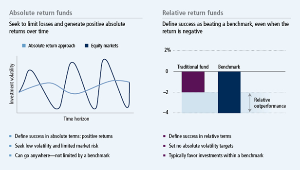

## Table of Contents

## What is the basic definition of absolute return?

Absolute return is a way to measure how well an investment is doing. It looks at the total increase or decrease in the value of an investment over a certain period, without comparing it to any other investments or benchmarks. For example, if you invest $100 and it grows to $110, your absolute return is 10%.

This type of return is different from relative return, which compares an investment's performance to a specific index or market. Absolute return focuses on the actual gain or loss, making it useful for investors who want to know exactly how much their money has grown or shrunk, regardless of what the market is doing. It's often used in strategies that aim to make money in any market condition, not just when the market is going up.

## What is the basic definition of relative return?

Relative return is a way to see how well an investment is doing compared to something else, like a stock market index or another investment. It tells you if your investment did better or worse than the thing you're comparing it to. For example, if your investment went up by 5% and the market went up by 3%, your relative return would be positive because you did better than the market.

This type of return is useful for investors who want to know if their choices are beating the market or other investments. It helps them see if their strategy is working well compared to what others are doing. Relative return is often used by fund managers and investors to show how skilled they are at [picking](/wiki/asset-class-picking) investments that outperform common benchmarks.

## How is absolute return calculated?

To calculate absolute return, you take the final value of your investment and subtract the initial value. Then, you divide that difference by the initial value and multiply by 100 to get a percentage. For example, if you invested $100 and it grew to $120, you would subtract $100 from $120 to get $20. Then, you divide $20 by $100 to get 0.20, and multiply by 100 to find that your absolute return is 20%.

Absolute return is a simple way to see how much your investment has grown or shrunk over time. It doesn't matter what the market or other investments did during that time. This makes it useful for understanding the actual gain or loss on your money, without comparing it to anything else.

## How is relative return calculated?

Relative return is calculated by comparing the performance of your investment to a benchmark, like a stock market index. First, you find the return of your investment and the return of the benchmark over the same period. Then, you subtract the benchmark's return from your investment's return. For example, if your investment grew by 8% and the benchmark grew by 5%, you would subtract 5% from 8% to get a relative return of 3%.

This calculation helps you see if your investment did better or worse than the market or another standard. A positive relative return means your investment outperformed the benchmark, while a negative relative return means it underperformed. It's a useful tool for investors who want to know if their investment choices are beating the market or other investments, helping them gauge the effectiveness of their investment strategy.

## Can you provide a simple example of absolute return?

Imagine you bought a stock for $50. After a year, the stock is now worth $60. To find the absolute return, you take the new value of $60 and subtract the original value of $50. That gives you $10. Then, you divide $10 by the original $50 to get 0.20. Multiply that by 100 to turn it into a percentage, and you see that your absolute return is 20%.

This means your investment grew by 20% over the year. Absolute return is a straightforward way to see how much your money has grown or shrunk, without comparing it to anything else. It's useful because it tells you exactly how much you've gained or lost, no matter what the market did.

## Can you provide a simple example of relative return?

Let's say you invested in a stock that went up by 7% over a year. During the same time, the stock market, which you're using as your benchmark, went up by 5%. To find the relative return, you subtract the market's return from your stock's return. So, 7% minus 5% equals 2%. This means your stock did 2% better than the market, giving you a positive relative return.

Relative return helps you see if your investment is doing better or worse than something else, like the stock market. It's useful because it shows if your choices are beating the market. If your stock had only gone up by 3% instead of 7%, your relative return would be negative because 3% minus 5% equals -2%. This would mean your stock did worse than the market by 2%.

## What are the key differences between absolute return and relative return?

Absolute return and relative return are two ways to measure how well an investment is doing, but they look at different things. Absolute return tells you the total increase or decrease in the value of your investment over time. It's like looking at how much your money grew or shrunk without comparing it to anything else. For example, if you invest $100 and it becomes $110, your absolute return is 10%. This type of return is useful if you just want to know how much you've gained or lost, no matter what the market did.

Relative return, on the other hand, compares your investment's performance to something else, like a stock market index. It shows if your investment did better or worse than the market or another benchmark. For instance, if your investment went up by 8% and the market went up by 5%, your relative return would be 3% because you did better than the market. This type of return is helpful if you want to see if your investment choices are beating the market or other investments. It's often used by investors to see if their strategies are working well compared to others.

## In what scenarios would an investor prefer absolute return over relative return?

An investor might prefer absolute return when they want to know exactly how much their money has grown or shrunk, without comparing it to anything else. For example, if someone is saving for a specific goal, like buying a house or paying for college, they might care more about the actual amount of money they have at the end, rather than how it did compared to the market. Absolute return helps them see if they're on track to reach their goal, no matter what the market is doing.

Another scenario where absolute return might be preferred is when an investor is using a strategy that aims to make money in any market condition. Some investors use strategies that try to make a positive return whether the market goes up, down, or stays the same. In these cases, they might not care about beating the market; they just want to see if their strategy is working to increase their money. Absolute return gives them a clear picture of their gains or losses, which is more important to them than how they did compared to others.

## In what scenarios would an investor prefer relative return over absolute return?

An investor might prefer relative return when they want to see if their investments are doing better than the market or other investments. For example, if someone is trying to pick stocks that will beat the stock market, they would look at relative return to see if they're doing a good job. It helps them know if their choices are smart compared to what everyone else is doing. This is important for people who want to show they can pick winners or for those who are paid based on how well they do compared to the market.

Another time when relative return is useful is when an investor is comparing different funds or investment managers. If you're trying to decide which mutual fund to invest in, you might look at how each fund did compared to the market. This helps you see which fund manager is doing a better job at picking investments. Relative return gives you a way to judge performance against a common standard, which can be more helpful than just looking at how much money each fund made.

## How do absolute return and relative return impact investment strategy?

When you're making an investment strategy, knowing about absolute return and relative return can help you decide what you want to focus on. If you care about absolute return, you're looking at how much your money grows or shrinks over time. This is good if you have a specific goal, like saving for a house or retirement. You want to know if you're getting closer to that goal, no matter what the market does. So, you might choose investments that aim to make money in any market condition, like bonds or certain types of funds that try to give you a steady return.

On the other hand, if you're more interested in relative return, you're comparing your investments to the market or other benchmarks. This is useful if you want to see if you're doing better than everyone else. Maybe you're trying to pick stocks that will beat the market, or you're a fund manager who gets paid based on how well you do compared to others. In this case, your strategy might focus on picking the best stocks or funds that you think will do better than the market. You'll keep an eye on how your choices are doing compared to the market, and adjust your strategy to try to keep beating it.

## What are the potential pitfalls of focusing solely on absolute return?

Focusing only on absolute return can make you miss out on important information. If you just look at how much your money grew or shrunk, you might not see if you're doing better or worse than the market. This can be a problem if you want to know if your investment choices are smart compared to what everyone else is doing. For example, if your investment went up by 5% but the market went up by 10%, you might think you did okay, but you actually did worse than the market.

Another issue is that focusing only on absolute return might make you take more risk than you should. If you're just trying to get a certain amount of money, you might choose investments that promise big returns but are also very risky. This can lead to big losses if things don't go well. It's important to think about both how much you can gain and how much you could lose, and looking at relative return can help you see if the risks you're taking are worth it compared to safer options.

## What are the potential pitfalls of focusing solely on relative return?

Focusing only on relative return can make you forget about the actual amount of money you're making or losing. If your investment does better than the market, you might feel good about it, but if the market is going down, you could still be losing money. For example, if the market goes down by 5% and your investment only goes down by 3%, you have a positive relative return, but you're still losing money. This can be a problem if you need to reach a certain amount of money for a goal, like buying a house or paying for college.

Another problem with focusing only on relative return is that it might make you take too much risk. If you're always trying to beat the market, you might choose investments that are very risky just to try to do better than everyone else. This can lead to big losses if things don't go well. It's important to think about both how much you can gain and how much you could lose, and looking at absolute return can help you see if the risks you're taking are worth it for the actual amount of money you're making.

## What is Absolute Return?

Absolute return refers to the gain or loss on an investment over a specified period, expressed as a percentage. It measures the performance of an asset independently of any benchmark or index. This method of evaluation is particularly beneficial in that it provides a clear indication of the actual monetary gains or losses an investor can expect, without comparing the performance to external factors such as market indices.

In financial terms, if an investment initially valued at $1000 grows to $1100 over a year, the absolute return is calculated as:

$$
\text{Absolute Return} = \left( \frac{\text{Final Value} - \text{Initial Value}}{\text{Initial Value}} \right) \times 100
$$

Applying the formula:

$$
\text{Absolute Return} = \left( \frac{1100 - 1000}{1000} \right) \times 100 = 10\%
$$

Absolute returns are frequently associated with investment strategies utilized by hedge funds. These funds often focus on achieving positive returns in a variety of market conditions, whether they are bullish, bearish, or neutral. By not tying investment performance to a benchmark, hedge funds aim to generate consistent, positive outcomes, a strategy that can appeal to investors seeking stability and predictability in returns.

The concept of absolute return was pioneered by Alfred Winslow Jones, who established the first known absolute return fund in 1949, effectively marking the inception of hedge funds. Jones employed a unique approach that combined long and short positions with leverage to mitigate risk and enhance returns. This approach allowed hedge funds to pursue absolute return targets irrespective of market fluctuations, setting a foundation for similar strategies that many funds continue to employ today.

## What is Understanding Relative Return?

Relative return is a metric that evaluates the performance of an investment relative to a specific benchmark or market index. The main objective of assessing relative returns is to determine whether an asset or portfolio has outperformed or underperformed compared to the broader market or a designated benchmark, such as the Standard & Poor's 500 Index (S&P 500) or a relevant sector index.

This concept is widely used to evaluate the performance of fund managers, as it provides a contextual measure of their ability to add value over passive investment strategies. By comparing an investment's return to a benchmark, investors can gain insights into how well the manager is performing in navigating market conditions.

Mathematically, the relative return ($R_r$) can be expressed as:

$$
R_r = R_i - R_b
$$

where $R_i$ is the return of the investment, and $R_b$ is the return of the benchmark. For example, if a mutual fund achieves a return of 7% over a particular period while its benchmark gains 5%, the relative return would be:

$$
R_r = 7\% - 5\% = 2\%
$$

This positive relative return indicates that the fund has outperformed its benchmark by 2%.

Relative return strategies are prevalent in mutual fund management, where the goal is often to exceed benchmark returns while adhering to specified investment mandates. Such strategies are typically employed by active fund managers who utilize a variety of analytical techniques and market insights to identify opportunities that will generate excess returns.

The emphasis on relative return is also crucial in periods of market [volatility](/wiki/volatility-trading-strategies). While absolute returns provide a straightforward measure of profit or loss, relative returns adjust for broader market movements, offering a more nuanced perspective of investment performance. In this way, relative return strategies can offer a measure of skill by determining whether returns are due to managerial decision-making rather than simply market trends.

Integrating relative return analysis into investment strategies allows for more informed decisions, helping investors to understand and evaluate the effectiveness of their investment approaches in achieving long-term financial goals.

## References & Further Reading

[1]: Bergstra, J., Bardenet, R., Bengio, Y., & Kégl, B. (2011). ["Algorithms for Hyper-Parameter Optimization."](https://dl.acm.org/doi/10.5555/2986459.2986743) Advances in Neural Information Processing Systems 24.

[2]: ["Advances in Financial Machine Learning"](https://www.amazon.com/Advances-Financial-Machine-Learning-Marcos/dp/1119482089) by Marcos Lopez de Prado

[3]: ["Evidence-Based Technical Analysis: Applying the Scientific Method and Statistical Inference to Trading Signals"](https://www.amazon.com/Evidence-Based-Technical-Analysis-Scientific-Statistical/dp/0470008741) by David Aronson

[4]: ["Machine Learning for Algorithmic Trading"](https://github.com/stefan-jansen/machine-learning-for-trading) by Stefan Jansen

[5]: ["Quantitative Trading: How to Build Your Own Algorithmic Trading Business"](https://github.com/LucindaYa/quant-resources/blob/master/Quantitative%20Trading%20How%20to%20Build%20Your%20Own%20Algorithmic%20Trading%20Business.pdf) by Ernest P. Chan