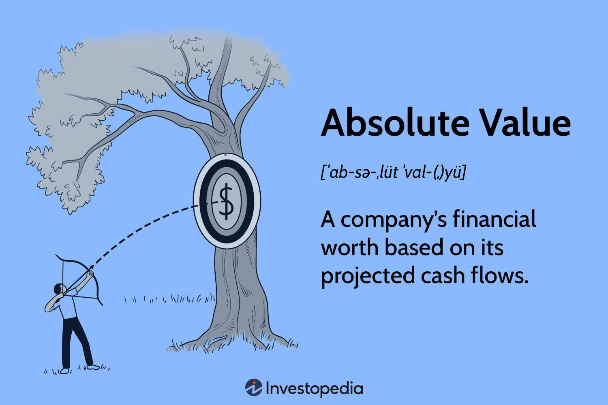

The world of finance is constantly evolving, with new technologies and methodologies reshaping the landscape. One of the most prominent developments in recent years is algorithmic trading, which utilizes computer algorithms to execute trading strategies with speed and efficiency. These strategies often rely on complex mathematical models to predict market movements and optimize trading decisions. Among the critical mathematical concepts underpinning these models is the concept of absolute value.

Absolute value, a fundamental concept in mathematics, represents the non-negative magnitude of a number regardless of its sign. This mathematical principle is integral in finance, where it can be used to assess the intrinsic value of assets independent of volatile market conditions. Understanding absolute value is essential for developing precise trading strategies, as it helps in removing noise from data and focusing on the core variables.



In this exploration of the intersection of finance, math, and algorithmic trading, we will address how absolute value calculations are integral to these processes. The application of mathematics in finance is extensive, providing tools that allow for the refinement of trading strategies. Absolute value calculations can be used to establish thresholds for trade execution, risk assessments, and model adjustments, especially during volatile market conditions.

The integration of absolute value into algorithmic trading underscores the importance of mathematical rigor in financial applications. This article will investigate the methodologies used in absolute value calculations and their implications for algorithmic trading strategies. As algorithmic trading continues to grow, the reliance on mathematical concepts such as absolute value will become even more vital, driving innovation and efficiency in the financial markets.

## Table of Contents

## What is Absolute Value?

Absolute value is a basic yet essential concept in mathematics, often denoted by vertical bars around a number, such as $|x|$. Mathematically, it represents the distance of a number from zero on a number line, disregarding its sign. This can be formally expressed as:

$$
|x| = 
\begin{cases} 
x, & \text{if } x \geq 0 \\
-x, & \text{if } x < 0 
\end{cases}
$$

In financial contexts, absolute value assumes a slightly different role by aiding in the determination of an asset's intrinsic worth, independent of extraneous market influences. This intrinsic value forms a cornerstone of [fundamental analysis](/wiki/fundamental-analysis), helping investors appraise the true "value" of an asset without being swayed by short-term market [volatility](/wiki/volatility-trading-strategies), sentiment, or external variables.

To translate this into a financial scenario, consider the absolute value as a tool for stripping away noise from the market's perception of an asset's value. This has parallels with concepts like net present value (NPV) in financial modeling, where future cash flows are discounted back to their present value to understand an asset's worth objectively. While not exactly the same calculation as mathematical absolute value, the philosophical underpinning remains—separating core value from fluctuating perceptions or external conditions.

Moreover, in risk management, absolute value can be employed in the calculation of metrics like the absolute drawdown. This measures the maximum equity loss of a portfolio from the initial investment, offering investors a direct look at potential loss magnitudes without the influence of previous gains.

By integrating the fundamental mathematical notion of absolute value, financial models help investors and algorithmic systems to establish baselines, make more informed decisions based on intrinsic merits, and maintain resilience against market fluctuations or biases.

## Methods of Calculating Absolute Value

Absolute value is a mathematical concept denoting the non-negative value of a number without regard to its sign. In the context of finance, absolute value computations often focus on models that help determine the value of an asset or project by focusing exclusively on intrinsic, rather than extrinsic, factors. One such critical model used in finance is the Discounted Cash Flow (DCF) method, which calculates the present value of expected future cash flows. This method is particularly essential for evaluating investment opportunities and making informed trading decisions.

### Discounted Cash Flow (DCF) Calculation

The DCF model is a primary method employed to compute an asset's absolute value by assessing its anticipated future cash inflows and outflows. The principle behind DCF is that a dollar today is worth more than a dollar in the future due to its potential [earning](/wiki/earning-announcement) capacity. Therefore, future cash flows must be discounted back to their present value using a required rate of return or discount rate.

The formula for DCF is:

$$
DCF = \sum_{t=1}^{n} \frac{CF_t}{(1 + r)^t}
$$

Where:
- $CF_t$ = Cash flow at time $t$
- $r$ = Discount rate
- $n$ = Total number of periods

### Step-by-Step Example

**Step 1: Forecast Cash Flows**

Estimate future cash flows for the asset or project over a specified period. For example:
- Year 1: $100,000
- Year 2: $120,000
- Year 3: $150,000

**Step 2: Choose a Discount Rate**

Determine an appropriate discount rate based on the riskiness of the cash flows. This rate reflects the opportunity cost and risk profile of the investment.

**Step 3: Calculate Present Value of Cash Flows**

Apply the DCF formula to compute the present value of each cash flow.

For instance, if the chosen discount rate is 8%, the calculations would be:

- Year 1: $\frac{100,000}{(1 + 0.08)^1} = 92,593$
- Year 2: $\frac{120,000}{(1 + 0.08)^2} = 102,893$
- Year 3: $\frac{150,000}{(1 + 0.08)^3} = 119,403$

**Step 4: Sum the Present Values**

Add all present values to get the total DCF:
$$

DCF = 92,593 + 102,893 + 119,403 = 314,889 
$$

### Application in Financial Models and Algorithmic Strategies

The absolute value computed through DCF is instrumental in financial strategies by offering a baseline for comparisons. Investors use these calculations to determine an asset's intrinsic value and make buy or sell decisions based on whether the current market price is above or below this intrinsic value. In [algorithmic trading](/wiki/algorithmic-trading), DCF models can be integrated into algorithms to trigger transactions when certain thresholds are crossed, enhancing precision in executing trades.

Algorithmic strategies often implement Python-based solutions to constantly assess DCF values amidst changing market conditions. Here is a simple Python function to calculate DCF:

```python
def calculate_dcf(cash_flows, discount_rate):
    dcf_value = 0
    for t, cf in enumerate(cash_flows, start=1):
        dcf_value += cf / (1 + discount_rate) ** t
    return dcf_value

# Example Usage
cash_flows = [100000, 120000, 150000]
discount_rate = 0.08
dcf_value = calculate_dcf(cash_flows, discount_rate)
print(f"Calculated DCF: {dcf_value}")
```

This script succinctly demonstrates how computational models facilitate sophisticated financial analysis and trading practices. By systemic recursion through each cash flow, this function calculates their present values, offering a rapid assessment of an investment's potential appeal.

## Algorithmic Trading and Absolute Value

Algorithmic trading has become a cornerstone of modern financial practices, driven by the complexity and speed it brings to trading operations. Central to this approach is the integration of mathematical methods, with absolute value playing a crucial role in refining strategies and decisions.

Absolute value calculations serve as a vital tool in trading strategies by assessing the intrinsic differences between various market values. This involves considering the magnitude of changes without the influence of direction, thus offering a clearer perspective on asset valuation and market movements. By leveraging absolute values, algorithmic models can better gauge volatility, set stop-loss orders, and optimize entry and [exit](/wiki/exit-strategy) points.

One primary example of implementing absolute value in algorithmic trading is volatility calculation. When determining market volatility, the absolute value of price deviations from a mean or predicted value can be used to establish a robust measure of market risk. For instance, a simple volatility indicator might be calculated using:

$$
\text{Volatility} = \frac{1}{n}\sum_{i=1}^{n} | P_i - \bar{P} |
$$

where $P_i$ are individual price points and $\bar{P}$ is the mean price over the period $n$. This measure helps traders recognize abnormal market conditions and adjust their algorithms accordingly.

Case studies underscore the application of absolute values in trading environments. For example, quantitative hedge funds often use statistical [arbitrage](/wiki/arbitrage) strategies that rely on price disparities between related securities. By employing absolute value calculations, these funds can identify and exploit these discrepancies efficiently. Such strategies typically involve algorithms programmed to seek out minor but statistically significant price differences, enabling the traders to execute high-frequency trades that capitalize on price convergence.

Algorithm developers also incorporate absolute value into their stop-loss mechanisms. This ensures that positions are liquidated promptly when deviations exceed acceptable risk thresholds. An algorithm might be configured to trigger a sale if the absolute difference between the current asset price and the entry price surpasses a predefined limit, safeguarding against excessive losses.

Another practical application is within the context of risk management frameworks. By calculating the absolute value of potential losses, financial institutions can set precise leverage limits and margin requirements, effectively controlling risk exposure. This use of absolute values helps align trading activities with underlying risk management strategies, fostering a more stable trading environment.

In conclusion, absolute value calculations not only enhance the precision of algorithmic trading models but also contribute to more effective and strategic financial decision-making. Through careful application, traders can refine their approach to market volatility, price discrepancies, and risk management, ultimately aiming for optimized performance and sustained profitability in increasingly competitive markets.

## Challenges and Considerations

Using absolute value in algorithmic trading presents various challenges and considerations that must be addressed to ensure effective implementation and accurate outcomes. One of the major challenges associated with applying absolute value in algorithmic trading is data limitations. High-quality, reliable data is essential for accurate calculations and informed decision-making. Inadequate or erroneous data can lead to incorrect valuations, resulting in suboptimal or misguided trading strategies. Ensuring data integrity and precision is crucial, as even slight discrepancies can significantly alter outcomes.

Market volatility is another critical [factor](/wiki/factor-investing) impacting the use of absolute value in trading algorithms. Financial markets are inherently dynamic and can experience rapid fluctuations, which complicates the task of predicting asset values and making informed decisions. Volatility can obscure the intrinsic value of assets, making it challenging to assess their true worth accurately. Algorithms must be designed to account for these fluctuations and adapt to changing market conditions to maintain their effectiveness.

Accuracy in mathematical models is paramount when utilizing absolute value for algorithmic trading. Erroneous models or incorrect assumptions can lead to significant financial losses. It is essential to rigorously test and validate models to ensure their reliability and robustness. Sensitivity analyses and stress testing can help evaluate how models perform under various market scenarios, reducing the likelihood of incorrect valuations and enhancing the confidence in the algorithmic strategies employed.

Implementing mathematical models that incorporate absolute value also involves significant technological and practical considerations. Robust computational infrastructure is necessary to handle large datasets and complex calculations efficiently. Real-time processing capabilities are often required to execute trades at optimal times, necessitating advanced computing resources and algorithms designed for high-frequency trading environments. 

Additionally, programming expertise is crucial for translating mathematical models into functional algorithmic trading systems. Adept use of programming languages, such as Python, is necessary to code these models effectively. For example, calculating the absolute value of a dataset in Python can be achieved through libraries like NumPy:

```python
import numpy as np

data = np.array([-100, 250, -150, 200])
absolute_values = np.abs(data)
print(absolute_values)
```

This code snippet demonstrates how to calculate the absolute values of a dataset efficiently, underscoring the role of technology in facilitating algorithmic trading operations.

In conclusion, the challenges associated with employing absolute value in algorithmic trading include dealing with data limitations, market volatility, ensuring the precision of mathematical models, and overcoming technological hurdles. Addressing these challenges requires a combination of rigorous data management, robust model validation, and advanced computational support to implement effective trading strategies in an ever-evolving financial landscape.

## Conclusion

Mathematics, particularly the concept of absolute value, holds substantial significance in enhancing trading strategies within algorithmic trading. Absolute value offers a foundational approach to analyzing the intrinsic worth of assets, eliminating the noise of market fluctuations, and providing clearer insight into asset valuation. In algorithmic trading, precise mathematical models leverage these calculations to optimize trading decisions, mitigate risks, and maximize returns. The integration of absolute value calculations within complex trading algorithms allows traders to make informed decisions, balancing mathematical theory with empirical market data.

Emerging trends show a growing affinity towards integrating sophisticated mathematical models with algorithmic systems. Machine learning algorithms and [artificial intelligence](/wiki/ai-artificial-intelligence) are increasingly being employed to harness large volumes of data, creating predictive models that further refine trading strategies. These technologies augment the role of absolute value, enabling dynamic adjustments to strategies based on real-time data analysis and market conditions.

Continuous learning and adaptation remain crucial for success in financial markets. The rapid evolution of technology and mathematical techniques necessitates a commitment to education and innovation. As new models and computational methods emerge, staying informed and adaptive will ensure that traders and financial analysts can maintain a competitive edge. The confluence of mathematics and advanced computing will continue to drive the future of trading, underscoring the importance of integrating theoretical knowledge with practical application.

## References & Further Reading

[1]: Bergstra, J., Bardenet, R., Bengio, Y., & Kégl, B. (2011). ["Algorithms for Hyper-Parameter Optimization."](https://dl.acm.org/doi/10.5555/2986459.2986743) Advances in Neural Information Processing Systems 24.

[2]: ["Advances in Financial Machine Learning"](https://www.amazon.com/Advances-Financial-Machine-Learning-Marcos/dp/1119482089) by Marcos Lopez de Prado

[3]: ["Evidence-Based Technical Analysis: Applying the Scientific Method and Statistical Inference to Trading Signals"](https://www.amazon.com/Evidence-Based-Technical-Analysis-Scientific-Statistical/dp/0470008741) by David Aronson

[4]: ["Machine Learning for Algorithmic Trading"](https://github.com/stefan-jansen/machine-learning-for-trading) by Stefan Jansen

[5]: ["Quantitative Trading: How to Build Your Own Algorithmic Trading Business"](https://www.amazon.com/Quantitative-Trading-Build-Algorithmic-Business/dp/1119800064) by Ernest P. Chan