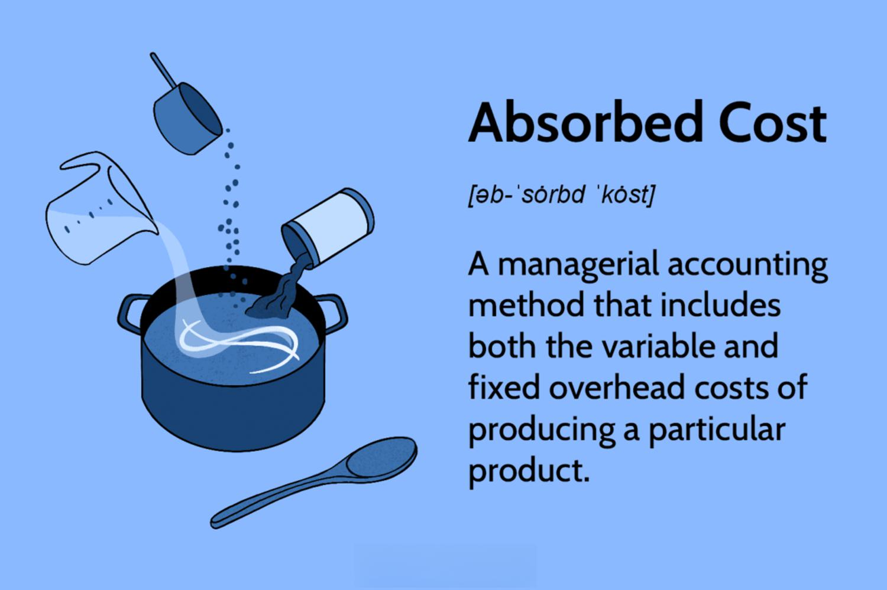

In the intersection of finance and technology, the ability to understand and apply the principles of financial analysis, cost accounting, and algorithmic trading is essential. These areas, once distinct, are now increasingly interwoven, with each playing a critical role in shaping financial strategies and outcomes. Financial analysis provides insights into the financial health and performance of an organization, offering metrics and evaluations that guide investment and operational decisions. Cost accounting, on the other hand, meticulously tracks, records, and analyzes all costs associated with a company's production processes. One pivotal concept within cost accounting is the absorbed cost, which encompasses both variable and fixed overheads in determining the overall cost of a product.

Understanding absorbed cost is vital, as it influences the accuracy of financial statements, affecting everything from profit calculations to inventory valuations. This cost accounting method ensures that all costs associated with the production of a product are accounted for, including not just direct materials and labor, but also a share of fixed and variable manufacturing overheads.



Absorbed cost is not only significant for internal financial management but also impacts broader financial analysis, as it can alter key financial metrics that stakeholders use to gauge company performance. Moreover, the evolution of technology in finance, particularly through the rise of algorithmic trading, presents new opportunities for integrating absorbed cost insights into trading strategies. Algorithmic trading leverages advanced algorithms to execute trades with precision and speed, and understanding cost structures can optimize these algorithms for better financial outcomes.

In this article, we present an overview of absorbed cost, evaluate its implications on financial statements, and link its relevance to modern trading strategies, setting the stage for its ongoing integration in financial systems. By bridging these domains, professionals equipped with knowledge of absorbed costs can enhance strategic planning and decision-making, ultimately driving improved profitability and operational efficiency.

## Table of Contents

## Understanding Financial Analysis and Cost Accounting

Financial analysis is a crucial mechanism for assessing a company's financial well-being using a variety of metrics. It involves the evaluation of financial statements, such as the balance sheet, income statement, and statement of cash flows, to track financial performance over time. By analyzing these documents, stakeholders can gauge profitability, efficiency, liquidity, and solvency, which are vital to making strategic decisions. This analysis not only allows investors and management to identify trends and areas for improvement but also provides insights into a company's competitive position within the industry.

Cost accounting is integral to financial analysis as it involves meticulous tracking, recording, and analysis of costs related to a company's products or activities. It helps in determining the actual cost of production and plays a significant role in internal financial decision-making. The primary function of cost accounting is to provide detailed cost information that management needs to control current operations and plan for the future. It serves as a bridge between financial accounting and management accounting, focusing on detailed breakdowns of costs related to activities, products, and services.

Absorbed cost, also known as absorption costing, is a method used within cost accounting that assigns fixed and variable manufacturing overheads to products. This comprehensive cost assessment is essential for financial analysis as it provides a more complete view of production costs. Absorption costing ensures that all costs associated with manufacturing are captured, which is fundamental for setting product prices, ensuring profitability, and presenting accurate financial statements.

The key components of absorbed costs include direct materials, direct labor, and overhead costs. Direct materials refer to the raw materials that are consumed during the production of a product. Direct labor involves the wages paid to workers who are directly involved in manufacturing. Overhead costs, which can be both fixed and variable, include expenses such as utilities, depreciation, and factory rent that support the production process but are not directly tied to a single product unit.

Informed financial decisions depend on a holistic understanding of production costs highlighted through absorption costing. By encompassing both variable and fixed costs into the unit cost of a product, absorption costing gives companies a clearer picture of operational efficiency and cost management practices. Accurate knowledge of the total cost is pivotal for setting competitive pricing strategies and for the accurate representation of inventory and cost of goods sold on financial statements.

Overall, the integration of financial analysis and cost accounting is fundamental in aiding companies to optimize budget allocation, improve operational efficiencies, and achieve strategic financial goals. Through a thorough understanding of absorbed costs, companies can make well-informed decisions that enhance profitability and ensure long-term sustainability.

## Absorbed Cost: An In-Depth Look

Absorbed cost, often referred to as absorption cost, is a method of product costing that captures all costs associated with manufacturing a product. This includes both variable costs, such as direct materials and direct labor, and fixed overheads. By incorporating all these costs, absorption costing provides a comprehensive view of the total expense incurred in the production process, which is crucial for accurate financial reporting and informed decision-making.

In absorption costing, the direct costs, which are directly attributable to the production, consist of direct materials and direct labor. Direct materials are the raw materials that are used to create a product, while direct labor refers to the wages of workers who are directly involved in manufacturing. These costs are variable in nature as they change with the level of production.

Beyond direct costs, absorption costing also includes fixed overhead costs, which are expenses that do not vary with the level of production in the short term. These can include expenses like rent, depreciation, and salaries of supervisory staff. Fixed overheads are allocated to each unit of production to ensure that the full cost of production is captured.

The rationale for including both variable and fixed costs lies in the portrayal of a fuller picture of production expenses. This methodology supports strategic pricing decisions, inventory valuation, and profitability analysis. For example, by accounting for all costs, a company can ensure that products are priced above their total cost, thus safeguarding margins and facilitating sustainability.

Furthermore, absorption costing is integral to financial reporting requirements, as it aligns with generally accepted accounting principles (GAAP) and International Financial Reporting Standards (IFRS). By incorporating fixed manufacturing overhead into product costs, absorption costing prevents the understatement of inventory values on the balance sheet, which might occur under variable costing methods where only variable production costs are considered.

This costing method is also useful in scenarios where businesses need to ascertain the financial impact of their production decisions. Since absorbed costs include all manufacturing expenses, they offer a realistic assessment of product profitability and assist managers in making informed decisions regarding production volumes, budgeting, and resource allocation.

In summary, absorption costing plays a pivotal role in comprehensive financial analysis by ensuring that financial statements reflect the true cost of production. It is a key tool for businesses to maintain an accurate depiction of their financial health, drive strategic initiatives, and achieve competitive advantage.

## Comparing Absorption and Variable Costing

Absorption costing and variable costing are two cost accounting methods that differ primarily in how fixed manufacturing costs are treated. These differences can significantly affect financial statements and managerial decision-making.

Absorption costing, often mandated by accounting standards for external reporting, allocates all manufacturing costs to the product, including both variable and fixed costs. This means that fixed manufacturing overhead is incorporated into the cost of the product and thus affects inventory valuation. When using absorption costing, fixed costs are spread over the total number of units produced, carrying part of these costs into the inventory on the balance sheet. The formula for product cost under absorption costing is:

$$
\text{Product Cost} = \text{Direct Materials} + \text{Direct Labor} + \text{Variable Manufacturing Overhead} + \text{Fixed Manufacturing Overhead}
$$

In contrast, variable costing (also known as direct costing or marginal costing) includes only variable production costs (direct materials, direct labor, and variable manufacturing overhead) in product costs. Fixed manufacturing costs are not assigned to the product but are treated as period costs, expensed in full in the period incurred. The product cost under variable costing is calculated as follows:

$$
\text{Product Cost} = \text{Direct Materials} + \text{Direct Labor} + \text{Variable Manufacturing Overhead}
$$

The key difference is how fixed manufacturing overhead is handled: it's included in inventory cost under absorption costing but expensed immediately under variable costing. This distinction impacts several financial metrics:

1. **Profit Reporting**: Absorption costing can lead to higher reported profits, especially if inventory increases during the period, because some fixed costs are deferred to future periods as inventory assets. Conversely, variable costing reflects lower profits if fixed costs are treated entirely as expenses in the current period.

2. **Inventory Valuation**: With absorption costing, inventory is valued higher because it includes a portion of fixed manufacturing overhead. In variable costing, inventory reflects only variable costs, leading to a potentially lower valuation.

3. **Decision-Making Impact**: Since variable costing provides clearer insight into the contribution margin (the difference between sales and variable costs), it can be more useful for internal decision-making, highlighting the impact of fixed costs separately from production-related costs.

### Illustrative Example

Consider a company producing 1,000 units with total fixed manufacturing overheads of $50,000. Each unit has direct material costs of $15, direct labor of $10, and variable overhead of $5. In this scenario, the per-unit cost under both costing methods would be calculated as follows:

- **Absorption Costing per Unit**: 
$$
  \text{Per Unit Cost} = \$15 + \$10 + \$5 + \left( \frac{\$50,000}{1,000} \right) = \$85

$$

- **Variable Costing per Unit**:
$$
  \text{Per Unit Cost} = \$15 + \$10 + \$5 = \$30

$$

This contrast demonstrates how inventory valuation and profitability can differ under each method. Thus, understanding these cost allocation differences is vital for accurate financial analysis and strategy formulation.

## Algorithmic Trading: A Modern Financial Tool

Algorithmic trading, a significant advancement in the financial sector, utilizes complex algorithms to execute trades with speed and precision. These sophisticated algorithms analyze a multitude of market variables, including price, timing, and [volume](/wiki/volume-trading-strategy), allowing traders to perform high-frequency trading, minimize costs, and maximize returns. The strategic advantage of [algorithmic trading](/wiki/algorithmic-trading) lies in its ability to remove human emotion from trading decisions, ensuring unbiased and efficient execution.

In reshaping financial markets, algorithmic trading has contributed to increased market [liquidity](/wiki/liquidity-risk-premium) and tighter spreads—differences between the bid and the ask price of securities—providing a more competitive trading environment. The automation of trading processes not only speeds up the execution but also enables rapid adaptation to market fluctuations, thereby improving the overall functioning and stability of financial markets. These technological enhancements also support sophisticated trading strategies like [arbitrage](/wiki/arbitrage), [market making](/wiki/market-making), and [trend following](/wiki/trend-following), making them accessible and viable at scale.

Integrating cost accounting methods within algorithmic trading provides significant insights into both trading strategies and financial outcomes. Cost accounting involves systematically tracking and analyzing costs associated with business processes, offering detailed insights that are critical for optimizing trading algorithms. By incorporating costs related to transaction execution, such as brokerage fees and taxes, algorithmic trading systems can refine their strategies to focus on net profitability rather than raw gains. 

Additionally, by understanding absorbed costs—comprising both variable and fixed overheads—traders can develop algorithms that account for these cost structures, enhancing decision-making and strategic planning. For example, adjusting algorithmic parameters to optimize trade volume and timing could lead to a reduction in overhead costs per trade, thereby improving the profitability ratio of trading strategies.

Algorithmic trading continues to evolve, integrating [machine learning](/wiki/machine-learning) and [artificial intelligence](/wiki/ai-artificial-intelligence) to enhance predictive accuracy and decision-making efficiency. The ongoing development of more sophisticated algorithms promises further transformation of the trading landscape, potentially integrating even more complex cost accounting metrics for holistic financial analysis and greater strategic foresight.

## Integrating Absorption Costing with Algorithmic Trading

The integration of absorption costing and algorithmic trading introduces a strategic advantage by using detailed cost analysis to enhance trading algorithms. Absorption costing, which includes both fixed and variable costs in product costing, provides a holistic view of a company's financials. When combined with algorithmic trading, this comprehensive cost perspective can lead to the optimization of trading algorithms and improved profitability.

### Optimizing Algorithm Performance

In algorithmic trading, timing, pricing, and execution are crucial components that determine the success of trading strategies. Absorption costing can contribute to optimizing these elements by providing insights into the true cost structure of assets. For instance, understanding the absorbed costs allows traders to identify precise thresholds for trade execution, considering both the opportunity cost of holding inventory and the cost of executing trades. This can be especially beneficial in high-frequency trading ([HFT](/wiki/high-frequency-trading-strategies)) environments, where speed and precision are paramount.

Imagine an algorithm designed to trade stocks. By incorporating absorbed cost data, the algorithm can better estimate the cost base of the stocks, enabling it to make more informed decisions about buying or selling based on adjusted profit margins. The formula for determining the profitability of trade considering absorbed costs might look like this:

$$
\text{Profit} = (\text{Selling Price} - \text{Absorbed Cost} - \text{Transaction Cost}) \times \text{Volume}
$$

This formula integrates absorption costing directly into the economic decision-making process of trading, ensuring every trade considers the full cost spectrum.

### Improving Profitability

Profitability in trading is not solely a function of revenue but also the efficiency of cost management. By integrating absorption costing, traders can better assess which trades contribute most to overall profitability after accounting for all costs. This leads to more strategic allocation of capital and resources. Moreover, the comprehensive cost insight afforded by absorption costing can help identify trades that appear profitable superficially but do not significantly contribute to net profit due to hidden costs.

### Potential Use-Cases

1. **Risk Management:** By understanding the full cost structure, algorithms can better manage risk through more accurate pricing models that include absorbed costs, leading to more effective hedging strategies.

2. **Portfolio Optimization:** The integration of absorbed costs can refine algorithms used for portfolio optimization, as it allows for a more comprehensive assessment of the carrying costs of each portfolio component.

3. **Cost-Based Trading Filters:** Develop trading filters that exclude trades with low profit margins when absorbed costs are considered. This prevents the execution of low-return trades that don't justify the operational costs involved.

In practice, these strategies can be implemented in algorithmic trading platforms using Python. Below is a simplified example of how one might incorporate absorbed cost calculations into a trading script:

```python
def calculate_profit(selling_price, absorbed_cost, transaction_cost, volume):
    return (selling_price - absorbed_cost - transaction_cost) * volume

def trade_decision(stock_price, absorbed_cost, transaction_cost, threshold):
    potential_profit = calculate_profit(stock_price, absorbed_cost, transaction_cost, 1)
    if potential_profit > threshold:
        return "Execute Trade"
    else:
        return "No Trade"

# Sample data
stock_price = 150
absorbed_cost = 120
transaction_cost = 5
threshold = 20

decision = trade_decision(stock_price, absorbed_cost, transaction_cost, threshold)
print(decision)
```

This script demonstrates how absorbed costs can directly influence trading decisions by acting as a filter to ensure only trades with sufficient profit potential are executed. Through such applications, absorption costing not only optimizes algorithm performance but also enhances overall profitability.

## Challenges and Future Directions

Absorption costing, while integral in many accounting practices, is not without its criticisms, especially concerning potential distortions in product costs. A primary concern is that absorption costing can sometimes obscure the true cost of producing goods, as it allocates fixed manufacturing overhead costs to products. This allocation can lead to inflated inventory values on financial statements if production levels are higher than sales, thus potentially distorting profit margins. Such distortions can mislead stakeholders about the company's actual economic performance, affecting strategic decisions.

The integration of absorption costing with algorithmic models presents several challenges. One significant challenge is the accurate representation of cost data in real-time environments where automated trading decisions are made almost instantaneously. Algorithmic models often rely on precise data inputs to execute trades; hence, any distortion in cost representation can lead directly to suboptimal trading decisions. Moreover, algorithms used in financial trading must continuously evolve to account for various market conditions, such as [volatility](/wiki/volatility-trading-strategies) and liquidity, which requires that cost models also adapt quickly. Integrating a traditionally static and periodic accounting methodology like absorption costing with dynamic and real-time trading algorithms can be technically complex and may require innovative approaches to data integration and synchronization.

Looking ahead, the convergence of financial reporting and algorithmic trading trends towards greater transparency and efficiency. As data processing technologies and computational techniques enhance, there is potential for the development of more refined costing models that can accommodate real-time data flow. The ability to capture and analyze vast amounts of data with precision could lead to more accurate and meaningful costing information being available to traders and analysts. Furthermore, the growing field of artificial intelligence (AI) presents opportunities to redefine how absorbed costs are utilized within financial systems. AI can automate the analysis of absorbed cost data, quickly identifying patterns and anomalies, thus providing deeper insights into cost behaviors and their impacts on trading strategies.

Future advances in blockchain technology also offer potential improvements in how absorbed costs are tracked and verified. The inherent transparency and immutability of blockchain can ensure that cost data remains consistent and verifiable across platforms and stakeholders, providing a more solid foundation for integrating accounting data with trading algorithms.

In conclusion, while absorption costing presents challenges in the context of cutting-edge trading models, advancements in data analytics and technology promise potential solutions. These solutions can provide more accurate and actionable insights, ultimately leading to enhanced financial reporting and improved decision-making in algorithmic trading. The future of cost accounting lies in its ability to evolve alongside technological innovations, allowing it to remain a vital component of comprehensive financial analysis.

## Conclusion

The integration of cost accounting principles, particularly absorbed costing, with algorithmic trading signifies a significant advancement in financial analysis. Absorbed costs, which encompass both fixed and variable overheads, offer a comprehensive picture of production expenses. This information is invaluable for traders and financial analysts seeking to implement strategies that precisely reflect the true cost structure of a production environment.

Incorporating such detailed cost information into algorithmic trading strategies can lead to more informed decision-making. For example, when algorithms are designed to execute trades based on real-time cost fluctuations, traders can achieve optimal pricing models, thus improving profitability. Insights gained from accurate cost reporting can lead to fine-tuning of trading algorithms, allowing them to react more effectively to market conditions. This creates a feedback loop where enhanced cost understanding informs better trading decisions, which in turn lead to more accurate financial reporting.

The use of absorbed cost analysis within financial systems not only aids in refining trading strategies but also enhances the accuracy of financial forecasts. Through improved predictions of profit margins and cost structures, businesses can allocate resources more efficiently and improve overall financial health. By integrating these methodologies, organizations can expect a marked improvement in the precision of their financial strategies and the potential to achieve substantial profitability.

## References & Further Reading

1. **Horngren, C. T., Datar, S. M., & Rajan, M. V. (2015). "Cost Accounting: A Managerial Emphasis."** This seminal book lays the foundation for understanding cost accounting, including comprehensive exploration of absorbed and variable costing. For readers seeking a deep dive into cost accounting, this book is an invaluable resource. [Link](https://www.pearson.com)

2. **Marrella, A., & Tagac, M. (2021). "Algorithmic Trading: Winning Strategies and Their Rationale."** Ideal for those interested in the technical aspects of algorithmic trading, this book explains the development and execution of trading strategies using algorithms. [Link](https://www.wiley.com)

3. **Brigham, E. F., & Ehrhardt, M. C. (2019). "Financial Management: Theory & Practice."** Covering a wide array of financial management topics, this book provides insight into financial analysis and decision-making, with sections on cost implications in financial reporting. [Link](https://www.cengage.com)

4. **Gaubert, C., & Itskhoki, O. (2021). "Granular Comparative Advantage."** This paper investigates into cost structures in production and their implications for economic advantage on a granular level, aligning well with absorbed cost's comprehensive approach to expense analysis. [Link](https://nber.org)

5. **Pindyck, R. S., & Rubinfeld, D. L. (2018). "Microeconomics."** A book that provides core economic principles, including cost structures and their impact on decision-making in firms. Perfect for those who want to understand the economic theories underpinning cost accounting methods. [Link](https://www.pearson.com)

6. **Hasbrouck, J. (2007). "Empirical Market Microstructure: The Institutions, Economics, and Econometrics of Securities Trading."** This book discusses the microstructure of markets, offering insights into the empirical aspects of market mechanics and the role of technology in trading—key for those exploring algorithmic trading. [Link](https://www.oup.com)

7. **Drury, C. (2018). "Management and Cost Accounting."** This textbook outlines various costing methods, including detailed descriptions and analyses of absorption costing, providing readers with an in-depth understanding of managerial accounting practices. [Link](https://www.cengage.com)

8. **Jones, C. (2013). "Applications of Natural Language Processing in Algorithmic Trading."** This paper examines the intersection of advanced computational techniques and algorithmic trading, highlighting how modern technology is employed to optimize financial strategies. [Link](https://arxiv.org)

9. **Reinstein, D. & Sadun, R. (2020). "The Contribution of Management to Allocation and Productivity."** This Harvard Business School paper explores how effective cost management strategies can enhance trading system performance, relevant to absorbed cost's application in algorithmic contexts. [Link](https://www.hbs.edu)

These resources offer a comprehensive understanding of the intricate interplay between cost accounting, financial analysis, and algorithmic trading, equipping professionals and academics alike with the theoretical and practical knowledge needed in today's financial landscape.

