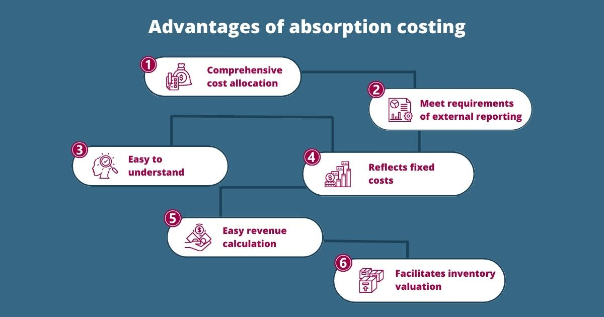

In today's fast-paced financial environment, understanding management and cost accounting is crucial for efficient business operations. These fields are vital as they provide internal stakeholders with the financial insights necessary for informed decision-making. Absorption costing, a fundamental concept in cost accounting, plays a critical role in financial reporting by allocating all manufacturing costs, including fixed and variable expenses, to the production of goods. This comprehensive allocation is essential for external financial statements, adhering to accounting standards such as the Generally Accepted Accounting Principles (GAAP).

Simultaneously, algorithmic trading has revolutionized financial markets. By leveraging mathematical models and automated systems, algorithmic trading executes high-speed and high-volume trades, contributing to market efficiency. The integration of such automated strategies with thorough cost accounting methods, like absorption costing, enhances financial analysis and decision-making.



This article provides an overview of absorption costing within management accounting and explores its potential implications in algorithmic trading. As these two domains converge, businesses can develop more robust financial strategies, optimize resource allocation, and maintain competitiveness in ever-evolving markets.

## Table of Contents

## Understanding Management Accounting and Cost Accounting

Management accounting is a specialized branch of accounting aimed at providing vital financial information to managers to support decision-making processes. It encompasses a variety of activities including budgeting, forecasting, and performance evaluation, each designed to facilitate the effective functioning of an organization. By focusing on internal decision-making, management accounting aids businesses in optimizing their operations, improving efficiency, and maximizing profitability.

Cost accounting, as a subset of management accounting, is primarily focused on the meticulous analysis and management of costs linked to production. It provides detailed insights into cost behaviors, allowing businesses to pinpoint areas for cost reduction and efficiency improvements. Cost accounting serves as an instrumental tool in managerial decision-making, facilitating the preparation of financial statements that reflect true production costs.

Two principal methods within cost accounting are variable costing and absorption costing. Variable costing, also known as direct costing, only considers variable production costs when calculating the cost of goods sold and inventory values. Variable costs fluctuate with changes in production levels and typically include direct materials, direct labor, and variable manufacturing overhead. This approach aids in providing a clear picture of short-term financial performance and operational efficiency by highlighting how costs change with varying production volumes.

Absorption costing, or full costing, allocates all manufacturing costs—both fixed and variable—to individual products. This includes direct materials, direct labor, and both variable and fixed manufacturing overhead. Absorption costing is mandated by Generally Accepted Accounting Principles (GAAP) for external financial reporting because it provides a comprehensive view of product cost, encompassing all aspects of production expenses.

Each method serves distinct business purposes. Variable costing is often utilized internally to support managerial decision-making, such as determining the breakeven point or setting prices. Absorption costing, on the other hand, is essential for external reporting and compliance, ensuring that financial statements accurately reflect the full cost of inventory.

In summary, management accounting, through its subset cost accounting, employs variable and absorption costing methods to provide managers with the financial intelligence needed to make informed decisions that drive business success while ensuring compliance with accounting standards.

## Detailed Insight into Absorption Costing

Absorption costing, often referred to as full costing, is a widely used accounting method where all manufacturing costs are attributed to individual products. This comprehensive approach includes both fixed and variable costs, such as raw materials, direct labor, and both variable and fixed manufacturing overheads. As a result, each unit produced bears a portion of these overall costs, providing a detailed picture of the total production cost associated with each product.

This costing method is essential for external financial reporting and is mandated under Generally Accepted Accounting Principles (GAAP). By incorporating all manufacturing costs, businesses can present a complete and legally compliant view of their financial statements. Through absorption costing, external stakeholders gain a better understanding of a company's overall production expenditure, which can influence investment and financing decisions.

While absorption costing's all-encompassing nature ensures that financial reports reflect the full cost of production, it can obscure short-term product profitability. This is particularly noticeable in periods of fluctuating production levels or when inventory levels are manipulated. Since fixed costs are spread across all produced units, changes in inventory levels can lead to variations in unit cost. For example, increasing inventory levels might defer fixed costs to future periods, thereby inflating current profitability. Conversely, reducing inventory can increase reported costs and reduce short-term profits.

This method can also lead to inefficiencies in inventory management. When a company uses absorption costing, there is an incentive to overproduce, as higher production spreads fixed costs over a larger number of units, lowering the cost per unit. This practice can result in excess inventory, leading to increased holding costs and potential obsolescence.

In summary, while absorption costing provides a comprehensive view necessary for statutory reporting purposes, it presents challenges in the evaluation of short-term profitability and efficient inventory management. Nonetheless, its role in ensuring compliance with financial reporting standards underscores its importance in the broader context of management accounting.

## Comparing Absorption Costing and Variable Costing

Absorption costing and variable costing represent two distinct methodologies for handling manufacturing costs and each has substantial implications for financial accounting and operational decision-making.

Absorption costing, also referred to as full costing, involves the allocation of all manufacturing costs—both fixed and variable—to each unit of production. This means that products not only bear the direct costs, such as raw materials and direct labor, but also a portion of fixed manufacturing overhead, such as factory rent and equipment depreciation. The formula for unit cost under absorption costing can be expressed as:

$$

\text{Unit Cost} = \frac{\text{Direct Materials} + \text{Direct Labor} + \text{Variable Manufacturing Overhead} + \text{Fixed Manufacturing Overhead}}{\text{Total Units Produced}} 
$$

In contrast, variable costing only assigns variable costs to product units. Fixed manufacturing overhead is treated as a period cost and is expensed in full during the period incurred, rather than being allocated to each unit. Thus, the unit cost under variable costing is calculated as follows:

$$
\text{Unit Cost (Variable Costing)} = \frac{\text{Direct Materials} + \text{Direct Labor} + \text{Variable Manufacturing Overhead}}{\text{Total Units Produced}}
$$

The choice between absorption costing and variable costing has significant impacts on financial statements and managerial decisions:

1. **Inventory Valuation**: Absorption costing often results in higher inventory values on the balance sheet, as unsold inventory will include a portion of fixed costs. With variable costing, inventory values are typically lower because fixed costs are not capitalized in inventory.

2. **Profit Reporting**: During periods when inventory levels change, absorption costing can lead to different profit levels compared to variable costing. For example, if production exceeds sales, absorption costing can report higher profits because some fixed costs remain in ending inventory and are not expensed. 

3. **Financial Metrics**: Key financial metrics such as gross margin and net income can differ depending on which costing method is used, thereby influencing business assessments and performance evaluations.

4. **Managerial Decisions**: The costing method affects pricing strategies, as absorption costing spreads fixed costs across all units, potentially altering perceived profitability. Managers using absorption costing might price products to cover fixed costs per unit, impacting competitiveness and market strategy.

Understanding the differences between these costing methods is pivotal for managers when considering pricing strategies, budgeting, and overall financial strategy, ensuring alignment with their organization's financial goals and market conditions.

## Algorithmic Trading: An Overview

Algorithmic trading leverages sophisticated algorithms to execute trades with high speed and precision, significantly enhancing the efficiency of financial markets. This practice involves utilizing computer programs to automate trading decisions, based on a myriad of inputs including market data, trading signals, and predetermined strategies. These algorithms are capable of processing vast amounts of data in real-time to identify trading opportunities that are imperceptible to human traders. By reducing the need for manual intervention, [algorithmic trading](/wiki/algorithmic-trading) minimizes human error and allows for the execution of trades at optimal prices.

The integration of cost accounting principles within algorithmic trading frameworks can lead to improved financial performance optimization. By applying cost structures to trading activities, market participants can assess the viability and profitability of their trading strategies more accurately. This involves analyzing the costs associated with algorithmic trading, including transaction fees, capital allocation, and system maintenance, among others. By understanding these costs, traders can refine their strategies to minimize expenses and enhance returns.

Moreover, algorithmic trading enables enhanced risk management by utilizing quantitative models to assess market conditions and adjust strategies accordingly. For instance, algorithms can incorporate risk metrics such as Value at Risk (VaR) and standard deviation of returns to evaluate risk exposure. This allows traders to make informed decisions about position sizes and stop-loss limits, thereby protecting their investment portfolios.

Understanding cost structures in algorithmic trading also provides a strategic advantage in trade execution. Traders can develop more efficient execution algorithms that [factor](/wiki/factor-investing) in the impact of various cost elements on trade profitability. For example, implementing strategies that reduce market impact costs can lead to more effective order execution and maximize the net gains from trading.

Incorporating cost accounting principles into algorithmic trading is essential for developing strategies that align with financial performance objectives while managing risk efficiently. As algorithmic trading continues to evolve, embracing these methodologies can drive not only increased profitability but also strategic decision-making that is grounded in a thorough understanding of financial commitments and market dynamics.

## Applying Absorption Costing in Algorithmic Trading

Incorporating absorption costing into algorithmic trading models involves the comprehensive consideration of financial commitments associated with trading operations. Absorption costing is instrumental in providing a holistic overview, as it accounts for both fixed and variable costs associated with trading activities. This not only includes direct expenses such as transaction fees and brokerage costs but also extends to indirect costs like infrastructure, software maintenance, and research and development expenses necessary to support algorithmic trading systems.

Evaluating these costs allows traders to optimize their capital allocation. By understanding and differentiating between fixed costs (e.g., servers and data feeds) and variable costs (e.g., transaction fees that vary with trading [volume](/wiki/volume-trading-strategy)), traders can devise strategies that ensure resources are deployed efficiently. For instance, high-frequency trading ([HFT](/wiki/high-frequency-trading-strategies)) environments are highly sensitive to transaction costs, and proper absorption of these costs can lead to more accurate profitability assessments. A clear understanding of these cost structures can help traders decide whether certain trading strategies will yield sufficient returns after covering all associated costs.

Integrating absorption costing into trading systems also enhances decision-making processes. With a clear financial picture, it becomes easier to assess the impact of increasing trading frequencies or entering new markets. For example, the use of Python-based models to simulate different trading scenarios can help in evaluating cost implications and profitability. Here's a simple example of such an analysis:

```python
# Basic example of calculating trading costs using absorption costing principles

fixed_costs = 10000   # Example fixed costs for infrastructure and data
variable_costs_per_trade = 5  # Average variable cost per transaction
number_of_trades = 2000  # Total number of trades executed

total_costs = fixed_costs + (variable_costs_per_trade * number_of_trades)

print("Total Costs:", total_costs)  # Outputs the total costs for the trading period
```

Additionally, incorporating absorption costing can lead to enhanced profitability in algorithmic trading, particularly in high-frequency environments. By ensuring that all costs are accurately absorbed into the trading strategy, traders can better gauge the true profitability of their endeavors. This financial rigor ensures that strategies are not only technically viable but also economically sustainable, thereby providing a competitive edge in rapidly evolving financial markets.

The comprehensive cost analysis facilitated by absorption costing in algorithmic trading thus supports not only better financial performance optimization but also strategic alignment with overarching market dynamics and goals. As such, this integration could be pivotal in enabling traders to maintain profitability and adaptability in an increasingly competitive market landscape.

## Conclusion

The convergence of cost accounting methods, such as absorption costing, with algorithmic trading marks a significant advancement in financial strategy development. Absorption costing, by its comprehensive inclusion of all manufacturing costs—both fixed and variable—ensures that businesses adhere to regulatory standards and gain a thorough understanding of the cost implications associated with their operations. This method not only supports compliance with Generally Accepted Accounting Principles (GAAP) but also yields a complete view of product cost, which is essential for accurate financial reporting and effective decision-making.

As financial markets continue their rapid evolution towards automation and sophisticated trading models, the integration of traditional cost accounting methodologies with modern financial technologies proves vital. Algorithmic trading, characterized by the use of complex algorithms to execute trades at high speeds and volumes, benefits significantly from the insights provided by cost accounting. By applying these principles, traders can achieve better financial performance optimization and enhance risk management strategies, thereby improving their ability to make informed decisions in dynamically changing markets.

Embracing these methodologies, businesses and trading entities can maintain competitiveness and achieve operational excellence. A strategic focus on understanding and managing both fixed and variable costs facilitates better capital allocation, optimized trading strategies, and enhanced profitability. As such, the fusion of cost accounting practices with technological advancements in trading represents not just an innovation but a necessity in the modern financial landscape. Leveraging these combined approaches will be crucial for entities seeking to thrive in an increasingly complex and competitive environment.

## References & Further Reading

Horngren, C. T., Datar, S. M., & Rajan, M. V. (2014). *Cost Accounting: A Managerial Emphasis*. This text is an authoritative source on cost accounting practices, offering insights into managerial decision-making and financial reporting. Its in-depth analysis of absorption costing provides a foundation for understanding its application in business.

Kaplan, R. S., & Atkinson, A. A. (1998). *Advanced Management Accounting*. This book presents advanced concepts in management accounting, including detailed discussions on cost management and methodologies that are crucial for both theoretical understanding and practical application in business contexts.

Drury, C. (2018). *Management and Cost Accounting*. Drury's work offers a comprehensive overview of cost accounting principles, with clear explanations of various costing methods, including absorption costing. It is a valuable resource for understanding the role of cost accounting in strategic decision-making.

De Prado, M. L. (2018). *Advances in Financial Machine Learning*. This book explores the intersection of finance and [machine learning](/wiki/machine-learning), providing techniques and models that improve trading strategies. It is essential for those interested in applying algorithmic trading techniques to enhance financial performance.

Chan, E. (2009). *Quantitative Trading: How to Build Your Own Algorithmic Trading Business*. Chan outlines the essentials of developing algorithmic trading strategies, from concept to execution. The book includes insights into trading algorithms and risk management, making it a critical resource for traders aiming to implement algorithmic systems in financial markets.

