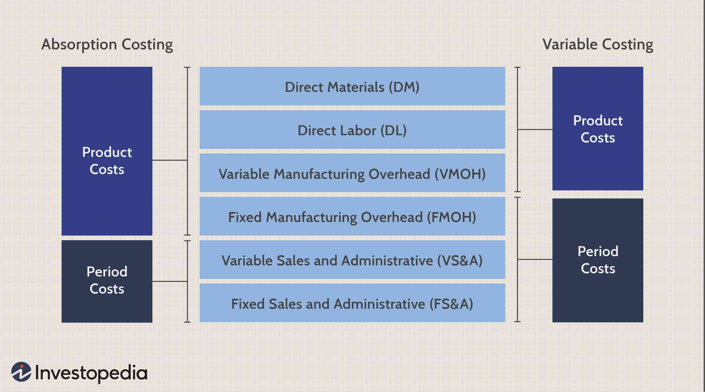

In today's dynamic business environment, understanding the cost structure of a business is crucial for achieving financial success. Accurate cost management not only helps in improving profitability but also supports strategic decision-making. Among the most significant methodologies employed by businesses to manage expenses is absorption costing. This comprehensive approach allocates all costs related to the production of goods, providing a detailed overview of production-related expenses.

Beyond traditional cost accounting, the landscape of business finance is rapidly evolving with technological advancements reshaping expense management strategies. One such development, algorithmic trading (often referred to as algo trading), is revolutionizing how businesses approach expenses in finance and investing. Algorithmic trading utilizes sophisticated computer algorithms to execute trading strategies, significantly altering the cost dynamics in financial markets.



This article aims to explore the intricacies of business expenses, highlighting the roles of absorption costing and algorithmic trading. By offering insights into these areas, it provides valuable information for managers and financial planners seeking to optimize financial performance and embrace new technologies. The integration of traditional accounting methods alongside modern financial innovations ensures that businesses can strategically navigate the complexities of today's economic landscape, positioning themselves for sustainable growth and competitive advantage.

## Table of Contents

## Understanding Business Expenses

Business expenses are the financial obligations that companies incur during their operations, covering a range of expenditures necessary for maintaining and growing the business. These expenses encompass various categories, including employee salaries, utilities, rent, and cost of goods sold (COGS), among others. Understanding and managing these expenses are crucial for achieving financial efficiency and sustainability.

One foundational aspect of managing business expenses is distinguishing between fixed and variable expenses. Fixed expenses are costs that remain constant regardless of the level of production or sales activity. Examples include rent, insurance premiums, and salaries for permanent staff. These expenses do not fluctuate with business volume and therefore need careful planning as they occur consistently.

Variable expenses, on the other hand, change in direct correlation with business activity levels. These include costs such as raw materials, direct labor for production, and utility costs tied to production volume. Accurately predicting variable expenses can be challenging, as they depend on market conditions and sales volume.

Efficient accounting practices play a vital role in managing business expenses. Accurate tracking and categorization of expenses enable businesses to create realistic budgets, which are essential for financial planning and performance optimization. Budgeting helps in setting financial goals and provides a framework for making informed decisions about cost-cutting or investment opportunities.

Furthermore, precise accounting of business expenses is crucial for financial reporting and tax compliance. It ensures that financial statements reflect the true state of the business, aiding stakeholders in making informed decisions. For instance, a comprehensive understanding of COGS can guide pricing strategies to improve gross margins and overall profitability.

In summary, the nuanced understanding and management of business expenses, by distinguishing between fixed and variable costs and employing robust accounting practices, are fundamental to the financial health and strategic planning of any business.

## Cost Accounting: A Fundamental Approach

Cost accounting is a systematic practice integral to managing and controlling a company's financial activities. By tracking, recording, and analyzing costs associated with the production of goods or services, businesses can achieve deeper insights into their financial operations. This discipline allows businesses to allocate resources efficiently, reduce waste, and enhance profitability.

Financial planning benefits significantly from cost accounting, which aids in establishing budgets, forecasting financial performance, and setting pricing strategies. By understanding cost structures, businesses can pinpoint areas where efficiencies can be improved, ultimately contributing to cost control and optimization efforts.

Several cost accounting methods are particularly relevant, each catering to different types of production and operational structures:

1. **Job Costing**: This method applies when products are manufactured based on specific customer orders, where each product or batch is distinct. In job costing, costs are tracked and allocated to individual jobs or orders. This ensures precise computation of the cost of each unit produced, allowing for effective pricing and profitability analysis.

2. **Process Costing**: Used when identical products are produced in continuous processes, this method aggregates costs over a period and assigns them to a large volume of uniform products. Industries such as chemicals, oil refining, and food processing commonly utilize process costing. This method simplifies the costing process by averaging costs over all units produced, making it efficient for homogeneous products.

3. **Activity-Based Costing (ABC)**: ABC is a more sophisticated method that assigns costs to products or services based on the activities that generate costs. This approach allocates indirect costs more accurately than traditional costing methods by associating costs with activities like machine setups, quality inspections, and material handling. ABC offers a nuanced perspective on cost drivers, enabling businesses to manage overhead more effectively and improve decision-making.

Incorporating these diverse methodologies allows firms to tailor their cost accounting practices to their specific needs. By doing so, they can achieve a comprehensive understanding of their cost dynamics, leading to better strategic and operational decisions. Each method serves as a tool to dissect complex cost structures and empowers companies to fine-tune their financial strategies.

## What is Absorption Costing?

Absorption costing, also known as full costing, is a comprehensive accounting method employed to account for all costs associated with manufacturing a product. In this approach, both direct and indirect costs are considered essential to the cost of production. Direct costs include expenses that can be directly traced to the manufacturing of a product, such as raw materials and labor. Indirect costs encompass fixed overheads, which are not directly attributable to specific units of production but are necessary for the overall manufacturing process. These may include utility costs, rent of manufacturing facilities, and salaries of production management.

The essence of absorption costing lies in its capacity to allocate these fixed overheads to the cost of the product, thereby ensuring a comprehensive understanding of product cost and profitability. This allocation can be mathematically represented as:

$$
\text{Product Cost} = \text{Direct Costs} + \text{(Fixed Overhead Allocation per Unit)}
$$

where the fixed overhead allocation per unit is calculated by dividing the total fixed overhead by the total units produced.

Absorption costing is not merely a choice of accounting method; it is a requirement under Generally Accepted Accounting Principles (GAAP) for external financial reporting in the United States. This stipulation ensures that financial statements accurately reflect the cost of inventory and provide a complete picture of a company's financial health. By including all manufacturing costs in product calculations, absorption costing aligns reported profitability with the true economic activities of a company, making it a critical tool for financial planning and analysis.

## Advantages and Disadvantages of Absorption Costing

Absorption costing, also known as full costing, offers several advantages when it comes to financial reporting and decision-making in manufacturing and production sectors. One of the primary benefits of absorption costing is its compliance with Generally Accepted Accounting Principles (GAAP) and International Financial Reporting Standards (IFRS) for external financial reporting. These standards require that all manufacturing costs—both variable and fixed—be allocated to product costs, ensuring that the financial statements reflect a comprehensive overview of production expenses.

This comprehensive accounting of production costs gives managers a complete picture of the total costs associated with manufacturing a product. Such detailed information is instrumental for long-term pricing strategies, as it accounts for all expenditures related to production. By including fixed manufacturing costs, absorption costing helps prevent underestimating costs that could affect profitability in competitive markets.

Moreover, absorption costing can provide beneficial insights for inventory management. Since all manufacturing costs are absorbed by the products, the cost figures reflected in inventory are inclusive of all necessary expenditures, which can aid in pricing strategies and inventory valuation for tax purposes.

However, there are notable disadvantages to absorption costing. One significant drawback is the potential for overstating profitability. This can occur if a large amount of inventory remains unsold at the end of an accounting period. In such cases, the fixed manufacturing costs included in the inventory costs are not expensed in the period they are incurred but deferred until the inventory is sold. This can artificially inflate profits in periods of high production but low sales, leading to potentially misleading financial results.

Another criticism of absorption costing is its complexity and the potential distortion in managerial decision-making due to the allocation of fixed overheads to product costs. Managers might be misled into thinking that production efficiencies are achieved when manufacturing output increases, as fixed overhead costs per unit decrease with higher production levels. This can incentivize overproduction, leading to excess inventory, increased storage costs, and potential [liquidity](/wiki/liquidity-risk-premium) issues.

Despite its drawbacks, absorption costing remains a valuable tool for cost analysis. It provides a holistic view of production costs and ensures compliance with accounting standards, facilitating accurate financial reporting and aiding in strategic decision-making, especially in environments where comprehensive cost assessment is crucial for long-term success.

## Absorption Costing vs. Variable Costing

The primary distinction between absorption costing and variable costing is centered on the treatment of fixed overhead costs. In the absorption costing method, all manufacturing costs, both variable and fixed, are allocated to products. This means that fixed overhead, such as rent and salaries of permanent staff, becomes part of the cost of each unit produced. The formula for unit cost under absorption costing can be represented as:

$$
\text{Unit Cost} = \frac{\text{Total Variable Costs} + \text{Total Fixed Costs}}{\text{Total Units Produced}}
$$

Conversely, variable costing does not assign fixed overhead costs to products. Instead, these are expensed in the period in which they are incurred. As a result, the cost of a product under variable costing only includes variable production costs, such as direct materials and direct labor. The equation for calculating product cost using variable costing is:

$$
\text{Unit Cost} = \frac{\text{Total Variable Costs}}{\text{Total Units Produced}}
$$

This distinction between the two costing methods has significant implications for profitability analysis and decision-making. Under absorption costing, products can appear more profitable when unsold inventory is high, as fixed overhead costs are deferred in the inventory account rather than being charged against the current period’s income. This can potentially lead to misleading financial statements if not properly analyzed. In contrast, variable costing provides a clearer picture of variable costs associated with production, allowing managers to better assess the impact of production [volume](/wiki/volume-trading-strategy) on profitability.

The choice between these methods influences decision-making processes, particularly in pricing, budgeting, and performance evaluation. For example, businesses using variable costing might decide to lower prices during periods of low demand without underestimating the impact on profitability, because all fixed costs have already been covered in prior periods or are accounted for separately. An understanding of both costing methods enables more informed decisions that align with the business's financial strategy.

## Algorithmic Trading and Business Costs

Algorithmic trading, often referred to as algo trading, is a process that uses complex mathematical models and high-speed computer programs to make trading decisions. It fundamentally alters how trades are executed by using algorithms to identify trading opportunities and automatically place orders, minimizing human intervention and allowing transactions to be completed at an incredibly rapid pace, often within milliseconds.

The proliferation of [algorithmic trading](/wiki/algorithmic-trading) necessitates new considerations for business costs, particularly in the financial sector. These costs can be broadly categorized into technology infrastructure, data acquisition, and transaction-specific charges.

**Technology Infrastructure Costs**: To effectively execute algorithmic trading strategies, businesses must invest in robust computational infrastructure. This includes cutting-edge hardware capable of handling large volumes of trades and implementing sophisticated algorithms, as well as reliable, high-speed internet connections to ensure minimal latency. Investing in cybersecurity measures to protect sensitive trading data is also crucial. The total cost of such infrastructure can be substantial, and ongoing maintenance must be factored into the budgeting process.

**Data Acquisition Costs**: Successful algorithmic trading strategies depend heavily on the quality and timeliness of data. Businesses typically incur significant expenses acquiring historical and real-time data feeds. This data can include price movements, trading volumes, economic indicators, and other market factors crucial for creating predictive models. The higher the quality and greater the quantity of data, the more accurate and effective the algorithmic trading strategy is likely to be.

**Transaction-specific Costs**: These encompass fees and commissions associated with executing trades, which can vary considerably depending on the brokerage or exchange. In high-frequency trading, where trade volumes are exceedingly high, even minor transaction fees can accrue rapidly, impacting profitability.

Understanding these costs not only helps in optimizing trading strategies but also in mitigating financial risks. Effective cost management can significantly enhance the performance and profitability of algo trading operations. Businesses can employ advanced analytics and [machine learning](/wiki/machine-learning) models to forecast costs and improve financial planning. For instance, by analyzing historical trading patterns and market trends, businesses can adjust algorithms to minimize unnecessary trades and reduce expenses.

In summary, while algorithmic trading offers substantial opportunities for improving trading efficiency and profitability, it is accompanied by a complex set of cost considerations. By strategically managing these expenses, businesses can not only optimize their trading operations but also achieve a sustainable competitive advantage in the financial market.

## Managing Expenses in Algo Trading

In algorithmic trading, managing expenses effectively is crucial for optimizing financial performance and maintaining profitability. The primary costs associated with algo trading include technology costs, data fees, and transaction charges. 

Technology costs comprise the expenses for acquiring and maintaining the computing infrastructure required to support algorithmic trading systems. This includes hardware such as servers and networking equipment, as well as software costs for trading platforms and algorithm development environments. Advancements in cloud computing services can provide scalable solutions to reduce upfront capital expenditure on hardware and offer flexible subscription models. 

Data fees are another significant portion of the expenses, covering the cost of real-time and historical market data. Access to high-quality data is vital for developing robust trading algorithms capable of making informed decisions. Negotiating better rates with data providers or leveraging open-source datasets can help in optimizing this expense.

Transaction charges refer to the costs incurred from executing trades, including brokerage fees and exchange fees. Reducing transaction costs typically involves optimizing order execution strategies to minimize market impact and slippage, which can be achieved using sophisticated order types and leveraging multiple exchanges.

Efficiency in managing these expenses plays a pivotal role in improving trading performance. Leveraging advanced analytics allows businesses to forecast expenses more accurately and plan financials effectively. Cost forecasting models can be developed using Python, utilizing packages such as NumPy for numerical calculations and pandas for data manipulation. For instance, a simple model to predict future technology costs based on historical data could be implemented as follows:

```python
import pandas as pd
import numpy as np
from sklearn.linear_model import LinearRegression

# Sample data for technology costs
data = {'Year': [2018, 2019, 2020, 2021, 2022],
        'Tech_Cost': [10000, 12000, 13000, 15000, 17000]}
df = pd.DataFrame(data)

# Convert 'Year' to a numeric type
df['Year'] = pd.to_numeric(df['Year'])

# Predict future costs using linear regression
model = LinearRegression()
model.fit(df[['Year']], df['Tech_Cost'])
future_year = np.array([[2023]])
predicted_cost = model.predict(future_year)

print(f"Predicted technology cost for 2023: {predicted_cost[0]:.2f}")
```

Incorporating such predictive models aids financial planners in identifying potential areas of cost savings and aligning their strategic objectives with available resources. By efficiently managing these expenses, businesses can enhance their trading performance, increase profitability, and maintain a competitive edge in the financial markets.

## Conclusion

Effective management of business expenses is crucial for ensuring a company's financial stability and growth. Understanding cost accounting methods, such as absorption costing, provides businesses with the necessary tools to account for all production-related costs. This comprehensive awareness aids in better budgeting, cost control, and financial planning, ultimately contributing to the financial success of an organization.

The integration of modern technologies, such as algorithmic trading, adds a new dimension to cost management. With its ability to execute trades with precision and at high speeds, algo trading offers a mechanism to potentially enhance trading performance and profitability. However, it also introduces several additional cost considerations, including technology infrastructure, data acquisition, and transaction fees. Effective management of these expenses is equally important to maximize the benefits of algo trading.

A balanced approach, combining traditional cost accounting techniques with cutting-edge technological advancements like algorithmic trading, empowers businesses to optimize overall financial performance. By effectively managing expenses through established accounting methods and leveraging technology for competitive advantage, companies position themselves for sustainable growth, enhancing their market positioning and financial health in an ever-evolving business landscape.

## References & Further Reading

[1]: Bergstra, J., Bardenet, R., Bengio, Y., & Kégl, B. (2011). ["Algorithms for Hyper-Parameter Optimization."](https://dl.acm.org/doi/10.5555/2986459.2986743) Advances in Neural Information Processing Systems 24.

[2]: ["Advances in Financial Machine Learning"](https://www.amazon.com/Advances-Financial-Machine-Learning-Marcos/dp/1119482089) by Marcos Lopez de Prado

[3]: ["Evidence-Based Technical Analysis: Applying the Scientific Method and Statistical Inference to Trading Signals"](https://www.amazon.com/Evidence-Based-Technical-Analysis-Scientific-Statistical/dp/0470008741) by David Aronson

[4]: ["Machine Learning for Algorithmic Trading"](https://github.com/stefan-jansen/machine-learning-for-trading) by Stefan Jansen

[5]: ["Quantitative Trading: How to Build Your Own Algorithmic Trading Business"](https://www.amazon.com/Quantitative-Trading-Build-Algorithmic-Business/dp/1119800064) by Ernest P. Chan