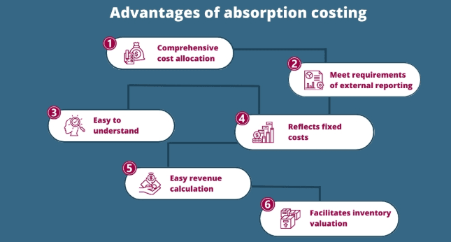

## Table of Contents

## What is absorption costing?

Absorption costing is a way of figuring out how much it costs to make a product. It includes all the costs that go into making the product, like the materials, labor, and even the costs of running the factory, such as rent and utilities. This method is also called full costing because it takes into account all the costs, not just the direct ones.

This type of costing is useful for businesses because it helps them understand the total cost of their products. It's required for financial reporting under generally accepted accounting principles (GAAP). By using absorption costing, a company can see if they are making a profit on each product they sell, which helps them make better decisions about pricing and production.

## How does absorption costing differ from variable costing?

Absorption costing and variable costing are two different ways to figure out how much it costs to make a product. Absorption costing includes all costs, both the direct costs like materials and labor, and the indirect costs like factory rent and utilities. This means that every product gets a share of all the costs, even the ones that don't change with how much you produce. On the other hand, variable costing only includes the costs that change with production, like materials and direct labor. The costs that stay the same no matter how much you produce, like rent, are not included in the cost of each product.

The main difference between these two methods is how they treat fixed costs. In absorption costing, fixed costs are spread out over all the products made, so each product carries a part of these costs. This can make the cost of each product seem higher. In variable costing, fixed costs are treated as period costs and are shown on the income statement as expenses for the time period they were incurred, not as part of the product cost. This can make it easier to see how changes in production levels affect profits, because the fixed costs don't change the cost of the products themselves.

## What are the main components included in absorption costing?

Absorption costing includes all the costs that go into making a product. This means it covers the direct costs, like the materials you use and the labor to put the product together. If you're making a toy car, the plastic and the time workers spend assembling it are direct costs. These costs change depending on how many toy cars you make.

It also includes indirect costs, which are the costs of running the factory but aren't tied to making one specific product. These are things like the rent for the factory, the electricity to keep the lights on, and the salaries of managers who oversee the whole operation. These costs don't change much no matter how many toy cars you make. In absorption costing, these indirect costs are spread out over all the products you make, so each toy car gets a little bit of the factory rent and other overhead costs.

## Can you explain how absorption costing impacts financial statements?

Absorption costing affects financial statements by including all costs in the cost of goods sold. This means that when a company makes a product, all the costs, like materials, labor, and even the factory rent, are added to the cost of that product. When the product is sold, all these costs are taken out of inventory and shown as the cost of goods sold on the income statement. This can make the cost of goods sold higher than if only direct costs were used, which can lower the gross profit.

Because absorption costing includes fixed costs in the product cost, it can also affect the balance sheet. If a company makes more products than it sells, some of the fixed costs stay in the inventory as part of the product cost. This makes the inventory value on the balance sheet higher. When those products are sold later, the fixed costs move from inventory to the cost of goods sold, which can change the profit reported in different periods. This can make it harder to see how well the company is doing from one period to the next.

## What are the advantages of using absorption costing for a business?

Absorption costing helps businesses understand the full cost of making their products. It includes all the costs, like the materials, labor, and even the costs of running the factory, such as rent and utilities. This way, when a business sells a product, they know exactly how much it cost to make it, which helps them set the right price to make a profit. It's also required for financial reporting under generally accepted accounting principles (GAAP), so businesses have to use it to show their financial health to investors and others.

Another advantage is that absorption costing can make the financial statements look better if a business makes more products than it sells. The fixed costs, like rent, are spread out over all the products made, so some of these costs stay in the inventory on the balance sheet. This can make the inventory value higher and the profit for that period look better. It's a way to match the costs with the revenues more evenly over time, which can help with planning and managing the business.

## What are the potential disadvantages of absorption costing?

One disadvantage of absorption costing is that it can make it hard to see how changes in production affect profits. Because fixed costs like rent are spread out over all the products, if a business makes more products than it sells, some of those fixed costs stay in the inventory. This can make the profit for that period look better than it really is, because the costs are not all shown on the income statement right away. It can be confusing and make it harder to understand how well the business is doing.

Another problem is that absorption costing can make the cost of each product seem higher than it needs to be. Since all costs, including fixed costs, are added to the product cost, the price of the product might be set too high. This can make it harder to compete with other businesses that use a different costing method. It can also make it harder to see which products are really making money and which ones are not, because the fixed costs are mixed in with the direct costs.

## How does absorption costing comply with generally accepted accounting principles (GAAP)?

Absorption costing follows the rules of generally accepted accounting principles (GAAP) because it includes all the costs of making a product in the cost of goods sold. This means that when a business sells a product, it shows all the costs, like materials, labor, and even the factory rent, as part of the cost of that product. GAAP wants businesses to match all the costs of making a product with the revenue from selling it, so absorption costing fits this rule perfectly.

Using absorption costing can make financial statements look better if a business makes more products than it sells. The fixed costs, like rent, are spread out over all the products made, so some of these costs stay in the inventory on the balance sheet. This makes the inventory value higher and can make the profit for that period look better. GAAP allows this because it helps businesses show their financial health more accurately over time, even if it can make things a bit confusing in the short term.

## Can you provide a simple example of how to calculate absorption costing?

Let's say you own a small bakery and you want to figure out the cost of making a batch of 100 cookies using absorption costing. First, you need to add up all the direct costs. The direct costs are the ingredients like flour, sugar, and eggs, which cost you $20 for the batch. You also need to pay for the labor to mix and bake the cookies, which costs $10. So, the total direct costs for the batch are $30.

Next, you need to include the indirect costs, which are the costs of running the bakery that don't change with how many cookies you make. These include the rent for the bakery, which is $500 a month, and the utilities, which cost $200 a month. To find out how much of these costs to add to each batch, you need to figure out how many batches you make in a month. Let's say you make 10 batches of cookies a month. So, you divide the total indirect costs ($700) by the number of batches (10) to get $70 per batch. Now, you add the direct costs ($30) and the indirect costs ($70) to get the total cost per batch using absorption costing, which is $100 for 100 cookies.

## How does absorption costing affect inventory valuation?

Absorption costing affects inventory valuation by including all the costs of making a product in the inventory value. This means that when you make a product, you add up the cost of the materials, the labor to make it, and even the costs of running the factory like rent and utilities. All these costs go into the value of the inventory on your balance sheet. If you make more products than you sell, some of these costs stay in the inventory, making its value higher.

This can make your financial statements look better in the short term because the profit for that period might seem higher. But it can also make things confusing because the costs are not all shown on the income statement right away. When you sell the products later, the costs move from inventory to the cost of goods sold, which can change the profit reported in different periods. So, absorption costing can make it harder to see how well your business is doing from one period to the next.

## What role does absorption costing play in pricing decisions?

Absorption costing helps businesses figure out how much to charge for their products. It does this by including all the costs of making a product, like the materials, labor, and even the costs of running the factory, such as rent and utilities. When a business knows the total cost of making a product, they can set a price that covers all these costs and still makes a profit. This is important because if the price is too low, the business might lose money on each product they sell.

Using absorption costing can also affect how a business decides to price their products over time. If a business makes more products than they sell, some of the fixed costs, like rent, stay in the inventory. This can make the inventory value higher and the profit for that period look better. But when those products are sold later, the fixed costs move from inventory to the cost of goods sold, which can change the profit reported in different periods. So, businesses need to think about how absorption costing might make their profits look different from one period to the next when they set their prices.

## How can absorption costing be used for internal decision-making and performance evaluation?

Absorption costing can help businesses make decisions inside the company and see how well they are doing. It does this by showing the full cost of making a product, including all the costs like materials, labor, and even the costs of running the factory, such as rent and utilities. When a business knows the total cost of making a product, they can see if they are making a profit on each product they sell. This helps them decide if they should keep making the product, change how they make it, or stop making it altogether. It also helps them set prices that cover all their costs and still make money.

Absorption costing can also be used to see how well different parts of the business are doing. For example, if a business has different factories or departments, they can use absorption costing to see which ones are making products at a lower cost and which ones are not doing as well. This can help the business decide where to focus their efforts to improve. But, because absorption costing includes fixed costs in the product cost, it can sometimes make it hard to see how changes in production affect profits. So, businesses need to be careful and might want to use other costing methods too to get a full picture of their performance.

## What are the advanced considerations or adjustments needed when applying absorption costing in complex manufacturing environments?

In complex manufacturing environments, applying absorption costing can be tricky because there are many different costs to keep track of. For example, a big factory might make lots of different products, each with its own set of materials, labor, and overhead costs. To use absorption costing correctly, the business needs to figure out how to split up the indirect costs, like rent and utilities, fairly among all the products. This might mean using a system to track how much time and resources each product uses, so the costs can be spread out in a way that makes sense. If the business doesn't do this right, some products might seem more expensive than they really are, which can lead to bad decisions about pricing and production.

Another thing to think about is how to handle changes in production levels. In a complex manufacturing environment, the amount of products made can change a lot from one month to the next. When using absorption costing, if the business makes more products than it sells, some of the fixed costs stay in the inventory, making its value higher. This can make the profit for that period look better, but it can also make it hard to see how well the business is really doing. To deal with this, the business might need to make adjustments to how they report their costs and profits, so they can get a clearer picture of their performance over time. This might involve using other costing methods alongside absorption costing to help with decision-making and planning.

## What is Absorption Costing?

Absorption costing, also known as full costing, is a comprehensive accounting method employed to account for all costs associated with manufacturing a product. In this approach, both direct and indirect costs are considered essential to the cost of production. Direct costs include expenses that can be directly traced to the manufacturing of a product, such as raw materials and labor. Indirect costs encompass fixed overheads, which are not directly attributable to specific units of production but are necessary for the overall manufacturing process. These may include utility costs, rent of manufacturing facilities, and salaries of production management.

The essence of absorption costing lies in its capacity to allocate these fixed overheads to the cost of the product, thereby ensuring a comprehensive understanding of product cost and profitability. This allocation can be mathematically represented as:

$$
\text{Product Cost} = \text{Direct Costs} + \text{(Fixed Overhead Allocation per Unit)}
$$

where the fixed overhead allocation per unit is calculated by dividing the total fixed overhead by the total units produced.

Absorption costing is not merely a choice of accounting method; it is a requirement under Generally Accepted Accounting Principles (GAAP) for external financial reporting in the United States. This stipulation ensures that financial statements accurately reflect the cost of inventory and provide a complete picture of a company's financial health. By including all manufacturing costs in product calculations, absorption costing aligns reported profitability with the true economic activities of a company, making it a critical tool for financial planning and analysis.

## What are the differences between Absorption Costing and Variable Costing?

The primary distinction between absorption costing and variable costing is centered on the treatment of fixed overhead costs. In the absorption costing method, all manufacturing costs, both variable and fixed, are allocated to products. This means that fixed overhead, such as rent and salaries of permanent staff, becomes part of the cost of each unit produced. The formula for unit cost under absorption costing can be represented as:

$$
\text{Unit Cost} = \frac{\text{Total Variable Costs} + \text{Total Fixed Costs}}{\text{Total Units Produced}}
$$

Conversely, variable costing does not assign fixed overhead costs to products. Instead, these are expensed in the period in which they are incurred. As a result, the cost of a product under variable costing only includes variable production costs, such as direct materials and direct labor. The equation for calculating product cost using variable costing is:

$$
\text{Unit Cost} = \frac{\text{Total Variable Costs}}{\text{Total Units Produced}}
$$

This distinction between the two costing methods has significant implications for profitability analysis and decision-making. Under absorption costing, products can appear more profitable when unsold inventory is high, as fixed overhead costs are deferred in the inventory account rather than being charged against the current period’s income. This can potentially lead to misleading financial statements if not properly analyzed. In contrast, variable costing provides a clearer picture of variable costs associated with production, allowing managers to better assess the impact of production [volume](/wiki/volume-trading-strategy) on profitability.

The choice between these methods influences decision-making processes, particularly in pricing, budgeting, and performance evaluation. For example, businesses using variable costing might decide to lower prices during periods of low demand without underestimating the impact on profitability, because all fixed costs have already been covered in prior periods or are accounted for separately. An understanding of both costing methods enables more informed decisions that align with the business's financial strategy.

## References & Further Reading

[1]: Bergstra, J., Bardenet, R., Bengio, Y., & Kégl, B. (2011). ["Algorithms for Hyper-Parameter Optimization."](https://dl.acm.org/doi/10.5555/2986459.2986743) Advances in Neural Information Processing Systems 24.

[2]: ["Advances in Financial Machine Learning"](https://www.amazon.com/Advances-Financial-Machine-Learning-Marcos/dp/1119482089) by Marcos Lopez de Prado

[3]: ["Evidence-Based Technical Analysis: Applying the Scientific Method and Statistical Inference to Trading Signals"](https://www.amazon.com/Evidence-Based-Technical-Analysis-Scientific-Statistical/dp/0470008741) by David Aronson

[4]: ["Machine Learning for Algorithmic Trading"](https://github.com/stefan-jansen/machine-learning-for-trading) by Stefan Jansen

[5]: ["Quantitative Trading: How to Build Your Own Algorithmic Trading Business"](https://www.amazon.com/Quantitative-Trading-Build-Algorithmic-Business/dp/1119800064) by Ernest P. Chan