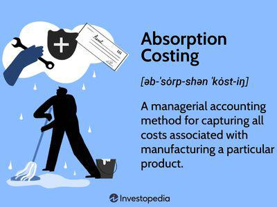

## Table of Contents

## What is absorption costing?

Absorption costing is a way of figuring out how much it costs to make a product. It includes all the costs that go into making the product, like the materials, labor, and even the costs of running the factory, such as rent and utilities. This method is different from other methods because it takes into account all these costs, not just the direct ones.

This type of costing is often used for financial reporting and tax purposes because it gives a complete picture of the costs involved in production. It helps businesses understand the total cost of their products, which can be useful for setting prices and making decisions about production. By including all costs, absorption costing can help businesses make sure they are not underestimating the true cost of their products.

## How does absorption costing differ from variable costing?

Absorption costing and variable costing are two different ways to figure out how much it costs to make a product. Absorption costing includes all the costs of making a product, like the materials, labor, and even the costs of running the factory, such as rent and utilities. This means that every product gets a share of all these costs, even the ones that don't change with how much you produce, like rent. On the other hand, variable costing only includes the costs that change with how much you produce, like materials and direct labor. It leaves out the costs that stay the same no matter how much you make, like rent and utilities.

The main difference between these two methods is how they treat fixed costs, like rent and utilities. In absorption costing, these fixed costs are spread out over all the products you make, so each product carries a part of these costs. This can make the cost of each product seem higher. In variable costing, these fixed costs are not added to the cost of the products. Instead, they are treated as period costs and are shown on the income statement as expenses for the time period they were incurred. This can make the cost of each product seem lower, but it also means that the total costs of running the business are shown separately from the costs of making the products.

## What are the basic principles of GAAP?

GAAP stands for Generally Accepted Accounting Principles. These are rules that businesses in the United States follow when they do their accounting. The main idea behind GAAP is to make sure that financial information is clear, consistent, and easy to understand. This helps people who read financial statements, like investors and creditors, trust the information they see. GAAP covers things like how to record income and expenses, how to value assets and liabilities, and how to present financial statements.

One important principle of GAAP is the revenue recognition principle. This rule says that a business should record income when it is earned, not when the money is actually received. For example, if a company does work for a customer in December but doesn't get paid until January, the income should be recorded in December. Another key principle is the matching principle, which says that expenses should be recorded in the same period as the income they help to generate. This helps give a true picture of a company's profitability for a specific time period.

GAAP also includes rules about how to be consistent in accounting practices. This means that once a company chooses a way to do something, like how to value inventory, it should keep doing it the same way from year to year. This makes it easier to compare financial statements over time. Additionally, GAAP requires that financial statements include enough information so that people can understand them. This might mean adding notes to explain things that aren't clear from the numbers alone. Overall, GAAP helps make sure that financial reporting is fair and useful.

## Why is absorption costing required under GAAP?

Absorption costing is required under GAAP because it gives a complete picture of the costs of making a product. GAAP wants financial statements to show all the costs that go into making something, not just the costs that change with how much you make. Absorption costing includes all these costs, like the materials, labor, and even the costs of running the factory, such as rent and utilities. This way, when a company reports its financials, it shows the true cost of each product, which helps people understand the company's financial health better.

Using absorption costing also helps keep things consistent. If all companies use the same method to figure out their costs, it's easier to compare their financial statements. This is important for investors and others who need to understand how different companies are doing. By including all costs in the product cost, absorption costing makes sure that the financial statements are fair and give a clear picture of the company's performance.

## How do you calculate the cost of goods sold using absorption costing?

To calculate the cost of goods sold using absorption costing, you start by figuring out the total cost of all the products you made during the period. This includes the cost of the materials you used, the labor to make the products, and a part of the fixed costs like rent and utilities. You then look at how many products you had at the start of the period, how many you made, and how many you had left at the end. The cost of goods sold is the cost of the products you sold during the period.

You can find the cost of goods sold by taking the cost of the products you had at the start of the period, adding the cost of the products you made during the period, and then subtracting the cost of the products you had left at the end. This gives you the total cost of the products that were sold. Using absorption costing makes sure you include all the costs that went into making those products, so you get a complete picture of what it cost to sell them.

## What are the components included in absorption costing?

Absorption costing includes all the costs that go into making a product. This means it covers the direct costs, like the materials you use and the labor to make the product. If you're making a toy car, the plastic and the time workers spend putting it together are direct costs. But absorption costing doesn't stop there. It also includes the indirect costs, like the rent for the factory where the toy car is made, the utilities to keep the lights on and the machines running, and even the salaries of the managers who oversee the production.

These indirect costs are often called fixed costs because they don't change much no matter how many toy cars you make. Even if you make one car or a thousand, the rent stays the same. Absorption costing spreads these fixed costs over all the products you make. So, each toy car gets a little bit of the rent, utilities, and management salaries added to its cost. This way, when you figure out the total cost of making the toy car, you're including everything that went into it, not just the materials and labor.

## How does absorption costing affect inventory valuation?

Absorption costing affects inventory valuation by including all the costs of making a product in the value of the inventory. This means that when you calculate how much your inventory is worth, you add up the cost of the materials, the labor, and even the fixed costs like rent and utilities. So, if you have a bunch of products sitting in your warehouse, their value on your financial statements will be higher because it includes all these costs.

This can make a big difference in how much your inventory is worth on paper. If you use absorption costing, your inventory value will be higher than if you used a method like variable costing, which only includes the costs that change with how much you produce. This higher inventory value can affect your financial statements, making your assets look bigger and possibly changing how profitable your business looks to investors and others who read your financial reports.

## What are the advantages of using absorption costing under GAAP?

Using absorption costing under GAAP has some big advantages. One of the main ones is that it gives a complete picture of the costs of making a product. This means it includes everything, like the materials, labor, and even the costs of running the factory, such as rent and utilities. By including all these costs, absorption costing helps businesses understand the true cost of their products. This can be really helpful for setting prices and making decisions about production. It also makes sure that financial statements show all the costs, which is important for investors and others who need to trust the financial information.

Another advantage is that absorption costing helps keep things consistent. When all companies use the same method to figure out their costs, it's easier to compare their financial statements. This is important for people who need to understand how different companies are doing. By including all costs in the product cost, absorption costing makes sure that the financial statements are fair and give a clear picture of the company's performance. This can help businesses make better decisions and show their financial health more accurately.

## What are the potential disadvantages or criticisms of absorption costing?

One potential disadvantage of absorption costing is that it can make it harder to see how much it really costs to make each product. Because absorption costing includes all the costs, like rent and utilities, in the cost of the product, it can make the cost of each product seem higher than it really is. This can make it harder for businesses to figure out if they are making money on each product they sell. If a business is trying to decide whether to keep making a certain product, absorption costing might not give them a clear picture of the costs that are directly related to that product.

Another criticism of absorption costing is that it can make a company's profits look different depending on how much inventory they have. If a company makes a lot of products but doesn't sell them all, the costs of making those products are stored in the inventory value. This can make the company's profits look higher than they really are because the costs are not shown on the income statement right away. When the company finally sells the products, the costs come out of inventory and can make the profits look lower in that period. This can make it hard for investors and others to understand the company's true financial performance.

## How does absorption costing impact financial statements?

Absorption costing impacts financial statements by including all the costs of making a product in the inventory value. This means that when a company calculates its inventory, it adds up the cost of materials, labor, and even fixed costs like rent and utilities. So, if a company has a lot of products in its warehouse, the value of that inventory will be higher because it includes all these costs. This can make the company's assets look bigger on the balance sheet. It also affects the income statement because the cost of goods sold will be higher when the products are sold, which can make the company's profits look lower in the period when the products are sold.

Another way absorption costing impacts financial statements is by making profits look different depending on how much inventory a company has. If a company makes a lot of products but doesn't sell them all, the costs of making those products are stored in the inventory value. This can make the company's profits look higher than they really are because the costs are not shown on the income statement right away. When the company finally sells the products, the costs come out of inventory and can make the profits look lower in that period. This can make it hard for investors and others to understand the company's true financial performance.

## Can you explain how absorption costing influences managerial decision-making?

Absorption costing can make it harder for managers to see the real cost of making each product. This is because it includes all the costs, like rent and utilities, in the cost of the product. This can make the cost of each product seem higher than it really is. When managers are trying to decide if they should keep making a certain product, absorption costing might not give them a clear picture of the costs that are directly related to that product. This can make it tough for them to figure out if they are making money on each product they sell.

On the other hand, absorption costing can help managers understand the total cost of running the business. By including all costs in the product cost, managers can see how much it really costs to make and sell their products. This can be helpful for setting prices and making decisions about production. It also makes sure that financial statements show all the costs, which is important for investors and others who need to trust the financial information. So, while absorption costing might make some decisions harder, it can also give managers a complete picture of their business's costs.

## What are some advanced considerations or adjustments needed for absorption costing under GAAP in complex scenarios?

In complex scenarios, absorption costing under GAAP might need some special adjustments. For example, if a company makes different kinds of products, it has to figure out how to split the fixed costs, like rent and utilities, between all those products. This can be tricky because the company has to decide how to fairly divide these costs. Another thing to think about is if the company has a lot of overhead costs that don't directly relate to making the products, like the cost of running the company's headquarters. These costs also need to be included in the product costs, but it can be hard to figure out how to do that in a way that makes sense.

Another advanced consideration is how to handle changes in production levels. If a company makes a lot more or a lot less of a product one year compared to another, the fixed costs per product can change a lot. This can make the cost of goods sold look very different from one year to the next, even if the company is selling the same number of products. Managers need to be careful about how they report these changes so that the financial statements still give a true picture of the company's performance. By making these adjustments and considerations, companies can make sure they are following GAAP rules and giving a clear and accurate picture of their costs.

## What is Understanding Absorption Costing?

Absorption costing is a comprehensive approach to accounting that records all costs associated with the manufacturing of a product. This method includes direct materials, direct labor, variable overhead, and fixed overhead. By integrating all these components, absorption costing provides a complete view of the total production costs involved in creating a product.

**Components of Absorption Costing:**

1. **Direct Materials:** These are the raw materials directly used in the production of goods. The costs are assigned specifically to individual products, ensuring an accurate representation of resource consumption.

2. **Direct Labor:** This component accounts for the wages of workers directly involved in the manufacturing process. It's a straightforward cost that's easily traceable to the product being manufactured.

3. **Variable Overhead:** These costs vary with the level of production. They include indirect costs such as utilities for machinery operation, maintenance expenses, and other costs that fluctuate with production volume.

4. **Fixed Overhead:** Unlike variable overhead, fixed overhead costs remain constant regardless of production levels. Examples include salaries of factory supervisors, rent, and depreciation of equipment. Absorption costing allocates these fixed overhead costs to each unit produced, which impacts the cost of goods sold (COGS) and inventory valuation.

**Allocation of Fixed Overhead in Absorption Costing:**

Absorption costing assigns a portion of fixed overhead costs to each unit of product manufactured. This allocation ensures that the COGS reflects the total costs incurred to produce goods. As such, higher inventory levels can result in lower per-unit fixed costs, thereby affecting the overall profitability calculations. Here's a simple formula for fixed overhead allocation:

$$
\text{Fixed Overhead per Unit} = \frac{\text{Total Fixed Overhead Costs}}{\text{Total Units Produced}}
$$

This formula ensures that each unit produced carries its share of the fixed overhead costs, providing a more accurate measure of production costs in financial reports.

**Distinguishing Period Costs from Product Costs:**

Absorption costing distinguishes between period and product costs. Product costs, which include direct materials, direct labor, and both variable and fixed overhead, are tied to the production process and are capitalized as inventory on the balance sheet until the product is sold. In contrast, period costs are expensed in the period they are incurred and are not tied to production [volume](/wiki/volume-trading-strategy). Examples include administrative expenses and selling costs.

**Comprehensive Financial Perspective:**

The essential role of absorption costing lies in its ability to provide a thorough picture of total production costs. By accounting for all elements involved in production, this method helps businesses understand the full cost of manufacturing which aids in pricing decisions and profitability analysis. Adequately capturing and allocating costs ensures that financial statements present a true reflection of the company's financial status, aligning with the requirements set by the Generally Accepted Accounting Principles (GAAP) for accurate external financial reporting.

## References & Further Reading

[1]: Kaplan, R. S., & Atkinson, A. A. (1998). ["Advanced Management Accounting"](https://archive.org/details/advancedmanageme0000kapl_u5x7). Pearson.

[2]: ["Financial Accounting Standards Board (FASB) Accounting Standards Codification"](https://asc.fasb.org/), which provides guidelines on absorption costing under GAAP.

[3]: ["Fundamentals of Cost Accounting"](https://www.amazon.com/Fundamentals-Cost-Accounting-William-Lanen/dp/1264100841) by William N. Lanen, Shannon W. Anderson, and Michael W. Maher.

[4]: Harris, L. (2003). ["Trading and Exchanges: Market Microstructure for Practitioners"](https://www.amazon.com/Trading-Exchanges-Market-Microstructure-Practitioners/dp/0195144708). Oxford University Press.

[5]: ["Algorithmic Trading and DMA: An Introduction to Direct Access Trading Strategies"](https://www.amazon.com/Algorithmic-Trading-DMA-introduction-strategies/dp/0956399207) by Barry Johnson.

[6]: Hull, J. C. (2015). ["Options, Futures, and Other Derivatives"](https://books.google.com/books/about/Options_Futures_and_Other_Derivatives.html?id=t6CSAgAAQBAJ). Pearson.