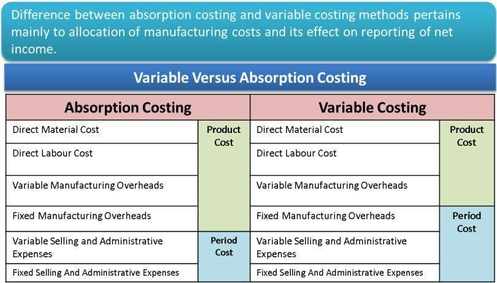

## Table of Contents

## What is absorption costing?

Absorption costing is a way of figuring out how much it costs to make a product. It includes all the costs that go into making the product, like the materials you use, the labor to put it together, and even the costs of running the factory where it's made. This method is also called full costing because it takes into account all the costs that are absorbed by the product.

This type of costing is useful for businesses because it helps them see the true cost of making each item. It's required for financial reporting under generally accepted accounting principles (GAAP). When a company uses absorption costing, they can better understand their profit margins and make smarter decisions about pricing and production. It's different from other methods, like variable costing, which only looks at costs that change with the number of products made.

## What is variable costing?

Variable costing is a way to figure out how much it costs to make a product by only looking at costs that change when you make more or less of the product. These costs are called variable costs and include things like the materials you use to make the product and the labor to put it together. If you make more products, these costs go up, and if you make fewer, they go down.

This method is different from absorption costing, which includes all costs, even the ones that don't change no matter how many products you make. Variable costing is useful for managers because it helps them see how costs change with production levels. It's easier to understand how profitable a product is when you only look at the costs that you can control by changing how much you produce.

## How do absorption costing and variable costing differ in terms of cost classification?

Absorption costing and variable costing differ in how they classify costs. Absorption costing includes all costs that go into making a product. This means it counts both the costs that change when you make more or less of the product, like materials and labor, and the costs that stay the same no matter how much you produce, like rent for the factory or salaries for managers. These fixed costs are spread out over all the products you make, so each product absorbs a part of these costs.

On the other hand, variable costing only looks at the costs that change with how much you produce. These are called variable costs, and they include things like the raw materials you use and the wages for workers who make the product. Fixed costs, like rent and salaries, are not included in the cost of each product. Instead, they are treated as period costs and are taken out of the company's income all at once, not spread out over the products.

Because of these differences, absorption costing gives you a fuller picture of the total cost to make a product, while variable costing helps you see how costs change when you make more or less of something. This can be really helpful for managers trying to figure out how to price their products or how to manage production levels.

## What are the main components included in absorption costing?

Absorption costing includes all the costs that go into making a product. This means it counts the costs that change when you make more or less of the product, like the materials you use and the labor to put it together. These are called variable costs. For example, if you make more shirts, you'll need more fabric and more workers to sew them.

It also includes costs that stay the same no matter how much you produce, like the rent for your factory or the salaries for your managers. These are called fixed costs. In absorption costing, these fixed costs are spread out over all the products you make. So, each shirt you make absorbs a little bit of the rent and salaries. This way, you get a full picture of what it really costs to make each product.

## What are the main components included in variable costing?

Variable costing only includes the costs that change when you make more or less of a product. These costs are called variable costs. They include things like the raw materials you need to make your product and the wages for the workers who actually make it. If you make more products, these costs go up, and if you make fewer, they go down. So, variable costing helps you see how your costs change with your production levels.

Fixed costs, like rent for your factory or salaries for managers, are not included in the cost of each product in variable costing. Instead, these costs are treated as period costs and are taken out of your company's income all at once, not spread out over the products. This way, variable costing gives you a clear picture of how much it costs to make each item, without mixing in the costs that don't change with how much you produce.

## How does absorption costing affect the calculation of product costs?

Absorption costing affects the calculation of product costs by including all the costs that go into making a product. This means it counts both the costs that change when you make more or less of the product, like the materials you use and the labor to put it together, and the costs that stay the same no matter how much you produce, like rent for the factory or salaries for managers. These fixed costs are spread out over all the products you make, so each product absorbs a part of these costs. This way, absorption costing gives you a full picture of what it really costs to make each product.

Because absorption costing includes all costs, it can make the cost of each product seem higher than if you only looked at the costs that change with production. This can affect how you price your products and how you report your profits. For example, if you make a lot of products, the fixed costs are spread out over more items, so the cost per product goes down. But if you make fewer products, the fixed costs are spread over fewer items, so the cost per product goes up. This can be important for businesses to understand when they're making decisions about how much to produce and how to price their products.

## How does variable costing affect the calculation of product costs?

Variable costing affects the calculation of product costs by only including the costs that change when you make more or less of a product. These costs, called variable costs, include things like the raw materials you need and the wages for the workers who make the product. If you make more products, these costs go up, and if you make fewer, they go down. So, variable costing helps you see how your costs change with your production levels.

In variable costing, fixed costs like rent for your factory or salaries for managers are not included in the cost of each product. Instead, these costs are treated as period costs and are taken out of your company's income all at once, not spread out over the products. This way, variable costing gives you a clear picture of how much it costs to make each item, without mixing in the costs that don't change with how much you produce. This can be helpful for managers trying to figure out how to price their products or how to manage production levels.

## What impact do absorption costing and variable costing have on inventory valuation?

Absorption costing and variable costing affect inventory valuation in different ways. With absorption costing, all costs, including both variable and fixed costs, are included in the cost of each product. This means that when you make products but don't sell them right away, the cost of those unsold products, or inventory, includes a part of the fixed costs like rent and salaries. So, the value of your inventory is higher because it includes all these costs.

On the other hand, variable costing only includes the costs that change with how much you produce, like materials and labor. Fixed costs, like rent and salaries, are not added to the cost of each product. Instead, they are taken out of your company's income all at once. This means that the value of your inventory is lower because it only includes the variable costs. This difference can affect how much profit you report, especially if you have a lot of unsold products in your inventory.

## How do absorption costing and variable costing influence profit reporting?

Absorption costing and variable costing can make a big difference in how much profit a company reports. With absorption costing, all costs, including the ones that don't change no matter how much you produce, are added to the cost of each product. If you make a lot of products but don't sell them all right away, these fixed costs stay in your inventory. This means your profit looks higher because you're not counting all those costs against your income yet. But when you finally sell those products, your profit might go down because you have to take those fixed costs out of your income.

On the other hand, variable costing only counts the costs that change when you make more or less of a product. Fixed costs, like rent and salaries, are taken out of your income right away, not spread out over the products. This means your profit can look lower if you have a lot of fixed costs, because you're counting all those costs against your income even if you haven't sold all your products yet. But when you do sell your products, your profit might go up because you've already taken out the fixed costs. So, the way you choose to cost your products can really change how your profits look on paper.

## In what scenarios might a company prefer to use absorption costing over variable costing?

A company might choose absorption costing over variable costing when they need to follow the rules for financial reporting. Absorption costing is required by generally accepted accounting principles (GAAP), so if a company wants to show their financial statements to investors or lenders, they'll need to use absorption costing. It helps them show a complete picture of their costs and profits, which is important for people outside the company to understand how well the business is doing.

Another reason a company might prefer absorption costing is when they want to spread out their fixed costs over all the products they make. This can be helpful if they have a lot of fixed costs like rent or salaries. By using absorption costing, they can make the cost of each product seem lower if they produce a lot, which can help them set prices and plan production. It gives them a better idea of the true cost of making each item, which can be important for long-term planning and decision-making.

## In what scenarios might a company prefer to use variable costing over absorption costing?

A company might choose variable costing when they want to see how costs change with how much they produce. Variable costing only counts the costs that go up or down when you make more or less of a product, like the materials you use and the wages for workers. This helps managers understand how much it really costs to make each item, without mixing in the costs that stay the same no matter how much you produce. It's really useful for making decisions about how to price products or how to manage production levels, because it shows you the direct impact of making more or fewer products.

Another reason a company might prefer variable costing is for internal planning and decision-making. Since variable costing separates fixed costs from the cost of each product, it can help managers see how profitable a product is on its own. This can be important when they're trying to figure out which products to focus on or how to cut costs. Variable costing can also make it easier to see how changes in production levels affect profits, which can be helpful for short-term planning and managing the business day-to-day.

## How do absorption costing and variable costing comply with different accounting standards and regulations?

Absorption costing is the method that follows the rules set by generally accepted accounting principles (GAAP). This means if a company wants to show their financial statements to investors or lenders, they have to use absorption costing. It's required because it gives a full picture of all the costs that go into making a product, including the costs that don't change no matter how much you produce. This helps everyone outside the company understand how well the business is doing.

Variable costing, on the other hand, is not allowed for external financial reporting under GAAP. But it's still very useful for companies to use inside their business. It helps managers see how costs change when they make more or less of a product, which is important for making decisions about pricing and production. Even though it's not used for official financial statements, variable costing can be a big help for planning and managing the business day-to-day.

## What are the key differences between variable and absorption costing?

The treatment of fixed costs is the fundamental distinction between variable costing and absorption costing methods. In absorption costing, also known as full costing, both variable and fixed manufacturing costs are incorporated into product costs. This inclusion means that fixed costs, such as salaries of production supervisors or rent of manufacturing facilities, are allocated to each unit produced, affecting the unit cost of production. The formula for total product cost under absorption costing can be expressed as:

$$
\text{Total Product Cost} = \text{Direct Materials} + \text{Direct Labor} + \text{Variable Manufacturing Overhead} + \text{Fixed Manufacturing Overhead}
$$

In contrast, variable costing, referred to as direct or marginal costing, assigns only variable manufacturing costs to product costs, treating fixed costs as period expenses. Thus, fixed costs are expensed in the period they are incurred, rather than allocated to individual products. The formula for calculating the total product cost under variable costing is:

$$
\text{Total Product Cost} = \text{Direct Materials} + \text{Direct Labor} + \text{Variable Manufacturing Overhead}
$$

This difference in cost allocation can significantly impact financial metrics. In absorption costing, inventory values reflect all manufacturing costs, including fixed costs. During periods of increasing inventory levels, some fixed costs are included in the ending inventory valuation, potentially reducing the expense recognized on the income statement and thus inflating profitability. Conversely, variable costing portrays a direct relationship between production activity and cost, often providing clearer insight into the additional cost of producing one more unit, which is beneficial for cost-[volume](/wiki/volume-trading-strategy)-profit analysis.

Managerial decisions, notably those involving production levels and pricing strategies, are influenced by these disparities. Under absorption costing, managers may be incentivized to increase production to spread fixed costs over a larger number of units, thereby reducing the cost per unit. However, this can lead to overproduction and excess inventory. Variable costing, by contrast, helps in making short-term pricing decisions as it highlights the additional variable costs associated with each product, aiding in setting prices that cover marginal costs and contribute towards fixed costs and profits.

The choice between these costing methods hinges on the specific financial goals and reporting requirements of a business, with absorption costing being necessary for external financial reporting under Generally Accepted Accounting Principles (GAAP), while variable costing remains a potent tool for internal analysis and decision-making.

## References & Further Reading

[1]: Horngren, C. T., Datar, S. M., & Rajan, M. V. (2014). ["Cost Accounting: A Managerial Emphasis."](https://www.semanticscholar.org/paper/Cost-Accounting%3A-A-Managerial-Emphasis-Horngren-Datar/0a40f19b3c7611bb798e8fc8641cd15bfc5eeaeb) Prentice Hall.

[2]: Kaplan, R. S., & Atkinson, A. A. (1998). ["Advanced Management Accounting."](https://books.google.com/books/about/Advanced_Management_Accounting.html?id=EKBZAAAAYAAJ) Prentice Hall.

[3]: Drury, C. (2018). ["Management and Cost Accounting."](https://link.springer.com/book/10.1007/978-1-4899-6828-9) Cengage Learning.

[4]: Hilton, R. W., Maher, M. W., & Selto, F. H. (2007). ["Cost Management: Strategies for Business Decisions."](https://books.google.com/books/about/EBOOK_Cost_Management_Strategies_for_Bus.html?id=zsovEAAAQBAJ) McGraw Hill.

[5]: Damodaran, A. (2012). ["Investment Valuation: Tools and Techniques for Determining the Value of Any Asset."](https://books.google.com/books/about/Investment_Valuation.html?id=5SRHAAAAQBAJ) Wiley.

[6]: De Prado, M. L. (2018). ["Advances in Financial Machine Learning."](https://www.amazon.com/Advances-Financial-Machine-Learning-Marcos/dp/1119482089) Wiley.

[7]: Chan, E. (2009). ["Quantitative Trading: How to Build Your Own Algorithmic Trading Business."](https://github.com/ftvision/quant_trading_echan_book) Wiley.

[8]: Jansen, S. (2020). ["Machine Learning for Algorithmic Trading."](https://github.com/stefan-jansen/machine-learning-for-trading) Packt Publishing.

[9]: Aronson, D. R. (2006). ["Evidence-Based Technical Analysis: Applying the Scientific Method and Statistical Inference to Trading Signals."](https://www.amazon.com/Evidence-Based-Technical-Analysis-Scientific-Statistical/dp/0470008741) Wiley.