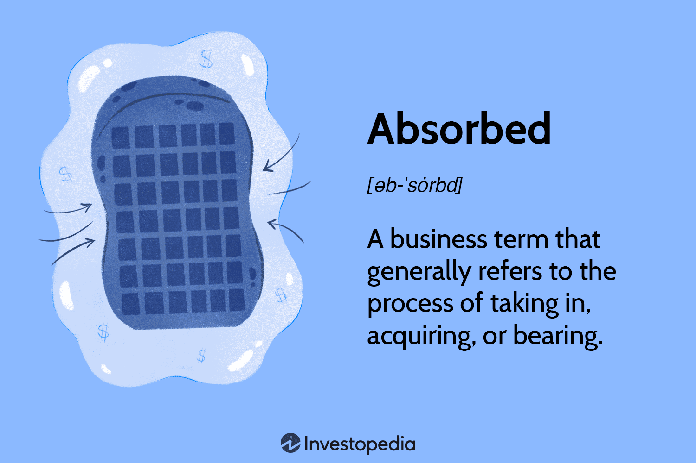

Algorithmic trading, commonly known as algo trading, represents a significant advancement in financial markets, utilizing complex algorithms and pre-programmed trading instructions. These algorithms execute trades automatically by considering various factors such as timing, price, and volume, which allows for more efficient and systematic trading practices compared to manual interventions. Algo trading has gained prominence due to its ability to process vast amounts of data at high speed, thus enabling traders to capitalize on fleeting market opportunities.

This article focuses on the concept of absorption within financial contexts and its relevance to algorithmic trading. Absorption in finance involves the process by which costs, risks, or shares are integrated without passing them on to another party. It significantly impacts financial strategies, as understanding how information and market dynamics are 'absorbed' can provide valuable insights into investor behavior and market trends. By grasping the nuances of absorption, stakeholders can develop more informed investment strategies, leveraging their understanding to anticipate market movements more accurately.



We'll explore how absorption mechanisms are utilized in algorithmic trading to enhance trading efficiency and effectiveness. Through this lens, traders can better appreciate how algorithms not only process and react to existing market conditions but also forecast future trends, thereby optimizing trade execution. In summary, as technology continues to evolve, marrying traditional financial theories with advanced algorithmic strategies presents a promising opportunity for enhancing market outcomes.

## Table of Contents

## Understanding Absorption in Finance

In financial terms, 'absorption' denotes the ability of an entity to take on costs, assets, or liabilities without transferring them to external parties. This process is essential in sustaining competitive pricing structures and managing operational overheads effectively. For example, a company might decide to absorb additional production or raw material costs rather than pass these on to customers through raised prices. This strategy can help maintain customer satisfaction and loyalty, as customers experience consistent pricing despite potential fluctuations in production costs.

Absorption has significant implications on financial statements. When a company absorbs costs, these are reflected in various line items such as cost of goods sold (COGS) and operating expenses, ultimately impacting net income. The absorption of costs often affects a firm's gross and operating margins, influencing investor perceptions and market valuations. A company adept at absorbing costs efficiently may be perceived as financially stable, potentially leading to a more favorable appraisal by investors and analysts.

Furthermore, absorption impacts market valuations by altering forecast assumptions and performance metrics used in equity valuation models like the discounted cash flow (DCF) or the price-to-earnings (P/E) ratio. For instance, efficient absorption of fixed costs may enhance operational leverage, leading to higher profit margins as sales increase.

In sum, understanding and managing absorption is vital for both corporate financial management and investment analysis. It enables companies to maintain stable pricing and cost structures, while providing investors with critical insights into the financial health and valuation of a business.

## Mechanism of Absorption in Algorithmic Trading

Algorithmic trading leverages the mechanism of absorption to adapt swiftly to market conditions and enhance decision-making capabilities. By rapidly integrating market data, algorithms are capable of making informed trading decisions that increase accuracy and efficiency. This absorption primarily involves processing large volumes of market data to discern patterns and trends, which are crucial for predictive analytics.

Algorithms in trading systems are designed to handle extensive datasets far beyond human capacity. They can decipher market 'noise'—random fluctuations and irrelevant factors in market data—and extract valuable insights that can inform trading strategies. This process allows algorithms to differentiate between significant and insignificant data, thereby improving the precision of trading decisions.

The efficacy of algorithms in absorbing market data is facilitated by advanced [machine learning](/wiki/machine-learning) models that recognize complex patterns and predict future market movements. These models function by analyzing historical data, identifying trends, and applying these insights to optimize trading parameters. For example, Python is commonly used in developing such machine learning models using libraries like pandas for data manipulation and scikit-learn for building predictive models. A simple Python example for performing linear regression, a fundamental predictive task, could look like this:

```python
import pandas as pd
from sklearn.model_selection import train_test_split
from sklearn.linear_model import LinearRegression

# Sample data
data = pd.DataFrame({
    'price': [100, 102, 101, 104, 108],
    'volume': [200, 220, 210, 230, 240]
})

# Splitting data into training and test set
X = data[['[volume](/wiki/volume-trading-strategy)']]
y = data['price']
X_train, X_test, y_train, y_test = train_test_split(X, y, test_size=0.2)

# Training the model
model = LinearRegression()
model.fit(X_train, y_train)

# Making predictions
predictions = model.predict(X_test)
```

This code demonstrates how historical pricing and volume data can be utilized to predict future prices, epitomizing the concept of absorption in [algorithmic trading](/wiki/algorithmic-trading).

Processing such data accurately minimizes human error, allowing for high-speed deployment of consistent trading strategies. Algorithms can execute trades based on predefined criteria, reducing latency and maximizing profit potential. As financial markets evolve, the ability of algorithms to absorb and process market data efficiently will continue to offer competitive edges to traders and investors.

## Examples of Absorption in Algorithmic Trading

Algorithmic trading utilizes absorption mechanisms through various strategies tailored to interpret and act upon market data efficiently. One prominent example is trend-following strategies, often employed to absorb and analyze market trends. Such strategies utilize historical price data to identify and follow prevailing price directions, thus enabling traders to make buy or sell decisions aligned with existing trends. A common approach is using moving averages, where the strategy buys when the price exceeds a moving average and sells when it falls below.

Mean reversion strategies are another application, based on the principle that prices tend to revert to their historical mean over time. Traders employing mean reversion absorption look for assets that deviate significantly from their average price, betting on a reversal trend. The strategy essentially absorbs historical price data to predict potential price corrections, capitalizing on perceived overbought or oversold conditions.

Index fund rebalancing relies on absorption by continuously integrating current asset allocation data against a target benchmark. As markets fluctuate, the absorption of these variations prompts the execution of trades to maintain alignment with the designated index. This strategy ensures the fund's performance mirrors the benchmark, absorbing discrepancies to achieve consistency.

Arbitrage strategies in algorithmic trading exploit price discrepancies across different markets or instruments. Algorithms absorb real-time pricing data to identify and execute trades capturing the spread between varying prices. Established models such as statistical [arbitrage](/wiki/arbitrage) employ complex mathematical tools to automate the absorption and analysis, seeking market inefficiencies for profit.

These examples underscore the critical role of absorption in algorithmic trading, demonstrating how automated strategies utilize absorbed data to optimize decision-making, reduce risks, and enhance profitability.

## Implementing Absorption Strategies without Coding

Several no-code platforms have emerged as powerful tools, enabling traders to implement algorithmic trading strategies that incorporate absorption mechanisms without requiring programming expertise. These platforms democratize access to sophisticated trading techniques by offering user-friendly interfaces and robust functionality.

One such platform, Composer, facilitates the creation, testing, and deployment of trading strategies through a drag-and-drop interface. Users can design strategies by selecting from various pre-defined components or creating custom logic blocks, which can then be linked together to form a complete trading algorithm. This approach empowers users to implement complex strategies, such as those involving absorption mechanisms, without needing to write code.

Composer and similar platforms offer tools for incorporating popular absorption strategies, such as [trend following](/wiki/trend-following) and mean reversion. Trend-following strategies leverage historical price data to identify and respond to emerging trends, allowing traders to anticipate market movements effectively. By "absorbing" trends, the platform enables traders to position themselves advantageously in the market. Mean reversion strategies, on the other hand, capitalize on the tendency of asset prices to return to a historical average. These strategies absorb deviations from the norm, providing traders with actionable signals based on statistical principles.

A significant advantage of no-code platforms is their integrated [backtesting](/wiki/backtesting) capabilities, which are essential for assessing the viability of absorption strategies under historical market conditions. Backtesting involves simulating a trading strategy using past market data to evaluate its performance. This process helps traders refine their strategies, ensuring that they are robust and capable of delivering consistent returns. Using historical data, traders can analyze key metrics such as risk-adjusted returns, drawdowns, and win rates, thereby making informed decisions about strategy deployment.

Implementing absorption strategies without coding is not only about convenience but also about enhancing accessibility. By lowering the barrier to entry, these platforms allow a wider audience, including those without a technical background, to engage with and benefit from algorithmic trading. As a result, traders can focus on developing intuitive and efficient strategies, harnessing the power of algorithmic trading to achieve their investment goals.

## Challenges and Opportunities

Algorithmic trading presents a range of challenges and opportunities. A significant challenge is overfitting, a common pitfall where trading strategies become overly specialized to historical data and hence fail to perform well in real-world scenarios. Overfitting occurs when an algorithm identifies patterns in noise rather than meaningful signals, leading to strategies that might excel in past conditions but do not generalize to future market dynamics. To address overfitting, traders often employ techniques such as cross-validation and regularization, which help in creating more robust models that maintain performance across unseen data.

Another challenge is the absorption of incorrect or misleading data, which can degrade the quality of trading decisions. The financial markets are saturated with vast amounts of data, not all of which are reliable or accurate. Algorithms that rely on such data may not only underperform but also introduce significant risks. Therefore, ensuring data integrity and reliability is essential, often requiring sophisticated data cleaning, validation, and accuracy checks before any trading decisions are made.

Despite these challenges, the landscape of algorithmic trading offers considerable opportunities, particularly with high-frequency trading ([HFT](/wiki/high-frequency-trading-strategies)). HFT allows for the efficient execution of large order volumes at unprecedented speeds, capitalizing on short-lived market inefficiencies. This capability to execute trades almost instantaneously provides traders with the potential to exploit market conditions that are simply unavailable through traditional trading methods.

Additionally, algorithmic strategies enable traders to better manage risk and achieve more consistent returns. By leveraging quantitative models, traders can deploy highly sophisticated strategies that adapt to market conditions in real-time. This adaptability, combined with the speed and precision of algorithmic execution, helps in mitigating risk exposure and enhancing the overall reliability of investment portfolios.

In summary, while algorithmic trading is fraught with complexities such as overfitting and data reliability issues, it simultaneously provides a powerful toolkit for executing high-frequency trades and mitigating risks. As traders refine their strategies and technology continues to advance, the benefits of incorporating algorithmic techniques with robust absorption mechanisms are likely to grow, offering substantial opportunities for those able to navigate these challenges effectively.

## Conclusion

The absorption mechanism is a fundamental component in both traditional and algorithmic trading, facilitating enhanced decision-making and improved market outcomes. By integrating absorption into trading strategies, traders can better interpret market dynamics and act upon them effectively, thus achieving more informed and strategic trading operations. 

With technological advancements, implementing these strategies has become increasingly accessible. New platforms, including those that require no coding knowledge like Composer, have democratized the ability to execute complex trading strategies like trend following and mean reversion, which rely on absorption principles. Such platforms enable traders to design, test, and deploy strategies even if they lack programming skills, significantly broadening the pool of potential users capable of utilizing algorithmic trading techniques effectively.

As financial markets continue to evolve with advancements in data processing and [artificial intelligence](/wiki/ai-artificial-intelligence), the importance of understanding and utilizing absorption mechanisms remains paramount. These mechanisms enable traders to parse through large volumes of market data, absorb pertinent information, and leverage that intelligence to maintain a competitive edge. Whether managing risks or seeking more consistent returns, leveraging the concept of absorption is integral to navigating the complexities of modern financial markets.

## References & Further Reading

[1]: Bergstra, J., Bardenet, R., Bengio, Y., & Kégl, B. (2011). ["Algorithms for Hyper-Parameter Optimization."](https://dl.acm.org/doi/10.5555/2986459.2986743) Advances in Neural Information Processing Systems 24.

[2]: ["Advances in Financial Machine Learning"](https://www.amazon.com/Advances-Financial-Machine-Learning-Marcos/dp/1119482089) by Marcos Lopez de Prado

[3]: ["Evidence-Based Technical Analysis: Applying the Scientific Method and Statistical Inference to Trading Signals"](https://www.amazon.com/Evidence-Based-Technical-Analysis-Scientific-Statistical/dp/0470008741) by David Aronson

[4]: ["Machine Learning for Algorithmic Trading"](https://github.com/stefan-jansen/machine-learning-for-trading) by Stefan Jansen

[5]: ["Quantitative Trading: How to Build Your Own Algorithmic Trading Business"](https://github.com/LucindaYa/quant-resources/blob/master/Quantitative%20Trading%20How%20to%20Build%20Your%20Own%20Algorithmic%20Trading%20Business.pdf) by Ernest P. Chan