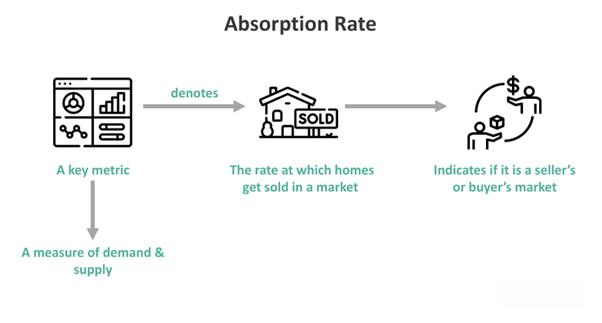

In the rapidly evolving real estate market, understanding key metrics such as the absorption rate is crucial for stakeholders aiming to make informed decisions. The absorption rate, a metric traditionally used in real estate, has found new significance through its integration into algorithmic trading systems. This article explores this integration and its implications for both industries. 

The absorption rate is a valuable tool in property sales, indicating how quickly homes are selling in a given area by dividing the number of homes sold by the number of available homes. When applied to modern trading technologies, the metric plays a pivotal role in enhancing trading strategies and adapting to market dynamics. 

As the real estate market experiences increased volatility, the merging of real estate metrics like the absorption rate with automated trading systems presents unique opportunities and challenges. This integration provides a nuanced understanding of market behavior, influencing strategies for both investors and traders. By leveraging these insights, market participants can enhance their decision-making processes, optimize returns, and maintain a competitive edge in an increasingly dynamic environment.

The ability to analyze and act on real-time data becomes a crucial factor, driving the convergence of traditional real estate with advanced trading technologies. As such, understanding the absorption rate does more than inform property sales—it is a strategic component in modern investment strategies, impacting decisions across various market sectors.

## Table of Contents

## Understanding Absorption Rate in Real Estate

The absorption rate in real estate is a critical metric used to assess how quickly properties are being purchased in a specific market during a set time frame. This is a pivotal indicator for measuring the demand and supply dynamics within the real estate sector.

The formula for calculating absorption rate is straightforward:

$$
\text{Absorption Rate} = \frac{\text{Number of Homes Sold}}{\text{Total Number of Available Homes}}
$$

For example, if there are 100 homes available on the market and 20 homes were sold over a month, the absorption rate would be $\frac{20}{100} = 0.20$ or 20%.

A high absorption rate suggests a seller's market, characterized by strong demand that leads to faster sales and potentially higher property prices. Conversely, a low absorption rate indicates a buyer's market, where properties remain on the market longer, and buyers may have greater negotiating power. This knowledge is essential for real estate professionals and investors who seek to optimize pricing strategies and determine the optimal timing for market entry or [exit](/wiki/exit-strategy).

Real estate [agents](/wiki/agents), developers, and financial institutions frequently utilize absorption rates to assess the health of the housing market. A high absorption rate can prompt developers to initiate new projects, anticipating that new constructions will sell quickly in a competitive market. Financial institutions may also adjust lending practices, based on absorption rates, to mitigate risk and allocate resources effectively.

Overall, understanding and analyzing the absorption rate equips stakeholders in the real estate market with the necessary tools to make informed decisions and adapt to changing market conditions.

## Impact of Absorption Rates on Market Dynamics

The absorption rate is a critical metric in real estate, directly affecting market dynamics and influencing various stakeholders' decisions. A high absorption rate typically indicates a seller's market, where the demand for properties exceeds supply. This imbalance often leads to increased property values, benefiting sellers and developers who can capitalize on the competitive environment. Sellers in such markets may find themselves in a position to command higher prices and face less negotiation pressure from buyers. Furthermore, developers might be encouraged to expedite projects to meet the heightened demand, potentially leading to increased profitability.

Conversely, a low absorption rate can signal an oversupply of homes, which may prompt a recalibration of strategic approaches by sellers and developers. When supply outstrips demand, property prices can stagnate or even decrease, forcing sellers to adjust their pricing strategies to attract buyers. Developers, on the other hand, may reconsider the timing of new projects, choosing to delay or scale down construction activities until market conditions become more favorable. Understanding these market signals can prevent overbuilding and financial overcommitment during periods of low absorption.

Investors utilize absorption rates as a barometer for local market conditions, making it a pivotal [factor](/wiki/factor-investing) in guiding investment decisions and portfolio diversification strategies. High absorption rates suggest robust market health, indicating potential for capital appreciation and rental income increases. Low rates, on the contrary, may highlight risks or opportunities for acquiring undervalued assets, with a longer-term view of market recovery. Prudent investors analyze absorption rate trends alongside other economic indicators to optimally time market entry and exit, enhancing their returns and mitigating risks.

Overall, grasping the nuances of the absorption rate allows for strategic planning in real estate transactions, aiding stakeholders in optimizing their operations and maximizing returns. Whether for pricing strategies, project launches, or investment decisions, this metric provides valuable insights into market behavior, essential for adapting to the evolving real estate landscape.

## Algorithmic Trading and Real Estate Market Analysis

Algorithmic trading employs automated systems programmed to execute trades based on specific criteria, which can now be applied to real estate markets. These systems can incorporate the vital metric of absorption rate, which helps determine optimal times for buying and selling properties. By examining absorption rates, algorithmic models can provide insights into the supply and demand dynamics of specific real estate markets, enabling more strategic decision-making.

Absorption rates reflect market conditions, such as how quickly properties are being purchased compared to their availability. By integrating this data, [algorithmic trading](/wiki/algorithmic-trading) systems can not only assess current market conditions but also anticipate potential shifts. High-frequency trading ([HFT](/wiki/high-frequency-trading-strategies)) strategies, which rely on speed and efficiency, can utilize these metrics to predict short-term market movements with increased precision. This form of trading can react to even slight changes in absorption rates, allowing for rapid adjustment of strategies to maximize profit margins.

Developers and traders are increasingly adopting these data analytics tools to streamline decision-making processes. By enhancing market accuracy and efficiency, these technological advancements allow market participants to capitalize on emerging signals, such as changes in buyer interest or shifts in property values. The intersection of real estate market data with algorithmic trading models offers a significant leap forward in property investment strategies, allowing for a more responsive and dynamic approach to market fluctuations.

As algorithmic trading continues to evolve, the inclusion of detailed real estate metrics like absorption rates is likely to become a standard practice in property investment. The synergy between these sophisticated trading systems and traditional real estate analysis represents a paradigm shift, paving the way for advanced approaches to both real estate management and investment strategy execution.

## Case Studies: Real Estate and Algorithmic Strategies

### Case Studies: Real Estate and Algorithmic Strategies

**Case Study 1:** A real estate firm operating in a high-demand urban area successfully utilizes absorption rates to strategically price new listings. This firm systematically analyzes local absorption rates to determine pricing strategies that align with current market demand. By focusing on neighborhoods with high absorption rates, the firm can price properties at a level that maximizes both competitiveness and profitability. For example, in a market where the absorption rate indicates rapid sales, they might set higher initial prices to capitalize on buyer urgency. This approach not only facilitates quicker sales but also optimizes profit margins by aligning listings with real-time market conditions, thereby enhancing overall financial performance.

**Case Study 2:** An algorithmic trading firm leverages real estate market data, incorporating absorption rates into its trading algorithms to improve the prediction accuracy of its real estate asset portfolios. By integrating this metric, the firm's algorithm gains insights into the liquidity and demand dynamics of different market segments, allowing it to make more informed predictions on property values and investment timing. These enhanced algorithms use historical absorption rate data to forecast short-term market movements, refine buying strategies, and adjust portfolio allocations dynamically. For instance, an algorithm might trigger property purchases in regions where absorption rates are increasing, anticipating a rise in property values.

These case studies underscore the practical benefits of utilizing absorption rate data within real estate and algorithmic trading contexts. The first case demonstrates how traditional real estate metrics can inform pricing strategies to maximize returns. The second case highlights the role of advanced data integration in refining trading algorithms for better investment outcomes. By combining traditional real estate metrics with sophisticated trading technologies, these applications reveal significant potential for enhanced efficiency and profitability in both fields. This integration represents a step forward in the evolution of real estate investment strategies, opening up new avenues for achieving superior performance through data-driven decision-making.

## Challenges and Future Prospects

Combining real estate absorption rates with algorithmic trading is a promising strategy, yet it comes with several challenges. One primary concern is data accuracy. Real estate data, including absorption rates, must be precise to ensure reliable algorithmic trading outcomes. The complexity of market variables in real estate, such as economic fluctuations, policy changes, and local market conditions, further complicates the integration of this data into trading algorithms. Variability in data sources and reporting standards can lead to inconsistencies, affecting the predictive power of the models used in algorithmic trading.

Real-time data integration and processing present another significant hurdle. Effective algorithmic trading relies on the ability to process real estate data swiftly to make timely decisions. The technological infrastructure required to achieve seamless real-time processing is still evolving. Systems must be designed to handle large datasets robustly and efficiently, minimizing latency in data acquisition and processing to maintain a competitive edge.

Looking ahead, we anticipate further advancements in predictive modeling that incorporate a diverse range of datasets, including real estate absorption rates. These models must be capable of accommodating the inherent complexities and variabilities of real estate markets while providing actionable insights. To stay competitive, market participants need to remain informed about evolving technologies and continuously refine their trading models. This may involve integrating [machine learning](/wiki/machine-learning) techniques to enhance the predictive accuracy of absorption rate data within algorithmic trading frameworks.

The ongoing digital transformation is expected to lead to a closer alignment of real estate dynamics with algorithmic trading. As this integration becomes more streamlined and sophisticated, it will likely establish a new norm in strategic investment practices. Professionals adept at leveraging both real estate data and algorithmic models will be well-positioned to seize emerging opportunities and optimize their investment strategies in an increasingly data-driven market environment.

## Conclusion

The absorption rate stands as a crucial metric in evaluating real estate market conditions, playing a significant role in shaping property sales strategies and investment decisions. By assessing how quickly properties are absorbed in the market, stakeholders can gauge demand and supply dynamics, which ultimately influence pricing strategies and market entry or exit plans. This critical insight helps to determine whether it is a buyer's or seller's market, directly impacting the tactics employed by real estate professionals.

Algorithmic trading presents a robust framework for harnessing such metrics, enhancing decision-making processes and market efficiency. The integration of absorption rate data into algorithmic models allows for the refinement of investment strategies based on real-time market fluctuations. The deployment of algorithms enables the processing of complex datasets, thus optimizing timing for property transactions and aligning investment portfolios with market trends.

This convergence of real estate metrics with algorithmic trading marks a transformative shift in traditional investment approaches, fostering interdisciplinary innovation. As real estate professionals and traders begin to leverage both data sources, they uncover new avenues for competitiveness and profitability. The marriage of these fields encourages the development of sophisticated models that are more predictive and responsive to market dynamics.

For investors and professionals, embracing this integration can unlock significant market opportunities. The ability to analyze and react swiftly to market signals delivered through absorption rates and algorithmic insights provides a distinct competitive edge. As the landscape of real estate and financial markets continues to evolve, understanding and adapting to the fusion of these disciplines will be vital for achieving and sustaining success in property sales and investments.

## References & Further Reading

[1]: "Absorption Rate: What It Is and How To Use It," [Investopedia](https://www.investopedia.com/ask/answers/012915/what-formula-calculating-current-ratio-excel.asp)

[2]: "Real Estate Market Analysis: A Case Study Approach" by Deborah L. Brett and Adrienne Schmitz

[3]: "Algorithmic and High-Frequency Trading" by Alvaro Cartea, Sebastian Jaimungal, and José Penalva

[4]: Geltner, David, Norman G. Miller, Jim Clayton, and Piet Eichholtz. "Commercial Real Estate Analysis and Investments."

[5]: "Trading Systems and Methods" by Perry J. Kaufman

[6]: "Real Estate Market Analysis: Methods and Applications" by John Ratcliffe, Michael Stubbs, and Miles Keeping

[7]: "Advances in Financial Machine Learning" by Marcos Lopez de Prado