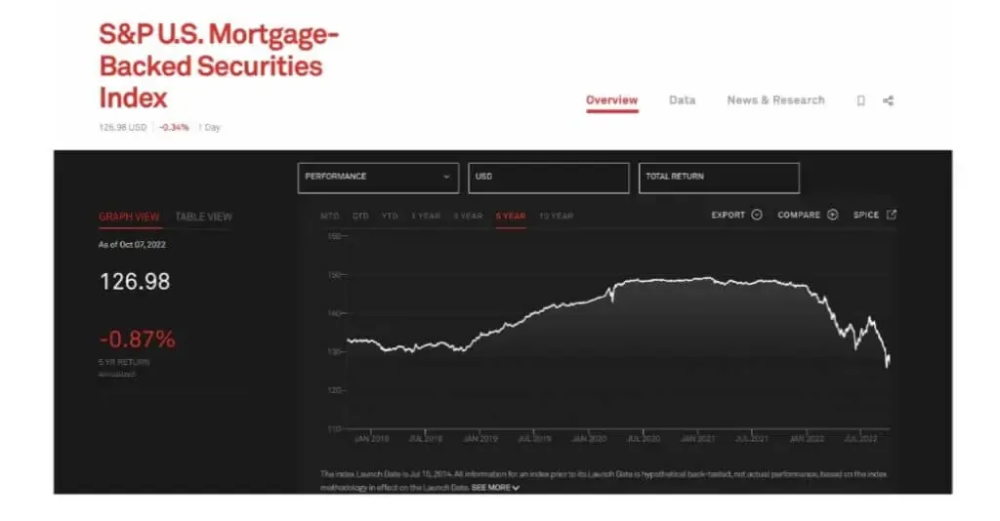

The article focuses on the intricate landscape of investment finance, specifically examining the interplay between traditional financial indicators and modern trading methodologies. Central to this exploration is the ABX Index, a key financial indicator within the mortgage-backed securities (MBS) market. Launched in January 2006 by Markit, now part of IHS Markit, the ABX Index offers a benchmark for the valuation and risk assessment of subprime mortgage-backed securities. This index allows investors to gauge the pricing and perceived risk associated with these securities, serving as an essential tool during periods of financial instability, such as the 2007–2008 financial crisis.

In parallel, algorithmic trading, which utilizes complex algorithms to execute and manage trades, has become increasingly vital in the financial markets. This method leverages mathematical models and high-speed computing, offering advantages like precision, speed, and the ability to process vast datasets beyond the capacity of human traders. As financial markets grow more complex and data-driven, algorithmic trading stands as a cornerstone in executing efficient and strategic trades.



Combining the ABX Index with algorithmic trading strategies presents a compelling synergy. Investors can leverage algorithmic models to dynamically interpret changes in the ABX Index, allowing for more informed trading decisions in the MBS sector. This integration exemplifies how traditional financial metrics can enhance modern investment strategies, potentially leading to improved risk assessment and return optimization. Such a combination highlights the potential of integrating established financial instruments with cutting-edge trading technologies, paving the way for innovation in investment strategies.

This article will delve further into the complexities of both the ABX Index and algorithmic trading, offering insights into their respective roles, integration methods, and the benefits and risks associated with their combined use. Through this lens, investors can better understand the evolving landscape of investment finance and the tools available to navigate it effectively.

## Table of Contents

## Understanding the ABX Index

The ABX Index is a financial benchmark created to assess the value and health of mortgage-backed securities (MBS). It was introduced in January 2006 by Markit Group Limited, targeting subprime home equity loans. The index provides a transparent and standardized tool to track changes in the value of subprime MBS, particularly through credit default swaps (CDS). The ABX Index is fundamentally designed to offer market participants a way to gauge risk and value in segments of the MBS market.

The ABX Index is structured by creating a series of sub-indices based on the credit ratings assigned to bond tranches. It consists of several "series," each launched semi-annually and tied to the issuance periods of the MBS included. Within each series, the ABX is further divided into tranches that reflect different risk levels: AAA, AA, A, BBB, and BBB-. This setup allows investors to focus on specific credit qualities, essentially enabling more nuanced assessment strategies.

The index plays a critical role in the MBS market by providing a measure of credit risk associated with subprime loans. Before its inception, there was a lack of transparency in valuations in the subprime MBS market. The ABX Index brought about enhanced transparency and offered a benchmark to compare and contrast different MBS products. Through CDS, investors could go long or short on specific credit tranches, making it a valuable tool for hedging positions or speculating on market movements.

Investors use the ABX Index for risk assessment by examining price changes and spreads which reflect the market's view of credit risk associated with the relevant MBS. For example, widening spreads might signal perceived increasing risk or deteriorating credit conditions. This allows financial institutions to better manage the risk associated with MBS portfolios by providing a clearer picture of how these securities are performing in the market, and by helping them make informed investment or hedging decisions.

Recent trends and events have influenced the ABX Index, particularly through changes in regulatory environments and evolving market perceptions post the 2008 financial crisis. The emphasis on credit risk and the reforms that followed have affected how these indices track and report. New developments in data analytics and financial technology continue to refine how the index operates, offering more precise evaluations and forecasting abilities. Furthermore, shifts in housing markets and [interest rate](/wiki/interest-rate-trading-strategies) policies also contribute to changes in the ABX Index, impacting its performance and relevance in current and future market assessments.

 to Algo Trading

Algorithmic trading, or algo trading, refers to the use of computer algorithms to automate trading strategies in financial markets. These algorithms execute orders for buying or selling stocks, commodities, or other financial assets at speeds and frequencies impossible for human traders. The key principles of [algorithmic trading](/wiki/algorithmic-trading) involve the concepts of speed, precision, and data processing capabilities, allowing traders to capitalize on market inefficiencies and execute large orders with minimal market impact. 

### Benefits of Algorithmic Trading

Algorithmic trading offers several benefits that contribute to its widespread adoption. One major advantage is efficiency; algorithms can conduct trades in milliseconds, significantly faster than human execution. This speed facilitates the rapid exploitation of small price differentials across markets, improving the profitability of trading strategies. Precision is another core benefit, as computer programs can execute trades at exact prices, reducing slippage—a common issue in manual trading where executed prices differ from expected ones.

### Types of Algorithmic Trading Strategies

Algo trading encompasses a variety of strategies suited for different market conditions and objectives. High-Frequency Trading ([HFT](/wiki/high-frequency-trading-strategies)) is one strategy characterized by executing a large number of orders at extremely high speeds. HFT aims to capitalize on minute price discrepancies and often involves holding positions for very short periods. Arbitrage strategies, another form, exploit price differences of the same asset in different markets or forms. For example, statistical [arbitrage](/wiki/arbitrage) relies on complex mathematical models to identify and exploit market inefficiencies. 

### Importance of Technology and Data

Technology and data are the backbone of algorithmic trading. High-performance computing infrastructure and low-latency networks are crucial for executing trades within microseconds. Similarly, vast datasets are required for developing and back-testing trading algorithms. Machine learning and [artificial intelligence](/wiki/ai-artificial-intelligence) are increasingly integral to improving the predictive accuracy and adaptability of trading models. With the right technology and data, traders can refine their strategies and enhance their market edge continuously.

### Risks and Challenges

Despite its advantages, algorithmic trading poses several risks and challenges. Technical failures, such as software bugs or network outages, can lead to severe financial losses. There is also the risk of overfitting, where models perform well on historical data but fail in live markets due to over-optimization. Additionally, algo trading can contribute to market [volatility](/wiki/volatility-trading-strategies), as demonstrated during the 2010 Flash Crash, where algorithmic orders exacerbated a sudden market drop. Traders must implement robust risk management strategies, such as circuit breakers and diversified algorithms, to mitigate these challenges.

In summary, while algorithmic trading offers significant benefits in terms of efficiency and precision, it demands a high level of technological infrastructure and thorough risk management. The strategic use of technology and data can effectively leverage these tools for improved trading outcomes, though awareness of potential pitfalls remains essential.

## Integrating the ABX Index with Algorithmic Trading

The integration of the ABX Index with algorithmic trading involves developing models that utilize this index as a data input to formulate trading strategies in the mortgage-backed securities (MBS) market. The ABX Index, representing a basket of credit default swaps on subprime mortgage-backed securities, reflects the perceived credit quality and risk within this sector. By incorporating the ABX Index into algorithmic trading models, traders can leverage these insights to make informed decisions regarding asset exposure, risk management, and potential market opportunities.

### Advantages of Using the ABX Index in Trading Strategies

1. **Risk Assessment and Pricing Insights**: The ABX Index offers a quantitative measure of credit risk within the MBS market. Algorithmic models using the ABX Index can enhance the precision of risk assessment, enabling traders to adjust their strategies according to market sentiment reflected by index movements.

2. **Market Volatility Exploitation**: Given the index's sensitivity to changes in mortgage market conditions, algorithms can capitalize on short-term volatility by executing trades swiftly based on real-time index changes.

3. **Hedging Opportunities**: The ABX Index serves as an effective tool for hedging against broader market downturns in mortgage-backed securities, allowing algorithms to dynamically adjust positions and mitigate losses.

### Case Studies of Successful Integration

While specific case studies on integrating the ABX Index into algorithmic trading frameworks are limited publicly, industry practices demonstrate that quantitative hedge funds and proprietary trading firms often employ indices like the ABX for developing algorithmic models that aim to optimize yield and manage portfolio risk in structured finance products.

### Technical Requirements and Data Considerations

1. **Data Availability**: Reliable access to historical and real-time ABX Index data is crucial. Traders aiming to incorporate this data into algorithms need databases with extensive historical pricing and performance metrics covering varying economic cycles.

2. **Model Development**: Using machine learning techniques, such as regression analysis or neural networks, can enhance the predictive power of trading models that incorporate ABX Index data. Such models require robust computational resources and expertise in quantitative finance and programming.

3. **Integration with Trading Systems**: Seamlessly integrating ABX Index data streams into existing trading platforms necessitates API connectivity and compatibility with order management systems for efficient execution.

### Challenges and Limitations

1. **Data Sensitivity and Noise**: The ABX Index can exhibit high sensitivity to market rumors and macroeconomic news, leading to potential noise in trading signals. This necessitates sophisticated filtering techniques to extract actionable insights and reduce false positives.

2. **Market Liquidity**: The liquidity of the securities underlying the ABX Index can be variable. Algorithms dependent on index movements must account for potential slippage and execution risk in less liquid market conditions.

3. **Regulatory Compliance**: Algorithmic trading strategies using indices like the ABX must adhere to financial regulations regarding risk management and systemic stability, which can impose constraints on trading velocity and leverage.

Integrating the ABX Index into algorithmic trading strategies presents investors with a robust tool for navigating the complexities of the MBS market. By addressing technical challenges and capitalizing on the intrinsic advantages of the index, traders can potentially enhance their portfolio performance and risk management capabilities.

## Benefits and Risks of ABX Index Algo Trading

The integration of the ABX Index into algorithmic trading strategies has emerged as a compelling prospect for investors seeking to optimize their engagement in the mortgage-backed securities (MBS) market. Utilizing the ABX Index offers several benefits and risks that must be carefully analyzed.

### Potential Profitability

Trading strategies that incorporate the ABX Index can potentially enhance profitability by leveraging the index's ability to reflect market sentiment about subprime mortgage credit risk. The ABX Index provides price transparency and market sentiment, making it a valuable tool for predictive modeling in algorithmic trading. Algorithms can utilize historical ABX data to generate signals that indicate optimal entry and [exit](/wiki/exit-strategy) points, which could potentially lead to significant returns if market conditions are favorable.

### Diversification Benefits

Integrating the ABX Index into an investment portfolio can offer diversification benefits. As the ABX Index is linked to the MBS market, it provides exposure to a segment of the fixed-income market that behaves differently from traditional equity or bond markets. By including the ABX Index in algorithmic trading strategies, investors can potentially reduce portfolio volatility and risk, owing to its low correlation with other asset classes.

### Liquidity Considerations

Liquidity is a crucial [factor](/wiki/factor-investing) in trading the ABX Index. As a derivative instrument, its [liquidity](/wiki/liquidity-risk-premium) largely depends on the overall health and perception of the MBS market. During times of market stress, liquidity can dry up, leading to wider bid-ask spreads and difficulty in executing large trades without significant market impact. Hence, algorithmic strategies that rely on the ABX Index must account for varying liquidity conditions to prevent slippage and unfavorable executions.

### Risks of Over-Reliance on Algorithmic Models

While algorithmic trading offers precision and efficiency, an over-reliance on these models can pose risks. Models based on the ABX Index may become less effective if market dynamics change or if they rely on historical data that may not predict future trends accurately. Additionally, algorithmic models are susceptible to technical glitches, data feed errors, and unforeseen market events that can lead to substantial financial losses.

### Risk Management and Mitigation Strategies

To mitigate these risks, robust risk management strategies should be implemented. These include:

- **Diversifying Algorithms**: Employ a range of algorithmic strategies that utilize different market indicators alongside the ABX Index to avoid concentrated risk.

- **Stress Testing Models**: Regularly stress test algorithms against a variety of market scenarios to ensure resilience under adverse conditions.

- **Liquidity Management**: Implement liquidity constraints within the algorithm to adapt trading activity based on current market liquidity, thus avoiding large trades when spreads are high.

- **Monitoring and Adaptation**: Continuously monitor algorithm performance and adapt strategies in response to market changes or unexpected data patterns.

- **Regulatory Compliance**: Ensure that trading strategies comply with relevant regulations, as compliance can mitigate legal risks and associated financial penalties.

By carefully weighing these benefits and risks, investors can better leverage the ABX Index in algorithmic trading to enhance their investment decisions and optimize their portfolio performance.

## Future Trends in ABX Index and Algo Trading

Predicting future developments in the ABX Index involves understanding both the dynamic nature of the mortgage-backed securities (MBS) market and technological advancements that are increasingly reshaping investment strategies. The performance and relevance of the ABX Index to investors continue to be influenced by macroeconomic factors, housing market conditions, and regulatory changes. As of now, the Index remains pivotal in assessing the health of the subprime mortgage market, a segment that still garners interest due to its historical impact on financial stability.

Technological advancements have significantly transformed algorithmic trading strategies, integrating sophisticated [machine learning](/wiki/machine-learning) algorithms and artificial intelligence (AI) to identify market patterns and execute trades with precision. These technologies allow for real-time data analysis, enabling algo trading systems to process vast amounts of information and adapt faster to market changes than traditional methods. Machine learning models are particularly adept at optimizing strategies based on historical data, making them invaluable in a complex and data-heavy domain like MBS trading.

Emerging trends in financial markets underscore the increasing importance of environmental, social, and governance ([ESG](/wiki/esg-investing)) factors. As investors demand more sustainable investment products, the ABX Index could evolve to incorporate ESG metrics, potentially leading to new derivative products. This shift may result in the development of ESG-compliant mortgage-backed securities, offering investors new segments within the real estate market to explore.

Regulatory changes also play a crucial role in shaping ABX Index trading. Post-2008 financial crisis reforms, such as the Dodd-Frank Act, have already increased transparency and accountability in the derivatives market. Future regulatory adjustments could further refine risk management practices, mandating more stringent reporting and possibly impacting the liquidity and volatility of securities tied to the ABX Index.

Innovative strategies could emerge by combining insights from the ABX Index with algorithmic models, leveraging the predictive power of AI to construct risk-optimized portfolios. One potential approach is the use of neural networks to forecast MBS price movements, incorporating both historical Index data and macroeconomic indicators. Given the improvements in data analytics technology, deploying such models in Python might involve libraries like TensorFlow or PyTorch to design and train neural networks. The integration might look like:

```python
import tensorflow as tf
from tensorflow import keras

# Define a simple neural network model
model = keras.Sequential([
    keras.layers.Dense(units=64, activation='relu', input_shape=(input_shape,)),
    keras.layers.Dense(units=32, activation='relu'),
    keras.layers.Dense(units=1)  # Output layer for price prediction
])

model.compile(optimizer='adam', loss='mean_squared_error')

# Assuming 'train_data' and 'train_labels' are preprocessed and available
model.fit(train_data, train_labels, epochs=50, batch_size=32)
```

This code represents a basic framework for training a [neural network](/wiki/neural-network) on MBS market data, aiming to predict future trends based on patterns in the ABX Index and other inputs. Algorithms like this could offer investors an edge by anticipating market shifts with greater accuracy and speed than traditional models. As data emerges from these increasingly complex and intertwined financial ecosystems, the role of advanced technology and innovative strategies will become even more crucial in capitalizing on the opportunities within the ABX Index and broader financial markets.

## Conclusion

In this comprehensive examination of the intersection between the ABX Index and algorithmic trading, several critical insights have emerged. The ABX Index serves as a crucial barometer for the mortgage-backed securities market, offering investors a systematic approach to gauge market sentiment and risk. When coupled with algorithmic trading, the ABX Index becomes a powerful tool for executing informed investment strategies with enhanced precision and efficiency.

The integration of the ABX Index into algorithmic trading strategies presents significant potential for both profitability and diversification. Harnessing this combination allows investors to leverage the ABX Index's insights to optimize their trading models. This integration aligns with the broader trend of technological innovation in finance, where the fusion of traditional market indicators with cutting-edge trading algorithms is reshaping investment landscapes.

As the financial markets continue to evolve with new technologies and methodologies, investors are encouraged to incorporate the ABX Index and algorithmic trading into their strategic planning. While there are inherent challenges, including liquidity considerations and the risks of over-reliance on algorithmic models, these can be mitigated with robust risk management practices.

Looking forward, the intersection of investment finance and technology promises continued innovation. Regulatory changes and emerging trends will likely influence the trading strategies surrounding the ABX Index, potentially leading to novel approaches and improved market efficiencies. It is crucial for investors to stay informed and adaptable to the shifting financial environment to capitalize on new opportunities.

The evolving landscape of investment finance underscores the necessity for continual learning and adaptation. By embracing the synergy between the ABX Index and algorithmic trading, investors are well-positioned to navigate and profit from the complexities of the modern financial market. To remain competitive, staying updated with ongoing changes and advancements will be essential for informed decision-making and sustained success.

## References & Further Reading

[1]: Gorton, G. B. (2009). ["The Subprime Panic."](https://onlinelibrary.wiley.com/doi/abs/10.1111/j.1468-036X.2008.00473.x) Journal of Economic Perspectives, 23(1), 61-83.

[2]: Fabozzi, F. J. (2006). ["The Handbook of Mortgage-Backed Securities."](https://academic.oup.com/book/7943) McGraw-Hill Education.

[3]: Andersen, T. G., & Benzoni, L. (2008). ["Stochastic Volatility."](https://www.chicagofed.org/publications/working-papers/2009/wp-04) In Handbook of Financial Time Series. Springer.

[4]: Cartea, Á., Jaimungal, S., & Penalva, J. (2015). ["Algorithmic and High-Frequency Trading."](https://assets.cambridge.org/97811070/91146/frontmatter/9781107091146_frontmatter.pdf) Cambridge University Press.

[5]: Markit Group Limited (2007). ["ABX Index Primer."](https://www.spglobal.com/spdji/en/landing/topic/abx/) Markit Indices Limited Publication. 

[6]: Aldridge, I. (2013). ["High-Frequency Trading: A Practical Guide to Algorithmic Strategies and Trading Systems."](https://www.ahmetbeyefendi.com/wp-content/uploads/2020/07/High-Frequency-Trading-Irene-Aldridge.pdf) Wiley Finance.

[7]: Hendershott, T., Jones, C. M., & Menkveld, A. J. (2011). ["Does Algorithmic Trading Improve Liquidity?"](https://onlinelibrary.wiley.com/doi/full/10.1111/j.1540-6261.2010.01624.x) The Journal of Finance, 66(1), 1-33.

[8]: Polbennikov, S., Desclée, A., Dynkin, L., & Maitra, A. (2016). ["Advanced Fixed Income Analysis."](https://www.semanticscholar.org/paper/ESG-Ratings-and-Performance-of-Corporate-Bonds-Polbennikov-Descle%CC%81e/4e4d43b5180e62eb857096999e3f56fb8e02151e) Risk Books.