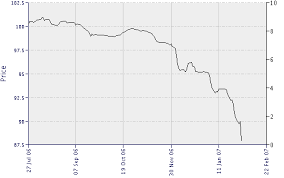

## Table of Contents

## What is the ABX Index?

The ABX Index is a financial tool used to measure the performance of certain types of bonds called asset-backed securities. These securities are backed by assets like mortgages, car loans, or credit card debt. The ABX Index helps investors understand how well these securities are doing in the market. It is like a report card that shows if the value of these bonds is going up or down.

The ABX Index is important because it gives investors a way to see the health of the market for asset-backed securities. By looking at the index, investors can make better decisions about buying or selling these bonds. It was created after the 2008 financial crisis to help prevent similar problems in the future by providing more transparency in the market.

## What was the 2008 subprime mortgage crisis?

The 2008 subprime mortgage crisis was a big financial problem that started in the United States but affected the whole world. It happened because many people were given loans to buy houses even though they couldn't afford them. These loans were called subprime mortgages. Banks and other lenders thought they could make money by giving these loans and then selling them to investors. But when people couldn't pay back their loans, the value of these loans dropped a lot, and many banks lost a lot of money.

This crisis led to a big economic downturn. Many people lost their homes because they couldn't keep up with their mortgage payments. Banks that had invested heavily in these subprime mortgages faced huge losses, and some even went bankrupt. The government had to step in to help stabilize the economy. The crisis showed how important it is to be careful with lending and investing, and it led to new rules and tools, like the ABX Index, to help prevent similar problems in the future.

## How is the ABX Index structured?

The ABX Index is made up of different parts, each representing a group of asset-backed securities. These groups are sorted by how risky they are, like from AAA (the least risky) to BBB- (more risky). Each group, or "tranche," is like a team of similar bonds. The index tracks how well these teams are doing by looking at their prices and how much they are traded. This helps investors see if the value of these bonds is going up or down.

The index is updated regularly, usually every month, to show the latest information. It uses a special way to calculate its values, which involves taking the average price of the bonds in each tranche. This average helps give a clear picture of the market. By looking at the ABX Index, investors can understand trends and make better choices about buying or selling these securities.

## What role did the ABX Index play during the 2008 financial crisis?

The ABX Index did not exist during the 2008 financial crisis. It was created after the crisis to help prevent similar problems in the future. During the crisis, there was no clear way to see how well subprime mortgage-backed securities were doing. This made it hard for investors to know how risky their investments were, which contributed to the crisis.

After the crisis, the ABX Index was introduced to give investors a tool to track the performance of asset-backed securities. By showing how these securities were doing in the market, the index helps investors make better decisions. It provides transparency and helps prevent the kind of uncertainty that led to the 2008 crisis.

## How did the ABX Index perform in the lead-up to the 2008 crisis?

The ABX Index did not exist before or during the 2008 financial crisis. It was created after the crisis to help investors keep an eye on the health of asset-backed securities. Without the ABX Index, it was hard for people to know how risky their investments were, which made the crisis worse.

If the ABX Index had been around before the crisis, it might have helped show that the value of subprime mortgage-backed securities was dropping. This could have warned investors about the dangers of these investments. But because it wasn't there, many people didn't see the problem coming until it was too late.

## What were the key dates and events that impacted the ABX Index during the crisis?

The ABX Index did not exist during the 2008 financial crisis, so there are no key dates or events that directly impacted it during that time. The index was created after the crisis to help investors track the performance of asset-backed securities. Without the ABX Index, it was hard for people to see how risky their investments were, which made the crisis worse.

If the ABX Index had been around before the crisis, it might have shown that the value of subprime mortgage-backed securities was dropping. This could have warned investors about the dangers of these investments. But because it wasn't there, many people didn't see the problem coming until it was too late. The creation of the ABX Index after the crisis was a way to try to prevent similar problems in the future by giving investors more information about the market.

## How did different tranches of the ABX Index react during the 2008 crisis?

The ABX Index did not exist during the 2008 financial crisis, so we can't talk about how different parts of it reacted back then. The index was created after the crisis to help people keep an eye on how well certain types of bonds, called asset-backed securities, were doing. These bonds are backed by things like mortgages, car loans, or credit card debt.

If the ABX Index had been around during the crisis, it might have shown that the value of subprime mortgage-backed securities was going down. This could have warned investors about the dangers of these investments. But because the index wasn't there, many people didn't see the problem coming until it was too late. The creation of the ABX Index after the crisis was a way to try to prevent similar problems in the future by giving investors more information about the market.

## What were the underlying factors that influenced the ABX Index's performance during the crisis?

The ABX Index did not exist during the 2008 financial crisis, so there were no underlying factors influencing its performance at that time. The index was created after the crisis to help investors understand how well certain types of bonds, called asset-backed securities, were doing. These bonds are backed by things like mortgages, car loans, or credit card debt. The ABX Index helps show if the value of these bonds is going up or down, which is important for investors to know.

If the ABX Index had been around during the crisis, it might have shown that the value of subprime mortgage-backed securities was dropping. This could have warned investors about the dangers of these investments. But because the index wasn't there, many people didn't see the problem coming until it was too late. The creation of the ABX Index after the crisis was a way to try to prevent similar problems in the future by giving investors more information about the market.

## How did the ABX Index's performance correlate with other financial indicators during the crisis?

The ABX Index did not exist during the 2008 financial crisis, so we can't talk about how it correlated with other financial indicators at that time. The index was created after the crisis to help investors understand how well certain types of bonds, called asset-backed securities, were doing. These bonds are backed by things like mortgages, car loans, or credit card debt. If the ABX Index had been around during the crisis, it might have shown that the value of subprime mortgage-backed securities was dropping. This could have helped investors see the dangers of these investments earlier.

Without the ABX Index, it was hard for people to know how risky their investments were, which made the crisis worse. Many other financial indicators, like housing prices and stock market performance, were also dropping during the crisis. If the ABX Index had existed, it might have moved in a similar way to these other indicators, showing a decline as the crisis got worse. The creation of the ABX Index after the crisis was a way to try to prevent similar problems in the future by giving investors more information about the market.

## What lessons can be learned from the ABX Index's performance during the 2008 crisis?

The ABX Index did not exist during the 2008 financial crisis, so we can't learn lessons from its performance at that time. The index was created after the crisis to help investors see how well certain types of bonds, called asset-backed securities, were doing. These bonds are backed by things like mortgages, car loans, or credit card debt. If the ABX Index had been around during the crisis, it might have shown that the value of subprime mortgage-backed securities was dropping. This could have warned investors about the dangers of these investments earlier.

Without the ABX Index, it was hard for people to know how risky their investments were, which made the crisis worse. The creation of the ABX Index after the crisis shows us how important it is to have clear information about the market. It helps investors make better decisions by showing them if the value of these bonds is going up or down. This way, they can avoid the kind of big problems that happened in 2008. The main lesson is that having tools like the ABX Index can help prevent future crises by giving everyone a better understanding of the risks involved in their investments.

## How has the ABX Index been modified or perceived differently post-2008 crisis?

Since the 2008 financial crisis, the ABX Index has become an important tool for investors to understand the health of the market for asset-backed securities. It was created to give people more information about how these securities are doing, helping them make better decisions. The index is now used regularly to track the performance of different groups of bonds, sorted by how risky they are. This helps investors see trends and understand if the value of these bonds is going up or down.

The perception of the ABX Index has changed a lot since its creation. Before the crisis, there was no clear way to see how risky subprime mortgage-backed securities were. Now, with the ABX Index, investors feel more confident because they have a tool that shows them the market's health. It's seen as a way to avoid the kind of big problems that happened in 2008 by giving everyone a better understanding of the risks involved in their investments.

## What are the expert analyses on the predictive power of the ABX Index regarding future financial crises?

Experts have different views on how well the ABX Index can predict future financial crises. Some experts think the ABX Index is very helpful because it gives a clear picture of how well asset-backed securities are doing. These securities are backed by things like mortgages, car loans, or credit card debt. By watching the ABX Index, investors can see if the value of these securities is going up or down. If the index shows a big drop in value, it could be a warning sign that there might be trouble ahead in the market.

Other experts are more cautious about the ABX Index's ability to predict crises. They say that while the index is useful for understanding current market conditions, it might not be enough to predict big problems like the 2008 crisis. They believe that many factors can cause a financial crisis, and the ABX Index is just one piece of the puzzle. So, while it's a good tool to have, it should be used along with other information to get a full picture of what might happen in the future.

## References & Further Reading

[1]: Gorton, G. B. (2008). ["The Panic of 2007."](https://www.nber.org/system/files/working_papers/w14358/w14358.pdf) National Bureau of Economic Research.

[2]: Coval, J. D., Jurek, J. W., & Stafford, E. (2009). ["The Economics of Structured Finance."](https://pubs.aeaweb.org/doi/pdfplus/10.1257/jep.23.1.3) Journal of Economic Perspectives, 23(1), 3-25.

[3]: Longstaff, F. A. (2010). ["The subprime credit crisis and contagion in financial markets."](https://www.sciencedirect.com/science/article/pii/S0304405X10000127) American Economic Review, 100(2), 501-505.

[4]: Acharya, V. V., & Richardson, M. (2009). ["Restoring Financial Stability: How to Repair a Failed System."](https://onlinelibrary.wiley.com/doi/book/10.1002/9781118258163) John Wiley & Sons.

[5]: Hull, J. (2018). ["Options, Futures, and Other Derivatives."](https://books.google.com/books/about/Options_Futures_and_Other_Derivatives.html?id=vpIYvgAACAAJ) Pearson, 10th Edition.

[6]: Bernanke, B. S. (2013). ["The Federal Reserve and the Financial Crisis."](https://archive.org/details/federalreservefi0000bern) Princeton University Press.