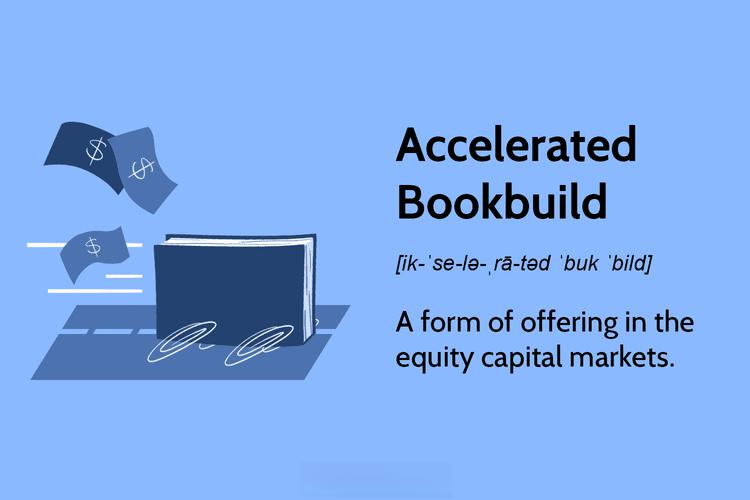

Accelerated bookbuilds have emerged as a crucial mechanism in the landscape of financial markets, offering a swift and efficient avenue for companies eager to access capital. As businesses navigate the ever-changing economic environment, the need for quick and effective capital-raising methods has intensified, positioning accelerated bookbuilds as a favored strategy. This approach enables companies to sell shares to institutional investors within a short timeframe, typically encompassing just a few days. The ability to expedite transactions without the usual protracted processes associated with traditional offerings is a defining feature of accelerated bookbuilds.

Understanding the foundational concepts of accelerated bookbuilds is essential to appreciating their role and benefits within capital markets. Unlike traditional initial public offerings (IPOs), which can take weeks or even months to finalize due to intricate regulatory and procedural requirements, accelerated bookbuilds significantly reduce this period. The condensed nature of the process achieves a dual advantage: it minimizes exposure to market volatility and locks in current pricing advantages. This not only appeals to issuers seeking rapid capital infusion but also attracts institutional investors seeking timely investment opportunities.

The growing popularity of accelerated bookbuilds is largely attributed to their strategic deployment in raising necessary funds under time-sensitive conditions. For companies, this method serves as an effective tool to address liquidity needs or fund strategic acquisitions. By bypassing the extended timelines typical of public offerings, companies can better respond to unforeseen market demands or capitalize on emerging opportunities with agility and precision.

Furthermore, accelerated bookbuilds present a reduced risk compared to traditional IPOs. The simplified interplay of issuer, bookrunner, and investor culminates in a more streamlined approach where shares are quickly allocated to institutional investors, who are often pre-qualified. This contrasts markedly with the extensive regulatory scrutiny and public disclosure requirements characteristic of IPOs, offering accelerated bookbuilds as an attractive alternative for both issuers and large-scale investors.

In summary, accelerated bookbuilds represent an innovative approach in financial markets, offering a fast, efficient, and lower-risk method for companies to raise capital. By differentiating themselves from traditional public offerings, they cater to the needs of modern businesses seeking nimbleness in capital procurement, thereby reinforcing their significance in contemporary financial strategies.

## Table of Contents

## Understanding Accelerated Bookbuild

Accelerated bookbuilds represent a swift mechanism employed by companies to issue shares, primarily targeting institutional investors. These processes enable issuers to raise capital expediently, thereby offering an efficient alternative to traditional methods such as Initial Public Offerings (IPOs). 

The mechanics of accelerated bookbuilds revolve around a condensed timeframe and streamlined operations. Typically, the process begins with the engagement of a bookrunner, usually an investment bank, which is tasked with gauging investor interest and setting the indicative price range for the shares. This swift execution facilitates prompt price discovery, ensuring that the securities are priced in alignment with current market conditions and investor demand. Unlike IPOs, which can take several weeks or months, accelerated bookbuilds are often completed within 24 to 48 hours. This rapid pace helps minimize market [volatility](/wiki/volatility-trading-strategies) risks as it reduces the window during which adverse market movements could affect the pricing and success of the offering.

A core distinction between accelerated bookbuilds and IPOs lies in their execution speed and the nature of investor participation. IPOs typically involve extensive marketing campaigns, often referred to as roadshows, aimed at attracting a wide array of public and institutional investors. Conversely, accelerated bookbuilds target a select group of institutional investors with established track records. This selective engagement reduces the time required for marketing efforts and expedites the allocation of shares, thereby lowering transaction costs and the risk of unsuccessful offerings.

The motivations for companies to choose accelerated bookbuilds over other financing strategies are multifaceted. Firstly, the reduced execution time translates into cost savings in terms of fees and administrative expenses. Secondly, the involvement of pre-qualified institutional investors mitigates the risk of undersubscription, as these entities are usually more knowledgeable and decisive in their investment choices. Furthermore, accelerated bookbuilds allow companies to capitalize on favorable market conditions, rapidly seizing opportunities to raise capital when investor sentiment aligns with their strategic objectives.

In summary, accelerated bookbuilds offer companies a rapid, cost-effective, and relatively low-risk method of raising capital by issuing shares to institutional investors. Through efficient price discovery and minimized exposure to market volatility, they present a compelling option for firms seeking to optimize their financing strategies in a dynamic market environment.

## The Benefits of Accelerated Bookbuild

Accelerated bookbuilds offer significant advantages, particularly in their speed and efficiency, making them an attractive option for companies looking to raise capital quickly. This method allows companies to tap into the capital markets in a matter of hours or days, compared to the weeks or months typically required for traditional initial public offerings (IPOs). This reduced execution time is particularly beneficial in volatile market conditions, as it mitigates the risk of adverse market movements impacting the offering.

Cost reduction is another compelling benefit of accelerated bookbuilds. Traditional public offerings often involve significant expenses, including underwriting fees, marketing costs, and regulatory compliance costs. In contrast, accelerated bookbuilds streamline the process by focusing on engaging pre-qualified institutional investors, which diminishes the need for extensive marketing efforts and related expenses. This reduction in costs can make the process more appealing for companies, particularly those looking to conserve financial resources.

Furthermore, the involvement of pre-qualified investors significantly reduces the risk of a failed offering. Institutional investors, who are typically more experienced and have a deeper understanding of the market, provide a level of assurance that the shares will be successfully placed. This not only ensures that the company raises the desired capital but also boosts confidence in the issuance process.

Additionally, accelerated bookbuilds create unique investment opportunities for institutional investors. These investors are often looking for immediate opportunities in high-demand stocks, and the rapid nature of the bookbuild process facilitates timely and strategic investment decisions. The ability to quickly assess and invest in new offerings allows institutional investors to align their portfolios with prevailing market trends and emerging opportunities.

In summary, accelerated bookbuilds stand out due to their speed, cost-effectiveness, and the security they provide against unsuccessful [capital raising](/wiki/hedge-fund-capital-raising) efforts. The process benefits both companies, by enabling swift capital access, and institutional investors, by offering advantageous opportunities for market engagement.

## Facilitating Accurate Price Discovery

Accelerated bookbuilds play a significant role in the pricing of new securities by facilitating accurate price discovery through their transparent and swift processes. These mechanisms allow issuers and investors to reach consensus on fair market value within a brief timeframe, thereby reflecting up-to-date market conditions and demands.

The transparency inherent in accelerated bookbuilds is key to their effectiveness. By engaging a select group of institutional investors, issuers benefit from informed participants capable of swiftly evaluating the worth of new securities. This enables the collection of indicative bids, which guide the setting of an initial price range. Bookrunners, who are critical in this phase, manage the interaction with potential investors, adjusting the price based on the received feedback. The iterative process helps ensure that the final price reflects genuine market sentiment.

Moreover, the speed of accelerated bookbuilds allows for real-time adjustments, addressing rapidly changing market data. Investors can adjust their bids promptly if new information emerges or market conditions change during the offering period. This adaptability is crucial in maintaining equilibrium between supply and demand, minimizing the risks of pricing discrepancies that might arise in prolonged offering processes.

Accelerated bookbuilds contribute to market stability during new share issuances by preventing the volatility that may accompany longer, more traditional methods such as IPOs. The expedited nature minimizes the window of uncertainty, limiting speculative actions that could destabilize the market. By quickly aligning the viewpoint of institutional investors with the issuer’s perceived value of the securities, accelerated bookbuilds reduce the likelihood of post-offering market corrections, which can occur when there is a misjudgment of initial pricing.

Furthermore, these processes are supported by advanced technological solutions that aid in the analysis and dissemination of financial data, ensuring participants operate with the most current information. For instance, automated systems can handle complex calculations and data management tasks rapidly, further ensuring that the price adjustments are both swift and precise.

To conclude, the accelerated bookbuild approach is instrumental in achieving accurate price discovery. Its ability to reflect real-time market conditions, allow rapid bidder adjustments, and stabilize market dynamics during share issuance makes it a preferred method for many companies seeking to raise capital efficiently.

## How Accelerated Bookbuild Works

Accelerated bookbuilds are a streamlined process for issuing shares to institutional investors, characterized by their rapid execution and efficiency. At the heart of this process are three key participants: issuers, bookrunners, and investors, each playing a pivotal role in ensuring the transaction's success.

### Roles of Key Participants

**Issuers** are the companies looking to raise capital by issuing shares. They initiate the bookbuild process by hiring investment banks to act as bookrunners.

**Bookrunners** are usually investment banks responsible for managing the issuance process. Their duties include advising issuers on the timing and size of the offering, setting an initial price range, and engaging with potential investors to gauge demand.

**Investors**, predominantly institutional investors, are invited to bid for shares. They assess the value and potential of the offering during the brief marketing period.

### Setting the Initial Price Range

The initial price range is determined through collaboration between the issuers and bookrunners. This range reflects current market conditions, the financial health of the issuer, and the demand perceived by the bookrunners. This crucial step aims to balance maximizing proceeds for the issuer while ensuring sufficient investor interest.

### Determining the Final Price

Once the initial price range is set, the bookrunners engage in a brief bidding process with investors. During this phase, investors submit bids indicating the number of shares they wish to purchase at various prices. The bookrunners collect these bids and determine the final price based on the equilibrium point where supply meets demand. This final price reflects real-time market conditions and the appetite of institutional investors.

### Real-World Applications

A notable example of an accelerated bookbuild is Alibaba's 2019 expansion financing, where the company swiftly raised significant capital by tapping into institutional networks. Such high-profile offerings demonstrate the process’s ability to efficiently allocate large volumes of capital while maintaining fair market pricing.

### Collaboration in the Process

The success of an accelerated bookbuild hinges on the effective collaboration between issuers, bookrunners, and investors. The seamless communication and negotiation between these entities enable a rapid response to market dynamics, enhancing the efficacy of the process. This collaborative effort ensures that capital is raised efficiently, meeting the needs of both issuers and investors in a timely manner. 

In summary, the accelerated bookbuild process leverages the expertise and networks of bookrunners to swiftly facilitate capital raises, underscored by the active participation of institutional investors and the issuers’ strategic goals.

## Key Players in the Accelerated Bookbuild Process

In an accelerated bookbuild process, several key participants play crucial roles in ensuring the successful execution of the capital-raising transaction. Understanding the responsibilities and interactions among these participants is essential to grasp the dynamics of this swift and complex mechanism.

### Issuers

Issuers are typically companies seeking to raise capital by selling their shares quickly and efficiently. Their primary role is to initiate the process and collaborate closely with underwriters to define the key parameters of the offering, such as the amount of capital sought and the offering timeline. Issuers provide the necessary financial disclosures and strategic information that underwriters use to market the shares effectively. The issuer's decision to use an accelerated bookbuild is often driven by the need for expediency and confidentiality, allowing them to fulfill immediate financing requirements without burdening the company's resources with prolonged market exposure.

### Underwriters (Bookrunners)

Underwriters, often referred to as bookrunners in this context, are financial institutions that manage the overall execution of the bookbuilding process. They are responsible for setting the initial price range for the shares, assessing investor demand, and conducting the marketing phase. The bookrunner's expertise in the market helps them gauge the appropriate pricing, minimizing the risk of under- or overpricing the shares. Additionally, their established relationships with institutional investors enable them to manage and coordinate the investor bidding process efficiently. Underwriters also play a risk management role, as they typically agree to purchase any unsold shares, thereby guaranteeing the issuer will receive the anticipated funds.

### Institutional Investors

Institutional investors are the primary buyers of shares in an accelerated bookbuild. These entities—including hedge funds, mutual funds, and pension funds—are chosen for their ability to quickly assess potential investments and commit substantial capital within the limited timeframe typical of these transactions. The participation of institutional investors is critical because their bids help determine the final pricing of the issue. Their active role in the price discovery process is facilitated by their expertise in assessing market conditions and the financial health of the issuer. The involvement of such reputable investors often enhances the credibility and perceived stability of the transaction.

### Interaction and Risk Management

The dynamic between issuers, underwriters, and institutional investors is a cornerstone of a successful accelerated bookbuild. Collaboration and transparency are key as these entities work together to achieve a mutual goal: raising the necessary capital swiftly while minimizing risks associated with market volatility and pricing errors. The underwriters' ability to communicate market feedback and investor sentiment to the issuer is crucial for making informed pricing and allocation decisions. 

The timely exchange of detailed information among these participants not only ensures the transaction's success but also aligns the interests of all parties involved, ultimately leading to a more efficient and effective capital raising process. Each participant's expertise and quick decision-making capabilities are the backbone of accelerated bookbuilds, underscoring the importance of selecting the right partners for such critical financial endeavors.

## Case Studies of Successful Accelerated Bookbuilds

Accelerated bookbuilds have become a pivotal tool in modern capital raising strategies, allowing companies to secure significant funding swiftly. Two notable examples that underscore their effectiveness are the Australian Securities Exchange (ASX) 2020 fundraising and Alibaba's 2019 expansion financing.

ASX 2020 Fundraising: The ASX utilized an accelerated bookbuild process to raise capital efficiently at a time when the market was facing volatility due to the COVID-19 pandemic. This approach allowed ASX to quickly tap into institutional investor demand, providing the company with the necessary [liquidity](/wiki/liquidity-risk-premium) to navigate uncertain times. The process was characterized by the swift execution and minimal market disruption, attributes that are hallmarks of a successful accelerated bookbuild. Key lessons from this case included the importance of timing and the ability to leverage existing investor relationships to achieve high subscription levels. By prioritizing speed and maintaining transparency with investors, ASX managed to secure its capital objectives swiftly and effectively.

Alibaba 2019 Expansion Financing: Alibaba's 2019 fundraising initiative further illustrates the strategic advantage of accelerated bookbuilds in corporate financing. Seeking to finance strategic expansions, Alibaba employed an accelerated bookbuild to raise approximately $12.9 billion. This decision was driven by the need for rapid capital access to capitalize on market opportunities and the desire to mitigate the risks associated with longer-market exposure. The process involved setting a price range that aligned with market expectations and securing commitments from institutional investors who were pre-informed of the company's growth strategies. A critical takeaway from Alibaba’s experience was the significance of clear communication and strategic alignment with investor interests, which resulted in an oversubscribed offering and demonstrated the robust demand for Alibaba's shares.

These cases highlight the practical application and effectiveness of accelerated bookbuilds in swiftly mobilizing capital with reduced market exposure. The strategies employed by both ASX and Alibaba—focused communication, strategic timing, and leveraging institutional relationships—serve as valuable lessons for other companies considering this approach. These examples underscore the capability of accelerated bookbuilds to facilitate large-scale fundraising efficiently while providing investors with immediate opportunities to invest in promising ventures.

## Risks and Challenges of Accelerated Bookbuild

Accelerated bookbuilds, while advantageous for their speed and efficiency, present several risks and challenges that participants must carefully navigate. One of the primary concerns is the potential for offer price misalignment. Due to the expedited nature of the process, there exists a heightened risk of overpricing the shares being issued. Overpricing can stem from inaccurate initial price setting, driven by limited information gathering time and market fluctuations that occur within the brief timeframe of the transaction. An inflated offer price may result in poor demand uptake from institutional investors and can significantly impact the perceived success of the capital-raising initiative.

The accelerated pace of these transactions often limits the scope and depth of due diligence. Comprehensive evaluations that typically accompany longer capital-raising processes, such as Initial Public Offerings (IPOs), might be abbreviated or overlooked, leading to potential oversights in assessing company fundamentals, market conditions, or investor sentiment. This lack of thorough scrutiny can result in uninformed decision-making, elevating the risk of executing ill-advised offerings that do not align well with market realities.

Competitive dynamics also emerge as a significant challenge within accelerated bookbuilds. Given the short window for action, multiple participants, including issuers and bookrunners, are often simultaneously striving for the most favorable outcomes. This can lead to complex negotiation environments where strategic interests may conflict, complicating transaction execution. The intricate nature of these dealings requires agile coordination to balance competing priorities while ensuring orderly and successful share distribution.

To mitigate these risks, various strategies are recommended. Conducting comprehensive due diligence, even within a condensed period, is crucial. Participants can employ techniques such as leveraging existing investor relationships for swift feedback or utilizing advanced data analytics to assess market trends rapidly. Additionally, setting realistic pricing expectations is fundamental to ensuring offer prices resonate with market conditions. Firms may adopt scenario analysis and engage in iterative pricing discussions with key stakeholders to refine offer pricing.

In summary, while accelerated bookbuilds offer a promising route for quick capital generation, they necessitate careful consideration of several challenges, from price setting to due diligence and the management of competitive dynamics. Implementing proactive strategies can mitigate potential risks, ensuring the transaction's success and maintaining market integrity.

## Conclusion and Future Outlook

Accelerated bookbuilds have emerged as a significant mechanism in modern financial markets, offering a strategic advantage in the rapid mobilization of capital. These processes are increasingly favored by companies due to their expedited nature and reduced risks compared to traditional methods like initial public offerings (IPOs). The inherent efficiency of accelerated bookbuilds stems from their ability to facilitate quick access to capital markets, ensuring companies can capitalize on market conditions with minimal delay.

The popularity of accelerated bookbuilds is further enhanced by their capacity for accurate price discovery. By engaging institutional investors in a streamlined process, these transactions can reflect real-time market dynamics, reducing the likelihood of price discrepancies and offering a true measure of market demand. This efficiency in price setting not only benefits issuers by minimizing the risk of undervaluation but also assures investors of fair pricing, fostering a healthier market environment.

Looking to the future, technological advancements are poised to further transform accelerated bookbuilds. The integration of [artificial intelligence](/wiki/ai-artificial-intelligence) and [machine learning](/wiki/machine-learning) in price prediction models holds the potential to refine these processes even further. AI systems can analyze vast datasets at unprecedented speeds, offering predictive insights and enhancing the accuracy and responsiveness of price settings. This technological evolution promises to make accelerated bookbuilds even more effective in both speed and precision.

However, as with any financial mechanism, the rise of accelerated bookbuilds is not without challenges. Concerns about market manipulation and the fair execution of these rapid transactions have prompted discussions on regulatory intervention. Potential reforms might focus on enhancing transparency and ensuring a robust framework that mitigates the risk of exploitative practices. Such measures would aim to balance the need for market flexibility with the protection of investor interests.

In conclusion, accelerated bookbuilds are likely to continue playing a vital role in capital allocation across dynamic sectors. Their ability to swiftly and effectively raise capital is invaluable in today's fast-paced economic landscape. As technology continues to evolve and regulatory frameworks adapt, these processes are expected to become even more refined and integral to the functioning of global financial markets. This growing reliance underscores the importance of understanding accelerated bookbuilds as a powerful tool for efficient capital allocation.

## References & Further Reading

[1]: Balmer, M. (2017). ["Accelerated Bookbuilding: An Analysis of the Pricing of Accelerated Secondary Equity Offerings."](https://www.cfajournal.org/accelerated-book-building/) Journal of Banking & Finance.

[2]: Walker, J. (2008). ["Accelerated Bookbuildings in Europe: The Extreme Form of a Seasoned Equity Offering."](https://www.cfajournal.org/accelerated-book-building/) Journal of Financial Economics.

[3]: Abdallah, W., & Makhija, A. K. (2012). ["Pricing IPOs and accelerated equity investments in developing stock markets."](https://www.emerald.com/insight/content/doi/10.1108/eb054556/full/html) Journal of Financial Research.

[4]: DECLERCQ, P. P. (2015). ["Accelerated Bookbuilding Versus Rights Offerings: A Framework for Choice."](https://www.researchgate.net/publication/249960487_Why_Does_Book_Building_Drive_Out_Auction_Methods_of_IPO_Issuance_Evidence_from_Japan) British Journal of Management.

[5]: Smith, R. L. (1986). ["Investment Banking and the Capital Acquisition Process."](https://www.sciencedirect.com/science/article/pii/0304405X86900486) Journal of Financial Economics.