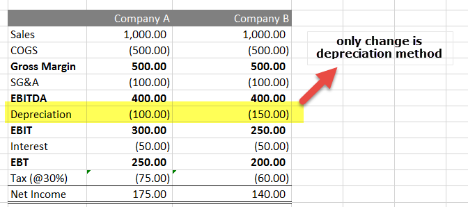

In today's fast-paced financial environment, mastering financial concepts is essential for effective strategy development and competitive advantage. Among these concepts, accelerated depreciation, asset management, and algorithmic trading stand out for their significant roles in enhancing financial performance.

Accelerated depreciation allows companies to write off the cost of an asset more quickly than with traditional methods. This process results in larger depreciation expenses early on in the asset's life, which can reduce taxable income and provide immediate tax benefits. Such strategic tax planning helps businesses manage their cash flow more effectively, enabling them to reinvest in their operations or fund further asset acquisitions.

Asset management plays a crucial role in strategic financial oversight by ensuring that a company's assets are utilized to their maximum potential. Integrating accelerated depreciation into asset management strategies can enhance financial reporting and align tax planning with business objectives. This synergy helps companies maintain optimal capital allocation and strengthens their financial health, which is pivotal for sustaining competitive advantage in dynamic markets.

Meanwhile, algorithmic trading has transformed financial markets by using complex algorithms to make rapid trading decisions based on real-time data. Incorporating financial accounting principles, such as those involved in depreciation, into algorithmic trading models can refine these systems. For example, understanding the impact of asset value reductions and the depreciable base can improve risk assessment and develop more effective trading strategies. 

Thus, understanding these methodologies—accelerated depreciation, asset management, and algorithmic trading—not only optimizes tax strategies and enhances cash flow but also refines trading algorithms, all of which contribute towards a robust financial strategy in today's ever-evolving marketplace.

## Table of Contents

## Understanding Accelerated Depreciation

Accelerated depreciation is a financial accounting method that allows for the rapid expensing of an asset's cost over a shorter period than its typical useful life. This is achieved by shifting a larger portion of the asset's depreciation expenses to the earlier years of its life, reducing taxable income for those initial periods. The accelerated depreciation method is particularly beneficial for businesses seeking immediate tax alleviation, as it can significantly decrease upfront taxable income, supplying additional cash flow for reinvestment.

In contrast to straight-line depreciation, where an equal amount of depreciation is expensed each year over an asset's useful life, accelerated depreciation methods offer immediate tax relief by intensifying depreciation earlier. This can be crucial for high-value, capital-intensive investments, providing [liquidity](/wiki/liquidity-risk-premium) to a company when resources are most needed.

Common methods of accelerated depreciation include the Double-Declining Balance (DDB) and Sum of the Years’ Digits (SYD). 

1. **Double-Declining Balance (DDB)**: This method doubles the rate of straight-line depreciation. It applies a constant rate to the asset's declining book value each year, leading to larger depreciation amounts in the early years. The formula for DDB is: 
$$
   \text{Depreciation Expense} = 2 \times \text{Straight-Line Rate} \times \text{Book Value at Beginning of Year}

$$

2. **Sum of the Years’ Digits (SYD)**: This approach computes depreciation based on a fraction of the asset's expected life, where the numerator is the remaining lifespan of the asset and the denominator is the sum of the years' digits. The SYD method heavily weights depreciation toward the start of the asset's life. The calculation for SYD involves:
$$
   \text{Depreciation Expense} = \left( \frac{\text{Remaining Life of the Asset}}{\text{Sum of the Years' Digits}} \right) \times \text{Depreciable Base}

$$

These methods facilitate strategic tax deferral by assigning more significant depreciation expenses to the initial years, which can be strategically aligned with a business’s fiscal strategies. By reducing taxable income earlier in an asset's life, firms can optimize their fiscal management, impact cash flows positively, and reallocate capital effectively to other areas of the business where it might yield higher returns.

## Methods of Accelerated Depreciation

Accelerated depreciation allows businesses to depreciate assets faster in the initial years of an asset's life, resulting in greater upfront tax savings. Two prevalent methods used are the Double-Declining Balance (DDB) method and the Sum of the Years’ Digits (SYD) method.

The Double-Declining Balance (DDB) method increases the depreciation rate, offering substantial early-year deductions. It is calculated by doubling the straight-line depreciation rate and applying it to the asset's book value at the beginning of each period. The formula for DDB is:

$$
\text{Depreciation Expense} = 2 \times \text{Straight-Line Rate} \times \text{Book Value at Beginning of Year}
$$

This method results in substantial depreciation expenses early in the asset’s life, thereby reducing taxable income significantly in the initial years.

The Sum of the Years’ Digits (SYD) method prioritizes depreciation based on the asset's anticipated lifespan, calculating it by dividing the sum of the years by the remaining useful life. This front-loads expenses, tapering off as the asset ages. Calculate SYD as follows:

1. Calculate the sum of the years. For example, for an asset with a useful life of 5 years, the sum is 1 + 2 + 3 + 4 + 5 = 15.
2. Calculate each year's depreciation by allocating a fraction of the depreciable base (cost minus salvage value) determined by:

$$
\text{Depreciation Expense for Year n} = \left( \frac{\text{Remaining Life of Asset (n)}}{\text{Sum of the Years’ Digits}} \right) \times \text{Depreciable Base}
$$

These methods provide significant tax deferral benefits. By accelerating depreciation, businesses can delay tax liabilities, enhancing cash flow during crucial early periods of asset use, and allocate financial resources more efficiently to foster growth and investment.

## Asset Management and Depreciation

Asset management involves the strategic oversight of a company's tangible and intangible assets to maximize value generation and ensure optimal utilization. A core component of asset management is aligning asset valuation with financial reporting and tax planning. This alignment is significantly influenced by the application of accelerated depreciation methods.

Accelerated depreciation is a technique that allows companies to write off the cost of their assets at a faster rate compared to the straight-line method. By front-loading depreciation expenses, companies can reduce their taxable income in the earlier years of an asset’s lifecycle, thereby improving cash flow. This method helps in reflecting a more realistic value of depreciable assets on financial statements, as it accounts for technological advancements and market conditions that might cause rapid obsolescence.

Proper asset management ensures optimal capital allocation, which is crucial for maintaining and enhancing the financial health of a company. By utilizing accelerated depreciation, a company can better match the economic utility of an asset with its actual consumption in productive activities. This approach not only reduces current tax liabilities but also facilitates strategic reinvestment and future resource planning. The practice of strategically depreciating assets enables the release of capital that can be reallocated towards innovation, expansion, or other profitable ventures.

Furthermore, precise management of depreciation impacts the company’s liquidity position. By synchronizing depreciation calculations with asset management strategies, firms can implement effective budgeting and forecasting techniques. This strategic synchronization aids in managing operational costs and maximizes return on investment by ensuring that assets are upgraded or replaced when they no longer contribute optimally to the firm’s operational goals. Consequently, accelerated depreciation serves as an integral tool for aligning asset management with both regulatory compliance and the financial objectives of the company.

## Integration with Algorithmic Trading

Algorithmic trading leverages computational algorithms to execute a substantial [volume](/wiki/volume-trading-strategy) of trades with high precision and speed. These algorithms rely heavily on quantitative methods and financial metrics to inform trading decisions. Depreciation calculations, such as the depreciable base and value reductions, play a pivotal role in the formulation of these trading models. By incorporating depreciation in the financial analysis, trading algorithms can account for the cost of capital and asset wear and tear more effectively, allowing for a more comprehensive evaluation of an investment's long-term profitability.

For instance, consider the calculation of a depreciable base, which is determined by subtracting the salvage value of an asset from its initial cost. This can be expressed in a simple formula:

$$
\text{Depreciable Base} = \text{Initial Cost} - \text{Salvage Value}
$$

Understanding these metrics is crucial in [algorithmic trading](/wiki/algorithmic-trading), especially when making decisions about asset-heavy investments or capital expenditures. Accurately calculating depreciation ensures that the correct cost of owning an asset over time is accounted for, influencing investment strategy and risk management.

In algorithmic trading, where split-second decisions can impact millions of dollars, the integration of financial accounting principles such as depreciation can enhance strategy development. By efficiently accounting for asset depreciation, algorithms can mitigate risk by ensuring investments are aligned with inherent asset value fluctuations. This aspect of financial modeling supports robust decision-making frameworks wherein asset devaluation is precisely forecasted and its implications on trading strategies evaluated.

Moreover, integrating depreciation into trading algorithms can optimize the tax liabilities associated with asset depreciation. Tax optimization is crucial in capital-intensive investments, allowing for improved cash flow management and strategic reinvestment decisions. Institutional trading firms often use such tax efficiencies to enhance their return on investment and maintain competitive profitability levels.

Conclusively, incorporating depreciation into the fabric of algorithmic trading models provides a comprehensive lens through which asset management decisions can be evaluated. This integration allows traders to make informed decisions that align with both fiscal realities and strategic objectives, enhancing the overall effectiveness of trading operations amidst dynamically evolving financial markets.

## Case Studies and Examples

In the competitive environment of algorithmic trading, firms like Virtu Financial and Citadel have strategically employed accelerated depreciation to manage their asset costs effectively. These companies often invest heavily in advanced technologies and infrastructure, which are crucial for maintaining their edge in high-frequency trading and data analysis. By utilizing accelerated depreciation methods such as Double-Declining Balance (DDB) and Sum of the Years’ Digits (SYD), these firms can front-load depreciation expenses, thereby realizing significant immediate tax benefits and improving cash flow management.

For instance, a company making substantial investments in high-performance computing hardware and data processing equipment can apply the DDB method, effectively doubling the depreciation rate used in traditional straight-line depreciation. Mathematically, this can be represented as:

$$
\text{Depreciation Expense} = 2 \times \left( \frac{\text{Cost} - \text{Accumulated Depreciation}}{\text{Useful Life}} \right)
$$

By accelerating these deductions, Virtu Financial and Citadel can reduce the taxable income in the initial years following the asset acquisition, allowing them to reinvest the capital saved on taxes into further technological advancements and trading strategy development.

Moreover, these firms employ such strategies to offset the costs associated with capital-intensive technological investments. Take, for example, the use of SYD in depreciating the same assets. The formula for calculating SYD depreciation is:

$$
\text{Depreciation Expense} = \frac{\text{Remaining Life of Asset}}{\text{Sum of Years}} \times \text{Cost}
$$

This method provides a systematic approach to front-load depreciation expenses, leveraging immediate tax deductions to enhance financial performance. As a result, firms can optimize their tax positions, offering financial flexibility and supporting aggressive expansion plans.

The implementation of accelerated depreciation not only aids tax optimization but also enhances investment returns by improving internal cash flow positions. This allows firms like Virtu Financial and Citadel to allocate more resources to high-yield investments and innovative trading strategies, thus maintaining their competitive advantages in the financial markets.

In summary, by effectively managing depreciation through accelerated methods, leading algorithmic trading firms can strategically navigate asset costs, thereby securing the benefits of reduced tax liabilities and enhanced reinvestment capabilities. This approach underscores the importance of financial acumen in supporting robust trading operations and fostering long-term growth.

## Conclusion

Accelerated depreciation emerges as a formidable instrument in both asset management and algorithmic trading. By allowing for greater depreciation expenses in the initial years of an asset's life, it provides immediate tax benefits. This not only enhances a company's cash flow but also aligns asset valuation with financial reporting needs. In asset management, such methodologies ensure optimal capital allocation, significantly impacting the financial health of an organization.

Moreover, the integration of accelerated depreciation into algorithmic trading frameworks can refine these models by incorporating comprehensive financial insights. The calculation of depreciation, including the depreciable base and value reductions, informs algorithmic trading models, thereby improving risk assessment and strategy development. Algorithms considering these financial accounting principles are better equipped to evaluate capital-intensive investments and execute trades effectively in dynamic markets.

As financial technologies and regulatory landscapes continually evolve, maintaining a solid understanding of methodologies like accelerated depreciation grants firms a competitive edge. The capacity to optimize tax positions and maximize investment returns is crucial, and keeping abreast of such methodologies is imperative for successful asset and trading strategy management. As these strategies become increasingly essential, organizations are better positioned to achieve regulatory compliance and enhance their overall financial performance.

## References & Further Reading

[1]: ["Advances in Financial Machine Learning"](https://www.amazon.com/Advances-Financial-Machine-Learning-Marcos/dp/1119482089) by Marcos Lopez de Prado

[2]: ["Evidence-Based Technical Analysis: Applying the Scientific Method and Statistical Inference to Trading Signals"](https://www.amazon.com/Evidence-Based-Technical-Analysis-Scientific-Statistical/dp/0470008741) by David Aronson

[3]: ["Machine Learning for Algorithmic Trading"](https://github.com/stefan-jansen/machine-learning-for-trading) by Stefan Jansen

[4]: ["Quantitative Trading: How to Build Your Own Algorithmic Trading Business"](https://www.amazon.com/Quantitative-Trading-Build-Algorithmic-Business/dp/1119800064) by Ernest P. Chan