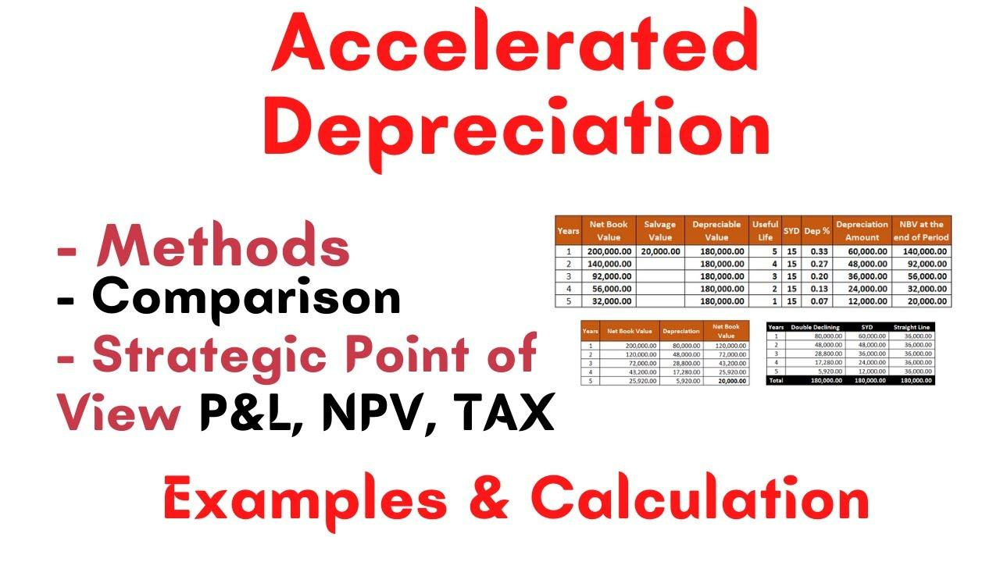

## Table of Contents

## What is accelerated depreciation?

Accelerated depreciation is a method of calculating the depreciation of an asset in a way that allows for larger deductions in the earlier years of the asset's life. Instead of spreading the cost evenly over the years, this method lets businesses write off more of the asset's value sooner. This can be helpful for companies because it reduces their taxable income more quickly, which means they pay less in taxes during the early years when the asset is new.

There are different ways to do accelerated depreciation, but two common methods are the double declining balance method and the sum-of-the-years'-digits method. In the double declining balance method, you apply a higher depreciation rate in the early years, which then decreases over time. The sum-of-the-years'-digits method also front-loads the depreciation but uses a different formula to calculate it. Both methods help businesses save money on taxes earlier, which can be important for managing cash flow and planning finances.

## How does accelerated depreciation differ from straight-line depreciation?

Accelerated depreciation and straight-line depreciation are two different ways to calculate how much an asset loses value over time. With straight-line depreciation, you spread the cost of the asset evenly over its useful life. This means you deduct the same amount each year until the asset is fully depreciated. It's simple and predictable, making it easy for businesses to plan their finances.

On the other hand, accelerated depreciation lets you take bigger deductions in the early years of the asset's life. This method recognizes that assets often lose more value when they are new, so it allows businesses to write off more of the cost sooner. This can help reduce taxable income more quickly, which is beneficial for cash flow. Common methods of accelerated depreciation include the double declining balance and the sum-of-the-years'-digits, both of which front-load the depreciation expense.

## What are the main benefits of using accelerated depreciation?

Using accelerated depreciation can help businesses save money on taxes faster. When you use this method, you can take bigger deductions in the early years of an asset's life. This means you can lower your taxable income more quickly, which leads to paying less in taxes during those years. This can be really helpful for businesses, especially if they need to manage their cash flow better or if they want to reinvest the money they save back into the business.

Another benefit is that accelerated depreciation matches the expense of the asset more closely with the revenue it generates. Many assets lose value faster when they are new, and they might also help the business make more money in the early years. By taking larger deductions at the start, the business can better reflect the true cost of using the asset over time. This can make financial statements more accurate and help with better financial planning.

## Can you list the common methods of accelerated depreciation?

There are two main ways to do accelerated depreciation: the double declining balance method and the sum-of-the-years'-digits method. The double declining balance method lets you take bigger deductions in the early years. You start with a high depreciation rate and then it goes down each year. This means you can write off more of the asset's cost when it's new, which can help save on taxes faster.

The sum-of-the-years'-digits method is another way to do accelerated depreciation. It also lets you take bigger deductions at the start, but it uses a different way to figure out how much to deduct each year. You add up the digits of the years the asset will be used, and then you use that number to decide how much to write off each year. Both methods help businesses save money on taxes earlier, which can be important for managing cash flow and planning finances.

## How does the Modified Accelerated Cost Recovery System (MACRS) work?

The Modified Accelerated Cost Recovery System, or MACRS, is a way for businesses in the United States to figure out how much they can deduct for the wear and tear of their assets. It's a type of accelerated depreciation that lets businesses take bigger deductions in the early years of an asset's life. MACRS divides assets into different classes based on how long they're expected to last, like 3-year, 5-year, 7-year, and so on. Each class has its own rules for how to calculate depreciation, but they all use a method called the double declining balance, which starts with a high rate and then slows down over time.

There are two ways to use MACRS: the General Depreciation System (GDS) and the Alternative Depreciation System (ADS). GDS is the more common method and uses shorter recovery periods, which means businesses can take bigger deductions faster. ADS, on the other hand, uses longer recovery periods and is usually used when the IRS requires it, like for certain types of property or when a business chooses to use it. Both systems help businesses save on taxes by letting them write off the cost of their assets more quickly, but GDS is more beneficial for most businesses because it speeds up the deductions.

## What is the Double Declining Balance (DDB) method and how is it calculated?

The Double Declining Balance (DDB) method is a way to figure out how much an asset loses value over time. It's a type of accelerated depreciation, which means you can take bigger deductions in the early years of the asset's life. With DDB, you start with a high depreciation rate and then it goes down each year. This helps businesses save money on taxes faster because they can write off more of the asset's cost when it's new.

To calculate depreciation using the DDB method, you first need to know the asset's cost, its useful life, and its salvage value, which is what the asset will be worth at the end of its life. The depreciation rate is double the straight-line rate, which is 1 divided by the useful life of the asset. So, if an asset has a useful life of 5 years, the straight-line rate would be 20% (1/5), and the DDB rate would be 40% (2 x 20%). Each year, you apply this rate to the asset's book value at the beginning of the year, not the original cost. You keep doing this until the asset's book value reaches its salvage value, at which point you stop depreciating it.

## How do you apply the Sum-of-the-Years'-Digits (SYD) method?

The Sum-of-the-Years'-Digits (SYD) method is another way to figure out how much an asset loses value over time. It's a type of accelerated depreciation, which means you can take bigger deductions in the early years of the asset's life. To use this method, you first need to know the asset's cost, its useful life, and its salvage value. The salvage value is what the asset will be worth at the end of its life. You start by adding up the digits of the years the asset will be used. For example, if an asset has a useful life of 5 years, you add 5 + 4 + 3 + 2 + 1, which equals 15. This number is called the sum-of-the-years'-digits.

Next, you figure out how much to deduct each year. You do this by taking the remaining life of the asset at the start of each year and dividing it by the sum-of-the-years'-digits. Then, you multiply that fraction by the depreciable base, which is the cost of the asset minus its salvage value. For the first year of a 5-year asset, you'd use 5/15 of the depreciable base. The second year, you'd use 4/15, and so on. You keep doing this until the asset's book value reaches its salvage value, at which point you stop depreciating it. This method helps businesses save money on taxes faster by letting them write off more of the asset's cost when it's new.

## What are the tax implications of using accelerated depreciation?

Using accelerated depreciation can help businesses save money on taxes faster. When you use this method, you can take bigger deductions in the early years of an asset's life. This means you can lower your taxable income more quickly, which leads to paying less in taxes during those years. This can be really helpful for businesses, especially if they need to manage their cash flow better or if they want to reinvest the money they save back into the business.

However, there are some things to keep in mind. While you save on taxes in the early years, your deductions will be smaller in the later years. This means you might end up paying more in taxes later on. Also, if you sell the asset before it's fully depreciated, you might have to pay back some of the tax benefits you got earlier. This is called depreciation recapture, and it can affect how much you owe in taxes when you sell the asset.

## How does accelerated depreciation affect a company's financial statements?

Accelerated depreciation affects a company's financial statements by changing how much the company reports as expenses and profits each year. When a company uses accelerated depreciation, it takes bigger deductions in the early years of an asset's life. This means the company's expenses are higher in the beginning, which makes the profits look lower during those years. On the income statement, you'll see higher depreciation expenses and lower net income in the early years compared to using straight-line depreciation.

On the balance sheet, accelerated depreciation also changes the value of the company's assets. Because the company is writing off more of the asset's cost sooner, the book value of the asset goes down faster. This means the total assets on the balance sheet will be lower in the early years. Over time, as the depreciation slows down, the impact on the financial statements will lessen, but the early years will show a bigger effect on both the income statement and the balance sheet.

## What are the limitations or potential drawbacks of using accelerated depreciation?

Using accelerated depreciation can have some downsides. One big problem is that while it helps you save on taxes in the early years, it means you'll have smaller deductions later on. This can make your taxes higher in the later years when the asset is older. Also, if you sell the asset before it's fully depreciated, you might have to pay back some of the tax benefits you got earlier. This is called depreciation recapture, and it can make you owe more in taxes when you sell the asset.

Another issue is how it affects your financial statements. When you use accelerated depreciation, your expenses are higher in the early years, which makes your profits look lower during that time. This can make your business seem less profitable to investors or lenders who look at your financial statements. On the balance sheet, the value of your assets goes down faster, which can also affect how your business is seen by others. So, while accelerated depreciation can help with cash flow in the short term, it can have some long-term effects on how your business looks financially.

## How do different industries typically choose between various depreciation methods?

Different industries often choose their depreciation methods based on how they use their assets and what makes the most sense for their business. For example, industries like manufacturing or transportation, where machines and vehicles lose value quickly when they're new, might prefer accelerated depreciation methods like Double Declining Balance or Sum-of-the-Years'-Digits. These methods let them take bigger deductions early on, which can help with cash flow and match the expense of the asset more closely with the revenue it generates.

On the other hand, industries like real estate or office-based businesses might prefer straight-line depreciation. This method spreads the cost of the asset evenly over its useful life, which can be easier to plan for and understand. It's especially useful for assets that don't lose value as quickly, like buildings or office furniture. The choice between these methods can also depend on tax strategies and how the company wants to present its financial health to investors and lenders.

## What advanced considerations should be taken into account when selecting an accelerated depreciation method for complex assets?

When choosing an accelerated depreciation method for complex assets, it's important to think about how the asset is used and how quickly it loses value. Some assets, like high-tech machinery or specialized equipment, might lose a lot of value right away. In these cases, using a method like Double Declining Balance or Sum-of-the-Years'-Digits can help match the expense of the asset with the revenue it brings in. This can be good for cash flow and tax savings in the early years. But you also need to think about how this will affect your financial statements. Higher expenses in the early years can make your profits look lower, which might not be good if you're trying to attract investors or get loans.

Another thing to consider is the tax rules and regulations that apply to your industry and the type of asset. Some assets might have specific rules under the Modified Accelerated Cost Recovery System (MACRS) that you need to follow. Also, think about what will happen if you sell the asset before it's fully depreciated. You might have to pay back some of the tax benefits you got earlier, which is called depreciation recapture. This can affect your long-term tax planning. So, when [picking](/wiki/asset-class-picking) an accelerated depreciation method for complex assets, you need to balance the short-term benefits with the long-term effects on your business's financial health and tax situation.

## What is Understanding Accelerated Depreciation?

Accelerated depreciation is a financial accounting method that allows for the rapid expensing of an asset's cost over a shorter period than its typical useful life. This is achieved by shifting a larger portion of the asset's depreciation expenses to the earlier years of its life, reducing taxable income for those initial periods. The accelerated depreciation method is particularly beneficial for businesses seeking immediate tax alleviation, as it can significantly decrease upfront taxable income, supplying additional cash flow for reinvestment.

In contrast to straight-line depreciation, where an equal amount of depreciation is expensed each year over an asset's useful life, accelerated depreciation methods offer immediate tax relief by intensifying depreciation earlier. This can be crucial for high-value, capital-intensive investments, providing [liquidity](/wiki/liquidity-risk-premium) to a company when resources are most needed.

Common methods of accelerated depreciation include the Double-Declining Balance (DDB) and Sum of the Years’ Digits (SYD). 

1. **Double-Declining Balance (DDB)**: This method doubles the rate of straight-line depreciation. It applies a constant rate to the asset's declining book value each year, leading to larger depreciation amounts in the early years. The formula for DDB is: 
$$
   \text{Depreciation Expense} = 2 \times \text{Straight-Line Rate} \times \text{Book Value at Beginning of Year}

$$

2. **Sum of the Years’ Digits (SYD)**: This approach computes depreciation based on a fraction of the asset's expected life, where the numerator is the remaining lifespan of the asset and the denominator is the sum of the years' digits. The SYD method heavily weights depreciation toward the start of the asset's life. The calculation for SYD involves:
$$
   \text{Depreciation Expense} = \left( \frac{\text{Remaining Life of the Asset}}{\text{Sum of the Years' Digits}} \right) \times \text{Depreciable Base}

$$

These methods facilitate strategic tax deferral by assigning more significant depreciation expenses to the initial years, which can be strategically aligned with a business’s fiscal strategies. By reducing taxable income earlier in an asset's life, firms can optimize their fiscal management, impact cash flows positively, and reallocate capital effectively to other areas of the business where it might yield higher returns.

## What are the methods of accelerated depreciation?

Accelerated depreciation allows businesses to depreciate assets faster in the initial years of an asset's life, resulting in greater upfront tax savings. Two prevalent methods used are the Double-Declining Balance (DDB) method and the Sum of the Years’ Digits (SYD) method.

The Double-Declining Balance (DDB) method increases the depreciation rate, offering substantial early-year deductions. It is calculated by doubling the straight-line depreciation rate and applying it to the asset's book value at the beginning of each period. The formula for DDB is:

$$
\text{Depreciation Expense} = 2 \times \text{Straight-Line Rate} \times \text{Book Value at Beginning of Year}
$$

This method results in substantial depreciation expenses early in the asset’s life, thereby reducing taxable income significantly in the initial years.

The Sum of the Years’ Digits (SYD) method prioritizes depreciation based on the asset's anticipated lifespan, calculating it by dividing the sum of the years by the remaining useful life. This front-loads expenses, tapering off as the asset ages. Calculate SYD as follows:

1. Calculate the sum of the years. For example, for an asset with a useful life of 5 years, the sum is 1 + 2 + 3 + 4 + 5 = 15.
2. Calculate each year's depreciation by allocating a fraction of the depreciable base (cost minus salvage value) determined by:

$$
\text{Depreciation Expense for Year n} = \left( \frac{\text{Remaining Life of Asset (n)}}{\text{Sum of the Years’ Digits}} \right) \times \text{Depreciable Base}
$$

These methods provide significant tax deferral benefits. By accelerating depreciation, businesses can delay tax liabilities, enhancing cash flow during crucial early periods of asset use, and allocate financial resources more efficiently to foster growth and investment.

## How can one achieve integration with algorithmic trading?

Algorithmic trading leverages computational algorithms to execute a substantial [volume](/wiki/volume-trading-strategy) of trades with high precision and speed. These algorithms rely heavily on quantitative methods and financial metrics to inform trading decisions. Depreciation calculations, such as the depreciable base and value reductions, play a pivotal role in the formulation of these trading models. By incorporating depreciation in the financial analysis, trading algorithms can account for the cost of capital and asset wear and tear more effectively, allowing for a more comprehensive evaluation of an investment's long-term profitability.

For instance, consider the calculation of a depreciable base, which is determined by subtracting the salvage value of an asset from its initial cost. This can be expressed in a simple formula:

$$
\text{Depreciable Base} = \text{Initial Cost} - \text{Salvage Value}
$$

Understanding these metrics is crucial in [algorithmic trading](/wiki/algorithmic-trading), especially when making decisions about asset-heavy investments or capital expenditures. Accurately calculating depreciation ensures that the correct cost of owning an asset over time is accounted for, influencing investment strategy and risk management.

In algorithmic trading, where split-second decisions can impact millions of dollars, the integration of financial accounting principles such as depreciation can enhance strategy development. By efficiently accounting for asset depreciation, algorithms can mitigate risk by ensuring investments are aligned with inherent asset value fluctuations. This aspect of financial modeling supports robust decision-making frameworks wherein asset devaluation is precisely forecasted and its implications on trading strategies evaluated.

Moreover, integrating depreciation into trading algorithms can optimize the tax liabilities associated with asset depreciation. Tax optimization is crucial in capital-intensive investments, allowing for improved cash flow management and strategic reinvestment decisions. Institutional trading firms often use such tax efficiencies to enhance their return on investment and maintain competitive profitability levels.

Conclusively, incorporating depreciation into the fabric of algorithmic trading models provides a comprehensive lens through which asset management decisions can be evaluated. This integration allows traders to make informed decisions that align with both fiscal realities and strategic objectives, enhancing the overall effectiveness of trading operations amidst dynamically evolving financial markets.

## What are some case studies and examples?

In the competitive environment of algorithmic trading, firms like Virtu Financial and Citadel have strategically employed accelerated depreciation to manage their asset costs effectively. These companies often invest heavily in advanced technologies and infrastructure, which are crucial for maintaining their edge in high-frequency trading and data analysis. By utilizing accelerated depreciation methods such as Double-Declining Balance (DDB) and Sum of the Years’ Digits (SYD), these firms can front-load depreciation expenses, thereby realizing significant immediate tax benefits and improving cash flow management.

For instance, a company making substantial investments in high-performance computing hardware and data processing equipment can apply the DDB method, effectively doubling the depreciation rate used in traditional straight-line depreciation. Mathematically, this can be represented as:

$$
\text{Depreciation Expense} = 2 \times \left( \frac{\text{Cost} - \text{Accumulated Depreciation}}{\text{Useful Life}} \right)
$$

By accelerating these deductions, Virtu Financial and Citadel can reduce the taxable income in the initial years following the asset acquisition, allowing them to reinvest the capital saved on taxes into further technological advancements and trading strategy development.

Moreover, these firms employ such strategies to offset the costs associated with capital-intensive technological investments. Take, for example, the use of SYD in depreciating the same assets. The formula for calculating SYD depreciation is:

$$
\text{Depreciation Expense} = \frac{\text{Remaining Life of Asset}}{\text{Sum of Years}} \times \text{Cost}
$$

This method provides a systematic approach to front-load depreciation expenses, leveraging immediate tax deductions to enhance financial performance. As a result, firms can optimize their tax positions, offering financial flexibility and supporting aggressive expansion plans.

The implementation of accelerated depreciation not only aids tax optimization but also enhances investment returns by improving internal cash flow positions. This allows firms like Virtu Financial and Citadel to allocate more resources to high-yield investments and innovative trading strategies, thus maintaining their competitive advantages in the financial markets.

In summary, by effectively managing depreciation through accelerated methods, leading algorithmic trading firms can strategically navigate asset costs, thereby securing the benefits of reduced tax liabilities and enhanced reinvestment capabilities. This approach underscores the importance of financial acumen in supporting robust trading operations and fostering long-term growth.

## References & Further Reading

[1]: ["Advances in Financial Machine Learning"](https://www.amazon.com/Advances-Financial-Machine-Learning-Marcos/dp/1119482089) by Marcos Lopez de Prado

[2]: ["Evidence-Based Technical Analysis: Applying the Scientific Method and Statistical Inference to Trading Signals"](https://www.amazon.com/Evidence-Based-Technical-Analysis-Scientific-Statistical/dp/0470008741) by David Aronson

[3]: ["Machine Learning for Algorithmic Trading"](https://github.com/stefan-jansen/machine-learning-for-trading) by Stefan Jansen

[4]: ["Quantitative Trading: How to Build Your Own Algorithmic Trading Business"](https://www.amazon.com/Quantitative-Trading-Build-Algorithmic-Business/dp/1119800064) by Ernest P. Chan