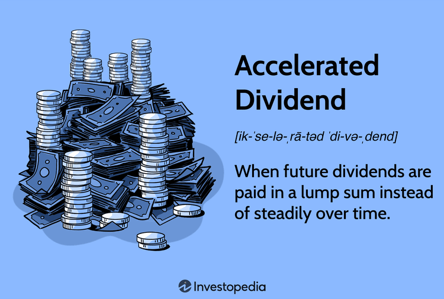

Dividends are distributions of a portion of a company's earnings to its shareholders, serving as a significant source of income for investors. These payments can take various forms, with accelerated dividends standing out due to their strategic implications. Accelerated dividends are payments made ahead of an anticipated schedule, often driven by corporate strategies or changes in taxation policies. They become particularly significant when companies expect changes in fiscal policy, allowing investors to secure returns at existing tax rates. Understanding these financial maneuvers can enhance investment strategies by maximizing income and taking advantage of favorable timing.

Algorithmic trading introduces a transformative approach to optimizing dividend strategies, offering unparalleled speed and precision. By leveraging data analytics and automation, algorithmic trading can enhance traditional dividend strategies, enabling investors to capture dividends more efficiently and execute reinvestment strategies with minimal delay. This technology-driven methodology reshapes how investors approach dividend-paying stocks, allowing for the continuous monitoring of market conditions and the dynamic adjustment of portfolios.



The article aims to provide a comprehensive overview of dividends, focusing specifically on accelerated dividends and their importance in investment strategies. It explores the role of algorithmic trading in refining dividend strategies, providing insights into real-world applications and explaining the processes involved. The structure follows a logical progression: from understanding dividends and their variations, to examining historical cases of accelerated dividends, and delving into the intersection of algorithmic trading with dividend investment. Through this exploration, readers will gain a deeper insight into how combining advanced trading techniques with dividend strategies can offer enhanced financial outcomes.

## Table of Contents

## Understanding Dividends and Accelerated Dividends

Dividends are payments made by a corporation to its shareholders, typically sourced from profits. These payments serve as a mechanism for distributing a portion of a company's earnings back to its owners, providing a stream of income to investors. Dividends are usually paid on a regular basis—quarterly or annually—and are a critical component for income-focused investors. They offer not only periodic income but also signal a company's strong financial health and profitability. Calculating dividends is straightforward: if a company declares a dividend per share (DPS), an investor holding a certain number of shares will receive income proportional to their holdings, i.e., $\text{Total Dividend Income} = \text{DPS} \times \text{Number of Shares Owned}$.

Accelerated dividends refer to payments made in advance of the normal schedule, often issued in anticipation of tax changes or economic uncertainties. Companies might resort to accelerated dividends to help investors avoid higher future tax rates on dividend income or to deploy excess cash reserves efficiently. For instance, during periods of potential tax reforms, firms might choose to issue these dividends proactively before new laws take effect, safeguarding shareholder value.

To differentiate further, normal dividends are scheduled payments that align with the company's usual payout calendar, reflecting its periodic distribution policy. Special dividends, meanwhile, are one-time distributions separate from the typical payout routine, often linked to extraordinary profits or substantial cash reserves. Accelerated dividends, in contrast, are usually intended to modify the timing of regular payments without altering the overall distribution amount, aligning with specific strategic objectives or responding to situational pressures.

Understanding these distinctions helps investors interpret a company's payout decisions and manage their income expectations. Knowing whether a dividend is accelerated, special, or normal can inform tax planning and assess a company's financial strategies under prevailing economic conditions.

## History and Real-World Examples of Accelerated Dividends

Accelerated dividends represent a strategic financial maneuver employed by companies to distribute dividend payments sooner than scheduled, often in anticipation of changes in tax regulations or economic conditions. A prominent historical example of widespread accelerated dividend issuance occurred in 2012, on the eve of the so-called U.S. fiscal cliff. The fiscal cliff referred to the potential economic effects that could have resulted from tax increases and spending cuts scheduled to occur simultaneously at the end of that year. Anticipating potential increases in dividend tax rates, a myriad of companies opted to issue dividends ahead of the usual schedule to shield shareholders from higher taxes. This move not only provided immediate tax benefits for shareholders but also incentivized stock purchases by income-focused investors seeking to maximize their after-tax income.

Several companies made headlines during this period for issuing accelerated dividends. For instance, Costco Wholesale Corporation announced a significant special dividend of $7 per share, totaling approximately $3 billion, which was payable in December 2012. The decision was driven largely by the looming uncertainties surrounding tax rate changes. Similarly, The Washington Post Company also declared a special dividend, with executives citing similar tax concerns as a primary motivation. These examples underscore the strategic use of accelerated dividends as companies sought to optimize shareholder value amidst looming fiscal policy shifts.

Beyond the fiscal cliff scenario, companies might choose to issue accelerated dividends for other strategic reasons, such as strong cash flow positions, to convey confidence in their financial stability, or to return excess capital to shareholders. In essence, accelerated dividends can serve as a tactical tool for capital management, particularly during periods of economic uncertainty or legislative transitions. These instances highlight how firms utilize accelerated dividend payouts not only as a means of transferring value to shareholders but also as a reflection of strategic financial stewardship.

## The Role of Algorithmic Trading in Dividend Strategies

Algorithmic trading has reshaped the landscape of traditional investing, providing enhanced efficiency, speed, and precision, which are particularly advantageous when implementing dividend strategies. At its core, [algorithmic trading](/wiki/algorithmic-trading) employs computer algorithms to execute trades based on predefined criteria without the need for human intervention. This approach not only reduces transaction costs but also optimizes execution timing, which is crucial for capturing dividend-related opportunities.

One key advantage of utilizing algorithmic trading in dividend strategies is the optimization of dividend capture strategies. Dividend capture involves purchasing a stock just before its ex-dividend date to receive the dividend payment and then selling it shortly thereafter. Algorithms can swiftly identify stocks nearing their ex-dividend dates, evaluate market conditions, and execute trades at optimal times to maximize returns efficiently. This rapid execution mitigates the risk of unfavorable price movements that might occur if trades are manually timed.

Furthermore, algorithms can enhance reinvestment strategies by automating the selection and purchase of dividend-paying stocks. Upon receiving dividends, investors can maximize their returns by immediately reinvesting them into other high-yield stocks. Algorithms can systematically analyze the market to select stocks that align with an investor's predefined financial goals and risk tolerance, facilitating continuous portfolio growth without manual oversight.

Several types of algorithms are commonly utilized in dividend strategies, each catering to different investment goals and processes:

1. **Mean-Reversion Algorithms:** These algorithms operate on the premise that stock prices and returns eventually revert to their long-term mean or average. In dividend strategies, mean-reversion algorithms can identify stocks that are temporarily under or overpriced, creating opportunities for dividend capture or reinvestment at advantageous prices.

2. **Momentum-Based Algorithms:** These capitalize on the continuation of existing market trends. By tracking price movements and trading volumes, momentum-based algorithms can pinpoint stocks exhibiting significant upward momentum around ex-dividend dates, enabling strategic buy-and-sell decisions.

3. **Statistical Arbitrage Algorithms:** These algorithms exploit price differentials between related securities, attempting to profit from market inefficiencies. For dividend strategies, statistical arbitrage might involve analyzing correlations and divergences between dividend-paying stocks and their sector indices, creating opportunities to enhance returns through informed trades.

In essence, algorithmic trading offers a systematic and efficient framework for implementing dividend strategies, enhancing both dividend capture and reinvestment processes. By leveraging advanced algorithms, investors can pursue more dynamic and profitable approaches to dividend investing, aligning their portfolios with both short-term and long-term financial objectives.

## Types of Dividend Strategies in Algo Trading

Dividend strategies in algorithmic trading are specialized approaches that utilize computational techniques to maximize income from dividend payments. Three common strategies include dividend capture, growth investing, and high-yield strategies, each of which can be significantly enhanced through algorithmic trading.

**Dividend Capture Strategy**

Dividend capture strategy involves buying a stock before its ex-dividend date and selling it afterward to receive the dividend. Algorithmic trading enhances this strategy by using algorithms to precisely time trades to capture dividends efficiently. Algorithms can analyze large datasets to identify the best stocks for dividend capture, considering factors such as historical [volatility](/wiki/volatility-trading-strategies), [liquidity](/wiki/liquidity-risk-premium), and upcoming dividend dates. By employing high-frequency trading techniques, algorithms can execute trades at optimal prices, minimizing transaction costs.

Example of Python code for a simple dividend capture strategy:

```python
import yfinance as yf  # For more datasets, visit: https://paperswithbacktest.com/datasets

def get_dividend_capture_opportunities(ticker, start_date, end_date):
    stock = yf.Ticker(ticker)
    ex_dividends = stock.dividends.loc[start_date:end_date]
    if not ex_dividends.empty:
        return ex_dividends
    return None

ticker = "AAPL"
dividends = get_dividend_capture_opportunities(ticker, "2023-01-01", "2023-12-31")
print(dividends)
```

**Growth Investing Strategy**

Growth investing focuses on companies with increasing dividend payouts and promising future earnings. Algorithmic trading can enhance this strategy by employing [machine learning](/wiki/machine-learning) models to predict future dividend growth and stock performance. Algorithms can analyze financial statements, market trends, and news sentiment to identify [growth stocks](/wiki/growth-stocks) with high potential returns. Furthermore, algorithms can adjust portfolio allocations dynamically based on quantitative metrics such as earnings growth rates and dividend growth rates.

**High-Yield Strategy**

The high-yield strategy targets stocks with superior dividend yields relative to their peers. Algorithmic trading is particularly useful in this strategy to distinguish between high-yield stocks that are sustainable and those that signal financial distress. Algorithms can screen thousands of stocks to select those with healthy payout ratios and consistent dividend payments. Additionally, risk management algorithms can be implemented to diversify risk across sectors and avoid over-exposure to any single company or industry.

**Pros and Cons of Using Algorithmic Trading for Dividend Strategies**

Algorithmic trading offers several advantages in dividend strategies, including enhanced precision in trading, the ability to process and analyze vast amounts of data at high speed, and the capacity to execute complex trading strategies automatically. These capabilities can lead to higher returns and improved risk management.

However, there are potential downsides. The reliance on algorithms can introduce systemic risks, as algorithms might make errors or react adversely to unexpected market conditions. Moreover, high-frequency trading can incur significant transaction costs if not managed properly. Lastly, algorithmic trading systems require substantial development and maintenance efforts, including [backtesting](/wiki/backtesting), to ensure their effectiveness and reliability.

In summary, while algorithmic trading presents powerful tools to optimize dividend strategies, it also necessitates careful design and monitoring to mitigate inherent risks.

## Key Concepts and Metrics in Dividend Investing

Dividend investing involves selecting stocks based on certain key metrics that evaluate their ability to provide ongoing income and capital appreciation. Understanding these metrics is crucial for constructing a successful dividend strategy. The three primary concepts are dividend yield, payout ratio, and dividend growth, each of which plays a pivotal role in evaluating and selecting stocks.

### Dividend Yield

Dividend yield is a financial ratio that indicates how much a company pays out in dividends each year relative to its stock price. It is expressed as a percentage and calculated using the formula:

$$
\text{Dividend Yield} = \left( \frac{\text{Annual Dividends per Share}}{\text{Price per Share}} \right) \times 100
$$

A high dividend yield can indicate that a stock is generating good income relative to its price, which is attractive for income-seeking investors. However, an excessively high yield might also suggest underlying issues with the company, such as a declining stock price.

### Payout Ratio

The payout ratio measures the proportion of earnings a company pays to its shareholders in the form of dividends. It's an indicator of how sustainable a company's dividend payments are over time. The formula for the payout ratio is:

$$
\text{Payout Ratio} = \left( \frac{\text{Dividends Paid}}{\text{Net Income}} \right) \times 100
$$

A lower payout ratio indicates that a company is retaining more of its earnings for growth, whereas a higher ratio might suggest that a company is returning more profits to shareholders. It’s crucial for evaluating whether a company can maintain or grow its dividend payments in the future.

### Dividend Growth

Dividend growth is a measure of the annualized percentage rate of growth that a company's dividends undergo over a certain period. Consistent dividend growth is a strong indicator of a company’s operational strength and profitability. Companies with strong dividend growth are often seen as stable investments with a commitment to returning capital to shareholders.

### Evaluating Stocks for Dividend Strategies

These metrics provide a foundation for assessing investment opportunities within dividend stocks:

- **Dividend Yield** offers insight into income potential relative to stock price.
- **Payout Ratio** signals the sustainability of dividend payments and future growth potential.
- **Dividend Growth** reflects the company’s ability to increase shareholder value over time.

Using a blend of these metrics allows investors to select stocks capable of providing stable and growing income. A well-rounded dividend strategy will balance yield and growth while ensuring that payout levels are sustainable relative to earnings.

### Role of Algorithmic Trading

Algorithmic trading can enhance the efficiency and precision of evaluating these metrics. Advanced algorithms can quickly scan and analyze large datasets to identify stocks meeting specific dividend criteria. Machine learning models can predict future dividend growth based on historical patterns and other financial indicators, allowing for more informed decision-making.

For example, an algorithm might use historical stock data and sentiment analysis to refine selections based on anticipated changes in dividend metrics. Here is a simple Python example using pseudocode to filter stocks based on dividend yield and payout ratio:

```python
import pandas as pd

# Load stock data
data = pd.read_csv('stock_data.csv')

# Define thresholds
yield_threshold = 3.0
payout_threshold = 60.0

# Filter based on metrics
filtered_stocks = data[(data['Dividend Yield'] > yield_threshold) & 
                       (data['Payout Ratio'] < payout_threshold)]

print(filtered_stocks)
```

This algorithm efficiently narrows down potential stocks, allowing investors to focus on promising opportunities. Additionally, predictive modeling and real-time analytics enable quicker responses to market changes and dividend announcements, further optimizing dividend strategies.

## Risks and Mitigation in Algo-Driven Dividend Strategies

Dividend-focused investing carries several inherent risks, which can influence the stability and predictability of returns. Among these, market risk, dividend cut risk, [interest rate](/wiki/interest-rate-trading-strategies) risk, and liquidity risk are the most significant.

**Market Risk** refers to the potential for investment losses due to market fluctuations. Stock prices, including those of dividend-paying companies, are subject to market volatility, which can be driven by various factors such as economic indicators, geopolitical tensions, or unexpected corporate announcements.

**Dividend Cut Risk** arises when companies reduce or eliminate dividend payouts, which can happen due to financial difficulties, a shift in corporate strategy, or broader economic downturns. Such cuts can undermine the primary objective of dividend investing, which is to provide a steady income stream.

**Interest Rate Risk** involves the impact of changing interest rates on investment returns. Rising interest rates often lead to decreased demand for dividend-paying stocks as alternative fixed-income investments become more attractive. This scenario can result in a decline in stock prices.

**Liquidity Risk** is the danger that investors may not be able to buy or sell stocks quickly without affecting the stock's price significantly. Dividend stocks of smaller companies or those in niche markets may experience low liquidity, which can amplify market risks and complicate the execution of timely trades.

Algorithmic trading offers tools to address these risks effectively:

1. **Market Risk Mitigation**: Algorithms can analyze vast datasets in real time to detect early signs of market shifts. Techniques such as machine learning can identify patterns that precede market downturns, allowing for strategic reallocation of assets. For instance, momentum-based strategies can shift investments from declining stocks to those showing upward trends.

   ```python
   import numpy as np
   from sklearn.linear_model import LinearRegression

   # Example of a simple momentum-based strategy
   def calculate_momentum(prices):
       returns = np.diff(prices) / prices[:-1]
       momentum = np.sum(returns[-5:])  # last 5 days momentum
       return momentum

   prices = np.array([100, 102, 101, 105, 107, 110])  # Example stock prices
   if calculate_momentum(prices) > 0:
       print("Consider buying the stock")
   else:
       print("Consider selling the stock")
   ```

2. **Managing Dividend Cut Risk**: Algorithms can evaluate financial health indicators, such as cash flow, payout ratios, and earnings consistency, to forecast potential dividend cuts. Natural language processing (NLP) can further analyze corporate press releases and earnings calls for clues on future dividend policies.

3. **Interest Rate Risk Mitigation**: Algorithms can optimize portfolio allocations dynamically based on interest rate projections, shifting investment focus from interest-sensitive stocks to more resilient sectors. Interest rate swaps and futures can also be incorporated to hedge against interest rate volatility.

4. **Liquidity Risk Management**: Algorithms can enhance liquidity by identifying optimal trade sizes and timing to minimize market impact. They can also simulate trade execution across multiple venues to ensure efficient transaction handling.

Real-time adjustments and monitoring are crucial in algorithmic trading. By continuously analyzing market data, algorithms can execute trades autonomously, adapting to new information almost instantaneously. This capability is particularly advantageous in high-frequency trading environments, where speed and precision are paramount. 

In conclusion, while dividend investing is fraught with challenges, algorithmic trading provides sophisticated methods to navigate and mitigate risks, enhancing the potential for stable returns. By leveraging data-driven insights and automated execution, investors can refine their strategies to withstand market uncertainties and optimize their investment outcomes.

## Implementing Dividend Investment Strategies with Algorithms

Implementing a dividend investment strategy using algorithms involves a systematic approach that leverages computational power and data-driven insights. This section will explore the steps necessary to build and implement such strategies effectively.

### Step-by-Step Guide to Building and Implementing a Dividend Strategy with Algorithms

1. **Define Investment Goals:**
   Begin by specifying clear investment objectives. Determine whether the focus will be on dividend growth, high yield, or a combination of strategies. Your goal will guide the selection of stocks and the development of algorithms.

2. **Data Collection:**
   Gather historical and real-time data on dividends, stock prices, financial statements, and economic indicators. It is essential to utilize reliable data sources such as Bloomberg, Yahoo Finance API, or platforms like Quandl.

3. **Data Preprocessing:**
   Clean and normalize the data to ensure consistency and accuracy. This may involve handling missing values, adjusting for stock splits, and ensuring all financial metrics are in a comparable format.

4. **Algorithm Development:**
   Develop algorithms tailored to your defined goals. For instance, a simple dividend capture strategy might involve:

   ```python
   def dividend_capture_strategy(stock_list, start, end):
       for stock in stock_list:
           data = fetch_data(stock, start, end)
           dividend_dates = find_dividend_dates(data)
           for date in dividend_dates:
               buy_signal = date - pd.Timedelta(days=1)
               sell_signal = date + pd.Timedelta(days=1)
               execute_trade(buy_signal, sell_signal)
   ```
   This pseudocode captures dividends by buying a day before the ex-dividend date and selling a day after.

5. **Backtesting:**
   Assess the strategy's historical performance using backtesting. This involves applying the algorithm to historical data to gauge its effectiveness. Consider metrics such as return on investment (ROI), risk-adjusted returns, and drawdown periods.

6. **Optimization:**
   Refine the algorithm to optimize performance. This can include adjusting parameters, incorporating machine learning techniques for predictive accuracy, or integrating technical indicators to improve timing.

7. **Risk Management:**
   Implement risk management protocols. Algorithms should include stop-loss orders, limit investment in individual stocks, and adhere to portfolio diversification rules to protect against market volatility.

8. **Execution:**
   Deploy the algorithm in a live trading environment. This may involve using brokerage APIs for automated trading. Platforms like [Interactive Brokers](/wiki/interactive-brokers-api) and Alpaca provide robust APIs for seamless integration.

9. **Monitoring and Adjustment:**
   Continuously monitor the algorithm's performance and market conditions. Be prepared to adjust the strategy based on new data, changing economic conditions, or shifts in dividend policy among target stocks.

### Importance of Backtesting and Data Analysis

Backtesting and data analysis are crucial in developing effective dividend strategies. Backtesting allows investors to simulate how a strategy would have performed using historical data, identifying strengths and weaknesses before real-world implementation. It provides insights into expected returns, volatility, and potential risks, facilitating informed decision-making.

Data analysis further enhances strategy development by identifying patterns and trends that traditional analysis might overlook. Advanced analytical techniques, including machine learning and statistical analysis, can uncover predictive signals that optimize strategy effectiveness.

### Tools and Platforms for Running Algorithms

Several tools and platforms facilitate the implementation of algorithmic dividend strategies:

- **QuantConnect and Quantopian**: These platforms offer cloud-based algorithm development and backtesting capabilities, supporting languages like Python and C#.

- **MetaTrader and NinjaTrader**: Primarily used for forex and futures trading, these platforms offer algorithmic trading features suitable for dividend strategies in stocks.

- **Custom Solutions using Python**: Leveraging libraries like pandas, NumPy, and scikit-learn can provide a flexible framework for tailored algorithmic solutions.

By utilizing these steps and tools, investors can harness technology to enhance their dividend investment strategies, potentially improving returns and achieving investment goals more efficiently.

## Conclusion

Integrating algorithmic trading into dividend investing strategies presents several notable benefits, leading to more efficient and potentially profitable investment outcomes. Algorithmic trading can significantly enhance the precision and speed of executing trades based on dividend strategies. This precision allows investors to capture dividends more effectively, thereby maximizing returns. Algorithms can assess large datasets rapidly, evaluating metrics such as dividend yield, payout ratios, and growth rates with higher accuracy than manual analysis.

The advancement of technology and increasing availability of data are key drivers in the evolving landscape of dividend strategies. With machine learning and [artificial intelligence](/wiki/ai-artificial-intelligence) becoming more accessible, the capacity to analyze complex datasets in real-time broadens, allowing investors to make more informed decisions. This technological progression suggests a future where dividend investing becomes even more data-driven, enabling the development of sophisticated algorithms that can predict dividend changes or optimize reinvestment opportunities.

As algorithmic trading tools become more intuitive and widespread, investors are encouraged to explore these technologies to optimize their investment strategies. Algorithmic trading not only facilitates improved resource management by reducing human errors and emotional biases but also empowers investors to leverage real-time data to enhance their decision-making processes. By embracing these advancements, investors can better navigate the complexities of the stock market and potentially enhance their financial outcomes in an increasingly competitive environment.

## References & Further Reading

[1]: Bergstra, J., Bardenet, R., Bengio, Y., & Kégl, B. (2011). ["Algorithms for Hyper-Parameter Optimization."](https://papers.nips.cc/paper/4443-algorithms-for-hyper-parameter-optimization) Advances in Neural Information Processing Systems 24.

[2]: ["Advances in Financial Machine Learning"](https://www.amazon.com/Advances-Financial-Machine-Learning-Marcos/dp/1119482089) by Marcos Lopez de Prado

[3]: ["Evidence-Based Technical Analysis: Applying the Scientific Method and Statistical Inference to Trading Signals"](https://www.amazon.com/Evidence-Based-Technical-Analysis-Scientific-Statistical/dp/0470008741) by David Aronson

[4]: ["Machine Learning for Algorithmic Trading"](https://github.com/stefan-jansen/machine-learning-for-trading) by Stefan Jansen

[5]: ["Quantitative Trading: How to Build Your Own Algorithmic Trading Business"](https://www.amazon.com/Quantitative-Trading-Build-Algorithmic-Business/dp/1119800064) by Ernest P. Chan