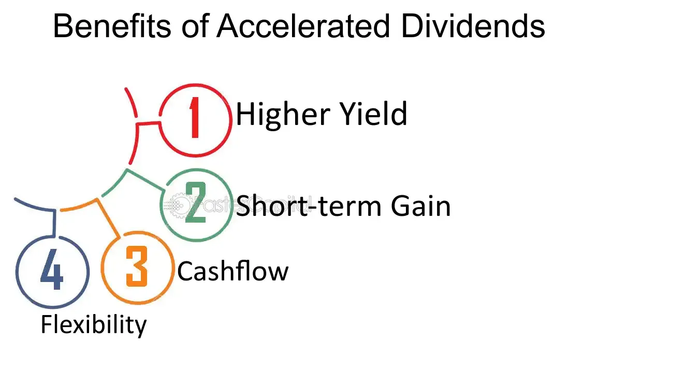

## Table of Contents

## What are accelerated dividends?

Accelerated dividends are payments that a company gives to its shareholders earlier than usual. Normally, dividends are paid out at set times during the year, like every three months or once a year. But with accelerated dividends, the company decides to give the money to shareholders sooner. This can happen for different reasons, like if the company wants to show it's doing well or if it's about to be bought by another company.

When a company decides to pay accelerated dividends, it can be good for shareholders because they get their money faster. They can then use this money for other investments or expenses. However, it can also make some investors worried. They might think the company is trying to make its stock price look better before bad news comes out. So, while getting money early can be nice, it's important for shareholders to understand why the company is doing it.

## How do accelerated dividends differ from regular dividends?

Accelerated dividends are when a company decides to give money to its shareholders earlier than the usual time. Regular dividends, on the other hand, are paid out at set times, like every quarter or once a year. So, the main difference is the timing. With accelerated dividends, shareholders get their money sooner than they would with regular dividends.

The reason a company might choose to pay accelerated dividends can be different from why they pay regular dividends. Regular dividends are a way for a company to share its profits with shareholders on a regular schedule. It shows that the company is stable and doing well over time. Accelerated dividends might be paid if the company wants to show it's doing really well right now, or if there's a big change coming, like being bought by another company. This can be exciting for shareholders because they get money faster, but it can also make them wonder why the company is changing its usual plan.

## What are the benefits of receiving accelerated dividends for shareholders?

Receiving accelerated dividends means shareholders get their money from the company earlier than they usually would. This can be really helpful because they can use this money sooner. They might want to invest it in other places that could make them more money, or they might need it for something important in their life right away. Getting money earlier can make a big difference for people who are planning their finances.

Also, when a company decides to pay accelerated dividends, it can make shareholders feel good about the company. It might show that the company is doing really well and wants to share that success with its investors right away. This can make shareholders feel more confident and happy with their investment. But, it's important for shareholders to think about why the company is giving out money early, because sometimes it could mean there are big changes coming.

## Can you explain the process of how companies issue accelerated dividends?

When a company decides to issue accelerated dividends, it starts with the company's board of directors. They meet and decide that they want to give money to shareholders earlier than usual. They might do this because they have extra money, or because they want to show that the company is doing well. Once the board agrees, they set a date for when the dividends will be paid out. This date is usually sooner than the regular dividend payment date.

After the board makes their decision, the company tells everyone about it. They do this by making an announcement, which is like sending a message to all the shareholders and the public. The announcement says when the accelerated dividends will be paid and how much money each shareholder will get. Shareholders then need to make sure they own the stock on a certain date, called the record date, to get the dividend. Once that date passes, the company sends out the money to everyone who qualifies.

## What types of companies typically offer accelerated dividends?

Companies that often offer accelerated dividends are usually ones that are about to go through big changes. For example, a company might be getting bought by another company, and they want to give money to shareholders before the deal happens. Or, a company might be changing its structure, like turning into a real estate investment trust (REIT), and they need to pay out dividends before they can make that change.

Another type of company that might offer accelerated dividends is one that has a lot of extra money. They might have had a really good year and want to share that success with shareholders right away. These companies could be in any industry, but they usually have strong financials and want to show that they are doing well.

## What are the tax implications of receiving accelerated dividends?

When you get accelerated dividends, you need to think about taxes. The money you get from these dividends is usually seen as income by the tax people. So, you have to pay taxes on it, just like you do with your regular job money. The tax rate can be different depending on where you live and how much money you make in total. Sometimes, if the company is changing into a different kind of business, like a real estate investment trust, the tax rules might be a bit different.

It's a good idea to talk to someone who knows about taxes, like an accountant, before you get your accelerated dividends. They can help you understand how much tax you'll have to pay and if there are any special rules you need to know about. This way, you won't be surprised when it's time to do your taxes, and you can plan better for how to use the money you get from the dividends.

## How do accelerated dividends impact a company's financial statements?

When a company pays accelerated dividends, it shows up on their financial statements right away. The money they pay out goes down as a decrease in their cash and cash equivalents on the balance sheet. This means the company has less money in the bank after paying the dividends. On the statement of cash flows, you'll see the payment listed under the financing activities section, because paying dividends is a way the company is using its money to give back to shareholders.

Paying accelerated dividends can also affect the company's income statement, but in a more indirect way. If the company decides to pay out a lot of money in dividends, it might have less money to spend on other things, like growing the business or paying down debts. This could mean less profit in the future, which would show up on the income statement. But, the immediate impact is mostly seen on the balance sheet and the statement of cash flows, where the cash going out to shareholders is clearly recorded.

## What are the potential risks for companies that offer accelerated dividends?

When a company decides to pay accelerated dividends, it can face some risks. One big risk is that it might not have enough money left for other important things. For example, the company might need money to grow its business, pay its bills, or handle any unexpected problems. If it gives a lot of money to shareholders early, it might not have enough cash to do these things. This could make the company weaker and less able to handle tough times.

Another risk is that paying accelerated dividends might make investors think something is wrong. When a company changes its usual way of doing things, like paying dividends earlier than planned, people might start to worry. They might think the company is trying to make its stock price look better before bad news comes out. This could make the stock price go down, which is not good for the company or its shareholders. So, while giving money to shareholders early can seem nice, it can also lead to problems if it makes people lose trust in the company.

## How can investors identify opportunities for accelerated dividends?

Investors can spot opportunities for accelerated dividends by keeping an eye on company news and announcements. Companies often share their plans to pay accelerated dividends through press releases or during shareholder meetings. If a company is about to be bought by another company or is making a big change, like turning into a real estate investment trust, they might decide to pay out dividends early. So, reading news about the company and understanding what's happening can help investors see when accelerated dividends might be coming.

Another way to find these opportunities is by looking at the company's financial health. If a company is doing really well and has a lot of extra money, they might choose to give some of it back to shareholders early. Investors can check the company's financial statements to see if they have a lot of cash and if they are making good profits. If the company seems strong and has more money than it needs right now, it could be a sign that they might pay accelerated dividends.

## What historical examples exist of companies using accelerated dividends and their outcomes?

One famous example of a company using accelerated dividends happened with Kinder Morgan in 2014. They decided to pay out a big dividend early because they were changing into a different kind of business called a master limited partnership (MLP). This change meant they had to give money to shareholders before they could make the switch. The outcome was good for shareholders because they got a lot of money right away, but it also made some people worry about the company's future. In the end, Kinder Morgan did make the change and kept doing well, but the early dividend payment was a big event that people remembered.

Another example is when Dell announced accelerated dividends in 2013. They did this because they were about to be bought by another company. Dell wanted to give money to shareholders before the buyout happened. Shareholders were happy to get the money early, but some also worried about what would happen to Dell after the buyout. The outcome was that Dell went through with the buyout and became a private company. The early dividend helped shareholders feel better about the change, but it also showed how big changes can make people nervous.

## How do market conditions influence the decision to issue accelerated dividends?

Market conditions can really affect a company's choice to pay accelerated dividends. If the market is doing well and the company is making a lot of money, they might decide to give some of that money back to shareholders early. This can make shareholders happy and show that the company is doing great. But if the market is not doing well, a company might be more careful about paying out money early. They might want to keep the money to help the company stay strong during tough times.

Sometimes, big changes in the market can push a company to pay accelerated dividends. For example, if another company wants to buy them, they might pay out dividends early to give shareholders money before the deal happens. Or, if the market is changing in a way that makes the company want to change its structure, like becoming a real estate investment trust, they might need to pay out dividends before they can make that change. So, market conditions can make a company think about paying accelerated dividends, but it depends a lot on what's happening in the market and what the company needs to do.

## What advanced strategies can investors use to maximize returns from accelerated dividends?

Investors can use a few smart strategies to get the most out of accelerated dividends. One way is to keep a close eye on company news and announcements. If a company is about to be bought or is making a big change, they might pay out dividends early. By knowing this, investors can buy the stock just before the dividend is paid and then sell it after they get the money. This can help them make more money, but they need to be careful because the stock price might go down after the dividend is paid.

Another strategy is to look at the company's financial health. If a company is doing really well and has a lot of extra money, they might decide to give some of it back to shareholders early. Investors can check the company's financial statements to see if they have a lot of cash and are making good profits. If the company seems strong, buying their stock before an accelerated dividend could be a good move. But, investors should also think about the risks, like if the company might not have enough money left for other important things after paying the dividend.

## What are the key concepts and metrics in dividend investing?

Dividend investing involves selecting stocks based on certain key metrics that evaluate their ability to provide ongoing income and capital appreciation. Understanding these metrics is crucial for constructing a successful dividend strategy. The three primary concepts are dividend yield, payout ratio, and dividend growth, each of which plays a pivotal role in evaluating and selecting stocks.

### Dividend Yield

Dividend yield is a financial ratio that indicates how much a company pays out in dividends each year relative to its stock price. It is expressed as a percentage and calculated using the formula:

$$
\text{Dividend Yield} = \left( \frac{\text{Annual Dividends per Share}}{\text{Price per Share}} \right) \times 100
$$

A high dividend yield can indicate that a stock is generating good income relative to its price, which is attractive for income-seeking investors. However, an excessively high yield might also suggest underlying issues with the company, such as a declining stock price.

### Payout Ratio

The payout ratio measures the proportion of earnings a company pays to its shareholders in the form of dividends. It's an indicator of how sustainable a company's dividend payments are over time. The formula for the payout ratio is:

$$
\text{Payout Ratio} = \left( \frac{\text{Dividends Paid}}{\text{Net Income}} \right) \times 100
$$

A lower payout ratio indicates that a company is retaining more of its earnings for growth, whereas a higher ratio might suggest that a company is returning more profits to shareholders. It’s crucial for evaluating whether a company can maintain or grow its dividend payments in the future.

### Dividend Growth

Dividend growth is a measure of the annualized percentage rate of growth that a company's dividends undergo over a certain period. Consistent dividend growth is a strong indicator of a company’s operational strength and profitability. Companies with strong dividend growth are often seen as stable investments with a commitment to returning capital to shareholders.

### Evaluating Stocks for Dividend Strategies

These metrics provide a foundation for assessing investment opportunities within dividend stocks:

- **Dividend Yield** offers insight into income potential relative to stock price.
- **Payout Ratio** signals the sustainability of dividend payments and future growth potential.
- **Dividend Growth** reflects the company’s ability to increase shareholder value over time.

Using a blend of these metrics allows investors to select stocks capable of providing stable and growing income. A well-rounded dividend strategy will balance yield and growth while ensuring that payout levels are sustainable relative to earnings.

### Role of Algorithmic Trading

Algorithmic trading can enhance the efficiency and precision of evaluating these metrics. Advanced algorithms can quickly scan and analyze large datasets to identify stocks meeting specific dividend criteria. Machine learning models can predict future dividend growth based on historical patterns and other financial indicators, allowing for more informed decision-making.

For example, an algorithm might use historical stock data and sentiment analysis to refine selections based on anticipated changes in dividend metrics. Here is a simple Python example using pseudocode to filter stocks based on dividend yield and payout ratio:

```python
import pandas as pd

# Load stock data
data = pd.read_csv('stock_data.csv')

# Define thresholds
yield_threshold = 3.0
payout_threshold = 60.0

# Filter based on metrics
filtered_stocks = data[(data['Dividend Yield'] > yield_threshold) & 
                       (data['Payout Ratio'] < payout_threshold)]

print(filtered_stocks)
```

This algorithm efficiently narrows down potential stocks, allowing investors to focus on promising opportunities. Additionally, predictive modeling and real-time analytics enable quicker responses to market changes and dividend announcements, further optimizing dividend strategies.

## References & Further Reading

[1]: Bergstra, J., Bardenet, R., Bengio, Y., & Kégl, B. (2011). ["Algorithms for Hyper-Parameter Optimization."](https://papers.nips.cc/paper/4443-algorithms-for-hyper-parameter-optimization) Advances in Neural Information Processing Systems 24.

[2]: ["Advances in Financial Machine Learning"](https://www.amazon.com/Advances-Financial-Machine-Learning-Marcos/dp/1119482089) by Marcos Lopez de Prado

[3]: ["Evidence-Based Technical Analysis: Applying the Scientific Method and Statistical Inference to Trading Signals"](https://www.amazon.com/Evidence-Based-Technical-Analysis-Scientific-Statistical/dp/0470008741) by David Aronson

[4]: ["Machine Learning for Algorithmic Trading"](https://github.com/stefan-jansen/machine-learning-for-trading) by Stefan Jansen

[5]: ["Quantitative Trading: How to Build Your Own Algorithmic Trading Business"](https://www.amazon.com/Quantitative-Trading-Build-Algorithmic-Business/dp/1119800064) by Ernest P. Chan