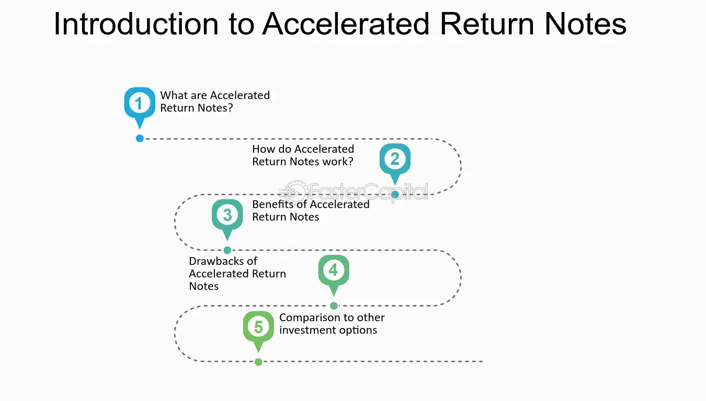

## Table of Contents

## What is an Accelerated Return Note (ARN)?

An Accelerated Return Note (ARN) is a type of investment product that offers the chance to earn higher returns in a shorter amount of time compared to traditional investments. It is usually linked to the performance of an underlying asset, like a stock index or a basket of stocks. If the underlying asset does well, the ARN can provide returns that are higher than what you might get from regular investments.

However, ARNs can be risky. They often have complex structures and may not be suitable for everyone. If the underlying asset doesn't perform as expected, you could lose some or all of your investment. It's important to understand the terms and conditions of an ARN before investing, and it might be a good idea to talk to a financial advisor to see if it fits your investment goals and risk tolerance.

## How does an Accelerated Return Note work?

An Accelerated Return Note (ARN) is a special kind of investment that can give you bigger returns faster than normal investments. It works by being connected to something else, like a stock market index or a group of stocks. If the thing it's connected to does well, the ARN can give you more money back than you would get from regular investments. For example, if the stock market goes up a lot, your ARN might give you a bigger return than if you just bought stocks directly.

But ARNs can be tricky and risky. They have complicated rules that can be hard to understand. If the thing the ARN is connected to doesn't do well, you might lose some or all of your money. It's really important to read all the details about an ARN before you decide to invest. Talking to a financial advisor can help you figure out if an ARN is a good choice for you and fits with how much risk you're willing to take.

## What are the key features of an Accelerated Return Note?

An Accelerated Return Note (ARN) is a type of investment that can give you bigger returns faster than normal investments. It works by being linked to something else, like a stock market index or a group of stocks. If the thing it's linked to does well, the ARN can give you more money back than you would get from regular investments. For example, if the stock market goes up a lot, your ARN might give you a bigger return than if you just bought stocks directly.

But ARNs can be tricky and risky. They have complicated rules that can be hard to understand. If the thing the ARN is linked to doesn't do well, you might lose some or all of your money. It's really important to read all the details about an ARN before you decide to invest. Talking to a financial advisor can help you figure out if an ARN is a good choice for you and fits with how much risk you're willing to take.

## Who typically invests in Accelerated Return Notes?

People who invest in Accelerated Return Notes (ARNs) are usually looking for bigger returns in a shorter time. They might be experienced investors who understand the risks and are willing to take them for the chance of higher rewards. These investors often have a good understanding of the stock market and other financial products, and they might be looking to diversify their investment portfolio with something that could offer more than traditional investments.

However, ARNs can also attract less experienced investors who are drawn in by the promise of quick gains. These investors might not fully understand the complexities and risks involved with ARNs. It's important for anyone thinking about investing in ARNs to do their homework and maybe talk to a financial advisor to make sure it's a good fit for their investment goals and how much risk they can handle.

## What are the potential benefits of investing in an ARN?

Investing in an Accelerated Return Note (ARN) can offer the chance to earn bigger returns faster than with regular investments. If the thing the ARN is linked to, like a stock market index or a group of stocks, does well, you might get more money back than you would from traditional investments. This can be really appealing if you're looking to grow your money quickly.

However, ARNs come with risks. They can be complicated, and if the thing they're linked to doesn't do well, you could lose some or all of your investment. It's important to understand the terms and conditions of an ARN before you invest. Talking to a financial advisor can help you figure out if an ARN is right for you and fits with how much risk you're willing to take.

## What are the risks associated with Accelerated Return Notes?

Investing in Accelerated Return Notes (ARNs) can be risky. One big risk is that you might lose some or all of your money if the thing the ARN is linked to, like a stock market index or a group of stocks, doesn't do well. ARNs are often tied to the performance of these assets, so if they go down, your investment could go down too. This can be a problem if you're not ready to lose money or if you need your money back soon.

Another risk is that ARNs can be really complicated. They have a lot of rules and conditions that can be hard to understand. If you don't fully get how an ARN works, you might be surprised by how it performs. This complexity can make it hard to know what you're getting into, and you might end up with an investment that doesn't fit your goals or how much risk you're willing to take.

It's also important to think about the fees and costs that come with ARNs. These can eat into your returns and make the investment less profitable than it seems at first. Before you invest, it's a good idea to read all the details and maybe talk to a financial advisor to make sure an ARN is right for you.

## How is the return on an ARN calculated?

The return on an Accelerated Return Note (ARN) is based on how well the thing it's linked to, like a stock market index or a group of stocks, does over a certain time. If that thing goes up a lot, the ARN can give you a bigger return than if you just bought the stocks directly. The exact return depends on the rules set by the ARN, which can be different for each one. For example, an ARN might promise to give you double the return of the stock market if it goes up by a certain amount.

But if the thing the ARN is linked to doesn't do well, you might not get any return at all, or you could even lose some or all of your money. The rules of the ARN can be complicated, so it's important to read them carefully. Sometimes, there are also fees and costs that can affect how much money you get back. Talking to a financial advisor can help you understand how the return is calculated and if an ARN is a good choice for you.

## Can you explain the structure of an ARN?

An Accelerated Return Note (ARN) is a special kind of investment that can give you bigger returns faster than normal investments. It works by being linked to something else, like a stock market index or a group of stocks. If the thing it's linked to does well, the ARN can give you more money back than you would get from regular investments. For example, if the stock market goes up a lot, your ARN might give you a bigger return than if you just bought stocks directly. The exact return depends on the rules set by the ARN, which can be different for each one.

But ARNs can be tricky and risky. They have complicated rules that can be hard to understand. If the thing the ARN is linked to doesn't do well, you might lose some or all of your money. It's really important to read all the details about an ARN before you decide to invest. Talking to a financial advisor can help you figure out if an ARN is a good choice for you and fits with how much risk you're willing to take.

## What are the common terms and conditions of an ARN?

An Accelerated Return Note (ARN) has a lot of rules that can be hard to understand. One common rule is that the ARN is linked to something else, like a stock market index or a group of stocks. If that thing does well, the ARN can give you more money back than you would get from regular investments. But if it doesn't do well, you might lose some or all of your money. The ARN might also have a set time, like a year or two, during which it's active. After that time, you get your return based on how the linked thing did.

Another important rule is about how the return is calculated. The ARN might promise to give you a certain amount of return if the linked thing goes up by a certain amount. For example, it might say you get double the return of the stock market if it goes up by 10%. But there can be limits, like a cap on how much you can earn, or a floor that means you don't lose all your money if the market goes down a lot. There are also often fees and costs that can affect how much money you get back. It's really important to read all the details about an ARN before you decide to invest.

## How do Accelerated Return Notes compare to other investment vehicles?

Accelerated Return Notes (ARNs) are different from other investments like stocks, bonds, or mutual funds because they can give you bigger returns faster. If the thing an ARN is linked to, like a stock market index, does well, you might get more money back than if you just bought stocks directly. But ARNs are also riskier. If the linked thing doesn't do well, you could lose some or all of your money. This makes ARNs a bit like gambling, where you might win big or lose big.

Compared to bonds, which are usually safer and give you steady returns, ARNs can be much more exciting but also much more dangerous. Bonds give you a fixed amount of money over time, while ARNs depend on how well the market does. Mutual funds, which are a mix of different investments, can be less risky than ARNs because they spread out the risk. But they also usually don't offer the chance for such big, quick returns. So, ARNs are for people who are okay with taking big risks for the chance of big rewards.

## What should investors consider before investing in an ARN?

Before investing in an Accelerated Return Note (ARN), it's important to think about how much risk you're willing to take. ARNs can give you bigger returns faster than normal investments, but they're also riskier. If the thing the ARN is linked to, like a stock market index, doesn't do well, you could lose some or all of your money. So, you need to be ready for that possibility and make sure you can handle the risk.

Another thing to consider is how well you understand ARNs. They can be really complicated with a lot of rules and conditions. If you don't fully get how an ARN works, you might be surprised by how it performs. It's a good idea to read all the details carefully and maybe talk to a financial advisor. They can help you figure out if an ARN fits with your investment goals and how much risk you're willing to take.

## Are there any notable case studies or examples of ARNs in the market?

One example of an Accelerated Return Note (ARN) is the one offered by Bank of America Merrill Lynch. They had an ARN linked to the S&P 500 index. If the S&P 500 went up by a certain amount over a set time, like a year, the ARN would give investors a return that was higher than just buying the stocks in the S&P 500 directly. But if the S&P 500 didn't do well, investors could lose money. This ARN showed how these notes can offer big rewards but also come with big risks.

Another example is from Goldman Sachs, which offered an ARN tied to a basket of tech stocks. If the tech stocks did well, the ARN could give investors a much bigger return than if they had just bought those stocks. But if the tech stocks didn't perform as expected, the investors could lose a lot of their money. This example highlights how ARNs can be attractive to people looking for quick gains but also how they can be risky if the market doesn't go the way you hope.

## What are some examples and case studies?

An Accelerated Return Note (ARN) linked to the S&P 500 index typically promises enhanced returns based on the index's performance while capping the potential gains. These instruments exemplify the balance of risk and reward, with specific contingencies affecting their payouts. 

### Scenario 1: Slight Increase in the S&P 500
Consider an ARN maturing in 12 months, linked to the S&P 500, with a return cap of 20% and a participation rate of 200%. If the initial index value is 4,000 and it rises by 5% to 4,200 by maturity, the investor's return calculation would be as follows:

$$
\text{Index Performance} = \frac{4,200 - 4,000}{4,000} = 0.05 \text{ or } 5\%
$$

With a participation rate of 200%, the associated return is:

$$
\text{Investor Return} = 0.05 \times 200\% = 10\%
$$

Given that the 10% return is below the maximum cap of 20%, the investor receives a 10% increase on the initial investment. For a $10,000 investment:

$$
\text{Payout} = 10,000 \times (1 + 0.10) = \$11,000
$$

### Scenario 2: Significant Increase in the S&P 500
If the index increases by 15% to 4,600, the computation becomes:

$$
\text{Index Performance} = \frac{4,600 - 4,000}{4,000} = 0.15 \text{ or } 15\%
$$

With a participation rate of 200%:

$$
\text{Investor Return} = 0.15 \times 200\% = 30\%
$$

However, due to the 20% cap on returns, the investor's gain is limited to 20%. Thus, for a $10,000 investment:

$$
\text{Payout} = 10,000 \times (1 + 0.20) = \$12,000
$$

### Scenario 3: Decrease in the S&P 500
If the index drops by 10% to 3,600, the losses unfavorably affect the investor:

$$
\text{Index Performance} = \frac{3,600 - 4,000}{4,000} = -0.10 \text{ or } -10\%
$$

Since ARNs offer no downside protection, a $10,000 investment results in a loss:

$$
\text{Payout} = 10,000 \times (1 - 0.10) = \$9,000
$$

### Observations
These examples illustrate how ARNs can amplify investment returns when the underlying index performs positively, yet they expose the investor to full losses when the performance is adverse. The capped nature of returns ensures that while upside potential is enhanced, it is not unlimited, which can constrain investor profits during highly bullish periods. Conversely, during market downturns, the lack of loss protection significantly impacts returns, underscoring the importance of careful risk assessment when investing in ARNs.

## References & Further Reading

[1]: ["Structured Products in Financial Markets"](https://www.investopedia.com/articles/optioninvestor/07/structured_products.asp) by Christopher H. Timberlake

[2]: ["The Handbook of Structured Finance"](https://www.amazon.com/Handbook-Structured-Finance-Arnaud-Servigny/dp/0071468641) by Arnaud de Servigny and Norbert Jobst

[3]: ["Advances in Financial Machine Learning"](https://www.amazon.com/Advances-Financial-Machine-Learning-Marcos/dp/1119482089) by Marcos Lopez de Prado

[4]: ["Structured Products and Related Credit Derivatives: A Comprehensive Guide for Investors"](https://onlinelibrary.wiley.com/doi/book/10.1002/9781119197836) by Brian P. Lancaster, Glenn M. Schultz, and Frank J. Fabozzi

[5]: Segalini, A. (2009). ["Structured Notes: Governing Regulatory and Risk Management Issues."](https://www.fuchsfinancial.com/structured-notes-risks/) Capital Markets: Institutions and Instruments, 13(1).

[6]: ["Quantitative Trading: How to Build Your Own Algorithmic Trading Business"](https://www.amazon.com/Quantitative-Trading-Build-Algorithmic-Business/dp/1119800064) by Ernest P. Chan

[7]: ["Algorithmic and High-Frequency Trading"](https://assets.cambridge.org/97811070/91146/frontmatter/9781107091146_frontmatter.pdf) by Álvaro Cartea, Sebastian Jaimungal, and José Penalva