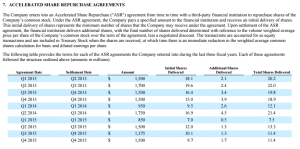

Accelerated Share Repurchase (ASR) is a tactical financial method employed by companies to rapidly reacquire their shares from the market. This strategic maneuver primarily aims to decrease the number of outstanding shares, thereby enhancing the earnings per share (EPS), and potentially augmenting the market value of the stock. By reducing the share count, the EPS is increased according to the formula:

$$
\text{EPS} = \frac{\text{Net Income}}{\text{Outstanding Shares}}
$$



An elevated EPS often acts as a catalyst for an increase in stock market value, reflecting positively on a company's financial health and performance metrics. Through an ASR, firms can efficiently consolidate their ownership, thus achieving greater control over strategic corporate decisions while simultaneously signaling confidence in their stock's undervaluation to the market. This article will offer a comprehensive investigation into ASR, detailing its mechanics, advantages, risks, and successful corporate applications.

## Table of Contents

## Understanding Accelerated Share Repurchase (ASR)

Accelerated Share Repurchase (ASR) is a financial strategy wherein a company collaborates with an investment bank to expedite the buyback of a significant quantity of its shares. The primary motivation for this maneuver is the company's perception that its shares are undervalued in the market. This belief prompts the company to reduce its number of outstanding shares quickly, thereby enhancing its earnings per share (EPS) and potentially driving up the stock's market value.

The mechanism of an ASR involves the company providing a substantial upfront cash payment to the investment bank. In return, the bank enters into a forward contract with the company. Under this agreement, the investment bank borrows shares, typically from institutional investors, and then sells these shares back to the company at a predetermined price. This arrangement facilitates a rapid decrease in the number of shares available in the market, leading to immediate financial benefits for the company, such as an increase in EPS due to the reduced denominator (number of outstanding shares) in the EPS calculation:

$$
\text{EPS} = \frac{\text{Net Income}}{\text{Outstanding Shares}}
$$

An ASR transaction is particularly advantageous when a company has significant cash reserves and believes its stock is traded below its intrinsic value. By reducing the supply of shares, ASRs can increase demand, potentially elevating the stock price to better reflect the company's actual performance and value. Additionally, because the shares are repurchased swiftly, ASRs present a more immediate effect on the market compared to traditional open market purchases, which occur over more extended periods.

Ultimately, the decision to pursue an ASR requires careful consideration of the company's valuation, available cash resources, and long-term strategic goals. Companies often choose this path not only to strengthen their capital structure but also to send a positive signal to the market about their financial health and future growth prospects.

## The Mechanics of ASR

An Accelerated Share Repurchase (ASR) transaction begins with a formal agreement between a company and an investment bank. The primary objective of this arrangement is to swiftly reduce the number of shares available in the market, leading to an improved Earnings Per Share (EPS).

In an ASR, the company arranges to provide a specified amount of upfront cash to the investment bank. The bank utilizes this capital to acquire a substantial block of the company’s shares rapidly. To achieve this, the investment bank typically borrows shares from institutional investors, who hold large quantities of stocks. Subsequently, these borrowed shares are sold back to the company. This borrowing and selling operation allows the company to repurchase a significant number of shares in a short time period, without having to maneuver through the market on its own, which might not be feasible rapidly given the large [volume](/wiki/volume-trading-strategy) of shares involved.

The reduction in outstanding shares through an ASR is advantageous because it directly impacts the EPS metric. Mathematically, EPS is defined as:

$$
\text{EPS} = \frac{\text{Net Income}}{\text{Outstanding Shares}}
$$

By decreasing the denominator—Outstanding Shares—while keeping the net income constant, the EPS increases. This often leads to a perception of improved financial health and can potentially raise the stock's market value, as the earnings are now distributed across fewer shares.

This process is appealing for companies aiming to adjust their capital structure swiftly, particularly when they assess their stock as being undervalued. Due to its rapid execution, ASRs enable the company to act decisively, leveraging conditions they believe are favorable and thus maximizing potential benefits to both corporate valuation and shareholder returns.

## Benefits of ASR for Companies

Accelerated Share Repurchase (ASR) offers several distinct advantages for companies seeking to optimize their financial standing and shareholder value. One of the primary benefits is the rapid consolidation of ownership, allowing companies to enhance their control over strategic decisions. By promptly acquiring a significant number of shares, companies can strengthen their influence over corporate governance and reduce reliance on external stakeholders. This facilitates a more streamlined decision-making process, aligning corporate strategies more closely with management objectives and long-term goals.

The ASR mechanism effectively reduces the number of shares available in the market. This reduction often results in increased share prices, as supply decreases while demand remains constant or increases. The relationship between share reduction and price can be conceptualized through the basic economic principle of supply and demand, which directly influences the perceived value of the remaining shares. In scenarios where investor sentiment is positive, this can lead to a more favorable market position for the company.

Furthermore, ASRs can provide tax advantages, enhancing the overall valuation of the company. When executed strategically, companies can benefit from lower taxable income, as share buybacks might be viewed differently from dividends in the context of taxation. This differential treatment can result in significant savings, improving the financial efficiency of the buyback process. Moreover, from a valuation perspective, successful ASRs may contribute to higher earnings per share (EPS), which is an important metric for investors. This enhancement in EPS can translate to an improved valuation as earnings are distributed over a reduced number of shares, increasing the attractiveness of the company’s stock to current and potential investors.

To illustrate the potential impact, consider the formula for calculating EPS:

$$
\text{EPS} = \frac{\text{Net Income} - \text{Dividends on Preferred Stock}}{\text{Average Outstanding Shares}}
$$

By significantly reducing the denominator, ASR can magnify the EPS, assuming stable net income levels. This financial maneuver not only underscores managerial confidence in the company’s intrinsic value but also acts as a catalyst for market reevaluation of the company’s worth. Consequently, through strategic reductions in share count and leveraging potential tax benefits, companies employing ASR can achieve a nuanced recalibration of their market stature and financial health.

## Benefits of ASR for Investors

Accelerated Share Repurchase (ASR) programs can provide several key benefits to investors, often serving as a positive signal regarding the company's financial standing and market perception. When a company undertakes an ASR, it typically signifies a belief that its shares are undervalued. This demonstrates management's confidence in the company's future prospects and frequently results in an increase in stock prices as the market anticipates improved financial performance.

From an investor's perspective, a significant benefit of ASR is the improvement in earnings per share (EPS). The formula for EPS is:

$$
\text{EPS} = \frac{\text{Net Income}}{\text{Outstanding Shares}}
$$

By reducing the number of outstanding shares through an ASR, the denominator in the EPS calculation decreases, leading to a higher EPS assuming net income remains stable. This increase in EPS can enhance the attractiveness of the stock, potentially leading to higher stock valuations.

Additionally, a reduction in the number of outstanding shares may pave the way for potential dividend increases. With fewer shares to distribute, companies may opt to enhance dividend per share payouts, assuming sufficient cash flow and profitability. This can be particularly appealing to income-focused investors seeking regular income streams from their investments.

Moreover, engaging in an ASR often provides investors with a signal of strong company financial health. A company deploying an ASR typically has robust cash reserves, enabling it to return capital to shareholders while maintaining operational stability. This financial flexibility is reassuring to investors, as it indicates the company's capability to thrive and strategically manage its capital structure even amid market fluctuations.

In summary, ASRs represent a vote of confidence from company management, implying undervaluation and signaling strong financial health. This confidence can attract investors looking for both stability and growth, reinforcing the company's position in the market while delivering tangible benefits to its shareholders.

## Risks Associated with ASR

Accelerated Share Repurchases (ASRs) involve complexities and uncertainties that necessitate careful risk management by companies. A primary concern is the potential overvaluation of a company's stock. If a company buys back its shares at a price higher than their intrinsic value, it can lead to inefficient capital allocation. Companies seeking to execute an ASR must diligently assess their stock's true value to avoid overpayment, which can negatively impact shareholder value.

Another significant risk is the excessive use of cash reserves. Companies typically fund ASRs with substantial amounts of cash upfront. Overcommitting to an ASR can strain a company's [liquidity](/wiki/liquidity-risk-premium) position, potentially impacting its ability to fund operational needs or strategic investments. This situation is particularly risky if unforeseen market conditions arise, necessitating rapid access to cash.

Market [volatility](/wiki/volatility-trading-strategies) poses an additional challenge to ASRs. Sudden fluctuations in stock prices can alter the economics of the buyback, potentially resulting in losses. For example, if the price of shares drops significantly after an ASR is announced or initiated, the perceived value to shareholders diminishes. Conversely, a sudden price increase may render the buyback more costly than initially anticipated.

Managing pricing uncertainties and investor expectations is crucial in this context. Investment banks and companies must carefully time market entries to minimize the impact of volatility on the transaction. This requires sophisticated modeling and forecasting abilities to anticipate market movements and adjust strategies accordingly. Clear communication with investors is also vital to manage expectations and mitigate negative perceptions that could arise from unexpected price changes or strategic shifts.

Quantitative models, often leveraged in these settings, can assist in evaluating the timing and scale of ASRs. A basic model in Python could involve Monte Carlo simulations to assess various stock price scenarios and their impact on ASR outcomes:

```python
import numpy as np

# Variables
current_price = 50  # Current stock price
volatility = 0.2  # Estimated stock volatility
num_simulations = 1000
time_horizon = 1  # One-year horizon
risk_free_rate = 0.05

# Simulating potential future prices
simulated_prices = np.zeros(num_simulations)

for i in range(num_simulations):
    simulated_prices[i] = current_price * np.exp(
        (risk_free_rate - 0.5 * volatility ** 2) * time_horizon + 
        volatility * np.sqrt(time_horizon) * np.random.normal(0, 1)
    )

# Analyzing the results
expected_price = np.mean(simulated_prices)
price_std_dev = np.std(simulated_prices)

print(f"Expected Stock Price after 1 Year: ${expected_price:.2f}")
print(f"Standard Deviation of Simulated Prices: ${price_std_dev:.2f}")
```

In conclusion, while ASRs offer substantial benefits, they [carry](/wiki/carry-trading) inherent risks related to stock valuation, liquidity management, market volatility, and investor relations. By utilizing quantitative tools and maintaining transparent communication, companies can navigate these challenges more effectively.

## Examples of Successful ASR

Intel Corporation's 2020 Accelerated Share Repurchase (ASR) serves as a prominent example of utilizing ASR strategies to manage an abundance of cash and to address share undervaluation effectively. In 2020, Intel embarked on an ASR program by partnering with a leading investment bank, aiming to repurchase a sizable portion of its outstanding shares swiftly. This decision was driven by Intel's perception that its shares were undervalued in the market, offering a tactical advantage to boost its Earnings Per Share (EPS) and enhance shareholder value quickly. The initiative involved the investment bank borrowing shares from institutional investors and selling them to Intel in exchange for upfront cash. Through this maneuver, Intel managed to consolidate its ownership, amplifying its control over strategic corporate decisions. Furthermore, by diminishing the number of shares in circulation, Intel not only improved its EPS but potentially bolstered its stock price.

Consolidated Edison's 2023 ASR illustrates an efficient approach to capital return following business divestitures. As a major utility company, Consolidated Edison undertook this strategic measure to effectively return capital to its investors after divesting certain business units. The ASR allowed the company to swiftly distribute excess capital back to shareholders, thereby optimizing its capital structure. This strategy mirrored its intent to maintain shareholder trust and confidence amidst restructuring efforts. By providing the investment bank with upfront cash, Consolidated Edison could expedite the share repurchase process. The rapid reduction in outstanding shares allowed for improved financial metrics and potentially higher dividend payouts, illustrating ASRs' capability to enhance shareholder value post-divestiture.

## Algorithmic Trading in ASR

Algorithmic trading plays a pivotal role in enhancing the efficiency and speed of Accelerated Share Repurchase (ASR) transactions. By using pre-programmed algorithms, financial institutions can execute buybacks at optimal times and prices, minimizing market disruption and maximizing financial gains. These algorithms help execute trades based on a variety of factors such as market conditions, stock price movements, and trading volumes, allowing for more precise and strategic repurchasing.

In ASR settings, [algorithmic trading](/wiki/algorithmic-trading) ensures that large volumes of shares can be transacted quickly without causing significant price swings. This is crucial in maintaining market stability and protecting the company's stock price from undue volatility during substantial buybacks. Algorithms can easily handle complex calculations and make instantaneous trading decisions, making them invaluable in executing ASRs efficiently.

Future advancements in algorithmic techniques hold the potential to further streamline ASR processes. For instance, [machine learning](/wiki/machine-learning) algorithms can be developed to predict market trends more accurately by analyzing historical data alongside real-time market information. As algorithmic trading technology continues to evolve, it is expected that more sophisticated methods will emerge, enabling even smoother execution of ASR transactions and allowing companies to better capitalize on favorable market conditions.

To illustrate, a simple algorithm used in ASR transactions might involve setting trigger conditions for the repurchase based on a stock's moving average. Here is an example of how one might programmatically determine an optimal buy condition using Python:

```python
import numpy as np

def moving_average(prices, window_size):
    return np.convolve(prices, np.ones(window_size), 'valid') / window_size

def determine_buy(prices, short_window, long_window):
    short_mavg = moving_average(prices, short_window)
    long_mavg = moving_average(prices, long_window)

    # Determine buy condition: when the short moving average crosses above the long moving average
    buy_signals = np.where(short_mavg > long_mavg)[0]
    return buy_signals

# Example usage
stock_prices = [100, 102, 104, 103, 107, 110, 115, 112, 110, 108]
buy_signals = determine_buy(stock_prices, short_window=3, long_window=5)

print("Buy signals at index:", buy_signals)
```

This code snippet highlights a simplified version of what algorithmic trading strategies might look like, aimed at identifying technical conditions under which ASR transactions could be optimized. As more complex algorithms incorporate additional data and analytics, companies will find even more refined methods to execute ASRs with precision.

## Conclusion

Accelerated Share Repurchases (ASRs) serve as a formidable instrument in corporate finance, enabling companies to efficiently optimize their share structures and enhance value. This tactical approach allows firms to reduce the number of outstanding shares swiftly, thus potentially boosting earnings per share (EPS) and elevating stock market valuation. Through a structured collaboration with investment banks, companies can quickly execute significant buybacks, which, when timed correctly, can provide substantial rewards.

The strategic implementation of ASRs can yield significant benefits for both the company and its investors. For companies, ASRs can lead to increased control over corporate strategies and market perceptions, while investors may experience improved EPS and potential dividend growth. However, it is crucial for companies to approach ASRs with a clear understanding of the intrinsic risks, such as overvaluing stock and the potential depletion of cash reserves. Successful ASRs require careful planning and precise execution to mitigate these challenges.

Remaining informed about current market conditions and technological advancements in trading is essential for maximizing the advantages of ASRs. The emergence of sophisticated trading technologies, like algorithmic trading, can further enhance the efficiency of ASR transactions, minimizing market disruptions and optimizing financial outcomes. This synergy between strategic corporate finance and innovative trading methods underscores the importance of ASRs as a versatile tool in enhancing corporate value and investor wealth.

## References & Further Reading

[1]: Chan, E. P. (2009). ["Quantitative Trading: How to Build Your Own Algorithmic Trading Business."](https://github.com/ftvision/quant_trading_echan_book) Wiley.

[2]: Jansen, S. (2020). ["Machine Learning for Algorithmic Trading: Predictive models to extract signals from market and alternative data for systematic trading strategies with Python."](https://www.amazon.com/Machine-Learning-Algorithmic-Trading-alternative/dp/1839217715) Packt Publishing.

[3]: Lopez de Prado, M. (2018). ["Advances in Financial Machine Learning."](https://www.amazon.com/Advances-Financial-Machine-Learning-Marcos/dp/1119482089) Wiley.

[4]: Aronson, D. R. (2007). ["Evidence-Based Technical Analysis: Applying the Scientific Method and Statistical Inference to Trading Signals."](https://www.amazon.com/Evidence-Based-Technical-Analysis-Scientific-Statistical/dp/0470008741) Wiley.

[5]: Hull, J. C. (2018). ["Options, Futures, and Other Derivatives."](https://www.semanticscholar.org/paper/Options%2C-Futures%2C-and-Other-Derivatives-Hull/89bdee500c8623864fc9eb7a471546aa713acc44) Pearson.

[6]: Farrell, R. J. (2018). ["Investment Management."](https://onlinelibrary.wiley.com/doi/book/10.1002/9781118267028) McGraw-Hill Education. 

[7]: Brealey, R. A., Myers, S. C., & Allen, F. (2020). ["Principles of Corporate Finance."](https://www.mheducation.com/highered/product/Principles-of-Corporate-Finance-Brealey.html) McGraw-Hill Education.