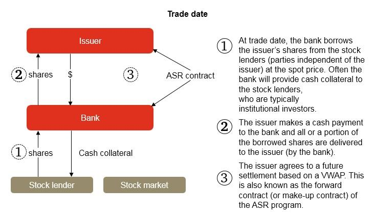

## Table of Contents

## What is an Accelerated Share Repurchase (ASR)?

An Accelerated Share Repurchase (ASR) is a way for a company to buy back its own shares quickly. Instead of buying shares slowly over time, the company works with a bank or financial institution. The bank gives the company a big chunk of shares right away. In return, the company pays the bank a lump sum of money.

After the initial exchange, the bank keeps buying shares in the market over a set period, usually a few months. At the end of this time, the bank and the company settle up. If the bank bought more shares than it gave at the start, the company gets more shares. If it bought fewer, the company might have to give some shares back or pay more money. This method helps the company reduce its shares quickly, which can increase the value of the remaining shares.

## How does an Accelerated Share Repurchase work?

An Accelerated Share Repurchase (ASR) is a way for a company to buy back its own shares quickly. The company teams up with a bank or financial institution. The company pays the bank a large amount of money upfront, and in return, the bank gives the company a big batch of its shares right away. This helps the company reduce the number of its shares in the market quickly.

After the initial exchange, the bank continues to buy more shares in the market over a set period, which is usually a few months. At the end of this time, the bank and the company do a final calculation. If the bank bought more shares than it initially gave to the company, the company gets extra shares. If the bank bought fewer shares, the company might need to give some shares back or pay more money. This method helps the company to quickly decrease the number of its shares, which can make the value of the remaining shares go up.

## What are the benefits of an Accelerated Share Repurchase for a company?

An Accelerated Share Repurchase (ASR) helps a company buy back its shares quickly. This can make the value of the remaining shares go up because there are fewer shares overall. When a company has fewer shares, each share represents a bigger piece of the company. This can be good for the shareholders because their shares might be worth more money.

Another benefit is that an ASR can show that the company believes in its own future. When a company buys back its shares, it sends a message to the market that it thinks its shares are a good investment. This can make investors feel more confident about the company. Plus, doing an ASR can be a smart way to use extra cash the company has, instead of letting it sit around.

## What are the potential risks or drawbacks of using an ASR?

One risk of using an Accelerated Share Repurchase (ASR) is that it can be expensive. The company has to pay a big amount of money upfront to the bank. If the stock price goes down after the ASR starts, the company might end up paying more for the shares than they are worth. This can be a problem if the company needs that money for other things or if it doesn't have enough cash to cover the cost.

Another drawback is that an ASR can be risky if the company's stock price is not stable. If the stock price goes up a lot after the ASR, the company might have been better off waiting to buy back shares at a lower price. Also, if the market thinks the company is buying back shares because it doesn't have better ways to use its money, it might make investors worried. This could make the stock price go down, which is the opposite of what the company wanted when it started the ASR.

## How does an ASR affect a company's stock price?

An Accelerated Share Repurchase (ASR) can affect a company's stock price in a few ways. When a company does an ASR, it buys back a lot of its own shares quickly. This means there are fewer shares left in the market. When there are fewer shares, each share can be worth more money because it represents a bigger piece of the company. So, the stock price might go up because of this.

But, there are also risks. If the market thinks the company is doing an ASR because it doesn't have better ways to use its money, it might make investors worried. This could make the stock price go down. Also, if the stock price goes up a lot after the ASR starts, the company might have paid too much for the shares it bought back. So, an ASR can help the stock price go up, but it can also have the opposite effect if things don't go as planned.

## Can you explain the typical structure of an ASR agreement?

An Accelerated Share Repurchase (ASR) agreement usually starts with a company paying a bank a big amount of money upfront. In return, the bank gives the company a large number of its shares right away. This helps the company reduce the number of its shares in the market quickly. The number of shares the bank gives at the start is based on the stock's price at that time. This initial exchange is the first part of the ASR agreement.

After the initial exchange, the bank keeps buying more shares in the market over a set period, which is usually a few months. This is the second part of the agreement. At the end of this time, the bank and the company do a final calculation. If the bank bought more shares than it initially gave to the company, the company gets extra shares. If the bank bought fewer shares, the company might need to give some shares back or pay more money. This final settlement makes sure everything is fair based on how the stock price moved during the ASR period.

## What are the accounting implications of an ASR?

When a company does an Accelerated Share Repurchase (ASR), it has to think about how to show it in its financial records. At the start, the company pays a big amount of money to the bank and gets shares right away. The company records this as a decrease in its cash and a decrease in its shareholders' equity. The shares that the company gets are taken out of the total number of shares that are out there. This makes the company's earnings per share go up because there are fewer shares to divide the earnings among.

After the initial exchange, the bank keeps buying more shares over time. At the end of the ASR period, the company and the bank do a final calculation. If the bank bought more shares than it gave at the start, the company gets more shares. If it bought fewer, the company might have to give some shares back or pay more money. The company then adjusts its financial records to show these final changes. This can affect the company's cash, shareholders' equity, and the number of shares outstanding again. It's important for the company to keep good records of all these changes to make sure its financial statements are correct.

## How do ASRs compare to traditional share repurchase programs?

An Accelerated Share Repurchase (ASR) and a traditional share repurchase program both help a company buy back its own shares, but they work in different ways. With an ASR, a company pays a bank a big amount of money upfront and gets a lot of shares right away. The bank then keeps buying more shares over time, and at the end, they do a final calculation to make sure everything is fair. This method is quick and can help the company reduce its shares fast. On the other hand, a traditional share repurchase program lets a company buy back its shares slowly over time, usually through the open market or by making offers to shareholders. This can take longer but gives the company more control over when and how many shares it buys back.

The main difference between the two is the speed and the upfront cost. An ASR is faster because the company gets a big chunk of shares right away, but it costs a lot of money upfront. A traditional program can be slower and more spread out, which might be easier on the company's cash flow. Both methods can help increase the value of the remaining shares by reducing the total number of shares, but an ASR can show the market that the company is confident in its future more quickly. However, an ASR can be riskier if the stock price changes a lot during the ASR period, while a traditional program might be less risky because the company can adjust its buying based on the stock price.

## What role do financial institutions play in an ASR?

In an Accelerated Share Repurchase (ASR), financial institutions like banks play a big role. They help the company buy back its shares quickly. The company pays the bank a lot of money upfront, and the bank gives the company a big batch of its shares right away. This helps the company reduce the number of its shares in the market fast. The bank uses the money it gets from the company to buy more shares over time, usually a few months.

After the initial exchange, the bank keeps buying more shares in the market. At the end of the ASR period, the bank and the company do a final calculation. If the bank bought more shares than it gave at the start, the company gets extra shares. If it bought fewer, the company might have to give some shares back or pay more money. The bank's role is important because it makes the whole process smoother and faster for the company.

## How are the shares delivered and settled in an ASR?

In an Accelerated Share Repurchase (ASR), the company pays a bank a big amount of money upfront. Right after that, the bank gives the company a large number of its shares. This happens quickly, so the company can reduce the number of its shares in the market fast. The number of shares the bank gives at the start is based on the stock's price at that time.

After the initial exchange, the bank keeps buying more shares in the market over a set period, usually a few months. At the end of this time, the bank and the company do a final calculation. If the bank bought more shares than it gave at the start, the company gets extra shares. If it bought fewer, the company might have to give some shares back or pay more money. This final settlement makes sure everything is fair based on how the stock price moved during the ASR period.

## What are the tax implications for a company engaging in an ASR?

When a company does an Accelerated Share Repurchase (ASR), it needs to think about how it might affect its taxes. The money the company spends on the ASR is not something it can take off its taxes right away. It's seen as a way to give money back to shareholders, not as a business expense. So, the company can't lower its taxable income by the amount it spent on the ASR. But, the ASR can change how much the company pays in taxes in the future. When the company buys back its shares, it has fewer shares out there. This can make the company's earnings per share go up, which might mean the company has to pay more in taxes on its earnings later on.

Also, the way the company accounts for the ASR can affect its taxes. When the company gets the shares from the bank at the start of the ASR, it records this as a decrease in its cash and a decrease in its shareholders' equity. At the end of the ASR, when the final settlement happens, the company might get more shares or have to give some back. These changes can affect the company's financial statements, which can then affect its taxes. It's important for the company to keep good records and maybe talk to a tax expert to make sure it's doing everything right with its taxes when it does an ASR.

## Can you discuss a real-world example of a company using an ASR and its outcomes?

A good example of a company using an Accelerated Share Repurchase (ASR) is Apple Inc. In 2018, Apple announced a $100 billion share buyback program, and part of this was done through an ASR. Apple worked with banks like Goldman Sachs and Bank of America to quickly buy back its shares. Apple paid the banks a large amount of money upfront, and in return, the banks gave Apple a big batch of its shares right away. This helped Apple reduce the number of its shares in the market quickly, which can make the value of the remaining shares go up.

The outcome of Apple's ASR was positive. By reducing the number of shares, Apple's earnings per share went up because there were fewer shares to divide the earnings among. This made the stock more attractive to investors. Also, the ASR showed that Apple believed in its own future, which can make investors feel more confident about the company. Overall, the ASR helped Apple manage its cash effectively and increase the value of its stock, which was good for its shareholders.

## What is Understanding Accelerated Share Repurchase (ASR)?

Accelerated Share Repurchase (ASR) is a financial strategy wherein a company collaborates with an investment bank to expedite the buyback of a significant quantity of its shares. The primary motivation for this maneuver is the company's perception that its shares are undervalued in the market. This belief prompts the company to reduce its number of outstanding shares quickly, thereby enhancing its earnings per share (EPS) and potentially driving up the stock's market value.

The mechanism of an ASR involves the company providing a substantial upfront cash payment to the investment bank. In return, the bank enters into a forward contract with the company. Under this agreement, the investment bank borrows shares, typically from institutional investors, and then sells these shares back to the company at a predetermined price. This arrangement facilitates a rapid decrease in the number of shares available in the market, leading to immediate financial benefits for the company, such as an increase in EPS due to the reduced denominator (number of outstanding shares) in the EPS calculation:

$$
\text{EPS} = \frac{\text{Net Income}}{\text{Outstanding Shares}}
$$

An ASR transaction is particularly advantageous when a company has significant cash reserves and believes its stock is traded below its intrinsic value. By reducing the supply of shares, ASRs can increase demand, potentially elevating the stock price to better reflect the company's actual performance and value. Additionally, because the shares are repurchased swiftly, ASRs present a more immediate effect on the market compared to traditional open market purchases, which occur over more extended periods.

Ultimately, the decision to pursue an ASR requires careful consideration of the company's valuation, available cash resources, and long-term strategic goals. Companies often choose this path not only to strengthen their capital structure but also to send a positive signal to the market about their financial health and future growth prospects.

## What are the Mechanics of ASR?

An Accelerated Share Repurchase (ASR) transaction begins with a formal agreement between a company and an investment bank. The primary objective of this arrangement is to swiftly reduce the number of shares available in the market, leading to an improved Earnings Per Share (EPS).

In an ASR, the company arranges to provide a specified amount of upfront cash to the investment bank. The bank utilizes this capital to acquire a substantial block of the company’s shares rapidly. To achieve this, the investment bank typically borrows shares from institutional investors, who hold large quantities of stocks. Subsequently, these borrowed shares are sold back to the company. This borrowing and selling operation allows the company to repurchase a significant number of shares in a short time period, without having to maneuver through the market on its own, which might not be feasible rapidly given the large [volume](/wiki/volume-trading-strategy) of shares involved.

The reduction in outstanding shares through an ASR is advantageous because it directly impacts the EPS metric. Mathematically, EPS is defined as:

$$
\text{EPS} = \frac{\text{Net Income}}{\text{Outstanding Shares}}
$$

By decreasing the denominator—Outstanding Shares—while keeping the net income constant, the EPS increases. This often leads to a perception of improved financial health and can potentially raise the stock's market value, as the earnings are now distributed across fewer shares.

This process is appealing for companies aiming to adjust their capital structure swiftly, particularly when they assess their stock as being undervalued. Due to its rapid execution, ASRs enable the company to act decisively, leveraging conditions they believe are favorable and thus maximizing potential benefits to both corporate valuation and shareholder returns.

## What are the benefits of ASR for companies?

Accelerated Share Repurchase (ASR) offers several distinct advantages for companies seeking to optimize their financial standing and shareholder value. One of the primary benefits is the rapid consolidation of ownership, allowing companies to enhance their control over strategic decisions. By promptly acquiring a significant number of shares, companies can strengthen their influence over corporate governance and reduce reliance on external stakeholders. This facilitates a more streamlined decision-making process, aligning corporate strategies more closely with management objectives and long-term goals.

The ASR mechanism effectively reduces the number of shares available in the market. This reduction often results in increased share prices, as supply decreases while demand remains constant or increases. The relationship between share reduction and price can be conceptualized through the basic economic principle of supply and demand, which directly influences the perceived value of the remaining shares. In scenarios where investor sentiment is positive, this can lead to a more favorable market position for the company.

Furthermore, ASRs can provide tax advantages, enhancing the overall valuation of the company. When executed strategically, companies can benefit from lower taxable income, as share buybacks might be viewed differently from dividends in the context of taxation. This differential treatment can result in significant savings, improving the financial efficiency of the buyback process. Moreover, from a valuation perspective, successful ASRs may contribute to higher earnings per share (EPS), which is an important metric for investors. This enhancement in EPS can translate to an improved valuation as earnings are distributed over a reduced number of shares, increasing the attractiveness of the company’s stock to current and potential investors.

To illustrate the potential impact, consider the formula for calculating EPS:

$$
\text{EPS} = \frac{\text{Net Income} - \text{Dividends on Preferred Stock}}{\text{Average Outstanding Shares}}
$$

By significantly reducing the denominator, ASR can magnify the EPS, assuming stable net income levels. This financial maneuver not only underscores managerial confidence in the company’s intrinsic value but also acts as a catalyst for market reevaluation of the company’s worth. Consequently, through strategic reductions in share count and leveraging potential tax benefits, companies employing ASR can achieve a nuanced recalibration of their market stature and financial health.

## What are the benefits of ASR for investors?

Accelerated Share Repurchase (ASR) programs can provide several key benefits to investors, often serving as a positive signal regarding the company's financial standing and market perception. When a company undertakes an ASR, it typically signifies a belief that its shares are undervalued. This demonstrates management's confidence in the company's future prospects and frequently results in an increase in stock prices as the market anticipates improved financial performance.

From an investor's perspective, a significant benefit of ASR is the improvement in earnings per share (EPS). The formula for EPS is:

$$
\text{EPS} = \frac{\text{Net Income}}{\text{Outstanding Shares}}
$$

By reducing the number of outstanding shares through an ASR, the denominator in the EPS calculation decreases, leading to a higher EPS assuming net income remains stable. This increase in EPS can enhance the attractiveness of the stock, potentially leading to higher stock valuations.

Additionally, a reduction in the number of outstanding shares may pave the way for potential dividend increases. With fewer shares to distribute, companies may opt to enhance dividend per share payouts, assuming sufficient cash flow and profitability. This can be particularly appealing to income-focused investors seeking regular income streams from their investments.

Moreover, engaging in an ASR often provides investors with a signal of strong company financial health. A company deploying an ASR typically has robust cash reserves, enabling it to return capital to shareholders while maintaining operational stability. This financial flexibility is reassuring to investors, as it indicates the company's capability to thrive and strategically manage its capital structure even amid market fluctuations.

In summary, ASRs represent a vote of confidence from company management, implying undervaluation and signaling strong financial health. This confidence can attract investors looking for both stability and growth, reinforcing the company's position in the market while delivering tangible benefits to its shareholders.

## References & Further Reading

[1]: Chan, E. P. (2009). ["Quantitative Trading: How to Build Your Own Algorithmic Trading Business."](https://github.com/ftvision/quant_trading_echan_book) Wiley.

[2]: Jansen, S. (2020). ["Machine Learning for Algorithmic Trading: Predictive models to extract signals from market and alternative data for systematic trading strategies with Python."](https://www.amazon.com/Machine-Learning-Algorithmic-Trading-alternative/dp/1839217715) Packt Publishing.

[3]: Lopez de Prado, M. (2018). ["Advances in Financial Machine Learning."](https://www.amazon.com/Advances-Financial-Machine-Learning-Marcos/dp/1119482089) Wiley.

[4]: Aronson, D. R. (2007). ["Evidence-Based Technical Analysis: Applying the Scientific Method and Statistical Inference to Trading Signals."](https://www.amazon.com/Evidence-Based-Technical-Analysis-Scientific-Statistical/dp/0470008741) Wiley.

[5]: Hull, J. C. (2018). ["Options, Futures, and Other Derivatives."](https://www.semanticscholar.org/paper/Options%2C-Futures%2C-and-Other-Derivatives-Hull/89bdee500c8623864fc9eb7a471546aa713acc44) Pearson.

[6]: Farrell, R. J. (2018). ["Investment Management."](https://onlinelibrary.wiley.com/doi/book/10.1002/9781118267028) McGraw-Hill Education. 

[7]: Brealey, R. A., Myers, S. C., & Allen, F. (2020). ["Principles of Corporate Finance."](https://www.mheducation.com/highered/product/Principles-of-Corporate-Finance-Brealey.html) McGraw-Hill Education.