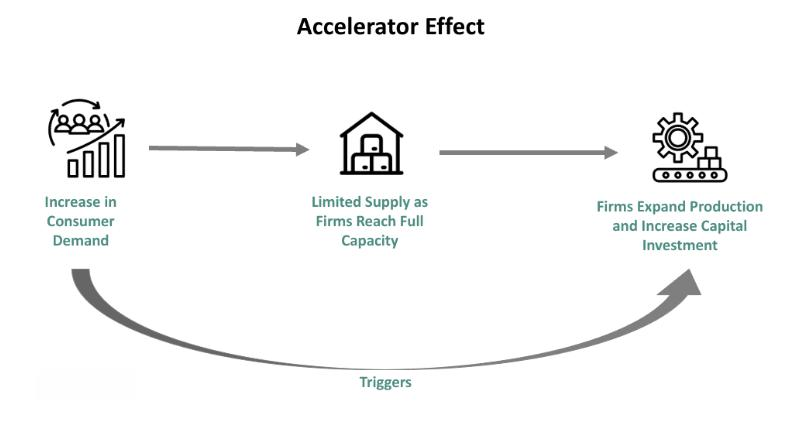

In the ever-evolving landscape of economic theories and financial strategies, understanding the principles that drive investment decisions is crucial for both individual investors and institutions. This article explores the intricate intersection of economics, investment theory, the acceleration principle, and algorithmic trading. These concepts are not just theoretical frameworks; they are dynamic forces shaping modern financial markets and guiding investment approaches.

Economics provides the foundational principles that influence financial decisions, offering insights into how markets operate and resources are allocated. Investment theory, on the other hand, offers a structured approach to understanding how investors allocate resources amid uncertainty, aiming to optimize returns while managing risk. The acceleration principle, a core element of economic thought, connects changes in consumer demand to fluctuations in capital investment, illustrating the cyclical nature of economic activities.



Algorithmic trading stands at the forefront of today's investment frontier, a technological marvel that executes trades based on pre-programmed strategies at unprecedented speeds and frequencies. This technology-driven approach has significantly transformed financial markets, increasing their efficiency and reducing susceptibility to human errors.

Through an in-depth analysis, this article will unravel how these theories and technologies influence one another, shaping the intricate web of investment decisions in today's volatile economic environment. By examining these connections, we aim to provide insights into the complexities and opportunities inherent in the contemporary financial ecosystem. Such understanding enables investors to navigate the complexities of modern markets with confidence, leveraging economic principles and technological advancements to make informed investment decisions.

## Table of Contents

## Understanding the Acceleration Principle in Economics

The acceleration principle is a key construct in economics, linked intricately with the dynamics of supply and demand. At its core, the principle posits a relationship between consumer demand and capital investment. This connection emerges through the observation that an upsurge in consumer demand for goods often prompts businesses to augment their production capacity by investing more in capital goods, such as machinery and infrastructure. Conversely, when there is a downturn in consumer demand, businesses frequently respond by significantly reducing their investment in capital resources. 

The acceleration principle provides insight into the transmission of effects from the consumer sectors to the business sectors across the economy. For instance, when demand for automobiles rises, car manufacturers may invest in additional production lines or upgrade their facilities to increase output, ultimately leading to a surge in orders for steel, rubber, and various components. This ripple effect showcases how changes in consumer demand extend beyond immediate industries to influence broader economic sectors, including suppliers and related industries.

Historically, the emergence and refinement of the acceleration principle have enhanced economic models by providing a deeper understanding of investment cycles. It aligns with the Keynesian economic thought which emphasizes aggregate demand as a principal driver of economic activity. The acceleration principle further refines this perspective by elucidating how changes in consumer demand amplify through investment adjustments, thus affecting employment, output, and economic growth.

In today's economy, the acceleration principle remains pertinent, particularly as businesses respond to rapidly shifting consumer patterns often driven by technological advancements and global market trends. Understanding this principle assists policymakers and business leaders in forecasting economic cycles and making informed strategic decisions to navigate fluctuations in consumer demand effectively.

## Investment Theory and the Accelerator Effect

Investment theory serves as a critical tool for understanding investor behavior and resource allocation, particularly in the context of the acceleration principle. At its core, investment theory examines how individuals and institutions allocate resources to maximize returns while managing risk. The [accelerator](/wiki/accelerator) effect, an integral component of this theory, proposes that changes in consumer demand trigger disproportionate shifts in investment spending. Essentially, a surge in consumer demand typically prompts businesses to increase their capital investments more than proportionally to meet rising production needs, while a decline in demand can result in substantial cutbacks in investment.

The interaction between investment theory and the accelerator effect significantly influences economic cycles. In periods of economic expansion, heightened consumer demand can lead to increased investment in capital goods, amplifying economic growth as firms expand their production capabilities. Conversely, during economic downturns, diminished demand often results in reduced investment, potentially deepening the contraction. This cyclical dynamic underscores the importance of understanding how demand fluctuations impact investment decisions at both macroeconomic and microeconomic levels.

On a macroeconomic level, the accelerator effect can magnify business cycle fluctuations. When consumer confidence is high, and disposable incomes rise, the increased demand can lead to significant investments in infrastructure, technology, and workforce expansion. This positive feedback loop can create a robust growth phase in the economy. However, if market expectations change and demand wanes, the resulting reduction in investment can exacerbate the downturn, making recovery efforts more challenging.

At a microeconomic level, firms respond to demand signals not only by adjusting their investment portfolios but also by adapting their strategic decision-making processes. Companies may focus on optimizing their capital structures and managing [liquidity](/wiki/liquidity-risk-premium) more effectively to weather demand fluctuations. Strategic investments in research and development, diversification, and technological innovation are also common approaches to sustaining growth and competitiveness during varying economic conditions.

The mathematical representation of the accelerator effect can be captured in a basic investment function: 
$$
I_t = e + d(Y_{t-1} - Y_{t-2})
$$
where $I_t$ represents investment at time $t$, $e$ is the autonomous investment not influenced by income changes, $d$ is the accelerator coefficient, and $Y_{t-1} - Y_{t-2}$ denotes the change in output or income levels over successive periods. This formula illustrates how changes in output can drive investment decisions within an economic cycle.

Overall, the interplay between investment theory and the accelerator effect is central to comprehending the dynamics of economic cycles. By recognizing these interactions, investors can better formulate strategies that consider potential demand shifts and their subsequent impact on investment opportunities. This strategic awareness enables more informed decision-making in both stable and volatile market environments, ultimately enhancing investment outcomes.

## Algorithmic Trading: The Modern Investment Frontier

Algorithmic trading, or algo trading, is revolutionizing the financial markets by employing sophisticated mathematical models and computer programs to [carry](/wiki/carry-trading) out trades at optimal speeds and frequencies. This method minimizes human error, increases market efficiency, and improves the precision of trade execution. 

At its core, [algorithmic trading](/wiki/algorithmic-trading) utilizes technology to capitalize on market inefficiencies and fluctuations quickly. This process is made possible through the integration of advanced computer algorithms that analyze vast datasets in real time, determining the best possible trading strategies based on market conditions. Such programs can evaluate a myriad of factors including price movements, trading [volume](/wiki/volume-trading-strategy), and market trends much faster than any human could.

Algorithmic trading also has significant implications when aligned with the economic concept of the acceleration principle. The acceleration principle postulates that an increase in demand for consumer goods leads to a larger increase in capital investment. This concept is leveraged in algo trading by automating responses to market shifts and changes in consumer demand. For instance, if data indicates a sudden increase in demand for a product, algorithms can quickly adjust investment strategies, reallocating resources to capitalize on the potential rise in stock prices of related companies.

In practice, suppose a trading algorithm is designed to monitor social media sentiment about a tech company. If positive sentiment spikes unexpectedly, indicating increased interest and potential consumer demand, the algorithm might instantly execute buy orders for shares of that company. Here's a simple Python example to illustrate a sentiment-based trading algorithm:

```python
import tweepy
from textblob import TextBlob

# Authentication details
consumer_key = 'your_consumer_key'
consumer_secret = 'your_consumer_secret'
access_token = 'your_access_token'
access_token_secret = 'your_access_token_secret'

# Setting up Twitter authentication
auth = tweepy.OAuthHandler(consumer_key, consumer_secret)
auth.set_access_token(access_token, access_token_secret)
api = tweepy.API(auth)

# Fetch tweets
public_tweets = api.search('TechCompany')

for tweet in public_tweets:
    analysis = TextBlob(tweet.text)
    # Simple sentiment analysis
    if analysis.sentiment.polarity > 0:
        # Execute buy order
        print("Positive sentiment detected: Executing buy order.")

```

This hypothetical algorithm, using sentiment analysis, evaluates and acts on market sentiment data, exemplifying how algorithmic trading applies economic theories like the acceleration principle for practical investment purposes.

In sum, algorithmic trading is paramount in modern finance, offering increased market efficiency and optimized investment strategies. It is a testament to how economic theories and cutting-edge technology harmonize in today's digital financial landscape.

## The Role of Technology in Investment Acceleration

Technology plays a crucial role in enabling data-driven investment decisions by applying economic principles in real-time, thereby accelerating investment processes. High-frequency trading ([HFT](/wiki/high-frequency-trading-strategies)) platforms, which execute numerous trades in fractions of a second, illustrate how technology has transformed trading by leveraging speed and precision. These platforms utilize sophisticated algorithms to analyze market data continuously, identifying trading opportunities and executing transactions at speeds unattainable by human traders. This technological advancement reduces latency in decision-making and enhances market efficiency by narrowing bid-ask spreads.

The use of complex algorithms and [artificial intelligence](/wiki/ai-artificial-intelligence) (AI) further exemplifies the intersection of technology and investment theory. AI models can predict market trends by processing vast amounts of historical and real-time data, identifying patterns not easily discernible through traditional analysis. This predictive capability allows investors to make informed decisions, balancing risks and expected returns more effectively. Machine learning, a subset of AI, also adapts to new data, continually refining its predictions and strategies for improved performance.

Python, a versatile programming language, is commonly used to implement these trading algorithms. Consider the following basic example of a Python script that could be used to automate a trade based on simple moving average (SMA) crossovers:

```python
import numpy as np
import pandas as pd

# Fetch historical data for a given stock
data = pd.read_csv('stock_data.csv')
prices = data['Close']

# Calculate simple moving averages
short_window = 40
long_window = 100

signals = pd.DataFrame(index=data.index)
signals['price'] = prices
signals['short_mavg'] = prices.rolling(window=short_window, min_periods=1, center=False).mean()
signals['long_mavg'] = prices.rolling(window=long_window, min_periods=1, center=False).mean()

# Generate buy/sell signals
signals['signal'] = 0.0
signals['signal'][short_window:] = np.where(signals['short_mavg'][short_window:] > signals['long_mavg'][short_window:], 1.0, 0.0)
signals['positions'] = signals['signal'].diff()

# Display generated signals
print(signals.tail())
```

This script demonstrates a basic algorithm capturing the essence of using technological tools for investment acceleration by generating automated buy and sell signals. 

Advancements in technology also influence market stability and investor behavior. As trading systems become more reliant on automated processes, market participants face heightened systemic risks, including potential for flash crashes — sudden, severe market downturns — caused by algorithmic errors or malfunctions. Regulators and market participants must balance the benefits of rapid, data-driven trading with the need to maintain robust safeguards against potential malfunctions.

Moreover, technological advances democratize investment opportunities by providing retail investors access to sophisticated analytical tools and platforms previously available only to institutional investors. This democratization fosters increased market participation but also raises concerns about the impact on market [volatility](/wiki/volatility-trading-strategies) and the potential for uninformed investments driven by automated advice lacking contextual analysis.

In summary, technology's integration into investment strategies facilitates faster and more precise decision-making processes, driving advancements in financial markets. However, it also necessitates careful management to ensure market integrity and stability amidst rapid technological changes.

## Future Trends in Investment Theory and Algo Trading

As technology continues to advance, the interplay between investment theory and algorithmic trading is poised to capitalize on cutting-edge developments in artificial intelligence (AI) and [machine learning](/wiki/machine-learning) (ML). These tools are increasingly being integrated into trading strategies, offering enhanced capabilities in predicting market trends and reacting dynamically to shifts in market conditions. 

AI and ML models excel in analyzing vast amounts of data to identify patterns that may not be immediately observable through traditional analysis. For instance, sentiment analysis can be performed by AI systems to gauge market sentiment from news articles, social media posts, and other forms of unstructured data. This powerful capability enables more informed decision-making, allowing traders to anticipate market movements based on public sentiment, thus optimizing trading strategies.

The integration of AI and ML in algorithmic trading is also expected to influence both traditional and emerging markets. In traditional markets, enhanced prediction models can lead to improved risk management and higher returns. These models can account for a wide range of variables and employ complex algorithms to assess potential outcomes and guide investment decisions.

In emerging markets, the use of AI and ML can aid in overcoming challenges such as limited historical data and market volatility. By leveraging these technologies, investors can better assess risks and opportunities, ensuring more robust investment strategies even in less stable environments. The adaptability of AI-driven models makes them particularly suitable for markets with high uncertainty.

Python, a popular programming language in the field of AI and algorithmic trading, provides a practical approach to developing such models. Here is a simple example showing how Python can be used to implement a basic ML model for predicting stock prices based on historical data:

```python
import numpy as np
import pandas as pd
from sklearn.model_selection import train_test_split
from sklearn.linear_model import LinearRegression
from sklearn.metrics import mean_squared_error

# Load historical stock data
data = pd.read_csv('historical_stock_data.csv')
features = data[['Open', 'High', 'Low', 'Volume']]
target = data['Close']

# Split data into training and test sets
X_train, X_test, y_train, y_test = train_test_split(features, target, test_size=0.2, random_state=42)

# Create and train the model
model = LinearRegression()
model.fit(X_train, y_train)

# Predict and evaluate
predictions = model.predict(X_test)
mse = mean_squared_error(y_test, predictions)
print(f'Mean Squared Error: {mse}')
```

This code snippet utilizes a linear regression model to predict stock prices. While simplistic, it illustrates the foundational concepts behind more sophisticated AI-driven models used in professional trading strategies.

Looking forward, the ongoing advancement in technology, particularly AI and ML, is expected to continue reshaping the investment landscape. This transformation promises to open up new investment opportunities while also presenting challenges related to ethical considerations, market regulation, and data privacy. As the financial industry navigates these changes, adaptability and continuous learning will be key to leveraging these technologies effectively. 

In conclusion, the future of investment theory and algorithmic trading is set to be profoundly shaped by technological advancements, offering novel avenues for achieving competitive advantages in both established and nascent markets.

## Conclusion

The convergence of economics, investment theory, the acceleration principle, and algorithmic trading provides a wide-ranging perspective on modern finance. By integrating these concepts, investors are better equipped to understand and navigate the complexities of financial markets. Economics provides the foundational principles that guide investment decisions, while investment theory offers a structured understanding of resource allocation influenced by factors such as consumer demand and investment cycles. The acceleration principle offers insights into how demand changes can impact investment levels, effectively linking macroeconomic shifts with microeconomic actions.

Algorithmic trading introduces a technological dimension that enhances the efficiency of market operations. By leveraging algorithms, investors can automate responses to dynamic market conditions, optimizing their strategies and minimizing human errors. This technically-driven approach underscores the importance of technology in modern finance and highlights the role of advancements like AI and machine learning in shaping future trends.

As the financial landscape continues to evolve, staying informed about these interconnections is essential for investors seeking to capitalize on emerging opportunities. By understanding the synergy between these economic principles and technological advancements, investors can better position themselves to respond to the nuances of financial markets. This exploration of how economic theories propel today's investment strategies serves as a foundational stepping stone for anyone aiming to further analyze the complexities of a rapidly transforming financial ecosystem.

## References & Further Reading

[1]: ["The Theory of Investment Value"](https://www.amazon.com/Theory-Investment-Contrary-Opinion-Library/dp/087034126X) by John Burr Williams

[2]: Blanchard, O. J. (1981). ["The Lucas Critique and the Supply Side: An Empirical Investigation."](https://books.google.com/books/about/Lectures_on_Macroeconomics.html?id=j_zs7htz9moC) National Bureau of Economic Research Working Paper Series.

[3]: ["Algorithmic Trading: Winning Strategies and Their Rationale"](https://www.wiley.com/en-us/Algorithmic+Trading%3A+Winning+Strategies+and+Their+Rationale-p-9781118460146) by Ernie Chan

[4]: Keynes, J. M. (1936). ["The General Theory of Employment, Interest, and Money."](https://www.files.ethz.ch/isn/125515/1366_KeynesTheoryofEmployment.pdf) 

[5]: ["High-Frequency Trading: A Practical Guide to Algorithmic Strategies and Trading Systems"](https://books.google.com/books/about/High_Frequency_Trading.html?id=6l0DDQAAQBAJ) by Irene Aldridge.