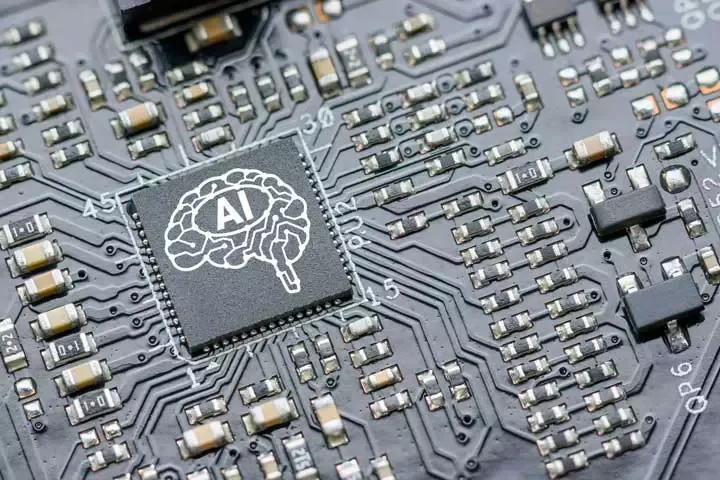

## Table of Contents

## What is an accelerator chip in the context of machine learning?

An accelerator chip in the context of machine learning is a special kind of computer chip designed to make machine learning tasks faster and more efficient. These chips are built to handle the heavy math and data processing that machine learning algorithms need. Instead of using regular computer chips, which can be slow for these tasks, accelerator chips are made to do the job much quicker. This means that things like training models or running them to make predictions can be done in less time.

A common type of accelerator chip used in machine learning is the GPU, or Graphics Processing Unit. Originally made for rendering graphics in video games and other visual applications, GPUs are very good at doing many calculations at the same time. This makes them perfect for the kind of parallel processing that machine learning requires. Another type of accelerator chip is the TPU, or Tensor Processing Unit, which is specifically designed by Google for machine learning tasks. TPUs are even more specialized and can make machine learning processes even faster than GPUs in some cases.

## How does an accelerator chip improve the performance of machine learning tasks?

An accelerator chip improves the performance of machine learning tasks by handling the complex math and data processing much faster than a regular computer chip. Machine learning involves a lot of calculations, like matrix multiplications and other operations, which can take a long time on a regular CPU. Accelerator chips, such as GPUs and TPUs, are designed to do these calculations much quicker. They can process many operations at the same time, which is called parallel processing. This means that tasks like training a machine learning model or making predictions with it can be done much faster.

For example, when training a neural network, the process involves updating the weights of the network through many iterations. This requires a lot of matrix multiplications, which can be slow on a CPU. But on an accelerator chip like a GPU, these multiplications can be done in parallel, speeding up the training process significantly. Similarly, when using a trained model to make predictions, the accelerator chip can handle the input data and produce results much faster than a regular CPU. This makes machine learning more efficient and allows for quicker experimentation and deployment of models.

## What are the key components of a typical machine learning accelerator chip?

A typical [machine learning](/wiki/machine-learning) [accelerator](/wiki/accelerator) chip has several key components that help it work well. One important part is the processing units, which can be many small cores designed to do calculations at the same time. These cores are good at doing things like matrix multiplications, which are very common in machine learning. Another key component is the memory, which needs to be fast and close to the processing units so data can be moved quickly. This is important because machine learning tasks often need to move a lot of data around.

Another component is the interconnect, which helps the different parts of the chip talk to each other. Good interconnects make sure that data can flow smoothly and that the chip can work as a team to get tasks done faster. Lastly, there are often special instructions or hardware features that are made just for machine learning. These can include things like support for certain math operations or ways to handle the special data types used in machine learning, like low-precision numbers. All these parts work together to make the chip good at speeding up machine learning tasks.

## Can you explain the difference between a CPU, GPU, and a dedicated machine learning accelerator chip?

A CPU, or Central Processing Unit, is like the brain of a computer. It's good at doing many different tasks, but it can only do a few things at the same time. When it comes to machine learning, CPUs can do the job, but they can be slow because they're not built for the kind of math that machine learning needs. A CPU has a few powerful cores that can handle different types of operations, but it's not great at doing a lot of the same kind of math at once, which is what machine learning often needs.

A GPU, or Graphics Processing Unit, is different because it's made to do many things at the same time. Originally used for making video games look good, GPUs have lots of smaller cores that can all work on the same type of math at once. This makes them really good for machine learning tasks, like doing matrix multiplications. For example, when training a [neural network](/wiki/neural-network), a GPU can do a lot of the calculations in parallel, making the process much faster than on a CPU. But GPUs are not just for machine learning; they're still used a lot for graphics and other tasks that need a lot of parallel processing.

A dedicated machine learning accelerator chip, like a TPU (Tensor Processing Unit), is made just for machine learning. These chips are even better at doing the specific types of math that machine learning needs. They have special hardware that's designed to handle the operations used in neural networks, like matrix multiplications and other calculations, very quickly. TPUs are not as flexible as CPUs or GPUs, but they can be much faster for machine learning tasks because they're so specialized. This makes them great for big machine learning projects where speed is really important.

## What are some popular machine learning accelerator chips available in the market?

Some popular machine learning accelerator chips are the NVIDIA GPUs, which are widely used because they are good at doing many calculations at the same time. NVIDIA's chips like the Tesla V100 and the newer A100 are very popular in the machine learning world. They are used for training big models and making predictions quickly. Another popular chip is the Google TPU, which is made just for machine learning. Google's TPUs are used in their data centers and can be accessed through their cloud services. They are very fast at doing the special math that machine learning needs, like matrix multiplications.

Another important chip is the AMD Radeon Instinct series, which are also GPUs but made by AMD. These chips are getting more popular for machine learning because they are powerful and can be a bit cheaper than NVIDIA's chips. The Radeon Instinct MI100 is one example that people use for training models. Lastly, there's the Habana Gaudi chip, made by Intel's Habana Labs. This chip is designed for [deep learning](/wiki/deep-learning) and can compete with NVIDIA and Google's chips. It's used by companies that need to train and run big machine learning models quickly.

## How do machine learning accelerator chips handle data parallelism and model parallelism?

Machine learning accelerator chips handle data parallelism by dividing the data that needs to be processed into smaller pieces and working on those pieces at the same time. Imagine you have a big pile of laundry to fold. Instead of folding one piece at a time, you could have many people folding different pieces at the same time. This is what data parallelism does. The chip has many small processing units, and each one can work on a different part of the data. For example, when training a neural network, the chip can process different parts of the training data in parallel, making the whole process much faster.

Model parallelism is a bit different. Instead of dividing the data, model parallelism divides the model itself into smaller parts. Think of a big puzzle that you need to solve. Instead of one person trying to put all the pieces together, you could have different people working on different sections of the puzzle at the same time. In machine learning, this means that different parts of the neural network can be processed on different parts of the chip. This is useful when the model is very big and won't fit into the memory of a single chip. By spreading the model across multiple chips or parts of a chip, you can still train and use the model efficiently.

## What are the energy efficiency considerations when using machine learning accelerator chips?

Machine learning accelerator chips are designed to do a lot of calculations quickly, but they also need to use energy efficiently. When we talk about energy efficiency, we mean how much work the chip can do with the energy it uses. Regular computer chips, like CPUs, can use a lot of energy for machine learning tasks because they are not built for the kind of math that machine learning needs. Accelerator chips, like GPUs and TPUs, are made to do this math better and faster, which often means they can do more work with less energy. This is important because using less energy saves money and is better for the environment.

For example, GPUs are good at doing many calculations at the same time, which makes them more energy efficient for machine learning than CPUs. TPUs are even more specialized and can be even more energy efficient because they are built just for machine learning tasks. But the energy efficiency can depend on the specific task and how the chip is used. Sometimes, using a lot of small chips together can be more efficient than using one big chip. It's a balance between getting the work done quickly and using as little energy as possible.

## How do machine learning accelerator chips integrate with existing software frameworks like TensorFlow or PyTorch?

Machine learning accelerator chips work well with software frameworks like TensorFlow and PyTorch because these frameworks are designed to take advantage of the chips' special abilities. For example, TensorFlow and PyTorch have special parts that can send the math work to the accelerator chips, like GPUs or TPUs. This means that when you write code to train a model or make predictions, the frameworks know how to use the chips to do the work faster. They do this by using special instructions that the chips understand, which helps the chips do their job better.

The integration happens through what's called an API, or Application Programming Interface. This is like a set of rules that lets the software talk to the hardware. For example, TensorFlow uses its own API to send work to TPUs, and PyTorch has its own way to talk to GPUs. This makes it easy for people who use these frameworks to use accelerator chips without having to learn a lot of new things. They can just write their code as usual, and the framework will take care of using the chips to make everything faster and more efficient.

## What are the latest advancements in machine learning accelerator chip technology?

The latest advancements in machine learning accelerator chip technology focus on making them faster, more energy-efficient, and better at handling the specific math that machine learning needs. One big advancement is the development of chips that can use lower-precision numbers for calculations. For example, instead of using 32-bit numbers, which take more memory and energy, these chips can use 8-bit or even 4-bit numbers. This makes the chips much faster and uses less energy because they can do more calculations with the same amount of memory and power. Companies like NVIDIA and Google are working on these kinds of chips, and they are showing big improvements in how quickly they can train and run machine learning models.

Another important advancement is the ability of these chips to handle bigger and more complex models. New chips are designed to work together in big groups, which is called scaling. This means that if one chip isn't enough to train a huge model, you can use many chips at the same time to get the job done. For example, NVIDIA's A100 GPU and Google's TPU v4 are made to work together in big systems, allowing them to handle models that are much bigger than before. These advancements make it possible to train and use very large models, like those used in big language models, much more quickly and efficiently.

## How can one evaluate the performance of different machine learning accelerator chips?

To evaluate the performance of different machine learning accelerator chips, you can look at several important things. One key thing is how fast the chip can do the math needed for machine learning, like matrix multiplications. This is often measured in FLOPS, which stands for Floating Point Operations Per Second. A chip with a higher FLOPS number can do more calculations in a second, making it faster for machine learning tasks. Another important thing to consider is how much energy the chip uses. A chip that uses less energy to do the same amount of work is more energy-efficient, which can save money and be better for the environment. You can also look at how well the chip works with software frameworks like TensorFlow or PyTorch, and how easy it is to use in your projects.

Another way to evaluate these chips is by looking at real-world benchmarks. These are tests that show how well the chip does on actual machine learning tasks, like training a neural network or making predictions. For example, you might run the same model on different chips and see which one finishes faster or uses less energy. Benchmarks can also show how well the chip handles different kinds of models, like big language models or image recognition models. By comparing these results, you can get a good idea of which chip is best for your specific needs. It's also important to think about the cost of the chip and whether it fits your budget, as well as any other features that might be important for your work, like how easy it is to set up and use.

## What are the future trends and potential developments in machine learning accelerator chip technology?

Future trends in machine learning accelerator chip technology will likely focus on making these chips even faster and more energy-efficient. One big trend is the use of lower-precision numbers for calculations. Instead of using 32-bit numbers, which take more memory and energy, future chips might use 8-bit or even 4-bit numbers. This makes the chips much faster because they can do more calculations with the same amount of memory and power. Companies like NVIDIA and Google are already working on these kinds of chips, and they are showing big improvements in how quickly they can train and run machine learning models. Another trend is the development of chips that can work together in big groups, called scaling. This means that if one chip isn't enough to train a huge model, you can use many chips at the same time to get the job done. This is important for handling very large models, like those used in big language models.

Another potential development is the integration of machine learning accelerator chips into more devices, like smartphones and IoT devices. As machine learning becomes more common in everyday life, having these chips in smaller devices could make them much more powerful and efficient. This would allow things like real-time image recognition or voice commands to work better on devices without needing to send data to a faraway server. Additionally, there might be new types of chips that can handle different kinds of machine learning tasks, not just the ones we use now. For example, chips that are good at handling sparse data, which is data with a lot of zeros, could become more common. This would be useful for certain types of models and could make them faster and more efficient. Overall, the future of machine learning accelerator chips looks bright, with many exciting possibilities for making machine learning faster, more energy-efficient, and more widely available.

## Can you discuss any case studies or real-world applications where machine learning accelerator chips have significantly impacted performance?

One real-world application where machine learning accelerator chips have made a big difference is in Google's use of TPUs for training large language models. Google's TPUs are special chips made just for machine learning, and they have been used to train models like BERT and other big language models much faster than before. Before TPUs, training these models could take weeks or even months on regular chips. With TPUs, Google was able to cut this time down to days or even hours. This meant they could experiment with different models more quickly and get better results faster. The impact of TPUs has been so big that Google now uses them in their data centers and offers them through their cloud services, helping many other companies and researchers speed up their machine learning work.

Another example is NVIDIA's GPUs being used by DeepMind for their AlphaGo project. AlphaGo is a computer program that plays the game Go, and it uses a lot of machine learning to get better at the game. Training AlphaGo on regular chips would have taken a very long time, but using NVIDIA's GPUs made the process much faster. The GPUs were able to handle the complex calculations needed for AlphaGo's neural networks, allowing DeepMind to train the model quickly and beat the world's best Go players. This showed how important machine learning accelerator chips can be for big projects that need a lot of computing power. It also helped show that these chips could be used for many different kinds of machine learning tasks, not just the ones they were originally made for.