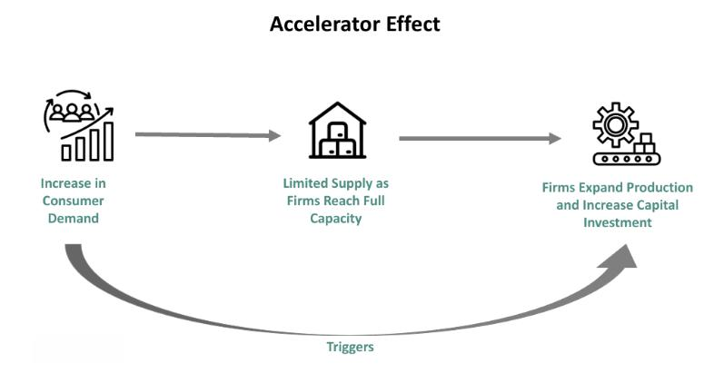

The accelerator theory is an essential component in the study of investment dynamics within economic frameworks. It provides a deeper understanding of how changes in national income can influence capital investment decisions. This article examines how the accelerator theory interconnects with broader economic theories, investment strategies, and the burgeoning field of algorithmic trading. By providing an overview of the accelerator theory, we aim to elucidate its role in formulating effective investment strategies that are responsive to economic fluctuations. Algorithmic trading systems, which execute trades based on computerized algorithms, often incorporate economic theories like the accelerator theory to enhance asset management and optimize trading decisions. These systems leverage historical and real-time economic data, adjusting to market conditions and improving the precision of investment strategies. In essence, this article seeks to offer comprehensive insights into how economic theories, particularly the accelerator theory, interact with modern technology to shape financial ecosystems and influence market activities.

## Table of Contents

## Understanding the Accelerator Theory

The accelerator theory is an influential concept within Keynesian economics, emphasizing the relationship between national income growth and capital investment. Initially developed by early economists like Thomas Nixon Carver and Albert Aftalion, the theory gained prominence through the work of John Maynard Keynes. It suggests that as national income increases, businesses anticipate higher demand for their products and services, leading to proportional increases in investment to expand capacity.

A fundamental aspect of the accelerator theory is its role as a catalyst for the multiplier effect. The basic premise is that an initial increase in demand not only raises consumption but also stimulates further investments. Investment decisions are often made with the expectation of maintaining or increasing production levels, thus creating a virtuous cycle of economic growth. For example, if a company experiences heightened demand for its products, it might invest in new machinery or technology to meet this rising demand, subsequently stimulating further economic activity and employment.

While the accelerator theory provides insight into investment dynamics, it is not without criticism. One notable limitation is its assumption of a direct and proportional relationship between demand changes and investment. In reality, businesses may face constraints such as excess capacity, which can dampen the anticipated increase in investment. Furthermore, the theory tends to overlook fluctuations in demand that are driven by external variables or market shocks, potentially leading to overinvestment or underinvestment in some sectors.

Despite these criticisms, understanding the accelerator theory remains vital for economic policy-making. Governments can use the insights derived from the theory to design effective stimulus measures, particularly during periods of economic downturn. By recognizing the interconnectedness of income, demand, and investment, policymakers can better target interventions that promote sustained economic growth.

The theory’s implications extend beyond policy into business strategy and financial planning. Companies actively monitor changes in economic indicators and national income to adjust their investment plans. This attention to demand shifts ensures that businesses can respond to market developments efficiently, maintaining competitiveness and profitability. Overall, the accelerator theory serves as a foundational concept for comprehending the intricate dynamics of investment and economic growth, offering valuable insights for both policymakers and business leaders.

## Application of Accelerator Theory in Investment

Investors leverage the [accelerator](/wiki/accelerator) theory as a tool to anticipate market dynamics by examining economic indicators such as Gross Domestic Product (GDP) and national income. The theory suggests that an increase in GDP or national income results in a proportional rise in investment in capital goods. This relationship is critical for making decisions about the timing and scale of investments in machinery, technology, and infrastructure.

In industries experiencing rapid growth, such as renewable energy, the accelerator effect is particularly evident. These industries often see swift increases in investment corresponding to rising demand for their products. As demand for renewable technologies such as solar panels or wind turbines escalates, companies invest in scaling production capabilities, illustrating the accelerator principle at work.

However, investors should be aware of the possible time lags inherent in investment projects. These lags may occur between the initial decision to invest and the realization of the returns, potentially affecting profitability and investment outcomes. The accelerator theory underscores the need for accurate timing and market forecasting to maximize investment returns.

Economic downturns pose another challenge within the framework of the accelerator theory. During periods of reduced national income or economic contraction, the accelerator theory predicts a decrease in investment. This is referred to as the negative accelerator effect and highlights the cyclical nature of economic activities. Investors must therefore consider not only the growth potential but also the risks associated with economic cycles when applying the accelerator theory in their strategies. This understanding aids in formulating resilient investment strategies that can weather varying market conditions.

## Algorithmic Trading and Economic Theories

Algorithmic trading employs sophisticated computer algorithms to facilitate the rapid execution of trading orders, leveraging advanced data analytics and insights from economic theories. At the core of these systems is the capability to process large volumes of market data instantly, thereby enabling traders to respond to market conditions faster than traditional methods allow. A significant advantage of [algorithmic trading](/wiki/algorithmic-trading) is the application of economic theories, such as the accelerator theory, to refine trading strategies and optimize investment portfolios.

Traders incorporate the accelerator theory within these algorithms to forecast short-term shifts in market demand. This theory suggests a direct correlation between increases in national income and capital investment, which can influence asset prices. By embedding this principle, algorithms can efficiently predict shifts in demand and adjust trading strategies to align with these movements. For instance, an anticipated rise in demand, as indicated by GDP growth or other economic indicators, may prompt algorithms to increase holdings in sectors likely to benefit from increased capital investment.

Economic indicators affected by the accelerator effect, such as national income levels or production increases, can serve as triggers for trading algorithms. When such indicators suggest potential growth or contraction, algorithmic systems can automatically execute buy or sell orders to enhance portfolio performance and mitigate risk. This proactive approach allows for optimizing investment portfolios by capitalizing on economic trends that traditional trading might miss.

Integrating economic theory into algorithmic trading advances provides tangible benefits in reducing transaction costs and enhancing decision-making efficiency. Sophisticated algorithms can process data and execute trades with minimal human intervention, reducing the impact of emotional biases on investment decisions. Moreover, these systems can consistently apply economic insights across varying market conditions, ensuring a disciplined approach to trading.

With continuous evolution, algorithmic systems adapt to new economic insights, integrating changes in accelerator dynamics and other economic developments. The adaptability of these systems is pivotal, as they must remain responsive to shifting market environments and emerging economic data. This requires ongoing algorithm refinement and an ability to incorporate new variables and indicators into their decision-making processes.

Overall, the intersection of algorithmic trading and economic theory, particularly the accelerator theory, exemplifies the convergence of technology and economics. By seamlessly incorporating economic insights into trading algorithms, these systems contribute to more efficient and informed market participation, paving the way for advanced investment strategies.

## Challenges and Criticisms

Critics argue that the accelerator theory, while pivotal in understanding investment dynamics, tends to oversimplify the intricate nature of economic interactions. One of the primary criticisms is its tendency to overlook other significant economic factors, such as price elasticity and external shocks, which can substantially alter market behaviors and outcomes. For instance, changes in consumer preferences or sudden geopolitical events can disrupt the assumed direct relationship between income changes and capital investment, challenging the theory's practical applicability in complex economic environments.

Similarly, algorithmic trading, though known for its efficiency, is not without its challenges. Market [volatility](/wiki/volatility-trading-strategies) often poses a significant risk. While algorithms are designed to capitalize on small price changes within milliseconds, abrupt market movements can lead to substantial losses if the algorithms are not equipped to manage such volatility. Additionally, there are ethical concerns regarding market manipulation. High-frequency trading, a subset of algorithmic trading, has been criticized for creating unfair advantages, as these systems can execute large numbers of orders before other investors can react, potentially destabilizing markets.

The rapid evolution of financial landscapes further fuels debate over the adequacy of traditional economic theories like the accelerator theory. These theories may not fully account for the complexities introduced by new financial products and technologies, raising questions about their relevance in contemporary markets. As financial markets become increasingly complex and globalized, the need for adaptive economic models that better reflect the dynamism of these environments becomes evident.

Algorithmic trading systems' reliance on historical data also presents limitations. While historical trends are valuable for projecting future market behaviors, they may not adequately predict unprecedented market events, such as financial crises or pandemics, which deviate from past patterns. This inherent limitation underscores the need for incorporating more dynamic and robust prediction models that can adapt to novel scenarios.

To overcome these challenges, future advancements in both economic modeling and trading systems should focus on integrating more adaptive and comprehensive frameworks. This might include the use of [machine learning](/wiki/machine-learning) techniques to develop models that evolve with market conditions, allowing for more accurate predictions and better risk management. By addressing these criticisms, economic theorists and technology developers can improve the tools available to investors, enhancing the robustness of financial markets.

## Conclusion

The intersection of accelerator theory, investment, and algorithmic trading highlights the synergy between economic theory and technological advancement. By understanding and applying the accelerator effect, which links increased economic activity to capital investment, investors and traders can more effectively navigate financial markets. This understanding aids in anticipating market trends and making informed investment decisions that align with economic indicators such as GDP growth and national income.

Algorithmic trading systems continue to evolve, integrating economic theories like the accelerator effect with sophisticated data analysis techniques to enhance trading strategies. These developments promise to further improve the efficiency of incorporating such theories into practical applications, optimizing portfolio management and trade execution.

However, this convergence is not without its challenges. Market volatility and the limitations of existing economic models necessitate ongoing innovation and learning. The ability to adapt to new information and integrate more dynamic economic models will be crucial for continuing to leverage these tools effectively.

Despite these challenges, the role of algorithmic trading in advancing our understanding of market dynamics is significant. As technology and economic theories coalesce, they offer valuable insights that can foster more robust investment strategies. Continuous adaptation and integration of emerging economic insights into trading systems will be key to maintaining a competitive edge in the ever-evolving economic landscape.

## References & Further Reading

[1]: Carver, T. N. (1903). "The Distribution of Wealth." Macmillan.

[2]: Aftalion, A. (1909). "Les Crises Périodiques de Surproduction." Ph.D. dissertation, University of Paris.

[3]: Keynes, J. M. (1936). "The General Theory of Employment, Interest and Money." Palgrave Macmillan.

[4]: Rajan, R. G., & Zingales, L. (1998). ["Financial Dependence and Growth."](https://www.jstor.org/stable/116849) The American Economic Review, 88(3), 559-586.

[5]: Chan, E. P. (2008). ["Quantitative Trading: How to Build Your Own Algorithmic Trading Business."](https://github.com/ftvision/quant_trading_echan_book) Wiley.

[6]: Jansen, S. (2020). ["Machine Learning for Algorithmic Trading."](https://github.com/stefan-jansen/machine-learning-for-trading) Packt Publishing.

[7]: De Prado, M. L. (2018). ["Advances in Financial Machine Learning."](https://books.google.com/books/about/Advances_in_Financial_Machine_Learning.html?id=oU9KDwAAQBAJ) Wiley.

[8]: Siegel, J. J. (2002). ["Stocks for the Long Run."](https://en.wikipedia.org/wiki/Stocks_for_the_Long_Run) McGraw-Hill Education.

[9]: Aronson, D. R. (2006). ["Evidence-Based Technical Analysis: Applying the Scientific Method and Statistical Inference to Trading Signals."](https://www.amazon.com/Evidence-Based-Technical-Analysis-Scientific-Statistical/dp/0470008741) Wiley.