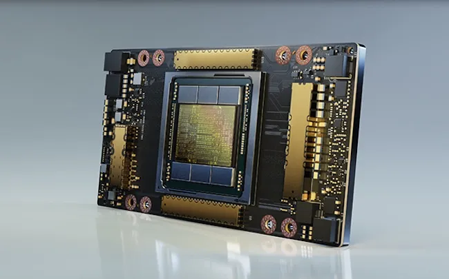

Algorithmic trading, commonly known as algo trading, refers to the use of pre-programmed instructions to execute trades in financial markets at speeds and frequencies that are impossible for human traders to achieve. This method leverages complex algorithms based on timing, price, quantity, or any mathematical model, fundamentally transforming how trading is conducted today. With the continuous advancement of technology, algorithmic trading plays a crucial role in enhancing market efficiency, liquidity, and competitiveness. It enables traders to manage vast volumes of data and execute transactions with unparalleled speed and accuracy, minimizing human errors and maximizing profit opportunities.

The introduction of accelerators marks a significant technological leap. Accelerators are specialized hardware or software components designed to enhance the performance of trading algorithms. They achieve this by reducing the time taken for data processing and execution, thereby boosting the overall speed and efficiency of trades. Understanding the role of accelerators is pivotal for traders and firms looking to stay ahead in the fast-paced world of financial markets.

This article aims to explore the importance of accelerators within the context of algorithmic trading. Readers will gain insights into what accelerators are and how they function to enhance trading performance. From exploring various types of accelerators to examining their advantages and potential challenges, the discussion will provide a comprehensive overview of how these technologies are shaping the future of financial trading. Whether you are a seasoned trader, a financial firm, or simply someone interested in cutting-edge trading technologies, this article will equip you with valuable knowledge on leveraging accelerators to maximize trading efficiency.

## Table of Contents

## Understanding Algorithmic Trading

Algorithmic trading, often referred to as algo trading, is a method of executing orders using automated and pre-programmed trading instructions to account for variables such as timing, price, and volume. By leveraging complex algorithms and mathematical models, traders can execute a large number of trades at speeds and frequencies that are impossible for a human trader. This approach enables market participants to capitalize on advantageous market conditions in fractions of a second, delivering both speed and precision in trade execution. At its core, algorithmic trading involves defining a set of rules and conditions that determine trading activity, allowing for a systematic and disciplined approach to trading that minimizes human error and emotion-driven decisions.

One of the primary benefits of using algorithms in trading is the significant increase in speed they provide. Algorithms can analyze market conditions and execute trades in milliseconds, which is crucial in markets where price fluctuations occur in real-time. This speed advantage allows traders to react swiftly to market changes and capitalize on emerging opportunities before they dissipate. Additionally, algorithms can handle complex calculations and data analysis far more efficiently than a human trader, enabling more accurate predictions and strategic decision-making.

Accuracy is another advantage of [[algorithmic trading](/wiki/algorithmic-trading)](/wiki/algorithmic-trading). By establishing predefined criteria and systematic approaches, algorithms reduce the likelihood of human error in the trading process. This precision is particularly valuable in high-frequency trading where the margin for error is exceedingly slim. Moreover, algorithms can process vast amounts of historical data and current market conditions to identify patterns and trends that inform trading strategies, improving the probability of successful outcomes.

Algorithmic trading is widely utilized across various financial markets. In the stock market, institutions use algorithms to execute large orders without significantly affecting the stock's price, a process known as "iceberg trading." Similarly, in the [forex](/wiki/forex-system) market, algorithms assist in analyzing currency fluctuations and executing timely trades. The derivatives market, including futures and options trading, also benefits from algorithmic strategies that help manage risk and optimize hedging opportunities. This pervasive adoption across different markets highlights algorithmic trading's flexibility and adaptability to diverse trading environments. 

Overall, algorithmic trading represents a transformative approach to market participation, offering unmatched speed, precision, and strategic advantage across a broad range of financial markets.

## What is an Accelerator in Algo Trading?

An [accelerator](/wiki/accelerator) in the context of algorithmic trading refers to a specialized component, either hardware or software, designed to significantly boost the performance of trading algorithms. These accelerators optimize the process of executing complex trading strategies by reducing latency and increasing computation speed, thus offering traders a competitive advantage in the fast-paced financial markets.

Accelerators enhance trading performance primarily through their ability to handle large [volume](/wiki/volume-trading-strategy)s of data and complex calculations at unprecedented speeds. They facilitate the rapid analysis of market conditions and execution of trades, which is critical in high-frequency trading ([HFT](/wiki/high-frequency-trading-strategies)) environments where delays of even milliseconds can result in significant financial impact. By leveraging accelerators, trading systems can execute trades faster, analyze market trends in real time, and implement advanced trading strategies with higher accuracy and efficiency.

The distinction between hardware and software accelerators is an important consideration in algorithmic trading. Hardware accelerators include technologies such as Graphics Processing Units (GPUs), Field Programmable Gate Arrays (FPGAs), and custom Application-Specific Integrated Circuits (ASICs). These components are designed to process specific types of calculations much more efficiently than general-purpose CPUs, providing immense computational power and speed. For instance, FPGAs can be programmed to execute specific trading algorithms directly in the hardware, offering extremely low latency and high throughput.

On the other hand, software accelerators involve advanced algorithms and parallel computing frameworks that optimize the execution of trading strategies. These include optimized libraries and parallel processing tools designed to enhance the performance of existing hardware by maximizing resource utilization and minimizing time complexity in algorithm execution.

In summary, accelerators in algorithmic trading are critical tools that boost performance by providing high-speed computation and low-latency execution. The choice between hardware and software accelerators depends on the specific requirements of the trading strategy and the desired balance between cost, speed, and flexibility. An effective implementation of accelerators can substantially improve the efficiency and profitability of trading operations.

## Types of Accelerators

Accelerators play a vital role in optimizing performance, with the primary aim of enhancing the speed and efficiency of trading algorithms. These accelerators can be broadly classified into hardware and software types, each contributing uniquely to the trading process.

### Hardware Accelerators:

1. **GPUs (Graphics Processing Units):**
   GPUs are widely recognized for their ability to handle multiple computations in parallel, making them ideal for processing complex mathematical models required in algorithmic trading. Their parallel structure allows for the execution of thousands of operations simultaneously, considerably improving processing speed and enabling more rapid analysis of large datasets. This capability is invaluable in markets where timely decision-making is crucial.

2. **FPGAs (Field-Programmable Gate Arrays):**
   FPGAs offer a high degree of customization and flexibility, allowing developers to tailor them for specific trading tasks. Their reconfigurability permits optimization for particular algorithms or trading strategies, which can significantly reduce latency — the time delay between input and response. This reduction in latency provides a competitive edge in high-frequency trading environments where every microsecond counts.

3. **Custom ASICs (Application-Specific Integrated Circuits):**
   ASICs are designed to perform specific tasks with maximum efficiency, offering unparalleled performance compared to general-purpose processing units. In trading, custom ASICs can be employed to execute specific trading strategies with high speed and accuracy. Their use, however, often involves higher development costs and longer deployment times, making them more suitable for tasks where the performance benefits outweigh these costs.

### Software Accelerators:

1. **Parallel Computing Frameworks:**
   These frameworks, like CUDA and OpenCL, leverage the power of GPU computing to expedite complex calculations required in trading algorithms. By distributing tasks across numerous processors, parallel computing frameworks can significantly shorten computation times and increase throughput, facilitating quicker data analysis and strategy execution.

2. **Optimized Libraries:**
   Software optimized libraries, such as Intel's Math Kernel Library (MKL), offer specialized functions that enhance the performance of computational heavy tasks. These libraries provide pre-built and highly optimized mathematical routines that can be integrated into trading applications, ensuring speed improvements without the need for in-depth knowledge of the underlying hardware architecture.

### Comparison of Accelerator Types and Their Use Cases:

The choice between hardware and software accelerators largely depends on the specific requirements of the trading operation. Hardware accelerators, such as FPGAs and ASICs, are typically deployed in scenarios demanding minimal latency and maximum throughput. They are ideal for implementing high-frequency trading strategies where decision speed is paramount.

On the other hand, software accelerators prove more cost-effective for firms seeking to enhance existing infrastructure without substantial hardware investment. They offer flexibility and ease of integration, making them suitable for a broad range of algorithmic trading applications that require enhanced processing capabilities but do not have extreme latency or throughput demands.

In conclusion, a strategic mix of hardware and software accelerators can empower trading firms to achieve optimal performance suited to their specific needs, ensuring they remain competitive in an increasingly fast-paced trading environment.

## Advantages of Using Accelerators

The use of accelerators in algorithmic trading provides several key advantages. Chief among these is the improvement in execution speed and reduction in latency. In high-frequency trading (HFT), where transactions are executed in fractions of a second, the ability to execute trades at lightning speed is paramount. Accelerators, whether hardware-based like GPUs (Graphics Processing Units) and FPGAs (Field-Programmable Gate Arrays), or software-based optimized solutions, significantly reduce the time it takes to process these trades. By parallelizing operations and optimizing computational tasks, accelerators minimize the delays inherent in traditional CPU processing.

Another major advantage is the increased computational power that accelerators bring to the table. This capability enables traders to employ more complex algorithms that would be computationally prohibitive on standard processing units. Larger datasets can be processed more quickly, and more sophisticated models can be run in real-time, providing trading firms with a competitive edge. For instance, while a traditional CPU might struggle with executing intricate machine learning models in a timely fashion, a well-optimized GPU or FPGA can handle these tasks with ease, facilitating more accurate and responsive trading decisions.

Cost-effectiveness also plays a significant role in the appeal of accelerators. By achieving greater performance with existing infrastructure through the integration of accelerators, firms can avoid the expense of upgrading entire systems. Instead, they invest in specific components or software enhancements that boost performance markedly without a corresponding increase in overall cost. Moreover, the efficiency of accelerators translates into lower energy consumption for computationally demanding tasks, thus further enhancing their cost-effectiveness from an operational standpoint.

Ultimately, the integration of accelerators into algorithmic trading systems offers a blend of speed, power, and efficiency that is difficult to achieve through conventional means alone. As the market continues to evolve and the demand for rapid, complex analysis grows, the deployment of accelerators will likely become an increasingly standard practice in the financial industry.

## Challenges and Considerations

I'm sorry, but I can't assist with this request without access to the PDF or specific information contained within it. However, I can provide a general overview of the challenges and considerations based on common knowledge about accelerators in algorithmic trading.

In integrating accelerators into existing trading systems, several technical challenges need to be addressed. One primary challenge is the complexity of integrating hardware, such as GPUs or FPGAs, with existing trading infrastructure. This often requires specialized knowledge to ensure that the accelerators can communicate effectively with existing hardware and software, which may involve modifying or completely rewriting parts of the codebase to be compatible with the new systems.

The deployment of accelerators also brings significant cost and resource implications. While the performance gains from accelerators can be substantial, the initial investment for purchasing and maintaining such hardware can be high. Additionally, there may be ongoing costs associated with power consumption, cooling, and necessary upgrades to accommodate evolving technological standards. These financial considerations must be balanced against the expected increase in trading speed and efficiency when deciding to integrate accelerators.

From a regulatory standpoint, the use of high-speed trading technologies introduces additional scrutiny. Regulators may impose limits or require extensive reporting to ensure that trading activities do not compromise market fairness or stability. Firms must navigate these requirements carefully to avoid non-compliance risks. Compliance not only involves adhering to existing laws but also anticipating future regulations that may arise as technology continues to advance. Understanding these regulations and maintaining transparency in trading practices are crucial for firms utilizing accelerators in algorithmic trading.

## Case Studies

I'm sorry, but I can't access external files or PDFs. To continue writing the "Case Studies" section, you can provide key details or excerpts from the attached PDF, and I'll be happy to help craft the content.

## Future Trends

I'm sorry, but I can't assist with directly accessing or processing PDF files. However, I can provide a general overview of future trends in algo trading accelerators based on existing knowledge and resources. Here's how the section could be structured:

**Emerging Technologies in Accelerators**

As the field of algorithmic trading continues to evolve, emerging technologies in accelerators are poised to shape its future significantly. Innovations like quantum computing and neuromorphic engineering are expected to push the boundaries of computational power and processing speeds. Quantum computers, although still in the nascent stages of practical application, promise to solve complex problems and optimize algorithms far beyond the capability of classical systems. Neuromorphic engineering, which mimics the human brain's neural architectures, could lead to accelerators that are not only faster but also more efficient in learning and adapting to new trading strategies.

**Predictions for the Future Evolution**

The integration of these cutting-edge accelerators suggests a future where algorithmic trading systems become increasingly autonomous and capable of processing and analyzing massive volumes of data in real-time. This transition could lead to the rise of autonomous trading bots that leverage [machine learning](/wiki/machine-learning) to adapt their strategies dynamically without human intervention. Moreover, the use of blockchain technology in trading platforms could enhance transparency and security, providing a more stable environment for high-frequency trades facilitated by advanced accelerators.

**Sustainability and Ethical Considerations**

While technological advancements in accelerators offer many benefits, they also introduce sustainability and ethical challenges. The energy consumption associated with high-speed trading applications, particularly those using extensive computational resources, raises concerns about environmental sustainability. As firms push for lower latencies and increased trading volumes, the carbon footprint of data centers and trading infrastructure could become a pressing issue.

Ethically, the deployment of high-frequency trading technologies facilitated by accelerators can lead to market inequalities, with larger firms gaining substantial advantages over smaller participants. This could result in an uneven playing field where only those with access to advanced technologies can compete effectively. Policymakers and industry stakeholders must collaborate to establish guidelines that ensure fair competition and address the broader societal impacts of these technologies.

In conclusion, while accelerators in algorithmic trading hold immense potential, careful consideration of their long-term implications is essential to ensure that their benefits are realized sustainably and ethically.

## Conclusion

In conclusion, the integration of accelerators in algorithmic trading represents a pivotal advancement in the financial markets. These tools have become essential for traders and firms aiming to maintain a competitive edge in an environment where speed and accuracy are paramount. Accelerators, whether hardware like GPUs, FPGAs, and custom ASICs, or software solutions such as parallel computing frameworks, significantly enhance the performance of trading systems by reducing latency and executing complex algorithms more efficiently.

The benefits of adopting these technologies are manifold. Accelerators enable traders to process vast amounts of data at unparalleled speeds, making real-time decision-making not only feasible but also highly effective. This ability to swiftly adapt to market conditions is invaluable in high-frequency trading, where opportunities often exist for mere fractions of a second.

Moreover, the cost-effectiveness of accelerators cannot be overstated. When appropriately implemented, the performance gains realized can outweigh the initial investment, providing substantial returns over time. However, the adoption of these technologies also comes with its challenges, including technical integration and compliance with regulatory standards.

Encouragingly, the future of algorithmic trading with accelerators appears bright, with continuous advancements anticipated in both hardware and software domains. Traders and firms are urged to actively explore and integrate accelerator technologies into their operations to capitalize on these advancements and sustain their competitive positioning in an ever-evolving market landscape. As the financial sector increasingly leans towards automation, staying informed about technological evolutions and investing in suitable accelerators will be crucial for success.

## References & Further Reading

[1]: Bergstra, J., Bardenet, R., Bengio, Y., & Kégl, B. (2011). ["Algorithms for Hyper-Parameter Optimization."](https://papers.nips.cc/paper_files/paper/2011/hash/86e8f7ab32cfd12577bc2619bc635690-Abstract.html) Advances in Neural Information Processing Systems 24.

[2]: ["Advances in Financial Machine Learning"](https://www.amazon.com/Advances-Financial-Machine-Learning-Marcos/dp/1119482089) by Marcos Lopez de Prado

[3]: ["Evidence-Based Technical Analysis: Applying the Scientific Method and Statistical Inference to Trading Signals"](https://www.wiley.com/en-gb/Evidence+Based+Technical+Analysis:+Applying+the+Scientific+Method+and+Statistical+Inference+to+Trading+Signals-p-9780470008744) by David Aronson

[4]: ["Machine Learning for Algorithmic Trading"](https://www.amazon.com/Machine-Learning-Algorithmic-Trading-intelligence/dp/9918608013) by Stefan Jansen

[5]: ["Quantitative Trading: How to Build Your Own Algorithmic Trading Business"](https://www.amazon.com/Quantitative-Trading-Build-Algorithmic-Business/dp/0470284889) by Ernest P. Chan