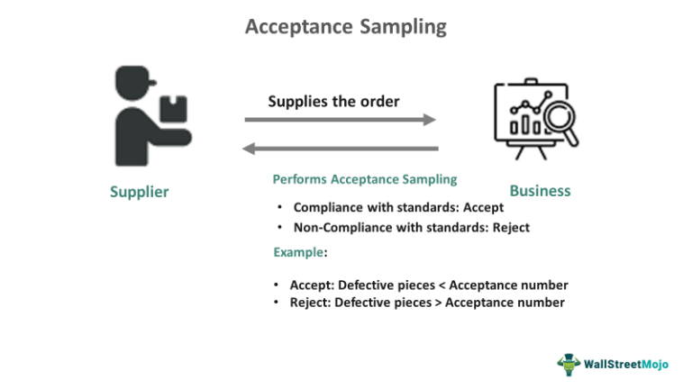

In the fast-evolving world of finance, understanding different market types and financial instruments is crucial for both seasoned investors and newcomers. Financial markets serve as the backbone of global economies, facilitating the exchange of goods, services, and financial assets. This article provides a comprehensive exploration of various market types and financial instruments, along with the increasingly important role of algorithmic trading in modern financial scenarios.

Market types can primarily be classified into physical, virtual, and specialized categories. Physical markets, the most traditional form, involve the direct buying and selling of goods, necessitating face-to-face interactions. With advancements in technology, virtual markets have come to the forefront, offering a platform where trading occurs online—thereby lowering barriers to entry and enabling global participation. Specialized markets, on the other hand, focus on distinct sectors such as commodities, finance, and housing, each governed by its specific dynamics and regulatory frameworks.



Financial instruments, namely stocks, bonds, and derivatives, are pivotal in market operations, each serving distinct purposes like capital raising or risk hedging. The diverse nature of these instruments necessitates a clear understanding of their attributes and associated risks to make informed investment choices.

The concept of acceptance markets emerges as a critical component in international trade, providing liquidity through short-term credit instruments. These markets facilitate smoother international trade by ensuring timely payments for exporters while allowing importers to defer payments until receipt of goods, all safeguarded by financial institutions that guarantee these transactions.

Algorithmic trading, or algo trading, stands as a revolutionary advancement, transforming the execution of trades through the use of computer programs that operate on pre-defined criteria. This technology minimizes emotional biases, enhances precision, and allows trades to be executed at high speed. With its profound market impact, algorithmic trading optimizes investment strategies and enhances market liquidity, altering the traditional trading paradigms.

In this rapidly changing environment, this guide aims to equip both seasoned traders and new investors with the necessary insights to navigate these complex terrains strategically. As technological advancements continue to reshape financial markets, understanding market types, financial instruments, and algorithmic trading becomes indispensable for optimizing trading strategies and achieving potentially enhanced returns.

## Table of Contents

## Understanding Market Types

Markets can be broadly categorized into three primary types: physical, virtual, and specialized markets. Each of these market types plays a distinct role in the exchange of goods and services, catering to different transaction methods and requirements.

1. **Physical Markets**: These are traditional markets where buying and selling occur face-to-face. Physical markets are characterized by direct interaction between buyers and sellers, often in defined locations such as marketplaces, shops, or trading floors. This market type is prevalent in sectors where tactile assessment of goods is essential, such as agriculture, art, and real estate. Despite the rise of technology, physical markets continue to hold significant value, especially in communities with limited digital infrastructure or for products where physical inspection before purchase is necessary.

2. **Virtual Markets**: Virtual markets have emerged as pivotal platforms facilitated by technological advancements. These markets enable transactions via online platforms, reducing geographical constraints and the barriers to entry for participants. Virtual markets are versatile and encompass various types of trade, from retail to financial instruments. They offer an unprecedented level of convenience and access, allowing users to participate in global markets from anywhere with internet access. The efficiency and reach of virtual markets are major drivers of e-commerce growth, financial trading, and even service-based sectors like education and healthcare.

3. **Specialized Markets**: These are designed to cater to particular sectors, including commodities, finance, and housing. Specialized markets often have unique dynamics and regulatory frameworks tailored to the specific needs of the sector. For example, commodities markets facilitate the trading of raw materials and primary products like oil, gold, and agricultural goods. Financial markets include stock exchanges and bond markets, where a range of financial instruments is traded. Housing markets focus on real estate transactions, requiring regulations to ensure fair practices and consumer protection. Specialized markets can provide depth and liquidity for specific asset classes, offering investors and participants tailored opportunities that align with their strategic goals.

Understanding these market types is crucial for recognizing how diverse economic activities are structured and operationalized. Each market type presents unique opportunities and challenges, shaped by technological, cultural, and regulatory influences. As these markets continue to evolve, stakeholders must adapt to the complexities inherent in each type to optimize their engagements and achieve desired outcomes.

## Financial Instruments in the Market

Financial instruments represent a spectrum of financial products used for various purposes within the markets. Primarily, these instruments can be categorized into equity instruments like stocks, debt instruments such as bonds, derivatives, and others including mutual funds and ETFs (Exchange-Traded Funds). Each of these instruments serves distinct roles, ranging from [capital raising](/wiki/hedge-fund-capital-raising) to risk management.

Stocks, representing equity instruments, are shares in the ownership of a corporation. They provide potential capital appreciation and, potentially, dividends. Investors in stocks are subject to market risks and must consider company performance, industry conditions, and broader economic factors in their decision-making.

Bonds, a form of debt instrument, serve as a means for entities to raise capital through borrowing. Bondholders are essentially creditors to the issuer and receive periodic interest payments, with the principal amount repaid at maturity. The risks associated with bonds include [interest rate](/wiki/interest-rate-trading-strategies) risk, credit risk, and reinvestment risk. The bond's yield, calculated as $\text{Yield} = \frac{\text{Annual Coupon Payment}}{\text{Current Market Price}}$, is an essential [factor](/wiki/factor-investing) in assessing its attractiveness.

Derivatives are financial contracts whose value is dependent on underlying assets such as stocks, bonds, commodities, or currencies. Common derivatives include options, futures, and swaps. These instruments are primarily used for hedging risks or for speculative purposes. For example, options provide the right, but not the obligation, to buy or sell an asset at a predetermined price by a certain date. The pricing of options can be estimated using models like the Black-Scholes formula: 
$$
C = S_0 N(d_1) - X e^{-rT} N(d_2)
$$
where $C$ is the call option price, $S_0$ is the current stock price, $X$ is the strike price, $r$ is the risk-free interest rate, $T$ is the time to expiration, and $N(d)$ represents the cumulative distribution function of the standard normal distribution.

Mutual funds and ETFs allow investors to pool their resources to invest in diversified portfolios of stocks, bonds, or other securities, making them suitable for individuals seeking diversification without directly managing individual investments.

Each financial instrument carries its unique set of risks and benefits. Understanding these attributes is crucial for investors to align their strategies with their risk tolerance and investment goals. For instance, while stocks offer higher growth potential, they come with greater [volatility](/wiki/volatility-trading-strategies) compared to bonds, which generally provide more stable but lower returns. Hence, informed investment decision-making necessitates a comprehensive analysis of each instrument's characteristics and market conditions.

## Acceptance Markets and Their Role

Acceptance markets play a significant role in facilitating international trade by providing [liquidity](/wiki/liquidity-risk-premium) through short-term credit instruments. These markets are essential for allowing exporters to receive payment without delay while enabling importers to defer their payments until goods are delivered. 

In practice, acceptance markets operate through the use of instruments such as bills of exchange and promissory notes, which are central to these financial arrangements. A bill of exchange is a written, unconditional order by one party (the drawer) directing another party (the drawee) to pay a specified sum to a third party (the payee) at a future date. When accepted by the drawee, it becomes a negotiable instrument. This acceptance is a commitment by the drawee to pay the amount on the due date, effectively creating credit.

By introducing these financial instruments into the trade process, acceptance markets provide immediate funding to exporters, enhancing their cash flows while granting importers the flexibility to manage their financial commitments. This dual benefit is crucial for maintaining the fluidity and efficiency of cross-border trade.

Financial institutions, particularly commercial banks, are critical in this ecosystem as they often act as intermediaries providing guarantees for these transactions. When a bank accepts a bill of exchange, it backs the obligation, thereby enhancing its credibility and liquidity. This guarantee reassures both parties—ensuring that exporters will be paid and importers can fulfill their obligations under more flexible terms.

The viability and trustworthiness of acceptance markets largely depend on the financial institutions involved. Their role in securing these transactions promotes a smoother operation within global trade, mitigating risks associated with defaults and payment uncertainties. As a result, acceptance markets are a backbone for businesses looking to expand their reach internationally, facilitating greater economic interconnectedness and growth. 

By lowering the barriers of uncertainty in payment, acceptance markets solve one of the critical challenges in international trade, enabling a more seamless exchange of goods and services across borders.

## Algorithmic Trading: An Overview

Algorithmic trading, commonly known as algo trading, employs computer programs to execute trading orders at speeds and frequencies that are impossible for human traders. By utilizing predefined criteria or algorithms, these systems can act decisively, reducing the influence of human emotions such as fear and greed, which often lead to irrational decision-making in financial markets.

The precision offered by [algorithmic trading](/wiki/algorithmic-trading) is one of its critical benefits. Algorithms can analyze vast amounts of data and process complex calculations quickly, ensuring that trades are executed with extreme accuracy. This precision allows traders to exploit even the slight price movements in the market, a feat unattainable through manual trading. Additionally, the high-speed nature of algo trading facilitates the execution of thousands of trades in seconds, capturing opportunities in fast-moving markets that would otherwise be missed.

The impact of algorithmic trading on the market is significant, as it optimizes investment strategies and enhances liquidity. By executing trades at lightning speed, algorithmic trading ensures that buy and sell orders are matched efficiently, leading to tighter bid-ask spreads and reducing transaction costs for all market participants. This increased market efficiency often results in more consistent pricing across financial markets.

Furthermore, algo trading allows for the implementation of sophisticated trading strategies, such as [arbitrage](/wiki/arbitrage) and trend-following, at scale. For instance, an arbitrage strategy in algo trading might involve simultaneously buying and selling an asset in different markets to exploit price discrepancies. Python can be used to implement such a strategy:

```python
def arbitrage_opportunity(prices_market1, prices_market2):
    """Detects and executes arbitrage opportunities."""
    for item in prices_market1:
        if item in prices_market2:
            price_diff = prices_market1[item] - prices_market2[item]
            if price_diff > threshold:
                # Execute buy in market2 and sell in market1
                execute_trade('buy', market='market2', asset=item)
                execute_trade('sell', market='market1', asset=item)
```

In summary, algorithmic trading revolutionizes trading by providing high-speed, precise execution of trades, optimizing market strategies, and enhancing liquidity, though it requires advanced technological infrastructure and regulatory oversight to manage potential risks effectively.

## Types of Algorithmic Trading Strategies

Algorithmic trading employs a range of strategies, each leveraging sophisticated algorithms to exploit market conditions and achieve specific objectives. Among these, trend-following, arbitrage, mean reversion, and high-frequency trading are prominent.

**Trend-following strategies** are designed to capitalize on the momentum of asset prices. These strategies operate on the principle that once a price trend is established—upwards or downwards—it is likely to continue for some time. This approach often involves the use of moving averages or other momentum indicators to identify and follow trends. For instance, a simple moving average crossover strategy might place a buy order when a shorter-term moving average crosses above a longer-term one, indicating a bullish trend. Conversely, a sell order might be triggered when the shorter-term average crosses below the longer-term average.

**Arbitrage strategies** exploit price discrepancies between identical or related financial instruments across different markets or exchanges. These strategies rely on the notion of market efficiency; in ideal markets, equivalent assets should trade at the same price. However, due to factors like market fragmentation or momentary inefficiencies, discrepancies can occur. An arbitrage algorithm might simultaneously buy a security in a market where it is undervalued and sell it in another where it is overvalued, capturing the price difference as profit. This requires rapid execution and precise calculation of transaction costs to ensure profitability.

**Mean reversion strategies** focus on the concept that asset prices and historical returns eventually move back toward the mean or average over time. These strategies involve identifying overbought or oversold conditions. For example, when the current price deviates significantly from its historical average, a mean reversion strategy might predict a reversal back towards this average, prompting trades accordingly. Statistical indicators, such as Bollinger Bands, are frequently used to assess mean reversion opportunities.

**High-frequency trading (HFT)** targets extremely small price movements. This strategy involves executing a large number of trades in fractions of a second to profit from tiny price changes. HFT algorithms operate under the assumption that smaller inefficiencies in the market that are too brief for human traders can still be exploited effectively by machines. Due to the sheer volume and rapid execution requirement, HFT demands high-speed connections and substantial computational resources, making it typically reserved for well-capitalized players like investment banks and hedge funds.

Each of these strategies requires algorithms finely tuned to specific market conditions and goals. Developing these algorithms involves extensive [backtesting](/wiki/backtesting) and optimization to ensure robust performance under various market scenarios. The selection among these strategies depends on factors such as market liquidity, volatility, regulatory considerations, and the trading entity's risk tolerance and capital adequacy.

## Advantages and Challenges of Algo Trading

Algorithmic trading, a method that employs computer programs to perform trading activities, offers several distinct advantages. Primarily, its speed and efficiency outpace traditional trading methods. Algorithms can process vast amounts of data in real-time, executing orders within milliseconds. This capability allows traders to capitalize on fleeting market opportunities that would be impossible to seize manually.

Another significant benefit is the reduction of human error. By automating the trading process, algorithmic systems diminish the impact of emotional and psychological biases, leading to more consistent and objective decision-making. This automation also enables trading to occur 24/7, taking advantage of different time zones and international markets, which facilitates continuous market engagement without fatigue.

However, algorithmic trading is not without its challenges. Technical failures, such as system outages or software bugs, can result in significant financial losses. To mitigate these risks, robust systems and protocols need to be in place to ensure reliability and efficiency.

Market impact is another concern. The large [volume](/wiki/volume-trading-strategy) of trades executed in a brief period can cause market volatility. Additionally, when multiple algorithmic systems react simultaneously to market events, this can exacerbate price movements and lead to "flash crashes."

Regulatory concerns also pose a challenge. As algorithmic trading becomes more prevalent, financial authorities enforce stricter regulations to ensure market integrity and protect investors. Compliance with these evolving regulations requires diligent oversight and adaptation by trading firms.

To address these challenges effectively, several measures are critical. A robust infrastructure tailored to handle high-frequency data and transactions is essential. Implementing comprehensive risk management strategies helps in overseeing and controlling the potential market impact. Ensuring the algorithms are well-designed reinforces the resilience against technical breakdowns. Adherence to regulations is imperative, necessitating systems that are flexible enough to adjust to new compliance demands.

In summary, while the advantages of algorithmic trading are significant, encompassing speed, precision, and 24-hour market access, the challenges must be managed meticulously. Improvements in infrastructure, algorithm design, and regulatory compliance are vital for the sustainable growth and successful execution of algorithmic trading strategies.

## The Future of Markets with Algorithmic Trading

The integration of AI and [machine learning](/wiki/machine-learning) is poised to significantly impact the future of algorithmic trading by enhancing the sophistication and adaptability of trading strategies. As these technologies advance, they enable the development of algorithms capable of learning from vast amounts of data, identifying complex patterns, and making autonomous decisions with increasing accuracy and speed. For instance, machine learning models, such as neural networks, can be trained to predict market trends by analyzing historical data, economic indicators, and even sentiment expressed on social media platforms.

AI-driven trading systems utilize advanced algorithms to process large datasets in real-time. This capability not only allows for the swift processing of information but also facilitates decision-making processes that are both rational and emotion-free. Furthermore, machine learning algorithms can continuously improve their performance by adapting to changing market conditions, thus ensuring that trading strategies remain robust over time.

However, the increasing reliance on AI and machine learning in algorithmic trading introduces new challenges, particularly concerning regulatory frameworks. Regulators are tasked with the complex challenge of balancing innovation with market stability. It is imperative to establish policies that encourage technological advancement while simultaneously protecting market integrity and preventing systemic risks. Addressing concerns around transparency, accountability, and ethical AI use will be crucial in shaping the future regulatory landscape.

Investors and traders must adapt to this rapidly changing environment by embracing data-driven strategies. Leveraging AI and machine learning not only improves decision-making processes but also enhances competitiveness in increasingly sophisticated markets. Staying informed about technological trends and continuously updating skill sets is vital for investors aiming to thrive in an AI-driven trading ecosystem.

In summary, the future of markets with algorithmic trading will be defined by the seamless integration of AI and machine learning, which promises to elevate trading efficiency and adaptability. By aligning technological advancements with thoughtful regulatory measures, the financial industry can harness the full potential of these innovations, thereby ensuring sustainable growth and stability.

## Conclusion

Understanding the complexities of market types, financial instruments, and algorithmic trading is crucial for optimizing trading strategies. The diversity of market structures, ranging from physical to virtual and specialized markets, underpins the dynamic nature of modern finance. Each type comes with unique characteristics and implicit regulatory nuances that traders and investors must navigate proficiently. Similarly, comprehensive knowledge of financial instruments — from equities and bonds to more intricate derivatives — equips traders with the ability to tailor strategies effectively to individual risk profiles and objectives.

Algorithmic trading emerges as a transformative force in today's financial markets. By using algorithms to execute trades based on pre-defined criteria, traders gain the benefits of speed, efficiency, and precision. The ability to analyze large data sets quickly and act upon actionable trading signals reduces human error and capitalizes on fleeting market opportunities. As global markets continue to evolve with technological advancements, remaining informed and adaptable is not just a strategic advantage but a necessity. Investors willing to embrace algorithmic insights and leverage advanced data analytics can potentially improve returns while refining risk management techniques.

To maintain a competitive edge in this ever-evolving landscape, market participants must continually update their knowledge and infrastructure to accommodate innovations in algorithmic trading. This requires not only an understanding of existing strategies but also the foresight to anticipate future trends and regulatory shifts. As technology continues to break new grounds, seizing these advancements allows investors to achieve greater operational efficiency and optimize portfolios for enhanced profitability. Ultimately, the fusion of technology and finance provides unprecedented opportunities for those who are prepared to harness its potential.

## References & Further Reading

[1]: Bergstra, J., Bardenet, R., Bengio, Y., & Kégl, B. (2011). ["Algorithms for Hyper-Parameter Optimization."](https://dl.acm.org/doi/10.5555/2986459.2986743) Advances in Neural Information Processing Systems 24.

[2]: ["Advances in Financial Machine Learning"](https://www.amazon.com/Advances-Financial-Machine-Learning-Marcos/dp/1119482089) by Marcos Lopez de Prado

[3]: ["Evidence-Based Technical Analysis: Applying the Scientific Method and Statistical Inference to Trading Signals"](https://www.amazon.com/Evidence-Based-Technical-Analysis-Scientific-Statistical/dp/0470008741) by David Aronson

[4]: ["Machine Learning for Algorithmic Trading"](https://github.com/stefan-jansen/machine-learning-for-trading) by Stefan Jansen

[5]: ["Quantitative Trading: How to Build Your Own Algorithmic Trading Business"](https://www.amazon.com/Quantitative-Trading-Build-Algorithmic-Business/dp/1119800064) by Ernest P. Chan