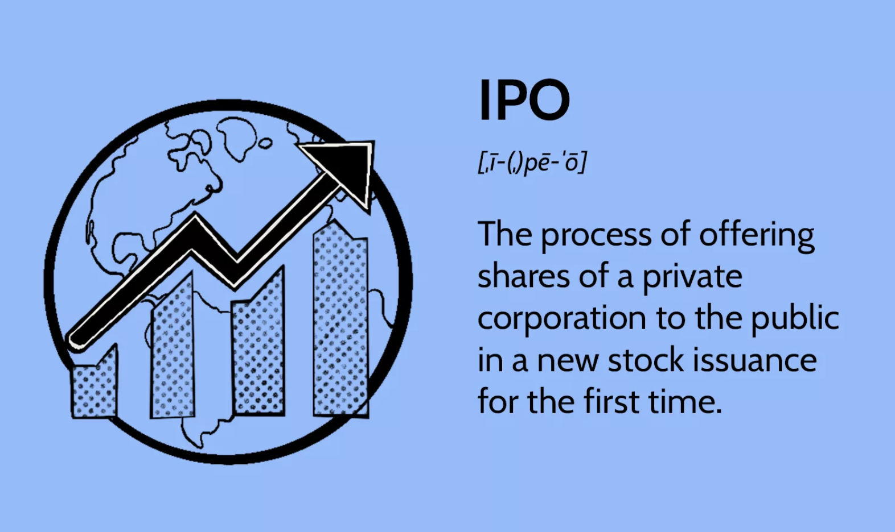

## Table of Contents

## What is a short sale in the context of an Initial Public Offering (IPO)?

A short sale in the context of an Initial Public Offering (IPO) happens when someone sells shares of a company that is going public before they actually own them. This is done by borrowing the shares from someone else, usually a broker, and then selling them at the IPO price. The person doing the short sale hopes that the stock price will go down after the IPO so they can buy the shares back at a lower price, return them to the lender, and make a profit from the difference.

However, short selling during an IPO can be risky. If the stock price goes up instead of down after the IPO, the person who did the short sale will have to buy the shares back at a higher price. This means they will lose money. Because of this risk, and because IPOs can be hard to predict, short selling during an IPO is not very common and is usually done by experienced investors.

## How does a short sale differ from a regular sale during an IPO?

In a regular sale during an IPO, an investor buys shares directly from the company at the IPO price and then owns those shares. They hope the stock price will go up so they can sell the shares later for a profit. It's a straightforward process where the investor is betting on the company's future success.

A short sale during an IPO is different because the investor doesn't actually own the shares they are selling. Instead, they borrow the shares from someone else, like a broker, and sell them at the IPO price. The goal of a short sale is to buy the shares back later at a lower price, return them to the lender, and keep the difference as profit. This is riskier because if the stock price goes up, the short seller will lose money when they have to buy back the shares at a higher price.

## What are the potential benefits of accepting short sales in IPOs for issuers?

Accepting short sales in IPOs can help issuers by making the market more active right after the IPO. When people do short sales, they are selling borrowed shares, which means more trading happens. More trading can make the stock price move more and attract more investors to buy the stock. This can be good for the issuer because it can make the stock more popular and help the company get more attention.

However, there are risks too. If too many people do short sales and the stock price goes down a lot, it might make other investors worried and less likely to buy the stock. But if the issuer thinks the stock price might go up after the IPO, having some short sales might not be a big problem. It's a way to balance the risk and reward, and it can help the issuer if everything goes well.

## What risks do short sales pose to the IPO process?

Short sales can make the IPO process riskier. When people do short sales, they sell borrowed shares hoping the price will go down. If a lot of people do this and the price does drop, it can scare away other investors. They might think the company is not doing well, and they might not want to buy the stock. This can make it hard for the company to raise money and could hurt the IPO.

On the other hand, if the stock price goes up after the IPO, the people who did short sales will have to buy the shares back at a higher price. This can cause a lot of buying, which might make the price go up even more. This can be good for the company, but it can also make the stock price move a lot, which can be confusing and risky for everyone involved. So, short sales can add a lot of uncertainty to the IPO process.

## How have regulatory bodies responded to short sales in IPOs?

Regulatory bodies have been careful about short sales during IPOs because they can cause problems. They want to make sure the stock market is fair and safe for everyone. In some countries, rules have been made to stop too many short sales from happening right after an IPO. These rules can include things like a waiting period before people can do short sales, or limits on how many shares can be sold short.

For example, in the United States, the Securities and Exchange Commission (SEC) has rules to protect the IPO process. They might watch closely for any strange trading patterns that could hurt the company or other investors. By doing this, they try to keep the IPO process smooth and fair. It's all about balancing the need for a lively market with the need to keep things stable and trustworthy.

## Can you provide examples of IPOs where short sales were accepted and their outcomes?

One example is the IPO of Facebook in 2012. Some investors did short sales right after the IPO. They thought the stock price was too high and would go down. At first, the stock did go down a lot, and people who did short sales made money. But after a few months, the stock started to go up again. This showed that short sales can make the stock price move a lot right after an IPO, but it doesn't always mean the company will do badly in the long run.

Another example is the IPO of Snap Inc., the company behind Snapchat, in 2017. There were also short sales during this IPO. Some investors thought the stock was overvalued and sold borrowed shares. The stock price did go down after the IPO, which was good for the short sellers. But like with Facebook, the stock price later went up over time. These examples show that short sales can cause a lot of ups and downs right after an IPO, but it's hard to predict what will happen to the stock price in the long run.

## What are the market conditions that favor the acceptance of short sales in IPOs?

Market conditions that favor the acceptance of short sales in IPOs often happen when investors think the stock price is too high. If a company's IPO price seems much higher than what people think the company is worth, some investors might want to do short sales. They think they can sell the shares at the high IPO price and then buy them back later at a lower price. This can happen if there's a lot of excitement about the IPO and the stock price goes up a lot right away.

Another condition is when the market is not sure about the company's future. If there are doubts about how well the company will do, more investors might try short sales. They believe the stock price will go down because of these doubts. This can make the market more active right after the IPO, as people trade more to try to make money from the price changes.

## How do investors typically react to the possibility of short sales in an IPO?

Investors often feel nervous when they know there might be short sales during an IPO. They worry that if many people do short sales, it could make the stock price go down a lot. This can scare them away from buying the stock because they don't want to lose money. So, the possibility of short sales can make investors more careful and less likely to jump into the IPO right away.

On the other hand, some investors might see short sales as a chance to make money. If they think the stock price is too high, they might do short sales themselves. They hope to sell the shares at the high IPO price and then buy them back later at a lower price. This can make the market more exciting and active right after the IPO, but it also adds more risk and uncertainty.

## What strategies can companies employ to manage the impact of short sales during their IPO?

Companies can use different strategies to handle the impact of short sales during their IPO. One way is to set the IPO price carefully. If the price is too high, more investors might want to do short sales because they think the price will go down. By setting a fair price that matches what the company is really worth, fewer people might try short sales. Another strategy is to talk to investors and tell them about the company's plans and why they should believe in its future. This can make investors feel more confident and less likely to do short sales.

Another thing companies can do is to work with their investment bankers to watch the market closely. If they see a lot of short sales happening, they can try to calm the market by releasing good news or updates about the company. This can help keep the stock price stable and reduce the chance of big drops. By being ready and knowing what to do, companies can manage the risks that come with short sales during their IPO.

## How does the acceptance of short sales in IPOs affect the long-term performance of the stock?

The acceptance of short sales in IPOs can make the stock price go up and down a lot right after the IPO. When people do short sales, they are betting that the stock price will go down. If a lot of people do this, it can scare other investors and make the stock price drop. But if the company is doing well and the stock price goes up later, the short sellers will have to buy the shares back at a higher price. This can make the stock price go up even more because of all the buying. So, short sales can cause a lot of excitement and movement in the stock price right after the IPO.

In the long run, though, the effect of short sales on the stock's performance depends more on how the company does. If the company keeps growing and making money, the stock price will likely go up over time, no matter what happened with short sales at the start. But if the company doesn't do well, the stock price might go down, and the early short sales might have been a sign that some investors saw problems coming. So, while short sales can make things exciting and risky right after the IPO, what really matters for the long-term performance of the stock is how the company does over time.

## What are the ethical considerations surrounding the use of short sales in IPOs?

Short sales in IPOs can raise some ethical questions. One big worry is that short sellers might be trying to make money by hurting the company's stock price. If a lot of people do short sales, it can make the stock price go down a lot right after the IPO. This can scare away other investors who might have wanted to buy the stock and help the company grow. Some people think it's not fair for short sellers to bet against the company like this, especially when the company is just starting out and trying to raise money.

On the other hand, some people believe that short sales can actually help the market. They say that short sellers are just doing their job by finding problems with the company that other investors might miss. If the stock price is too high, short sellers can help bring it down to a more fair level. This can make the market more honest and help investors make better choices. So, while short sales can be risky and make things exciting right after an IPO, they can also play an important role in keeping the market fair and balanced.

## How might future market trends influence the acceptance of short sales in IPOs?

Future market trends might make short sales in IPOs more common if people start to think that stock prices are too high. If there's a lot of excitement about new companies going public and their stock prices go up a lot right away, more investors might want to do short sales. They would hope to sell the shares at the high IPO price and then buy them back later at a lower price. This can happen if the market is doing well and people are feeling confident, but also if there's a lot of uncertainty about the future.

On the other hand, if the market gets more careful and worried about risks, people might do fewer short sales during IPOs. If investors are scared about the economy or think that new companies might not do well, they might not want to take the risk of short selling. This could make short sales less common. So, the future of short sales in IPOs will depend a lot on how people feel about the market and how much risk they are willing to take.

## References & Further Reading

[1]: ["Short Selling: Strategies, Risks, and Rewards"](https://www.wiley.com/en-us/Short+Selling%3A+Strategies%2C+Risks%2C+and+Rewards-p-9780471704331) by Frank J. Fabozzi

[2]: Gomber, P., & Haferkorn, M. (2015). ["Algorithmic Trading in Practice."](https://www.semanticscholar.org/paper/High-Frequency-Trading-Gomber-Haferkorn/abc039a3062247744e85451ec2bb8b8adfff3fc9) Encyclopedia of Operations Research and Management Science.

[3]: Lewis, M. (2015). ["Flash Boys: A Wall Street Revolt"](https://en.wikipedia.org/wiki/Flash_Boys) by Michael Lewis

[4]: Pascual, R., & Veredas, D. (2010). ["What pieces of limit order book information matter in explaining order choice by patient and impatient traders?"](https://www.semanticscholar.org/paper/What-pieces-of-limit-order-book-information-matter-Pascual-Veredas/27cd4011fdc31df2d19e76b6b9f8f9f5b0e26778). Journal of Financial Markets, 13(4), 501-520.

[5]: ["Algorithmic and High-Frequency Trading"](https://www.cambridge.org/us/universitypress/subjects/mathematics/mathematical-finance/algorithmic-and-high-frequency-trading) by Álvaro Cartea, Sebastián Jaimungal, and José Penalva

[6]: Ritter, J. R. (1987). ["The costs of going public."](https://www.sciencedirect.com/science/article/pii/0304405X87900055) Journal of Financial Economics, 19(2), 269-281.

[7]: Shkilko, A., & Sokolov, K. (2020). ["Every cloud has a silver lining: Fast trading, microwave connectivity and trading costs."](https://www.jstor.org/stable/45377926) Journal of Financial Economics, 136(2), 381-402.

[8]: ["The Little Book of Behavioral Investing"](https://www.amazon.com/Little-Book-Behavioral-Investing-worst/dp/0470686022) by James Montier

[9]: Gai, J., & Shi, Y. (2011). ["Is algorithmic trading magical?"](https://www.sciencedirect.com/science/article/pii/S2543925124000020) International Review of Financial Analysis, 20(2), 90-103.