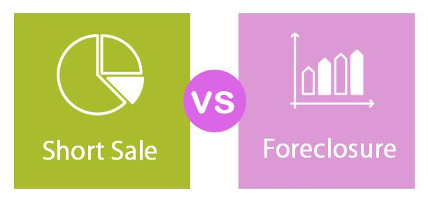

Financial markets serve as the backbone of global economic systems, providing platforms where financial instruments such as stocks, bonds, currencies, and derivatives are exchanged. They are essential for the efficient functioning of economies, enabling the allocation of resources, distribution of income, and facilitation of trade and investment. The mechanisms within these markets are diverse, evolving to include sophisticated instruments and strategies designed to manage risk, enhance returns, and leverage market dynamics.

The modern financial landscape is characterized by a growing interest in complex financial instruments and strategies. These include techniques such as short sales, where investors sell borrowed stocks in anticipation of buying them back at a lower price, thus capitalizing on expected declines in market value. Public offerings, particularly Initial Public Offerings (IPOs), represent another crucial aspect, allowing private companies to raise capital by offering shares to the public for the first time. Moreover, the advent of algorithmic trading has introduced a new era of trading, where pre-programmed computer algorithms execute trades at speeds and volumes impossible for human traders to match.

Each of these themes—short sales, public offerings, IPOs, and algorithmic trading—plays a significant role in either providing liquidity or impacting the volatility of financial markets. Understanding these complex concepts is imperative for investors and traders, enabling them to make informed decisions that align with their financial goals and risk appetites. This foundation is crucial not only for individual and institutional investors but also for regulators, who must craft policies that balance market innovation with stability.

As we explore these topics further, the nuances and implications of these market mechanisms will be unpacked. This exploration will shed light on how they influence investor behavior, market sentiments, and overall economic activity. Such understanding is vital in a financial climate that is continuously shaped by technological advances and evolving regulatory landscapes.

## Table of Contents

## Understanding Short Sales

Short selling is a sophisticated trading strategy used in financial markets involving the sale of a security that the seller does not own. This is typically achieved by borrowing the security from a broker and selling it on the open market with the intention of repurchasing it later at a lower price. The goal of short selling is to profit from a decline in the security's price. Short sellers believe that the price of the security will fall, allowing them to buy back the securities at a reduced rate, return the borrowed shares, and pocket the difference as profit.

### Reasons for Short Selling

Investors engage in short selling for various strategic reasons:

1. **Speculation**: Traders may speculate on the decline of a stock's price due to anticipated negative news or market trends that could lead to a price drop.

2. **Hedging**: Portfolio managers often use short selling as a hedging tool to protect against potential losses in their portfolios. By shorting stocks they believe might underperform, they can offset potential declines.

3. **Arbitrage**: In arbitrage strategies, traders might short a temporarily overpriced stock while buying a properly valued or underpriced stock in the same sector, thereby profiting from price corrections in both directions.

### Risks Associated with Short Selling

While short selling can be profitable, it carries substantial risks:

- **Market Volatility**: Unexpected market movements can lead to rapid price increases, causing significant losses for short sellers. This is known as a "short squeeze," where rising prices force short sellers to cover their positions at a loss.

- **Unlimited Losses**: Unlike traditional long positions where losses are limited to the initial investment, short selling can result in theoretically unlimited losses as there is no cap on how high a stock price can rise.

- **Regulatory Risks**: Regulators often impose restrictions on short selling during volatile market conditions, as seen during the 2008 financial crisis, potentially affecting trading strategies.

### High-Profile Short Selling Cases

Several high-profile short selling cases have demonstrated the potential impact and controversy surrounding this strategy:

- **GameStop (2021)**: In a frenzy of retail trading led by users of the subreddit r/WallStreetBets, GameStop's stock price soared, causing substantial losses for institutional investors holding short positions.

- **Enron (2001)**: Hedge fund managers, including Jim Chanos, famously shorted Enron before its bankruptcy, predicting the collapse of its accounting and business model. This case illustrates the potential for profit when thorough research and market insights align.

### Regulatory Frameworks

The regulatory environment for short selling varies by country and market:

- **United States**: The SEC regulates short selling through rules such as the "uptick rule," which restricts short selling to price increases, and requires short sellers to disclose large borrowing positions.

- **European Union**: Under the European Short Selling Regulation, short sellers are required to disclose significant short positions and adhere to temporary short selling bans during market downturns.

- **Asia**: Countries like Japan and Hong Kong have their own specific regulations, often requiring shorts to be marked and prohibiting "naked" short selling, where the seller does not ensure prior borrowing of the security.

In summary, while short selling can be a valuable tool for managing market exposure and leveraging market downturns, it is fraught with complexities and risks that necessitate a comprehensive understanding and diligent execution within regulatory bounds.

## Public Offerings: IPOs and Beyond

Public offerings represent a crucial mechanism by which companies raise capital to fund growth, repay debt, or meet other corporate needs. Going public typically involves offering securities to the public in the form of shares, allowing companies to access a broader pool of capital. The primary types of public offerings include Initial Public Offerings (IPOs) and Secondary Offerings.

An Initial Public Offering (IPO) occurs when a company offers its shares to the public for the first time. This process involves several steps, such as hiring underwriters, conducting due diligence, setting a price range for the shares, and marketing the offering through roadshows. The company aims to achieve several objectives through an IPO, including raising equity capital, enhancing visibility and prestige, and providing [liquidity](/wiki/liquidity-risk-premium) for existing shareholders.

Secondary Offerings, on the other hand, involve the sale of new or closely held shares after a company has already gone public. These offerings can either be non-dilutive or dilutive. Non-dilutive offerings occur when existing shareholders sell their shares, while dilutive offerings involve issuing new shares, which can impact existing shareholders by reducing their ownership percentage and potentially their share value.

Recent trends in the IPO space highlight a shift towards alternative methods, such as direct listings and Special Purpose Acquisition Companies (SPACs). Direct listings allow companies to go public without the need for underwriters, enabling a more cost-effective process. SPACs, also known as "blank check companies," raise capital through an IPO to acquire or merge with an existing company, providing a faster route to public markets.

The impact of public offerings extends beyond the immediate influx of capital. For existing shareholders, IPOs can unlock liquidity and offer an [exit](/wiki/exit-strategy) strategy. For the market, public offerings contribute to price discovery, increase market liquidity, and provide opportunities for investors to participate in a company’s growth story. However, they can also introduce [volatility](/wiki/volatility-trading-strategies), especially if the offerings do not meet market expectations.

In conclusion, understanding the intricacies of public offerings, particularly IPOs and secondary offerings, is essential for investors and companies alike. As market dynamics evolve, staying abreast of the latest trends and developments is crucial to navigating the complexities of going public effectively.

## Algorithmic Trading: The New Age of Trading

Algorithmic trading has revolutionized the way financial markets operate by using computer programs to execute trades based on predetermined criteria. Unlike traditional trading methods that rely heavily on human judgment and manual execution, [algorithmic trading](/wiki/algorithmic-trading) utilizes mathematical models and algorithms to determine the optimal timing, price, and quantity for trades. This approach allows for rapid decision-making and execution, often within milliseconds, which is crucial in today's fast-paced markets.

One of the primary advantages of algorithmic trading is its speed. Algorithms can process vast amounts of data and execute orders much quicker than human traders, capitalizing on fleeting market opportunities. Precision is another key benefit; algorithms can be programmed to follow specific strategies without deviation, reducing the risk of human error. This capability ensures that trades are executed at the best possible prices, enhancing profitability. Furthermore, algorithmic trading facilitates the implementation of complex strategies, such as statistical [arbitrage](/wiki/arbitrage) and high-frequency trading, which would be challenging to perform manually.

Despite its advantages, algorithmic trading presents potential disadvantages and ethical considerations. The reliance on technology makes it susceptible to technical failures, such as software bugs or server issues, which can lead to significant financial losses. Moreover, high-frequency trading, a subset of algorithmic trading, has been criticized for contributing to market volatility and creating an uneven playing field for slower, traditional investors. Ethical concerns also arise regarding the use of algorithms for market manipulation, such as spoofing or layering, where orders are placed with no intention of execution to mislead other traders.

The history of algorithmic trading dates back to the 1970s with the development of electronic communication networks (ECNs) that facilitated electronic trading. The 1980s and 1990s saw further advancements with the introduction of order management systems and [quantitative trading](/wiki/quantitative-trading) strategies. The proliferation of high-speed internet and improvements in computing power during the 2000s significantly accelerated the adoption of algorithmic trading.

Technology and data are central to the evolution and future of algorithmic trading. Advancements in [machine learning](/wiki/machine-learning) and [artificial intelligence](/wiki/ai-artificial-intelligence) enable the development of more sophisticated trading models that can adapt to changing market conditions. The increasing availability of big data, including [alternative data](/wiki/best-alternative-data) sources such as social media sentiment or satellite imagery, provides algorithms with more inputs to refine trading strategies. The integration of cloud computing allows for scalable and cost-effective computational resources, facilitating the widespread use of algorithmic trading across different market participants.

As financial markets continue to evolve, algorithmic trading is expected to play an increasingly prominent role. Innovations in fintech and regulatory technological advancements will likely shape the landscape, offering both opportunities and challenges for traders and investors. Understanding the intricacies of algorithmic trading and their impact on the broader market environment remains essential for staying competitive in the financial industry.

## Interconnections and Impact on Financial Markets

The interconnectedness of short selling, Initial Public Offerings (IPOs), and algorithmic trading is a significant aspect of the modern financial markets. Each mechanism influences and is influenced by market dynamics, shaping volatility, liquidity, and investor behavior. Understanding these interconnections is crucial for market participants and regulators.

### Combined Impact on Market Volatility and Liquidity

Short selling, IPOs, and algorithmic trading can individually and collectively influence market volatility and liquidity. Short selling, for instance, often increases market volatility due to speculative trading aimed at profiting from declining asset prices. When combined with algorithmic trading, which can execute large volumes of trade at high speed, the volatility could be exacerbated. Algorithmic trading strategies might also exploit short selling activities by identifying short squeezes or rapid cover rallies, further adding to market flux.

Conversely, both IPOs and algorithmic trading can enhance market liquidity. IPOs introduce new shares to the market, potentially increasing trading volumes. Algorithmic trading ensures efficient price discovery and narrows the bid-ask spread through high-frequency trading operations. However, the potential for negative feedback loops exists where high-frequency trades inadvertently trigger massive sell-offs during volatile periods.

### Case Studies of Market Events

Historical market events showcase how these elements interact. During the GameStop short squeeze in early 2021, retail traders coordinated to force a short squeeze on heavily shorted stocks, predominantly using platforms that facilitate algorithmic trades. This event highlighted how coordinated short selling and trading algorithms could lead to significant market turmoil.

The Facebook (now Meta Platforms) IPO in 2012 serves as another example. Market volatility was amplified due to a combination of factors, including technical glitches during trading initiation and algorithmic trading systems that struggled with the unforeseen delays, underscoring the vulnerabilities in technological infrastructure as well as the reactionary nature of algorithmic systems.

### Regulatory Challenges and Policy Needs

The convergence of these financial mechanisms poses regulatory challenges. Oversight is necessary to mitigate systemic risks arising from high-frequency trading and speculative short selling. Regulators, such as the Securities and Exchange Commission (SEC) in the U.S., have introduced circuit breakers to curb excessive volatility and protect market integrity. Moreover, regulators constantly adapt frameworks to manage the nuanced risks associated with IPO mispricing and manipulation by algorithmic trading.

Sound policies are required to balance innovation and risk management. For example, stricter disclosure requirements for short positions could enhance transparency, while a robust framework for algorithmic trading could focus on minimizing disruptive risks without stifling technological advancements.

### Future Trends and Innovations

Looking forward, the integration of machine learning and artificial intelligence in algorithmic trading is expected to further evolve, potentially enhancing predictive analytics and execution strategies. This could lead to more sophisticated risk management tools but will require regulatory bodies to remain vigilant against new forms of market manipulation.

Future IPOs may become more democratized, with emerging platforms enabling retail participation in public offerings once reserved for institutional investors. The rise of Special Purpose Acquisition Companies (SPACs) is already reshaping traditional IPO processes, providing more flexible public offering pathways.

In conclusion, the interplay of short sales, IPOs, and algorithmic trading reflects the complex nature of financial markets, stressing the need for informed participation and adaptive regulation to safeguard market stability and integrity.

## Conclusion

The exploration of key financial mechanisms—short sales, public offerings, and algorithmic trading—reveals their intricate roles in shaping market dynamics. Each plays a distinct yet interconnected part in influencing market behavior and investment strategies. Understanding these mechanisms is crucial for both investors and traders seeking to navigate the complexities of modern financial markets.

Short sales offer the potential for profit in declining markets, yet come with inherent risks such as market volatility and the potential for significant losses. This strategy requires a keen awareness of market conditions and regulatory frameworks that can vary across jurisdictions.

Public offerings, notably IPOs, serve as pivotal moments for companies, allowing them to raise capital and transition to public ownership. The IPO process influences market perceptions and shareholder value, highlighting the importance of strategic planning in timing and pricing offerings.

Algorithmic trading represents a transformative approach to trading, characterized by speed, precision, and automation. While offering advantages in terms of efficiency and reduced human error, it also presents challenges such as ethical considerations and potential impacts on market stability.

Staying informed about regulatory changes and market trends is essential. As regulation bodies continually adapt to the evolving landscape, investors and traders must remain vigilant to ensure compliance and optimize their strategies. The financial markets' evolution, driven by technological advancements, underscores the importance of adapting to new tools and methodologies in trading and investment.

Looking ahead, the landscape of financial markets will likely be shaped by continued innovation in technology. This includes the growth of artificial intelligence and machine learning in trading systems, which promises to refine algorithms further and enhance decision-making processes. Investors and traders must embrace these advancements to maintain a competitive edge and make informed decisions in a rapidly changing environment. The future of investing and trading will be characterized by a seamless integration of technology and strategy, emphasizing the need for continuous education and adaptation.

## References & Further Reading

[1]: ["Short Selling: Strategies, Risks, and Rewards"](https://www.wiley.com/en-us/Short+Selling%3A+Strategies%2C+Risks%2C+and+Rewards-p-9780471704331) by Frank J. Fabozzi

[2]: Gomber, P., & Haferkorn, M. (2015). ["Algorithmic Trading in Practice."](https://www.semanticscholar.org/paper/High-Frequency-Trading-Gomber-Haferkorn/abc039a3062247744e85451ec2bb8b8adfff3fc9) Encyclopedia of Operations Research and Management Science.

[3]: Lewis, M. (2015). ["Flash Boys: A Wall Street Revolt"](https://en.wikipedia.org/wiki/Flash_Boys) by Michael Lewis

[4]: Pascual, R., & Veredas, D. (2010). ["What pieces of limit order book information matter in explaining order choice by patient and impatient traders?"](https://www.semanticscholar.org/paper/What-pieces-of-limit-order-book-information-matter-Pascual-Veredas/27cd4011fdc31df2d19e76b6b9f8f9f5b0e26778). Journal of Financial Markets, 13(4), 501-520.

[5]: ["Algorithmic and High-Frequency Trading"](https://www.cambridge.org/us/universitypress/subjects/mathematics/mathematical-finance/algorithmic-and-high-frequency-trading) by Álvaro Cartea, Sebastián Jaimungal, and José Penalva

[6]: Ritter, J. R. (1987). ["The costs of going public."](https://www.sciencedirect.com/science/article/pii/0304405X87900055) Journal of Financial Economics, 19(2), 269-281.

[7]: Shkilko, A., & Sokolov, K. (2020). ["Every cloud has a silver lining: Fast trading, microwave connectivity and trading costs."](https://www.jstor.org/stable/45377926) Journal of Financial Economics, 136(2), 381-402.

[8]: ["The Little Book of Behavioral Investing"](https://www.amazon.com/Little-Book-Behavioral-Investing-worst/dp/0470686022) by James Montier

[9]: Gai, J., & Shi, Y. (2011). ["Is algorithmic trading magical?"](https://www.sciencedirect.com/science/article/pii/S2543925124000020) International Review of Financial Analysis, 20(2), 90-103.