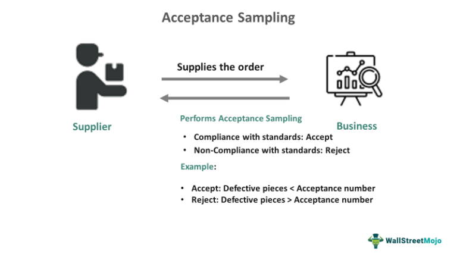

Software testing is a fundamental aspect of the software development lifecycle, encompassing a variety of testing phases designed to ensure that software products fulfill specified requirements and perform expected functionalities. Among these phases, acceptance testing stands out as a pivotal step that serves as the final validation checkpoint before a software product is launched into production. This critical phase helps validate that the software solution aligns with business objectives and meets user expectations by ensuring that the complete system behaves as intended in real-world scenarios.

Acceptance testing involves evaluating whether the software can support end-to-end business processes and meet the needs of its intended users. By doing so, it serves as a bridge between the development team and the users, confirming that the product is ready for the market. This process is especially crucial in domains that require high precision and compliance, such as algorithmic trading systems. In such contexts, acceptance testing not only ensures functional performance but also confirms adherence to regulatory standards and alignment with strategic business goals.



In the following article, we will explore the various types of acceptance testing, discuss their significance within the broader spectrum of software testing, and assess their specific contributions to sectors like algorithmic trading. By understanding the integral role of acceptance testing, stakeholders can ensure that software solutions effectively translate business strategies into successful, user-friendly applications that fulfill operational expectations and enhance overall satisfaction.

## Table of Contents

## What is Acceptance Testing?

Acceptance testing, also known as user acceptance testing (UAT), represents the final phase in the software testing process. It is a critical step where the software is validated by the intended audience under real-world conditions. This testing phase is designed to verify that the software’s end-to-end business flows function as expected in a live environment.

The primary objective of acceptance testing is to ensure that the software meets both user needs and business requirements. During this phase, users interact with the software in scenarios that mimic their typical operational environment. This phase is crucial for identifying discrepancies between the expected and actual performance of the application. User involvement is paramount as they are best positioned to assess whether the software truly meets their requirements and supports their operational tasks efficiently.

Acceptance testing serves as a bridge between the development phase and production deployment. By simulating real-life usage, it helps to identify any gaps in functionality that might have been overlooked during previous testing phases. It also ensures that all processes within the application work seamlessly together, providing confidence that the system will perform reliably post-launch.

In summary, acceptance testing is an essential checkpoint in software development, confirming that the application is ready to be deployed for use by the general audience, aligning closely with their needs and fulfilling business objectives.

## Types of Acceptance Testing

Acceptance testing serves as a critical checkpoint in the software development lifecycle, ensuring that the software product meets all predefined requirements before it goes live. This phase of testing includes various types, each addressing specific aspects of the product's functionality and usability.

User Acceptance Testing (UAT) is one of the most common forms of acceptance testing. This type involves real users assessing the product to ensure it can handle necessary tasks under real-world conditions. By simulating day-to-day user interactions, UAT verifies that the software is intuitive and user-friendly, thereby minimizing the risk of post-deployment issues related to user experience. 

Business Acceptance Testing (BAT) focuses on ensuring that the software aligns with the strategic objectives and operational processes of a business. It validates that the product supports all necessary workflows and tasks vital for the organization's success, filling the gap between technical specifications and business needs.

Contract and Regulation Testing ensures that the software complies with all legal, contractual, and regulatory requirements. This type of acceptance testing is crucial for preventing costly non-compliance issues and ensuring that the software adheres to all necessary standards, ranging from data protection laws to industry-specific regulations.

Operational Acceptance Testing (OAT) is the final check to confirm that the system is ready for production. This involves verifying aspects such as the stability, reliability, and operational performance of the software in a simulated production environment. OAT ensures the system’s smooth operation once it is deployed, covering elements such as backup, disaster recovery, and maintenance procedures.

By employing these diverse types of acceptance testing, organizations can ensure comprehensive evaluation and preparedness of their software products before launching them into production environments. This multi-faceted approach helps in identifying potential pitfalls early, thereby safeguarding both user satisfaction and business objectives.

## Acceptance Testing and Algo Trading

In [algorithmic trading](/wiki/algorithmic-trading), acceptance testing occupies a vital niche in guaranteeing that trading algorithms fulfill specified strategies and align with overarching business objectives. This involves rigorous validation processes which determine whether the algorithms can successfully operate under diverse market conditions prior to their live deployment. This is essential for practically deploying algorithmic strategies that translate theoretical profitability into real-world gain.

At its core, acceptance testing in this domain involves a series of simulations and stress tests. These are designed to emulate the [volatility](/wiki/volatility-trading-strategies), [liquidity](/wiki/liquidity-risk-premium), and price fluctuations typical of financial markets. The algorithms must be scrutinized for their responsiveness to these factors, ensuring they adhere to intended trading strategies and handle market stress while maintaining operational integrity. For instance, using historical data, algorithms are backtested to verify their performance consistency against past market conditions, which provides a baseline for future performance prediction. Python, with libraries such as `pandas`, `numpy`, and `[backtrader](/wiki/backtrader)`, is often employed to conduct these backtests:

```python
import backtrader as bt

class TestStrategy(bt.Strategy):
    def __init__(self):
        self.sma = bt.indicators.SimpleMovingAverage(self.data, period=15)

    def next(self):
        if self.data.close > self.sma:
            self.buy(size=100)
        elif self.data.close < self.sma:
            self.sell(size=100)

cerebro = bt.Cerebro()
cerebro.addstrategy(TestStrategy)
data = bt.feeds.YahooFinanceData(dataname='AAPL', fromdate=datetime(2022,1,1), todate=datetime(2022,12,31))
cerebro.adddata(data)
cerebro.run()
```

Moreover, compliance with regulatory constraints is a crucial aspect of acceptance testing in algorithmic trading. Algorithms must conform to regulations such as the Markets in Financial Instruments Directive II (MiFID II) or the Dodd-Frank Act, which mandate transparency, risk management, and limit controls. These constraints ensure that trading activities do not breach legal thresholds or ethical norms, which could cause severe financial and reputational damage.

Therefore, acceptance testing not only checks for functional correctness but also validates compliance, assuring that algorithms are equipped to meet regulatory and market demands effectively. This dual focus minimizes the risk of operational failures and optimizes the algorithm’s potential performance in a live trading environment.

## Advantages of Acceptance Testing

Acceptance testing offers significant advantages in software development by serving as a critical checkpoint before a product reaches the market. One of the primary benefits is the reduction in bugs identified prior to launch. By catching these issues early, organizations can substantially lower costs associated with fixing problems in a live environment. The expense of resolving defects post-launch tends to be much higher due to the complexity and potential impact on users and business operations. Studies indicate that the cost of a defect increases exponentially as it progresses through different stages of the software development lifecycle, with the highest costs incurred during post-production. Therefore, acceptance testing plays a pivotal role in minimizing these expenses by ensuring a higher quality product upon deployment.

Moreover, acceptance testing is instrumental in ensuring user satisfaction, as it validates the software against real-world use cases. This phase allows actual end-users or representatives to interact with the software in realistic conditions, providing feedback that reflects their true needs and expectations. By testing in such an environment, the likelihood that the final product will meet user requirements is significantly enhanced, leading to increased adoption rates and customer satisfaction. Users are more likely to embrace a product that functions smoothly and fulfills their requirements without requiring extensive modifications or workarounds.

In addition to technical and user-centric benefits, acceptance testing is crucial in aligning the final product with business and market demands. During this phase, the product is evaluated to ensure it meets strategic business goals and complies with market standards. This alignment is vital for the product’s success, as it ensures that the software not only operates correctly but also supports the organization's broader objectives. By confirming that the software fulfills these criteria, companies can better position themselves in the marketplace, responding effectively to competitive pressures and customer needs. Acceptance testing acts as a bridge between technical functionality and business objectives, ensuring that the software is not only operationally sound but also commercially viable.

## Challenges in Acceptance Testing

Acceptance testing, while crucial for ensuring software readiness, presents several challenges that can affect its efficacy. One of the primary challenges is accurately capturing user requirements. Users often struggle to articulate their requirements comprehensively. This miscommunication can result in features being overlooked during the development process, which may lead to dissatisfaction with the final software product. 

Another significant challenge is the coordination of tests involving large user bases. Managing diverse user groups, each with distinct needs and perspectives, can be labor-intensive and complex. This complexity is compounded in applications spread across various geographical locations or those requiring coordination between remote teams. The logistical challenges of bringing together diverse user groups for testing sessions can lead to delays and increased costs.

Feedback analysis from acceptance testing also poses a significant challenge. Users generate a vast amount of feedback that often contains conflicting opinions and priorities. Sifting through this data to extract valuable insights requires robust analytical techniques. Automated systems, like sentiment analysis, can help streamline this process, but these systems must be tailored to understand domain-specific nuances.

To manage these challenges, an organized approach is essential. Clear documentation and open communication channels can alleviate misunderstandings in user requirements. Employing skilled facilitators during testing can help bridge communication gaps between developers and users. Additionally, leveraging data analysis tools can provide structured methods to evaluate user feedback effectively, ensuring that only the most relevant insights guide future development stages.

## Conclusion

Acceptance testing plays a crucial role in the software testing lifecycle, ensuring that applications meet the required standards before they are deployed. It acts as a final verification step to confirm that a software product aligns with user expectations and fulfills all business requirements. By simulating real-world conditions, acceptance testing provides confidence that the software will perform effectively once released, thereby establishing a solid foundation for product launch.

In sectors like algorithmic trading, where precision and compliance are paramount, acceptance testing ensures that software solutions operate as intended and adhere to necessary regulations. These tests verify that trading algorithms execute properly under various market conditions. For instance, acceptance tests can simulate a range of trading environments to assess the algorithm's robustness and adaptability. Ensuring compliance with regulatory standards is critical, as algorithmic trading systems must adhere to strict legal criteria to prevent market manipulation and maintain financial integrity.

Furthermore, acceptance testing significantly mitigates the risks associated with operational failures by catching issues that could lead to costly errors if left unattended. For example, identifying bugs during this phase can prevent runtime failures, which are often more expensive to resolve after deployment. Through efficient validation processes, acceptance testing contributes to reduced post-deployment costs and enhances user satisfaction by delivering a reliable and user-friendly product.

Ultimately, acceptance testing is indispensable to software development. It ensures that the final product not only works as designed but also aligns with stakeholder expectations and legal requirements, thereby offering a well-rounded assurance of quality and performance.

## References & Further Reading

[1]: Bergstra, J., Bardenet, R., Bengio, Y., & Kégl, B. (2011). ["Algorithms for Hyper-Parameter Optimization."](https://dl.acm.org/doi/10.5555/2986459.2986743) Advances in Neural Information Processing Systems 24.

[2]: ["Advances in Financial Machine Learning"](https://www.amazon.com/Advances-Financial-Machine-Learning-Marcos/dp/1119482089) by Marcos Lopez de Prado.

[3]: ["Evidence-Based Technical Analysis: Applying the Scientific Method and Statistical Inference to Trading Signals"](https://www.amazon.com/Evidence-Based-Technical-Analysis-Scientific-Statistical/dp/0470008741) by David Aronson.

[4]: ["Machine Learning for Algorithmic Trading"](https://github.com/stefan-jansen/machine-learning-for-trading) by Stefan Jansen.

[5]: ["Quantitative Trading: How to Build Your Own Algorithmic Trading Business"](https://www.amazon.com/Quantitative-Trading-Build-Algorithmic-Business/dp/1119800064) by Ernest P. Chan.

[6]: Tufano, P. (2003). ["Financial innovation."](https://econpapers.repec.org/RePEc:eee:finchp:1-06) In The Handbook of the Economics of Finance.