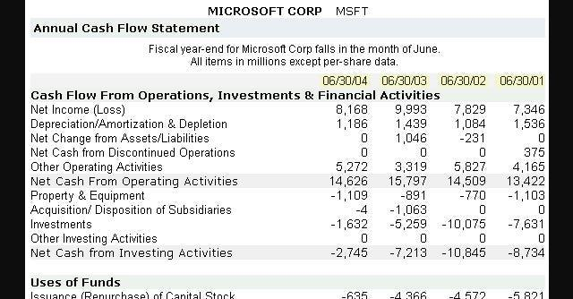

Annual reports are fundamental for understanding a company's financial health, offering a comprehensive overview of its performance and strategic direction. They serve as a primary tool for stakeholders, providing detailed insights into the fiscal activities and market position of a corporation. Key components of annual reports, such as financial statements and management analysis, offer crucial metrics and indicators that assist investors and analysts in evaluating a company's economic stability and growth potential.

In conjunction with annual reports, SEC filings play a vital role in promoting transparency and accountability within financial markets. Mandated by the U.S. Securities and Exchange Commission, these filings—including the 10-K, 10-Q, and 8-K—provide standardized financial information that ensures companies present an honest account of their financial status. This regulatory framework is designed to protect investors and maintain market integrity by enforcing consistent reporting standards across public companies.

Algorithmic trading represents a transformative shift in how financial markets operate, utilizing computer algorithms to execute trades based on predefined criteria. This method of trading is significant for investors because it offers enhanced speed, accuracy, and the ability to analyze vast datasets more efficiently than traditional trading practices. By integrating data from annual reports and SEC filings, algorithmic trading systems can react quickly to new information, thus optimizing trading strategies and potentially leading to better investment outcomes.

The objective of this article is to intertwine these elements—annual reports, SEC filings, and algorithmic trading—to provide a comprehensive understanding of how they collectively contribute to financial analysis and decision-making. As financial markets become increasingly digital, there is a growing reliance on sophisticated tools and algorithms to parse financial data, highlighting the necessity for investors to adapt to these technological advances to maintain a competitive edge.

## Table of Contents

## Understanding Annual Reports

Annual reports serve as comprehensive documents that provide a detailed overview of a company's financial health and operational performance for a given fiscal year. These reports are crucial tools not only for company management and shareholders but also for analysts, investors, and regulators who assess a company's market position, profitability, and future prospects.

### Definition and Purpose
An annual report is a publication issued by a company to its shareholders and other interested parties. Its primary purpose is to provide an accurate and fair view of the company's financial performance and condition over the past year. According to accounting standards and legal requirements, companies listed on stock exchanges are obligated to produce annual reports, ensuring transparency and accountability to investors.

### Components of an Annual Report
An annual report typically comprises several key components, which can include the following:

1. **Financial Statements**: These are the backbone of the report, consisting of the balance sheet, income statement, and cash flow statement. They provide numerical data on a company's financial transactions, including assets and liabilities, revenues and expenses, and cash movements.

2. **Management Discussion and Analysis (MD&A)**: This section offers management's perspective on the financial results, discussing operational and strategic issues that impacted the company's performance. It may include analysis of trends, risks, and future outlook.

3. **Corporate Governance Information**: This part outlines how the company is structured and managed, including information on the Board of Directors, executive compensation, and corporate governance practices.

4. **Notes to Financial Statements**: These notes provide additional detail on the numbers reported in the financial statements, explaining accounting policies, significant transactions, and potential uncertainties.

5. **Auditor's Report**: An independent auditor provides an opinion on whether the financial statements present a true and fair view of the company's financial position in accordance with relevant accounting standards.

### Importance for Stakeholders
Annual reports are vital for various stakeholders. Investors and analysts rely on these reports to evaluate the company's financial health and make informed investment decisions. They also look at growth trends, profitability ratios, and risk factors discussed in the reports. Regulatory bodies use them to ensure compliance with financial reporting standards and to maintain market integrity.

### Key Metrics and Indicators
When assessing annual reports, stakeholders focus on several metrics and indicators:

- **Earnings Per Share (EPS)**: A measure of the company's profitability on a per-share basis.
- **Return on Equity (ROE)**: Indicates how effectively management is using the company's assets to create profits.
- **Debt-to-Equity Ratio**: Provides insight into the company's financial leverage and stability.
- **Revenue Growth**: A critical indicator of the company's market demand and potential scalability.

### Access and Interpretation
Annual reports are usually accessible via a company's official website under the investor relations section. For companies listed in the U.S., they can also be found on the Securities and Exchange Commission (SEC) EDGAR database. When interpreting these reports, it is important for readers to have familiarity with accounting principles, financial metrics, and industry-specific factors that might influence financial performance.

By understanding the structure and content of annual reports, stakeholders can make more informed decisions regarding investments, regulatory scrutiny, and corporate strategy.

## The Role of SEC Filings in Financial Transparency

The U.S. Securities and Exchange Commission (SEC) serves a pivotal role in regulating the securities industry, protecting investors, and ensuring the fair functioning of the financial markets. Established in 1934, the SEC's mission is to maintain market integrity and facilitate capital formation, primarily by enforcing securities laws and requiring public companies to disclose meaningful financial and other information to the public. By mandating comprehensive disclosure through various filings, the SEC helps create a level playing field for all investors, enabling them to make informed decisions based on a company's financial health and business operations.

### Types of SEC Filings and Their Relevance to Financial Analysis

Several types of SEC filings are critical for financial analysis, each serving distinct purposes:

1. **10-K**: This is an annual report that provides a comprehensive summary of a company's financial performance. It includes audited financial statements, a management discussion and analysis (MD&A) section, and comprehensive descriptions of the company's business strategy and risk factors. The 10-K is crucial for investors and analysts as it provides a detailed and accurate depiction of a company's fiscal year performance.

2. **10-Q**: Filed quarterly, the 10-Q reports financial performance over the quarter and offers an ongoing view of a company's financial position. Unlike the 10-K, the financial statements in a 10-Q are generally unaudited, but it still serves as a vital document for tracking a company’s quarterly earnings and other key metrics.

3. **8-K**: This form reports unscheduled material events or corporate changes of importance to the shareholders. Examples include earnings announcements, acquisitions, disposals, and other significant events. An 8-K is essential for investors to stay updated on developments that could affect a company's stock performance.

### Importance of SEC Filings for Corporate Transparency and Investor Protection

SEC filings ensure corporate transparency by requiring companies to disclose pertinent information that may affect stock valuation and investment decisions. This transparency protects investors and fosters trust in the markets. The mandatory nature of these filings acts as a safeguard against fraudulent activities and misleading financial practices, thus serving as a cornerstone for investor protection.

### Utilization of SEC Filings by Investors and Analysts

Investors and analysts rely on SEC filings for comprehensive insights into the financial health and operational conditions of companies. By scrutinizing these documents, stakeholders can evaluate critical financial metrics, judge the effectiveness of management strategies, and assess potential investment risks. The data within SEC filings can be used to compute financial ratios, analyze trends, and benchmark against industry peers, aiding in sound investment decision-making.

### Recent Trends and Changes in SEC Filing Requirements

Over recent years, there have been significant changes in SEC filing requirements aimed at enhancing financial transparency and adapting to technological advancements. The SEC has been moving towards more accessible electronic filing systems like the EDGAR database, making it easier for investors and analysts to retrieve and analyze financial data. There have also been updates concerning disclosures about cybersecurity risks, climate-related risks, and executive compensation aimed at giving investors a holistic view of a company's risks and operations.

Additionally, the SEC is focused on improving data quality and accuracy by mandating the use of Inline XBRL (eXtensible Business Reporting Language) for certain filing requirements, which enhances the readability and usability of financial data. This shift towards structured data formats facilitates more effective data analysis and comparison across companies and time periods, promoting better investment decisions.

In summary, SEC filings are indispensable tools for ensuring transparency, protecting investors, and maintaining fair and informed financial markets. As regulatory frameworks evolve and technology advances, these filings will continue to be integral to comprehensive financial analysis and market integrity.

## Algorithmic Trading: Revolutionizing Financial Analysis

Algorithmic trading, often dubbed as "algo-trading," is a process that utilizes computer algorithms to automate the execution of trading orders. This automation is based on a set of predetermined criteria such as timing, price, or quantity. Algo-trading has become increasingly significant in financial markets due to its ability to process large datasets rapidly and execute trades with high precision and speed.

**Advantages of Using Algorithms for Trading and Data Analysis**

The core advantage of [algorithmic trading](/wiki/algorithmic-trading) lies in its ability to process and analyze vast amounts of financial data much faster than human capabilities allow. This leads to several benefits:

1. **Speed and Efficiency**: Algorithms can execute orders in fractions of a second, significantly faster than manual trading. This speed allows traders to capitalize on small price discrepancies quickly.

2. **Data Processing and Analysis**: Algorithms can analyze complex datasets from various sources, identifying patterns or trends that might be invisible to the human eye.

3. **Reduced Human Error**: By automating trades, algorithmic trading minimizes the risk of human error, which can lead to costly mistakes.

4. **Cost Reduction and Scalability**: Automated trading reduces transaction costs and allows scalability, handling large volumes with ease.

**Leveraging Data from Annual Reports and SEC Filings**

Algorithmic trading models often incorporate data from company annual reports and SEC filings. These documents contain crucial financial metrics and disclosures that algorithms can parse and analyze to forecast stock prices or assess company performance. By integrating such data, algorithms enhance their predictive accuracy and adapt swiftly to new information. For example, parsing an SEC 10-K filing for metrics like earnings per share (EPS) or revenue growth can inform trading decisions in anticipation of market reactions.

**Impacts on Market Efficiency and Investor Strategy**

Algorithmic trading has contributed to increased market efficiency by narrowing bid-ask spreads and providing [liquidity](/wiki/liquidity-risk-premium). These efficiencies benefit all market participants, from individual investors to large institutions. For investors, algorithm-driven strategies redefine traditional approaches, enabling hedge funds and investment firms to adopt complex strategies like statistical [arbitrage](/wiki/arbitrage), market-making, and trend-following.

**Challenges and Risks Associated with Algorithmic Trading**

Despite its advantages, algorithmic trading poses certain challenges and risks:

1. **Market Volatility**: High-frequency trading (HFT), a subset of algorithmic trading, can exacerbate market volatility, as seen in events like the "Flash Crash" of 2010.

2. **Systemic Risk**: The interconnectedness of algorithmic systems means that failures or bugs can lead to widespread financial instability.

3. **Regulatory Challenges**: Ensuring that trading algorithms comply with regulations poses a significant challenge, especially given the rapid evolution of trading technologies.

4. **Ethical Concerns**: The opacity of certain algorithm-driven strategies raises ethical questions about fairness and transparency in market operations.

In conclusion, algorithmic trading has revolutionized financial analysis by providing tools that enhance speed, efficiency, and precision in trading. While these advancements offer substantial benefits, they also introduce a set of challenges that market participants and regulators must address to ensure a stable and fair trading environment.

## Interconnection between Financial Reporting and Algorithmic Trading

Company financials and regulatory filings, such as annual reports and SEC filings, are integral to the development of trading algorithms used in algorithmic trading. These documents provide critical data points that can be processed computationally to identify trading signals, assess financial health, and predict market movements. The integration of this data into trading models enhances the accuracy and relevance of algorithmic trading strategies.

### Case Studies: Integration of SEC Data into Trading Models

Several case studies illustrate the successful incorporation of SEC data into trading algorithms. A notable example is the use of 10-K and 10-Q filings, which provide comprehensive insights into a company's financial condition, risk factors, and business strategies. Algorithms can mine these documents for key financial metrics such as earnings per share (EPS), revenue growth, and debt levels. By analyzing trends and deviations in these metrics over time, trading algorithms can generate buy or sell signals. For instance, an unexpected increase in revenue or profit margins might signal a potential buying opportunity.

Moreover, 8-K filings, which report unscheduled material events or corporate changes, are invaluable for short-term trading strategies. Algorithms can be programmed to react to the data found in 8-K filings, triggering trades based on changes in corporate governance, regulatory notifications, or significant mergers and acquisitions.

### Tools and Technologies for Real-Time Data Analysis

The real-time analysis of financial data is enabled by a variety of cutting-edge tools and technologies. Natural Language Processing (NLP) techniques are employed to parse unstructured textual data in filings and convert them into structured data that can be quantitatively analyzed. For instance, sentiment analysis models assess the tone and sentiment within management discussions to predict future stock performance.

High-frequency trading platforms utilize [machine learning](/wiki/machine-learning) algorithms to process streaming data from diverse sources, including SEC EDGAR databases and proprietary financial news services. Such systems benefit from supercomputing power and advanced algorithms to execute trades within microseconds following relevant data releases.

### Impact of Timely and Accurate Financial Information

The immediacy and precision of financial information are vital for the success of trading strategies. Timely access to SEC filings and annual reports ensures that trading models reflect current market realities, minimizing the risk of outdated information leading to suboptimal trades. With accurate data, trading algorithms can better predict price movements and adjust portfolio weights accordingly, thus improving investment returns and managing risk more effectively.

### Future Trends: Machine Learning and AI in Financial Reporting and Trading

The future landscape of financial reporting and algorithmic trading is poised to experience significant advancements owing to machine learning and [artificial intelligence](/wiki/ai-artificial-intelligence). Enhanced AI models can detect complex patterns in massive datasets, elevating the precision of predictions derived from financial reports. These models are increasingly capable of self-improvement through continuous learning mechanisms, ensuring that the trading strategies evolve alongside changing market conditions.

Moreover, blockchain technologies present potential improvements in the transparency and accessibility of financial data. Blockchain could automate parts of the reporting and regulatory processes, offering near-instant verification and transmission of financial information, which trading algorithms can then access without the typical delays associated with current data dissemination practices.

In conclusion, the interconnectedness of financial reporting and algorithmic trading represents a dynamic intersection of traditional financial analysis with cutting-edge computational methodologies. As technological innovation accelerates, this integration is set to grow even deeper, fundamentally reshaping the landscape of modern finance.

## Conclusion

Company financials and SEC filings serve as foundational elements in modern finance, providing a comprehensive view of an organization's economic well-being and operational transparency. These documents equip investors, financial analysts, and regulators with the essential information needed to make informed decisions. They ensure that companies uphold the principles of transparency and accountability, thus fostering investor confidence and market integrity.

Algorithmic trading has become a transformative force in financial markets, altering the landscape through the automation of trading processes and the use of complex trading strategies driven by data analytics. Algorithms exploit financial data, including insights from annual reports and SEC filings, to identify opportunities and execute trades with unprecedented speed and efficiency. This has significantly enhanced market liquidity and price discovery, although it also poses unique risks, such as exacerbated market [volatility](/wiki/volatility-trading-strategies).

As technology advances, continued learning and adaptation are crucial for staying competitive. Investors and analysts must embrace new tools and techniques, such as machine learning and artificial intelligence, that promise to further revolutionize data analysis and trading strategies. These technologies could enable even more sophisticated integration of financial reporting and real-time trading, enhancing the capability to predict market movements and optimize investment outcomes.

Looking ahead, the future of financial analysis and trading innovation is poised for further evolution as digital tools advance. This progression presents both opportunities and challenges, highlighting the importance of striking a balance between technological innovation and regulatory safeguards to maintain market stability.

Investors are urged to leverage these advanced tools and methodologies to gain deeper insights into market dynamics. By integrating comprehensive financial analysis with cutting-edge trading technologies, they can enhance their investment strategies and improve their market understanding, thus positioning themselves for success in a rapidly changing financial landscape.

## References and Further Reading

### References and Further Reading

#### Curated List of Books, Articles, and Online Resources for Deeper Insight
To gain a comprehensive understanding of financial analysis and trading, consider exploring the following resources:
1. **Books:**
   - "Financial Statement Analysis" by Martin Fridson and Fernando Alvarez: This book provides a thorough examination of how to interpret and analyze financial statements.
   - "Algorithmic Trading: Winning Strategies and Their Rationale" by Ernest P. Chan: This book discusses the practical aspects of creating and deploying trading algorithms.

2. **Articles:**
   - "Understanding SEC Filings: A Beginner's Guide" published by Investopedia explains the significance of different SEC filings.
   - "The Impact of High-Frequency Trading on Securities Markets" by Terrence Hendershott et al., provides insights into how algorithmic trading affects market dynamics.

3. **Online Resources:**
   - [SEC's EDGAR Database](https://www.sec.gov/edgar.shtml): This is a valuable tool for accessing public SEC filings.
   - [Yahoo Finance](https://finance.yahoo.com/): Offers historical and real-time financial data, which can be vital for analysis and trading strategies.

#### Links to Key Financial Analysis Platforms and SEC Filing Databases
Accessing accurate financial data is crucial for effective analysis:
- [SEC EDGAR Database](https://www.sec.gov/edgar.shtml): Comprehensive access to company filings.
- [Bloomberg Terminal](https://www.bloomberg.com/professional/solution/bloomberg-terminal/): A premium resource for financial data and analytics.
- [Morningstar](https://www.morningstar.com/): Provides in-depth analyst reports and financial data.
- [QuantConnect](https://www.quantconnect.com/): A platform for algorithmic trading and data analysis.

#### Recommendations for Courses and Certifications in Financial Analysis and Algorithmic Trading
To enhance skills and credentials, consider the following:
- **CFA (Chartered Financial Analyst):** This globally recognized certification provides strong expertise in financial analysis and portfolio management.
- **CQF (Certificate in Quantitative Finance):** Offers specialized knowledge in quantitative analysis and algorithmic trading.
- **Coursera's "Machine Learning for Trading":** A course focusing on implementing machine learning models for trading.

#### Information on Industry Best Practices and Standards
Staying informed on industry standards is essential for effective financial analysis and trading:
- The CFA Institute regularly publishes guidelines and ethics codes relevant to financial analysis.
- The Financial Industry Regulatory Authority (FINRA) provides best practices and compliance standards for trading activities.

#### Suggestions for Staying Updated on Trends and Regulatory Changes
Keeping abreast of shifts in the financial landscape is vital:
- Follow updates from the SEC and other regulatory bodies regarding changes in filing requirements or market rules.
- Subscribe to financial journals such as the "Journal of Finance" for scholarly articles on market trends.
- Engage with financial news platforms like Bloomberg and Reuters for real-time updates.

These resources collectively serve as an extensive guide for anyone looking to deepen their understanding of financial analysis, SEC filings, and algorithmic trading.

## References & Further Reading

[1]: Fridson, M., & Alvarez, F. (2011). ["Financial Statement Analysis: A Practitioner's Guide."](https://onlinelibrary.wiley.com/doi/book/10.1002/9781119457176) John Wiley & Sons.

[2]: Chan, E. P. (2009). ["Algorithmic Trading: Winning Strategies and Their Rationale."](https://github.com/ftvision/quant_trading_echan_book) Wiley.

[3]: Hendershott, T., Jones, C. M., & Menkveld, A. J. (2011). ["Does Algorithmic Trading Improve Liquidity?"](https://onlinelibrary.wiley.com/doi/full/10.1111/j.1540-6261.2010.01624.x) The Review of Financial Studies, 24(4), 1187-1227.

[4]: Investopedia. ["Understanding SEC Filings: A Beginner's Guide."](https://www.investopedia.com/articles/fundamental-analysis/08/sec-forms.asp)

[5]: U.S. Securities and Exchange Commission. ["EDGAR Database."](https://www.sec.gov/search-filings) 

[6]: Lopez de Prado, M. (2018). ["Advances in Financial Machine Learning."](https://www.amazon.com/Advances-Financial-Machine-Learning-Marcos/dp/1119482089) Wiley.

[7]: Aronson, D. R. (2007). ["Evidence-Based Technical Analysis: Applying the Scientific Method and Statistical Inference to Trading Signals."](https://onlinelibrary.wiley.com/doi/book/10.1002/9781118268315) Wiley.

[8]: QuantConnect. ["Algorithmic Trading and Data Analysis Platform."](https://www.quantconnect.com/) 

[9]: Morningstar. ["Morningstar Financial Data and Analyst Reports."](https://www.morningstar.com/company-reports) 

[10]: Bloomberg Professional. ["Bloomberg Terminal."](https://www.bloomberg.com/professional/products/bloomberg-terminal/) 

[11]: CFA Institute. ["CFA Program."](https://www.cfainstitute.org/programs/cfa-program) 

[12]: QuantInsti. ["Certificate in Quantitative Finance (CQF)."](https://www.cqf.com/)