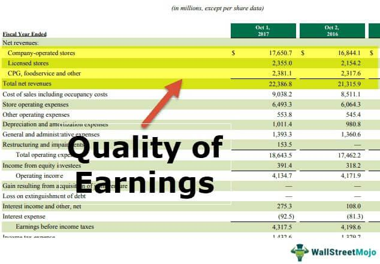

The landscape of modern investing is evolving rapidly, driven by technological advancements and increased access to abundant data. These changes are reshaping how investors approach the financial markets, making it imperative for them to adapt by leveraging new tools and insights. At the core of informed investment strategies lies the understanding of financial statements and earnings reports, which provide essential insights into a company's financial health and performance.

Financial statements are comprehensive records with details on a company's financial condition, encompassing assets, liabilities, revenues, and expenses. These reports help investors and analysts evaluate the viability and profitability of organizations. Similarly, earnings reports are critical as they provide periodic updates on a company’s profitability, aiding potential shareholders in assessing its financial standing and prospects.



The integration of company financials with algorithmic trading strategies marks a significant evolution in the investment process. Algorithmic trading, which employs computer algorithms to automate the buying and selling of financial instruments, is fundamentally enhancing how data is utilized in making investment decisions. These algorithms can process large volumes of data at unprecedented speeds, including real-time market conditions and company earnings reports, thereby allowing for enhanced precision and timing in trades.

This article explores how the convergence of company financials and algorithmic trading can optimize investment strategies. By harnessing financial data through advanced computational techniques, investors can achieve a competitive edge, unlocking opportunities for increased returns and better risk management. The synergy between these two domains not only streamlines decision-making processes but also paves the way for future advancements in technology and data analytics to further transform finance and trading.

## Table of Contents

## Understanding Financial Statements and Earnings Reports

Financial statements are fundamental documents that provide a detailed account of a company’s financial health, offering insights not only to internal stakeholders but also to investors, creditors, and market analysts. These documents are essential for gauging a company's operations, financial position, and cash flows. The primary components of financial statements include the balance sheet, income statement, and cash flow statement, each serving a distinct purpose in conveying a company's financial status.

### Balance Sheet

The balance sheet provides a snapshot of a company’s financial position at a specific point in time. It details assets, liabilities, and shareholders’ equity, following the fundamental accounting equation:

$$
\text{Assets} = \text{Liabilities} + \text{Shareholders' Equity}
$$

Assets represent the resources that the company owns, which can generate future economic benefits. Liabilities reflect the company’s obligations and debts, while shareholders' equity represents the owners' claims after all liabilities have been settled. The balance sheet aids in assessing a company's [liquidity](/wiki/liquidity-risk-premium) and financial flexibility.

### Income Statement

The income statement, also known as the profit and loss statement, portrays a company's financial performance over a defined period, typically a quarter or year. It highlights revenues, costs, expenses, and profits, culminating in the net income. The formula to calculate net income is:

$$
\text{Net Income} = \text{Total Revenue} - \text{Total Expenses}
$$

Key metrics derived from the income statement, such as Earnings Per Share (EPS), are critical for investors assessing profitability and company growth. EPS can be computed using:

$$
\text{EPS} = \frac{\text{Net Income} - \text{Dividends on Preferred Stock}}{\text{Average Outstanding Shares}}
$$

### Cash Flow Statement

The cash flow statement offers a view of the cash generated and used in operations, investing, and financing activities over a period. It is divided into three sections:

1. **Operating Activities:** Cash flows related to core business operations.
2. **Investing Activities:** Cash flows from the acquisition and disposal of long-term investments or assets.
3. **Financing Activities:** Cash flows from transactions with the company’s owners and creditors, such as issuing stock or repaying debt.

This statement is crucial for understanding the liquidity and cash-generating capability of a company, which might not always align with net income due to accounting practices like depreciation.

### Earnings Reports

Earnings reports are periodic statements issued by companies to disclose financial performance, often on a quarterly basis. These reports are crucial for assessing a company's profitability and financial standing. An earnings report typically includes the income statement, with additional narrative on company performance, future outlook, and sometimes a comparison with previous periods or projections.

Investors utilize earnings reports to gauge the company’s short-term and long-term viability, making them an essential tool for investment decisions. Analysts scrutinize these reports to adjust their forecasts and refine investment recommendations. Understanding financial statements and earnings reports empowers stakeholders to make informed decisions, reflecting the pivotal relationship between financial data and market dynamics.

## How to Access and Track Earnings Reports

Earnings reports are essential tools for evaluating a company's financial health and potential growth trajectory. These reports provide detailed information about a company's profitability, revealing critical metrics such as revenue, net income, and earnings per share (EPS). Understanding and accessing these reports is crucial for investors who wish to make informed decisions regarding stock purchases or sales.

One popular resource for tracking earnings reports is Nasdaq's earnings calendar. This online platform provides a comprehensive schedule of upcoming earnings announcements, helping investors plan their strategies around these pivotal events. The Nasdaq earnings calendar is frequently updated and allows users to search by specific company names or filter by date, thus offering a customizable experience for users looking to track multiple investments simultaneously.

Another indispensable tool for accessing earnings reports is the U.S. Securities and Exchange Commission's (SEC) EDGAR system. EDGAR stands for Electronic Data Gathering, Analysis, and Retrieval system, and it serves as a repository for companies' filings required by federal securities laws. The platform ensures transparency and provides the public with access to an extensive range of corporate documents, including quarterly and annual earnings reports, Form 10-K, and Form 10-Q filings. By navigating through EDGAR, investors can download these documents and perform a thorough analysis of a company's financial statements.

Timing is a critical [factor](/wiki/factor-investing) in evaluating and reacting to earnings reports. Companies typically announce their earnings on a quarterly basis, often following a fixed schedule coinciding with the fiscal calendar. These announcements can significantly influence stock prices as markets react to the disclosed information. Investors who keep track of when companies announce their earnings are better positioned to anticipate and respond to these market movements. This is especially relevant in [algorithmic trading](/wiki/algorithmic-trading), where automated systems can be programmed to trigger buy or sell orders based on the timing and content of these reports.

For investors wishing to harness the power of earnings data, understanding the precise timing of these reports, and keeping abreast of updates via platforms such as Nasdaq and EDGAR, is vital. This approach not only enhances the ability to make informed investment decisions but also maximizes the potential for returns in a volatile market environment.

## The Role of Company Financials in Investment Decisions

Company financials are integral for investors seeking to analyze stock performance and make informed investment decisions. These financial reports offer a comprehensive view of an enterprise's economic condition, enabling investors to gauge profitability, efficiency, and growth potential. The evaluation of a company's financial health often involves several key financial metrics that serve as indicators of performance and future prospects. 

One such metric is Earnings Per Share (EPS), which signifies the portion of a company's profit allocated to each outstanding share of common stock. It is a direct indicator of a company's profitability and is calculated as follows:

$$
EPS = \frac{\text{Net Income} - \text{Dividends on Preferred Stock}}{\text{Average Outstanding Shares}}
$$

Higher EPS values generally suggest better profitability, making it an attractive metric for investors focusing on earnings.

Operating margins constitute another critical metric. It reflects the percentage of revenue that remains after all operating expenses are deducted. Operating margin is determined using:

$$
\text{Operating Margin} = \left( \frac{\text{Operating Income}}{\text{Net Sales}} \right) \times 100
$$

This metric provides insights into the efficiency and effectiveness of a company’s operations, indicating how well it can convert sales into profits.

Net income growth also plays a significant role in investment decisions, showcasing the company's ability to increase its profitability over time. Consistent growth in net income implies a thriving business environment and robust management. Comparative analysis of these metrics can provide investors with a more nuanced understanding of a company’s trajectory.

Financial indicators can significantly impact market movements, especially around the time of earnings announcements. Positive or negative deviations from expected earnings reports can lead to substantial shifts in stock prices. A notable uptick in stock price often follows announcements that surpass investor expectations, whereas below-par results typically contribute to a decline in stock valuation.

In summary, company financials and their associated metrics are indispensable tools for investors. They not only offer insights into current performance but also help anticipate future trends, ultimately aiding in the development of strategic investment portfolios. External factors, such as market sentiment and industry conditions, can further magnify the influence of financial indicators on market dynamics, underscoring the complexity and significance of financial analysis in investment decision-making.

 to Algorithmic Trading

Algorithmic trading refers to the use of computer algorithms to execute trading strategies automatically. These algorithms leverage mathematical models to identify trading opportunities based on pre-defined criteria and execute trades at optimal times. A significant advantage of algorithmic trading is its ability to process vast amounts of financial data, including real-time market conditions, historical prices, tweets, news articles, and company earnings reports. This capability enables traders to make data-driven decisions with incredible speed and accuracy.

**Speed and Efficiency**: One of the primary benefits of algorithmic trading is its speed. Algorithms can react to market events faster than human traders, executing trades in fractions of a second. This speed is crucial in markets where prices can change rapidly, allowing traders to capitalize on short-lived opportunities. The efficiency of algorithms also minimizes manual intervention in the trading process, reducing the likelihood of human error and enhancing operational productivity.

**Accuracy and Precision**: Algorithmic trading enhances the precision of trading activities. Algorithms strictly follow predefined instructions and trading rules, reducing the risk of emotional decision-making inherent in manual trading. This precision is vital for implementing complex trading strategies that involve multiple variables and conditions.

**Data Processing**: Algorithms can process a vast array of data sources beyond traditional market data, integrating alternative information like social media sentiment, news releases, and economic indicators. This comprehensive data analysis allows for more informed trading decisions, as algorithms can quickly identify patterns and trends that may not be immediately apparent to human traders.

The sheer [volume](/wiki/volume-trading-strategy) of transactions handled by algorithmic systems also necessitates a robust infrastructure. High-frequency trading ([HFT](/wiki/high-frequency-trading-strategies)), a subset of algorithmic trading, particularly benefits from sophisticated technology that minimizes latency—a critical factor in executing trades at optimal prices.

To illustrate, consider a simple moving average crossover strategy where trades are executed when a short-term moving average crosses above or below a long-term moving average. This can be implemented in Python as follows:

```python
import pandas as pd

def moving_average_crossover(data, short_window, long_window):
    signals = pd.DataFrame(index=data.index)
    signals['price'] = data['close']
    signals['short_mavg'] = data['close'].rolling(window=short_window, min_periods=1).mean()
    signals['long_mavg'] = data['close'].rolling(window=long_window, min_periods=1).mean()

    signals['signal'] = 0.0
    signals['signal'][short_window:] = np.where(
        signals['short_mavg'][short_window:] > signals['long_mavg'][short_window:], 1.0, 0.0)

    signals['positions'] = signals['signal'].diff()
    return signals

# Example usage
data = pd.read_csv('market_data.csv', index_col='date', parse_dates=True)  # Example market data
signals = moving_average_crossover(data, short_window=40, long_window=100)
```

In this example, the `moving_average_crossover` function calculates the short-term and long-term moving averages, generates buy signals when the short-term average crosses above the long-term average, and sell signals when it crosses below. Automated strategies like this can be fine-tuned for various market conditions and are a testament to the power of algorithmic trading in modern financial markets.

## Integrating Earnings Reports into Algorithmic Trading Strategies

Algorithms in trading are transforming investment approaches by integrating earnings reports to predict stock price movements and generate buy or sell signals. Earnings reports, which provide detailed insights into a company's financial performance over a specific period, are crucial data points that algorithms can analyze in real-time.

The process begins with parsing earnings reports to extract relevant financial metrics—such as revenue figures, net income, and earnings per share (EPS). These metrics, together with qualitative data like management commentary and market expectations, are fed into algorithmic models.

Historical data plays a significant role in refining these models. By analyzing past earnings reports and corresponding market reactions, algorithms can identify patterns and relationships that may predict future price movements. For instance, a consistent increase in EPS could signal a potential upward trend in stock value. Machine learning techniques, including regression analysis and neural networks, are utilized to enhance predictive accuracy. These models are trained on large datasets to recognize complex patterns and improve their forecasting capabilities over time.

Here's a simple Python example that uses [machine learning](/wiki/machine-learning) to predict stock movements based on earnings data:

```python
import pandas as pd
from sklearn.model_selection import train_test_split
from sklearn.ensemble import RandomForestClassifier

# Sample dataset
data = pd.read_csv('earnings_data.csv')

# Features (e.g., EPS, revenue growth)
X = data[['eps', 'revenue_growth', 'net_income']]
# Target (stock movement: up/down)
y = data['stock_movement']

# Splitting the data
X_train, X_test, y_train, y_test = train_test_split(X, y, test_size=0.2, random_state=42)

# Random Forest Classifier
model = RandomForestClassifier(n_estimators=100, random_state=42)
model.fit(X_train, y_train)

# Predicting stock movement
predictions = model.predict(X_test)
```

Synchronizing earnings data with algorithmic models can potentially increase returns by optimizing entry and [exit](/wiki/exit-strategy) points. For example, an algorithm might execute trade orders when the reported EPS exceeds analyst expectations, a scenario often leading to stock price surges.

However, the integration is not without challenges. Market [volatility](/wiki/volatility-trading-strategies) around earnings releases can result in rapid price changes. As such, the algorithms should incorporate volatility measures to mitigate risks and enhance reliability. Regulatory requirements, which mandate fair access to financial data, also need careful consideration to prevent compliance issues.

Ultimately, the effective integration of earnings reports into algorithmic trading strategies holds the promise of outperforming traditional methods, aligning investment decisions with real-time financial insights.

## Challenges and Considerations

Integrating financial reports into algorithmic trading presents several challenges that need careful consideration to ensure effective and reliable trading strategies.

One of the primary challenges involves data accuracy. Inaccuracies in financial data can arise from errors in data entry, discrepancies in data sources, or delays in information updates. Ensuring the integrity of financial data is critical, as errors could lead to misinformed trading decisions and potential financial losses. To mitigate these risks, traders can implement data validation processes, cross-referencing multiple data sources, and using advanced data cleaning techniques to maintain high data quality.

Market volatility around earnings releases is another significant challenge. Earnings reports often lead to increased market activity, causing sharp price movements. Algorithmic trading systems must be designed to handle this volatility effectively. Strategies such as setting dynamic stop-loss orders, employing volatility-adjusted position sizing, and utilizing hedging techniques can help manage the impact of sudden market swings.

Regulatory considerations also play a crucial role in integrating financial reports into algo trading. Adhering to financial regulations and compliance measures is vital to prevent legal repercussions. Regulatory requirements may vary across jurisdictions and can include restrictions on data usage, reporting obligations, and trading conduct. Staying informed about regulatory changes and designing algorithms with built-in compliance checks can help traders navigate these legal complexities.

To ensure reliable algorithmic performance during earnings periods, traders can adopt several strategies. Backtesting algorithms against historical earnings data allows for the identification of potential weaknesses and the optimization of trading models. Real-time monitoring systems can provide alerts for unexpected behavior or deviations from expected performance, allowing for quick intervention if necessary.

By addressing these challenges and implementing robust measures, traders can enhance the reliability and effectiveness of their algorithmic trading strategies in the context of financial reports, thereby maximizing their potential for success.

## Conclusion

Financial statements and earnings reports are crucial tools in modern investment strategies. They provide investors with essential insights into a company's financial health, allowing for informed decision-making. By examining key metrics such as revenue, profit margins, and cash flow, investors can better assess a company's performance and potential for growth.

The integration of company financials with algorithmic trading has significantly altered the investment landscape, offering a competitive advantage for those aiming to maximize returns. Algorithmic trading leverages financial data to automate trading decisions, processing information at speeds and accuracy levels unattainable by human traders. When earnings reports and other financial disclosures are incorporated into these algorithms, they can instantly react to new information, optimizing entry and exit points in trading operations.

Looking ahead, advancements in [artificial intelligence](/wiki/ai-artificial-intelligence) (AI) and data analytics are set to further transform finance and trading. AI has the potential to enhance the interpretation of complex data sets, improving the predictive capabilities of trading algorithms. This evolution may lead to more sophisticated models that better capture market trends and anomalies, leading to more informed investment strategies.

The convergence of traditional financial analysis and cutting-edge technology helps investors navigate the complexities of the market more effectively. As AI technologies advance, the synergy between company financials and algorithmic trading is likely to deepen, paving the way for even more dynamic and responsive investment strategies. This continued evolution promises not only to enhance market efficiency but also to redefine how investors engage with financial markets.

## References & Further Reading

[1]: ["Advances in Financial Machine Learning"](https://www.amazon.com/Advances-Financial-Machine-Learning-Marcos/dp/1119482089) by Marcos Lopez de Prado

[2]: ["Machine Learning for Algorithmic Trading"](https://github.com/stefan-jansen/machine-learning-for-trading) by Stefan Jansen

[3]: ["Quantitative Trading: How to Build Your Own Algorithmic Trading Business"](https://www.amazon.com/Quantitative-Trading-Build-Algorithmic-Business/dp/1119800064) by Ernest P. Chan

[4]: ["Evidence-Based Technical Analysis: Applying the Scientific Method and Statistical Inference to Trading Signals"](https://www.amazon.com/Evidence-Based-Technical-Analysis-Scientific-Statistical/dp/0470008741) by David Aronson

[5]: Bergstra, J., Bardenet, R., Bengio, Y., & Kégl, B. (2011). ["Algorithms for Hyper-Parameter Optimization."](https://proceedings.neurips.cc/paper/2011/file/86e8f7ab32cfd12577bc2619bc635690-Paper.pdf) Advances in Neural Information Processing Systems 24.