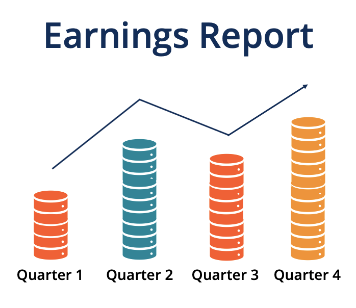

## Table of Contents

## What are company earnings reports?

Company earnings reports are documents that businesses release to show how much money they made and spent over a certain period, usually every three months. These reports tell investors and the public about the company's financial health. They include important numbers like total sales, profits, and costs. By looking at these reports, people can see if the company is doing well or if it's facing problems.

Earnings reports are important because they help investors decide whether to buy, sell, or keep their shares in the company. If a company's earnings are higher than expected, its stock price might go up because people think the company is doing well. On the other hand, if the earnings are lower than expected, the stock price might go down. These reports also help the company's leaders make better decisions about the future, like where to spend money or how to grow the business.

## Why are earnings reports important for investors?

Earnings reports are important for investors because they show how well a company is doing financially. When investors see these reports, they can find out if the company is making more money than it spends, which is a good sign. If the company's earnings are higher than what people thought they would be, investors might feel good about the company and want to buy more of its stock. This can make the stock price go up.

On the other hand, if the earnings are lower than expected, investors might worry that the company is not doing well. This could make them want to sell their stock, which can cause the stock price to go down. By looking at earnings reports, investors can make smarter choices about whether to buy, sell, or keep their shares in the company. This helps them decide if their money is in the right place.

## How often are earnings reports released?

Earnings reports are usually released every three months. This means companies share how much money they made and spent four times a year. These reports come out at the end of each quarter, which is a three-month period. For example, a company might release its earnings report in January, April, July, and October.

Sometimes, companies also release a yearly earnings report. This report shows the total money made and spent over the whole year. It usually comes out a few months after the end of the year, like in January or February. This yearly report gives a bigger picture of how the company did over the entire year, not just one quarter.

## Where can I find earnings reports for publicly traded companies?

You can find earnings reports for publicly traded companies on their official websites. Most companies have a section called "Investor Relations" or something similar. In this section, you can find the latest earnings reports, along with other important financial information. Just go to the company's website, look for the Investor Relations page, and you should be able to download or view the reports easily.

Another place to find earnings reports is on financial news websites like Yahoo Finance, Bloomberg, or Reuters. These websites collect earnings reports from many companies and make them available to the public. You can search for the company you're interested in, and you'll usually find a link to their latest earnings report. These sites are helpful because they also provide news and analysis about the company's performance, which can give you a better understanding of the earnings report.

## What key financial metrics should I look for in an earnings report?

When you look at an earnings report, you should pay attention to a few key financial metrics. The first one is revenue, which is the total amount of money the company made from selling its products or services. This tells you how much business the company did. Another important metric is net income, which is what's left after the company pays all its costs. This shows if the company made a profit or a loss. Earnings per share (EPS) is also crucial because it tells you how much money the company made for each share of its stock. If EPS is higher than what people expected, the stock price might go up.

You should also look at the company's operating expenses, which are the costs of running the business day to day. This can help you understand if the company is spending too much or if it's managing its money well. Another metric to consider is the gross margin, which is the difference between revenue and the cost of goods sold, divided by revenue. A higher gross margin means the company is making more money on each product it sells. Finally, keep an eye on the company's debt levels. If a company has a lot of debt, it might have trouble paying it back, which could be a red flag for investors.

## How can I interpret the income statement in an earnings report?

The income statement in an earnings report shows how much money a company made and spent over a certain time, usually three months. It starts with the company's total revenue, which is all the money it got from selling its products or services. Then, it subtracts the cost of goods sold, which is what it cost the company to make those products or provide those services. The difference between revenue and the cost of goods sold is called gross profit. This number tells you how much money the company made before paying for other things like rent, salaries, and advertising.

Next, the income statement lists all the operating expenses, which are the costs of running the business day to day. These can include things like salaries, rent, and utilities. After subtracting these expenses from the gross profit, you get the operating income. This shows how much money the company made from its main business activities. Finally, the income statement includes other income and expenses, like interest on loans or money from investments. After adding or subtracting these, you get the net income, which is the company's profit or loss for the period. If the net income is positive, the company made a profit; if it's negative, the company had a loss.

## What is the significance of the balance sheet in earnings reports?

The balance sheet in an earnings report is like a snapshot of what a company owns and owes at a specific time. It shows the company's assets, which are things like cash, buildings, and equipment. It also shows the company's liabilities, which are what the company owes, like loans and bills. The difference between the assets and liabilities is called shareholders' equity, which is the value that belongs to the people who own the company's stock. By looking at the balance sheet, you can see if the company has enough money and resources to pay its bills and keep running.

The balance sheet is important because it helps investors understand the company's financial health. If a company has a lot of assets and not much debt, it might be in a good position to grow or handle tough times. On the other hand, if a company has a lot of debt and not many assets, it might be risky to invest in. The balance sheet also shows how the company is using its money, like if it's investing in new equipment or paying down loans. This information can help investors decide if the company is a good place to put their money.

## How do cash flow statements complement earnings reports?

Cash flow statements are important because they show how money moves in and out of a company over a certain time, usually three months. While the income statement tells you if the company made a profit or a loss, the cash flow statement tells you where the actual cash came from and where it went. It's divided into three parts: operating activities, which show cash from the company's main business; investing activities, which show cash spent on things like new equipment; and financing activities, which show cash from loans or stock sales. By looking at the cash flow statement, you can see if the company has enough cash to pay its bills and keep running.

The cash flow statement helps investors understand the company's financial health better than just looking at the income statement. For example, a company might show a profit on the income statement, but if it's not getting enough cash from its operations, it might still have trouble paying its bills. The cash flow statement can also show if the company is spending a lot of money on new projects or paying down debt, which can be good or bad depending on the situation. By looking at both the income statement and the cash flow statement, investors can get a fuller picture of how the company is doing and make better decisions about their investments.

## What are some common red flags to watch for in earnings reports?

When you look at earnings reports, one big red flag is if the company's revenue is going down. This means they are selling less stuff or their services are not as popular. Another red flag is if the company's costs are going up a lot faster than its revenue. This can mean the company is spending too much money and might not be able to make a profit. Also, watch out if the company's debt is getting bigger and bigger. Too much debt can be a problem because the company might have trouble paying it back.

Another thing to be careful about is if the company's earnings per share (EPS) are a lot lower than what people expected. This can make investors worried and might cause the stock price to drop. Also, if the company keeps changing how it reports its numbers or if it uses a lot of complicated language to explain things, that can be a sign that something is not right. It's good to look at the cash flow statement too. If the company is not making enough cash from its main business, it might be in trouble even if it shows a profit on the income statement.

## How can I use earnings reports to predict future company performance?

Earnings reports can help you guess how a company might do in the future by showing you how it's doing right now. If a company's revenue and profits are going up, it might mean they are doing well and could keep growing. You can also look at what the company says about its plans for the future. If they talk about new products or expanding to new places, that could be a good sign. But if the company's costs are going up a lot or if they have a lot of debt, it might be harder for them to do well in the future.

Another way to use earnings reports is to compare them with what people expected. If a company does better than what people thought, it might mean they are doing better than their competition. This can make investors feel good about the company and might make the stock price go up. But if the company does worse than expected, it might mean they are having problems. By looking at these reports over time, you can see if the company is getting better or worse, which can help you guess what might happen next.

## What advanced ratios and analyses can be applied to earnings reports for deeper insights?

When you want to understand a company's earnings report better, you can use some advanced ratios and analyses. One important ratio is the price-to-earnings (P/E) ratio, which shows how much investors are willing to pay for each dollar of the company's earnings. A high P/E ratio might mean people think the company will grow a lot in the future, while a low P/E ratio might mean the company is not expected to grow much. Another useful ratio is the return on equity (ROE), which tells you how well the company is using the money that shareholders have invested. A high ROE means the company is making good use of that money. You can also look at the debt-to-equity ratio, which shows how much the company is borrowing compared to what shareholders have invested. A high debt-to-equity ratio can be risky because it means the company has a lot of debt to pay back.

Another way to get deeper insights is by doing a trend analysis. This means looking at the company's earnings reports over several quarters or years to see if there are any patterns. For example, if the company's revenue and profits are growing steadily, it might mean they are doing well and could keep growing. You can also compare the company's performance with other companies in the same industry. This is called a comparative analysis. If the company is doing better than its competitors, it might be a good sign. Finally, you can use a DuPont analysis, which breaks down the return on equity into three parts: profit margin, asset turnover, and financial leverage. This can help you understand what is driving the company's performance and where they might need to improve.

## How do regulatory requirements affect the content and timing of earnings reports?

Regulatory requirements play a big role in what companies have to put in their earnings reports and when they have to release them. In the United States, the Securities and Exchange Commission (SEC) makes rules that companies have to follow. These rules say that companies have to give a lot of information in their earnings reports, like how much money they made, how much they spent, and what they own and owe. The SEC also says that companies have to release their earnings reports within a certain time after the end of each quarter, usually within 45 days. This helps make sure that everyone gets the same information at the same time, which is fair for investors.

These rules are important because they help keep the stock market honest. If companies didn't have to follow these rules, they might hide bad news or only tell some people about it. This could make it hard for investors to make good choices. By making sure that all companies follow the same rules, the SEC helps keep the market fair and open. This means that investors can trust the information in earnings reports and use it to decide if they want to buy, sell, or keep their shares in a company.

## What is the importance of understanding financial statements and earnings reports?

Financial statements are fundamental documents that provide a detailed account of a company’s financial health, offering insights not only to internal stakeholders but also to investors, creditors, and market analysts. These documents are essential for gauging a company's operations, financial position, and cash flows. The primary components of financial statements include the balance sheet, income statement, and cash flow statement, each serving a distinct purpose in conveying a company's financial status.

### Balance Sheet

The balance sheet provides a snapshot of a company’s financial position at a specific point in time. It details assets, liabilities, and shareholders’ equity, following the fundamental accounting equation:

$$
\text{Assets} = \text{Liabilities} + \text{Shareholders' Equity}
$$

Assets represent the resources that the company owns, which can generate future economic benefits. Liabilities reflect the company’s obligations and debts, while shareholders' equity represents the owners' claims after all liabilities have been settled. The balance sheet aids in assessing a company's [liquidity](/wiki/liquidity-risk-premium) and financial flexibility.

### Income Statement

The income statement, also known as the profit and loss statement, portrays a company's financial performance over a defined period, typically a quarter or year. It highlights revenues, costs, expenses, and profits, culminating in the net income. The formula to calculate net income is:

$$
\text{Net Income} = \text{Total Revenue} - \text{Total Expenses}
$$

Key metrics derived from the income statement, such as Earnings Per Share (EPS), are critical for investors assessing profitability and company growth. EPS can be computed using:

$$
\text{EPS} = \frac{\text{Net Income} - \text{Dividends on Preferred Stock}}{\text{Average Outstanding Shares}}
$$

### Cash Flow Statement

The cash flow statement offers a view of the cash generated and used in operations, investing, and financing activities over a period. It is divided into three sections:

1. **Operating Activities:** Cash flows related to core business operations.
2. **Investing Activities:** Cash flows from the acquisition and disposal of long-term investments or assets.
3. **Financing Activities:** Cash flows from transactions with the company’s owners and creditors, such as issuing stock or repaying debt.

This statement is crucial for understanding the liquidity and cash-generating capability of a company, which might not always align with net income due to accounting practices like depreciation.

### Earnings Reports

Earnings reports are periodic statements issued by companies to disclose financial performance, often on a quarterly basis. These reports are crucial for assessing a company's profitability and financial standing. An earnings report typically includes the income statement, with additional narrative on company performance, future outlook, and sometimes a comparison with previous periods or projections.

Investors utilize earnings reports to gauge the company’s short-term and long-term viability, making them an essential tool for investment decisions. Analysts scrutinize these reports to adjust their forecasts and refine investment recommendations. Understanding financial statements and earnings reports empowers stakeholders to make informed decisions, reflecting the pivotal relationship between financial data and market dynamics.

## What is the Role of Company Financials in Investment Decisions?

Company financials are integral for investors seeking to analyze stock performance and make informed investment decisions. These financial reports offer a comprehensive view of an enterprise's economic condition, enabling investors to gauge profitability, efficiency, and growth potential. The evaluation of a company's financial health often involves several key financial metrics that serve as indicators of performance and future prospects. 

One such metric is Earnings Per Share (EPS), which signifies the portion of a company's profit allocated to each outstanding share of common stock. It is a direct indicator of a company's profitability and is calculated as follows:

$$
EPS = \frac{\text{Net Income} - \text{Dividends on Preferred Stock}}{\text{Average Outstanding Shares}}
$$

Higher EPS values generally suggest better profitability, making it an attractive metric for investors focusing on earnings.

Operating margins constitute another critical metric. It reflects the percentage of revenue that remains after all operating expenses are deducted. Operating margin is determined using:

$$
\text{Operating Margin} = \left( \frac{\text{Operating Income}}{\text{Net Sales}} \right) \times 100
$$

This metric provides insights into the efficiency and effectiveness of a company’s operations, indicating how well it can convert sales into profits.

Net income growth also plays a significant role in investment decisions, showcasing the company's ability to increase its profitability over time. Consistent growth in net income implies a thriving business environment and robust management. Comparative analysis of these metrics can provide investors with a more nuanced understanding of a company’s trajectory.

Financial indicators can significantly impact market movements, especially around the time of earnings announcements. Positive or negative deviations from expected earnings reports can lead to substantial shifts in stock prices. A notable uptick in stock price often follows announcements that surpass investor expectations, whereas below-par results typically contribute to a decline in stock valuation.

In summary, company financials and their associated metrics are indispensable tools for investors. They not only offer insights into current performance but also help anticipate future trends, ultimately aiding in the development of strategic investment portfolios. External factors, such as market sentiment and industry conditions, can further magnify the influence of financial indicators on market dynamics, underscoring the complexity and significance of financial analysis in investment decision-making.

 to Algorithmic Trading

Algorithmic trading refers to the use of computer algorithms to execute trading strategies automatically. These algorithms leverage mathematical models to identify trading opportunities based on pre-defined criteria and execute trades at optimal times. A significant advantage of algorithmic trading is its ability to process vast amounts of financial data, including real-time market conditions, historical prices, tweets, news articles, and company earnings reports. This capability enables traders to make data-driven decisions with incredible speed and accuracy.

**Speed and Efficiency**: One of the primary benefits of algorithmic trading is its speed. Algorithms can react to market events faster than human traders, executing trades in fractions of a second. This speed is crucial in markets where prices can change rapidly, allowing traders to capitalize on short-lived opportunities. The efficiency of algorithms also minimizes manual intervention in the trading process, reducing the likelihood of human error and enhancing operational productivity.

**Accuracy and Precision**: Algorithmic trading enhances the precision of trading activities. Algorithms strictly follow predefined instructions and trading rules, reducing the risk of emotional decision-making inherent in manual trading. This precision is vital for implementing complex trading strategies that involve multiple variables and conditions.

**Data Processing**: Algorithms can process a vast array of data sources beyond traditional market data, integrating alternative information like social media sentiment, news releases, and economic indicators. This comprehensive data analysis allows for more informed trading decisions, as algorithms can quickly identify patterns and trends that may not be immediately apparent to human traders.

The sheer [volume](/wiki/volume-trading-strategy) of transactions handled by algorithmic systems also necessitates a robust infrastructure. High-frequency trading ([HFT](/wiki/high-frequency-trading-strategies)), a subset of algorithmic trading, particularly benefits from sophisticated technology that minimizes latency—a critical factor in executing trades at optimal prices.

To illustrate, consider a simple moving average crossover strategy where trades are executed when a short-term moving average crosses above or below a long-term moving average. This can be implemented in Python as follows:

```python
import pandas as pd

def moving_average_crossover(data, short_window, long_window):
    signals = pd.DataFrame(index=data.index)
    signals['price'] = data['close']
    signals['short_mavg'] = data['close'].rolling(window=short_window, min_periods=1).mean()
    signals['long_mavg'] = data['close'].rolling(window=long_window, min_periods=1).mean()

    signals['signal'] = 0.0
    signals['signal'][short_window:] = np.where(
        signals['short_mavg'][short_window:] > signals['long_mavg'][short_window:], 1.0, 0.0)

    signals['positions'] = signals['signal'].diff()
    return signals

# Example usage
data = pd.read_csv('market_data.csv', index_col='date', parse_dates=True)  # Example market data
signals = moving_average_crossover(data, short_window=40, long_window=100)
```

In this example, the `moving_average_crossover` function calculates the short-term and long-term moving averages, generates buy signals when the short-term average crosses above the long-term average, and sell signals when it crosses below. Automated strategies like this can be fine-tuned for various market conditions and are a testament to the power of algorithmic trading in modern financial markets.

## References & Further Reading

[1]: ["Advances in Financial Machine Learning"](https://www.amazon.com/Advances-Financial-Machine-Learning-Marcos/dp/1119482089) by Marcos Lopez de Prado

[2]: ["Machine Learning for Algorithmic Trading"](https://github.com/stefan-jansen/machine-learning-for-trading) by Stefan Jansen

[3]: ["Quantitative Trading: How to Build Your Own Algorithmic Trading Business"](https://www.amazon.com/Quantitative-Trading-Build-Algorithmic-Business/dp/1119800064) by Ernest P. Chan

[4]: ["Evidence-Based Technical Analysis: Applying the Scientific Method and Statistical Inference to Trading Signals"](https://www.amazon.com/Evidence-Based-Technical-Analysis-Scientific-Statistical/dp/0470008741) by David Aronson

[5]: Bergstra, J., Bardenet, R., Bengio, Y., & Kégl, B. (2011). ["Algorithms for Hyper-Parameter Optimization."](https://proceedings.neurips.cc/paper/2011/file/86e8f7ab32cfd12577bc2619bc635690-Paper.pdf) Advances in Neural Information Processing Systems 24.