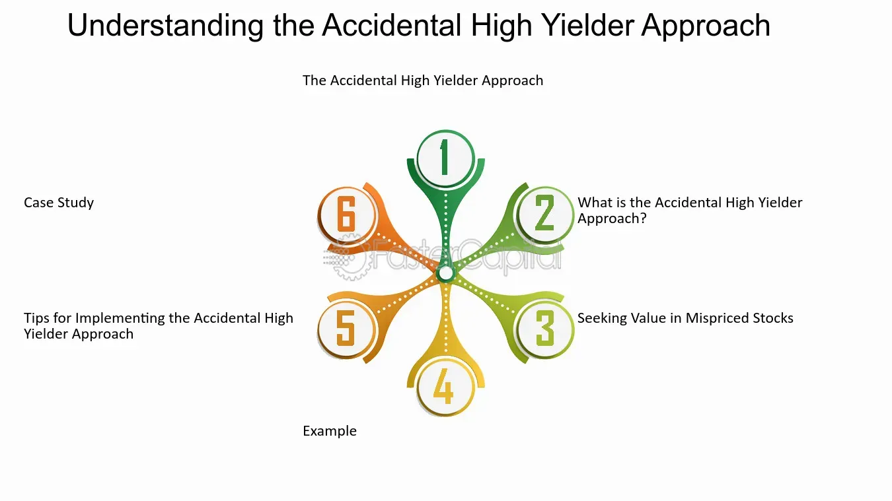

## Table of Contents

## What is an accidental high yielder?

An accidental high yielder is a stock that pays a high dividend yield, but not because the company planned it that way. It happens when a company's stock price drops a lot, but it keeps paying the same dividend. This makes the yield, which is the dividend divided by the stock price, go up a lot.

These stocks can be risky because the high yield might not last. If the company's problems get worse, it might cut the dividend or even stop paying it. But, if the company fixes its problems, the stock price could go up again, and the yield would go down. So, investors need to be careful and look at why the yield is high before they decide to buy the stock.

## How does a stock become an accidental high yielder?

A stock becomes an accidental high yielder when its price falls a lot, but the company keeps paying the same dividend. The dividend yield, which is the dividend amount divided by the stock price, goes up because the stock price is lower. For example, if a stock was $100 and paid a $5 dividend, the yield would be 5%. If the stock price drops to $50 but the dividend stays at $5, the yield jumps to 10%.

This happens because of problems in the company or the market. Maybe the company is not doing well, or people are worried about the economy. When the stock price drops, the high yield can attract investors looking for income. But it's risky because the high yield might not last. If the company's problems get worse, it might cut the dividend. So, investors need to understand why the yield is high before buying the stock.

## What are the common characteristics of accidental high yielders?

Accidental high yielders are stocks that have a high dividend yield because their stock price has dropped a lot, but they keep paying the same dividend. This makes the yield, which is the dividend divided by the stock price, go up a lot. These stocks often come from companies that are having problems, like losing money or facing tough competition. The high yield can attract investors who want to earn more income from their investments.

But, these stocks can be risky. The high yield might not last because the company's problems could get worse, and it might have to cut the dividend or stop paying it altogether. If the company fixes its problems, the stock price could go up again, and the yield would go down. So, investors need to be careful and look at why the yield is high before they decide to buy the stock. It's important to understand the company's situation and not just focus on the high yield.

## Can you provide examples of accidental high yielders?

An example of an accidental high yielder is a company like Ford Motor Company. A few years ago, Ford's stock price dropped a lot because people were worried about the car industry and Ford's future. But Ford kept paying the same dividend. This made the dividend yield go up a lot, making Ford an accidental high yielder. Investors saw the high yield and some bought the stock hoping to get more income. But it was risky because if Ford's problems got worse, it might have to cut the dividend.

Another example is Macy's, a big department store. A few years ago, Macy's stock price fell a lot because people were shopping online more and not going to stores as much. But Macy's kept paying the same dividend. This made the dividend yield go up a lot, turning Macy's into an accidental high yielder. Some investors bought the stock because of the high yield, but it was risky. If Macy's couldn't fix its problems, it might have to cut the dividend, and the high yield would go away.

## What are the risks associated with investing in accidental high yielders?

Investing in accidental high yielders can be risky. These stocks have high dividend yields because their prices have dropped a lot, but they keep paying the same dividend. The problem is, the high yield might not last. If the company's problems get worse, it might have to cut the dividend or stop paying it altogether. This means investors could lose the income they were hoping to get from the high yield.

Also, the stock price could keep falling if the company doesn't fix its problems. This means investors could lose money on the stock itself, not just the dividend. It's important for investors to understand why the yield is high and to look at the company's overall situation before buying the stock. Just seeing a high yield isn't enough; investors need to be careful and do their homework.

## How can an investor identify an accidental high yielder?

An investor can identify an accidental high yielder by looking at the stock's dividend yield and its recent price history. If a stock has a high dividend yield, like 8% or more, and the stock price has dropped a lot in the last few months or years, it might be an accidental high yielder. The high yield happens because the stock price is lower, but the company keeps paying the same dividend.

To be sure, the investor should check why the stock price fell. If the company is having problems, like losing money or facing tough competition, and the stock price dropped because of that, it's likely an accidental high yielder. The investor needs to be careful because the high yield might not last if the company's problems get worse. It's important to understand the company's situation before deciding to buy the stock.

## What strategies should be used when investing in accidental high yielders?

When investing in accidental high yielders, it's important to do a lot of research first. Look at why the stock price dropped and if the company is having problems. Check the company's financial health, like if it's making money or losing it. Also, see if the company has a plan to fix its problems. If the company can solve its issues, the stock price might go up again, and the high yield could be a good thing. But if the company's problems get worse, it might cut the dividend, and the high yield would go away.

Be ready for the stock price to go down more. Accidental high yielders can be risky because the stock price might keep falling if the company doesn't get better. Don't put all your money into one stock. Spread your money across different stocks to lower the risk. Also, think about how long you want to keep the stock. If you can wait a long time, you might be able to ride out the ups and downs. But if you need the money soon, accidental high yielders might not be a good choice because they can be too risky.

## How do accidental high yielders compare to traditional high-yield stocks?

Accidental high yielders and traditional high-yield stocks both offer high dividend yields, but they come from different situations. Traditional high-yield stocks are from companies that plan to pay high dividends. These companies are usually stable and have a history of paying good dividends. They might be in industries like utilities or real estate, where they can make steady money and share it with investors. Investors like these stocks because they can count on the dividends to keep coming.

On the other hand, accidental high yielders happen when a company's stock price drops a lot, but it keeps paying the same dividend. This makes the yield go up a lot, but it's risky. The high yield might not last because the company could be having problems. If the company's issues get worse, it might have to cut the dividend. So, while traditional high-yield stocks are seen as safer bets for income, accidental high yielders can be more of a gamble. Investors need to be careful and do a lot of research before buying an accidental high yielder.

## What impact do market conditions have on accidental high yielders?

Market conditions can have a big impact on accidental high yielders. When the market is doing well, and people feel good about the economy, the stock prices of these companies might go up. If the stock price goes up, the dividend yield goes down because the yield is the dividend divided by the stock price. This means the high yield that attracted investors in the first place might go away. But if the company fixes its problems, the stock price could keep going up, and investors could make money from both the stock and the dividend.

On the other hand, if the market is doing badly, and people are worried about the economy, the stock prices of accidental high yielders might keep falling. This could make the dividend yield go up even more, but it's risky. If the company's problems get worse because of the bad market, it might have to cut the dividend. This means investors could lose the income they were hoping to get from the high yield. So, market conditions can make accidental high yielders either a good investment or a risky one, depending on how the company and the market are doing.

## How can one assess the sustainability of the high yield from these stocks?

To assess the sustainability of the high yield from accidental high yielders, you need to look at the company's financial health. Check if the company is making money or losing it. If the company is losing money, it might not be able to keep paying the high dividend for long. Also, look at the company's debt. If it has a lot of debt, it might have to use the money to pay off the debt instead of paying dividends. It's also important to see if the company has a plan to fix its problems. If it does, and the plan is working, the high yield might be sustainable.

Another thing to consider is the industry the company is in. Some industries, like utilities or real estate, can make steady money and are more likely to keep paying dividends. But if the company is in a tough industry, like retail or energy, it might be harder for it to keep the high yield going. Also, think about the overall economy. If the economy is doing well, the company might do better and keep paying the dividend. But if the economy is doing badly, the company's problems could get worse, and it might have to cut the dividend. So, to know if the high yield will last, you need to look at the company's money situation, its industry, and the economy.

## What role does dividend policy play in the creation of accidental high yielders?

Dividend policy is really important when it comes to accidental high yielders. These are stocks that have a high dividend yield because their price dropped a lot, but the company keeps paying the same dividend. If a company has a policy to keep the dividend the same no matter what, even when the stock price goes down, it can turn into an accidental high yielder. This happens because the yield, which is the dividend divided by the stock price, goes up a lot when the price falls.

But, the company's dividend policy can also affect how long the high yield lasts. If the company is set on keeping the dividend the same, even when it's losing money or has a lot of debt, it might have to cut the dividend later. This means the high yield that attracted investors in the first place could go away. So, when looking at accidental high yielders, it's important to understand the company's dividend policy and if it can really keep paying that high dividend.

## How do financial analysts typically view accidental high yielders in terms of investment potential?

Financial analysts often see accidental high yielders as risky investments. These stocks have high dividend yields because their prices dropped a lot, but the company keeps paying the same dividend. Analysts know that the high yield might not last. If the company's problems get worse, it might have to cut the dividend. This means investors could lose the income they were hoping to get from the high yield. So, analysts are careful and tell investors to do a lot of research before buying these stocks.

Analysts also look at the company's overall situation. They check if the company is making money or losing it, and if it has a lot of debt. They also think about the industry the company is in and how the economy is doing. If the company can fix its problems, the stock price might go up again, and the high yield could be a good thing. But if the company's issues get worse, the stock price could keep falling, and the high yield would go away. So, analysts see accidental high yielders as a gamble that needs a lot of careful thinking before investing.

## What is Understanding Accidental Yield?

Accidental yield refers to the phenomena where an investment unintentionally becomes a high-yielding asset due to unforeseen market conditions. This concept typically arises when the stock price of a company falls significantly, thereby elevating its dividend yield, assuming dividends are maintained or not proportionally cut. The formula for dividend yield is:

$$
\text{Dividend Yield} = \frac{\text{Annual Dividends Per Share}}{\text{Price Per Share}} \times 100\%
$$

A decrease in the stock price results in an increased yield if the dividend remains constant. While this can present attractive opportunities for income-focused investors, caution must be exercised due to the risks involved.

### How Market Conditions Create Accidental Yield Opportunities

Accidental yield opportunities often manifest during periods of economic downturn or sector-specific crises. Market sell-offs can lead to disproportionate declines in stock prices while dividends are kept stable by managements determined to maintain investor confidence. For example, financial crises or industry-related scandals can sharply decrease stock valuations, transforming a traditionally conservative stock into an accidental high yielder.

External factors such as changes in interest rates or regulatory compliance costs can also play pivotal roles. In such cases, companies may witness declining stock prices which are not always reflective of their long-term financial health, leading to temporarily elevated yields.

### Investing in Stocks with Unintentional High Yields

Investors seeking high yields might find accidental yielders attractive due to the potential for both dividend income and capital appreciation. However, these opportunities require detailed scrutiny of the underlying company’s financial health, dividend sustainability, and the forces driving the stock price decline. Investors should examine key financial metrics such as payout ratios, cash flow stability, and debt levels to assess whether the dividends offered are sustainable.

Python can be used to analyze financial data and identify accidental yielders. Here's a simple code snippet to help identify potential accidental high yielders from a dataset:

```python
import pandas as pd

# Sample dataset with company stocks and their financial data
data = {
    'Company': ['A', 'B', 'C'],
    'AnnualDividendPerShare': [3.5, 4.0, 1.5],
    'CurrentSharePrice': [50, 20, 10],
}

# Convert to DataFrame
stocks = pd.DataFrame(data)

# Calculate the Dividend Yield
stocks['DividendYield'] = (stocks['AnnualDividendPerShare'] / stocks['CurrentSharePrice']) * 100

# Filtering stocks with a Dividend Yield above a certain threshold
high_yielders = stocks[stocks['DividendYield'] > 6]

print(high_yielders)
```

### Risks Associated with Accidental High Yielders

Investing in accidental high yielders involves several risks, notably dividend cuts. Companies at financial risk may reduce or entirely eliminate dividends to conserve cash. This not only affects income but can also result in further stock price declines. Understanding the reasons behind the stock price drop is essential, as is diversifying across different sectors to mitigate increased individual security risk.

Reputation risk also plays a role; high yields often signal distress rather than opportunity, attracting speculative rather than stable investors. Additionally, macroeconomic factors and competitive pressures should be thoroughly evaluated as they can impact long-term dividend viability.

### Real-World Cases of Accidental High Yielders in Action

A notable example of accidental high yielders can be seen in the 2008 financial crisis, where several blue-chip companies experienced massive stock price declines, inadvertently boosting their yields to attractive levels. Despite the attractive yields, many of these companies eventually reduced dividends during the recovery phase to stabilize operations.

More recently, during the COVID-19 pandemic, several sectors including travel, hospitality, and retail experienced severely depressed stock prices, creating numerous accidental high-yield opportunities. Some investors capitalized on these situations, but outcomes varied based on companies' adaptation to the evolving economic landscape and changes in consumer behavior.

Understanding these examples helps investors learn the value of thorough market research and risk assessment when considering accidental high yield stocks as part of a diversified portfolio.

## How can one develop a sustainable high-yield investing strategy?

Creating a sustainable high-yield investing strategy requires a structured approach to portfolio diversification, extensive market research, careful evaluation of investment opportunities, and the flexibility to adapt to market changes. This section outlines the steps and considerations necessary for developing such a strategy.

### Steps to Create a Diversified High-Yield Portfolio

Diversification is crucial in reducing risk and enhancing the potential for returns in a high-yield portfolio. A well-diversified portfolio includes various asset classes such as stocks, bonds, and real estate, each having different risk-reward profiles. This diversification helps mitigate the impact of market volatility on the overall portfolio performance.

**Asset Allocation and Diversification**  
The first step is to allocate assets across different sectors and geographies. For instance, combining high-yield dividend stocks with bonds can balance the portfolio by providing income and stability. The standard practice involves spreading investments across industries such as utilities, finance, consumer goods, and technology. Investors should also consider international diversification to protect against domestic downturns.

### Importance of Due Diligence and Market Research

Due diligence is critical when selecting high-yield investments. It involves analyzing financial statements, understanding industry trends, and assessing the management quality of potential investment targets. Investors should focus on key financial ratios like the dividend payout ratio, earnings per share (EPS), and return on equity (ROE) to ascertain financial health.

**Financial Analysis**  
A thorough analysis of a company's financials can provide insights into its ability to sustain high dividends. For example, a low dividend payout ratio suggests that a company is not overextending itself, which might indicate a more stable dividend flow.

### The Role of Dividend Reinvestment Plans

Dividend reinvestment plans (DRIPs) allow investors to reinvest dividends to purchase more shares, potentially compounding returns over time. This strategy can be particularly beneficial in high-yield investments, where consistent dividends provide regular opportunities for reinvestment.

**Mathematical Impact of DRIPs**  
Reinvesting dividends can lead to exponential growth in the number of shares owned and, consequently, the dividends received in the future. If $\text{D}$ is the original dividend per share and $\text{r}$ is the reinvestment rate, the future value of dividends can be modeled as:

$$
\text{FV} = D \times (1 + r)^n
$$

where $\text{n}$ is the number of years, demonstrating the power of compounding.

### How to Evaluate and Select High-Yield Opportunities

Identifying high-yield opportunities involves screening for companies with a high dividend yield and a sustainable dividend policy. Investors can use tools such as stock screeners to filter stocks based on yield percentage, market capitalization, and financial health metrics.

**Research Tools and Criteria**  
It is also important to examine qualitative factors like industry position, competitive advantage, and economic moat, which can provide additional assurance of a company's future performance.

### Adjusting Strategies in Response to Market Fluctuations

Market fluctuations are inherent in investing, requiring a flexible approach to strategy development. Regular portfolio rebalancing ensures that the investment mix aligns with the investor's risk tolerance and market conditions.

**Adaptive Strategy Implementation**  
Technology tools and algorithmic insights can assist in continuous portfolio assessment to identify when to buy, hold, or sell assets. Maintaining a watch list of potential investments and [exit](/wiki/exit-strategy) strategies can also help capitalize on emerging opportunities or minimize losses during downturns.

In conclusion, developing a sustainable high-yield investment strategy involves careful planning, rigorous research, and adaptive management. By diversifying a portfolio, diligently evaluating opportunities, leveraging reinvestment plans, and staying responsive to market changes, investors can strive to achieve a balance between risk and reward.

## References & Further Reading

[1]: Desai, P.J., Lepone, A., Junkeer, R., & Sharma, D.S. (2019). ["Accidental High Yield: Dividend Policy Revisions and Capital Market Reactions."](https://onlinelibrary.wiley.com/doi/10.1111/1468-036X.12185) Accounting & Finance, 59(3), 2097-2127.

[2]: Chincarini, L. (2015). ["The Crisis of Crowding"](https://ludwigbc.com/pres/cfa_san_francisco_08_28_2013_crowding_v2.pdf) FT Press.

[3]: Lopez de Prado, M. (2018). ["Advances in Financial Machine Learning"](https://www.amazon.com/Advances-Financial-Machine-Learning-Marcos/dp/1119482089) Wiley.

[4]: Chan, E.P. (2009). ["Quantitative Trading: How to Build Your Own Algorithmic Trading Business"](https://github.com/ftvision/quant_trading_echan_book) Wiley.

[5]: Narang, R. (2013). ["Inside the Black Box: A Simple Guide to Quantitative and High Frequency Trading"](https://onlinelibrary.wiley.com/doi/book/10.1002/9781118662717) Wiley.

[6]: Jansen, S. (2020). ["Machine Learning for Algorithmic Trading"](https://github.com/stefan-jansen/machine-learning-for-trading) Packt Publishing.

[7]: Aronson, D. (2007). ["Evidence-Based Technical Analysis: Applying the Scientific Method and Statistical Inference to Trading Signals"](https://www.amazon.com/Evidence-Based-Technical-Analysis-Scientific-Statistical/dp/0470008741) Wiley.