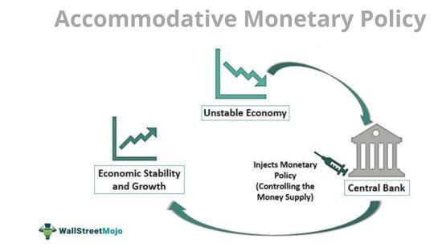

Understanding the interplay between economic policies and trading strategies is essential for grasping the modern financial landscape. Economies today are inextricably linked to both the decisions of central banks and the actions of market participants employing advanced technological tools. Accommodative monetary policy, characterized by lower interest rates and increased money supply, is a principal tool used by central banks to stimulate economic growth, particularly during periods of economic downturn. This policy aims to reduce the cost of borrowing, thereby encouraging spending and investment—key drivers of economic activity.

As central banks implement such policies in response to economic challenges, their actions create ripples across global markets. Investors and traders must quickly interpret and respond to these shifts to capitalize on emerging opportunities or mitigate risks. This has led to the prominence of algorithmic trading, where sophisticated computer algorithms execute trades based on predefined criteria. These algorithms are capable of processing vast amounts of data and executing trades at speeds and frequencies beyond human capability. Such technology allows traders to adapt swiftly to changing market conditions induced by economic policy decisions.



This article focuses on the concepts of accommodative monetary policy and its influence on algo trading. We will explore the fundamental principles of these policies and the technological strategies used in trading. By examining how central banks use these policies to stimulate growth and how traders leverage algorithms, we aim to provide comprehensive insights into the resultant economic and market effects. The intricate interaction between these two forces not only impacts economies but also shapes market dynamics, presenting both opportunities and challenges for stakeholders in the financial ecosystem.

## Table of Contents

## Understanding Accommodative Monetary Policy

Accommodative monetary policy is a strategic tool employed by central banks to stimulate economic growth by making borrowing more attractive and boosting consumer and business spending. It primarily involves reducing interest rates and expanding the money supply, with the aim of lowering the cost of borrowing and incentivizing financial activities. Two key instruments of accommodative monetary policy are the manipulation of the Federal funds rate and the implementation of quantitative easing.

The Federal funds rate is the interest rate at which depository institutions lend balances to each other overnight. By lowering this rate, the central bank makes borrowing cheaper, thereby encouraging banks to lend more to businesses and consumers. This increase in lending typically leads to higher levels of consumer spending and investment by businesses, thus stimulating economic growth.

Quantitative easing (QE) is another vital tool used in accommodative monetary policy. It involves the central bank purchasing long-term securities, such as government bonds and mortgage-backed securities, from the open market. This process injects liquidity into the banking system, encouraging banks to increase lending and investment in the economy. Additionally, by buying these securities, the central bank drives up their prices, which decreases their yields and lowers long-term interest rates. This, in turn, further reduces the cost of borrowing for households and companies.

Historically, significant examples of accommodative monetary policy were observed in the responses to the 2008 financial crisis and the COVID-19 pandemic. During the 2008 crisis, central banks around the world, including the U.S. Federal Reserve, reduced interest rates to near zero and implemented extensive quantitative easing programs. These measures aimed to stabilize financial markets and support economic recovery by facilitating easier access to credit and encouraging spending.

Similarly, in response to the economic disruptions caused by the COVID-19 pandemic, central banks once again employed accommodative policies. The Federal Reserve, for instance, cut interest rates to near-zero levels and launched unprecedented QE measures to maintain [liquidity](/wiki/liquidity-risk-premium) and support the functioning of financial markets. These interventions aimed to cushion the economic impact of the pandemic by promoting borrowing and spending among consumers and businesses.

In summary, accommodative monetary policies are essential tools used by central banks to foster economic growth, especially during periods of economic distress. By lowering the cost of borrowing and expanding liquidity in the financial system, these policies aim to boost spending and investment, ultimately stimulating economic activity. However, while these measures have proven effective in mitigating economic downturns, they also come with potential risks, such as inflationary pressures and the creation of financial bubbles, and must be carefully managed to avoid long-term instability.

## Economic Impacts of Accommodative Monetary Policy

Accommodative monetary policy, employed by central banks to stimulate economic growth, primarily involves reducing interest rates and expanding the money supply. By decreasing borrowing costs, it encourages both consumer and business spending, which can lead to increased economic activity and employment levels. Historically, such policies have been pivotal during periods of economic downturn.

The potential for accommodative policies to spur employment is significant as lower interest rates reduce the costs associated with loans for investments in business expansion and capital projects. As businesses grow, they tend to hire more employees, thus reducing unemployment. Moreover, increased consumer spending driven by lower interest rates supports demand across various sectors, further encouraging employment.

However, these policies also come with risks, one of the most notable being inflation. When interest rates are low for an extended period, and the money supply is increased substantially, there can be a rise in price levels as demand outpaces supply. Central banks must carefully balance the goal of stimulating growth with the necessity to control inflation. An extreme inflationary environment can erode purchasing power and destabilize the economy.

Critics of accommodative monetary policies often point to the risk of asset bubbles. Prolonged low interest rates can lead to excessive speculation in assets like real estate and equities, where investors seek higher returns in a low-yield environment. This speculative behavior can inflate asset prices beyond their intrinsic values, posing threats of market corrections that can have widespread economic repercussions.

Long-term economic stability concerns also arise from accommodative policies. When interest rates are artificially maintained at low levels, it can lead to inefficient allocation of resources, with investments channeled into less productive areas simply because capital is cheap. This misallocation can hinder long-term economic growth prospects and lead to vulnerabilities once monetary conditions normalize.

To navigate these challenges and maintain economic stability, central banks often transition between accommodative and tight monetary policies. Tight monetary policy involves increasing interest rates to temper economic growth and control inflation. The timing and execution of these transitions are critical; premature tightening can stifle growth, while delayed tightening can exacerbate inflationary pressures.

Central banks employ a variety of macroeconomic indicators to inform their policy decisions. Key metrics include inflation rates, employment figures, GDP growth rates, and other economic activity indicators. By analyzing these data points, central banks aim to anticipate and modulate economic fluctuations effectively.

Overall, while accommodative monetary policy is a powerful tool for economic revitalization, its implementation requires meticulous management to mitigate associated risks. Central banks must exercise strategic foresight to ensure that short-term economic gains do not succumb to long-term economic instabilities.

 to Algo Trading

Algorithmic trading, often referred to as algo trading, is the practice of using computers and sophisticated algorithms to automate the execution of trading strategies. This technological advancement aims to leverage the speed and precision of computers to process vast amounts of market data and execute trades with efficiency far beyond human capabilities.

At its core, algo trading employs mathematical models and algorithms to make decisions about the timing, price, and quantity of orders. These algorithms are programmed to analyze complex market data, identify lucrative trading opportunities, and execute trades at high speed and frequency. Such capabilities enable traders to capitalize on short-lived market inefficiencies, often within fractions of a second.

One of the primary benefits of algo trading is its ability to minimize the impact of human emotions on trading decisions, leading to more consistent and objective execution. Additionally, algorithmic strategies can be backtested using historical data, ensuring their viability under varying market conditions before actual deployment.

The technological backbone of algo trading encompasses high-performance computing and low-latency network connections. These requirements are crucial as trading algorithms must access real-time market data and execute orders on exchanges at lightning speed. In this environment, even microseconds can be substantial, driving a continuous arms race for faster and more effective technological solutions.

To elucidate the role of algorithms in trading, consider their ability to respond dynamically to economic policy changes. For instance, when accommodative monetary policies are announced, resulting in [interest rate](/wiki/interest-rate-trading-strategies) adjustments, algo trading systems can quickly assess the shift's implications across different asset classes and initiate trades accordingly. These rapid responses help ensure market liquidity and efficiency, albeit sometimes at the cost of increased market [volatility](/wiki/volatility-trading-strategies).

Understanding the impact of technology on trading strategies is essential, as it not only influences market dynamics but also shapes how economic policies are reflected in asset prices. Technological advancements facilitate the execution of complex strategies like statistical [arbitrage](/wiki/arbitrage), [market making](/wiki/market-making), and sentiment analysis, thus broadening the spectrum of strategic possibilities available to traders.

In summary, algo trading stands at the intersection of technology and finance, revolutionizing how trading strategies are executed. By automating decision-making processes, it enhances the efficiency and accuracy of trades while enabling market participants to adeptly navigate and respond to policy changes and market conditions.

## The Intersection of Monetary Policy and Algo Trading

Accommodative monetary policy exerts a substantial influence on market conditions, prompting the need for [algorithmic trading](/wiki/algorithmic-trading) models to quickly adapt to these changes. Trading algorithms are crafted with the capability to process a vast array of data and respond accordingly. They analyze macroeconomic indicators, such as interest rates, employment [statistics](/wiki/bayesian-statistics), and inflation reports, which are directly affected by central bank policies. This analysis enables algorithms to position trades that align with anticipated market movements resulting from policy shifts.

Algorithmic trading systems are designed to interpret policy changes through specific data feeds. High-frequency trading ([HFT](/wiki/high-frequency-trading-strategies)) algorithms, for example, rely on economic news releases to gauge market sentiment and adjust their strategies. They often use [machine learning](/wiki/machine-learning) techniques to predict potential price movements based on historical data and real-time information. In Python, libraries like `pandas`, `scikit-learn`, and `numpy` can be employed to build predictive models that simulate various policy outcomes.

Algo trading can significantly amplify market movements during periods of accommodative monetary policy. For instance, when interest rates are lowered, resulting in cheaper borrowing costs, the stock market may experience heightened buying activity. Algorithms, detecting these shifts, can execute large volumes of trades at speeds unmatchable by human traders, further driving the price movements initiated by the policy change.

To illustrate, consider an algorithm set to respond to the Federal Reserve's interest rate announcements. When a rate cut is announced, the algorithm might trigger a series of buy orders based on historical market reactions to similar announcements. The formula for calculating expected returns from a rate cut might involve elements such as prior interest rate changes ($\Delta r$), historical price responses ($\Delta P$), and current market volatility ($\sigma$):

$$
\text{Expected Return} = f(\Delta r, \Delta P, \sigma)
$$

In Python, a simplified model can be coded as:

```python
import numpy as np

def expected_return(rate_change, price_change, volatility):
    return np.dot(rate_change, price_change) * (1 - volatility)

rate_change = -0.25  # interest rate cut of 0.25%
price_change = 0.02  # assumed market price increase of 2%
volatility = 0.05    # 5% volatility

return_estimate = expected_return(rate_change, price_change, volatility)
print(f"Estimated Return: {return_estimate:.2f}%")
```

Data plays a crucial role not only in executing trades but also in forecasting market trends under different monetary policy environments. Algorithms are updated regularly with the latest economic figures and projections, ensuring their strategies remain relevant amidst policy alterations. Additionally, sentiment analysis of news articles, social media, and central bank statements can be integrated to refine predictions and strategies.

In conclusion, the intersection of accommodative monetary policy and algorithmic trading highlights a complex feedback loop where policy changes directly impact trading strategies, which in turn can influence market dynamics. This dynamic interaction underpins the necessity for robust data-driven algorithms capable of not only reacting to immediate market conditions but also anticipating future trends, thus enhancing both economic stability and market efficiency.

## Challenges and Risks Associated with Accommodative Policy and Algo Trading

Accommodative monetary policies and algorithmic trading are influential forces in modern financial markets, yet both come with significant challenges and risks. Accommodative monetary policy, which aims to stimulate economic growth through lower interest rates and increased money supply, can inadvertently destabilize markets. For example, prolonged low interest rates can lead to excessive risk-taking as investors search for higher yields, potentially inflating asset bubbles that may burst when rates rise again. Furthermore, the effectiveness of such policies can be limited by constraints in policy transmission, where lower interest rates do not necessarily translate to increased lending and spending if banks remain risk-averse or consumers and businesses lack confidence.

Algorithmic trading introduces another layer of complexity and potential instability. While algo trading increases market efficiency and liquidity, it also poses risks of market disruptions. High-frequency trading (HFT), a subset of algo trading, can contribute to market volatility and extreme events, such as the "flash crash" of May 6, 2010, when the Dow Jones Industrial Average dropped nearly 1,000 points within minutes before recovering. The speed and automation inherent in algo trading can lead to unintended consequences, particularly when algorithms interact in unpredictable ways.

Technical glitches within trading algorithms are another concern. Bugs or misconfigurations can cause erroneous trades, leading to substantial financial losses. In response to these risks, robust risk management practices are essential. One strategy is implementing circuit breakers that pause trading during extreme volatility, allowing human intervention to address problems. Rigorous testing and validation of algorithms before deployment are also critical to ensure they behave as intended under various market conditions.

Regulatory frameworks play a crucial role in mitigating these challenges. Policymakers and regulatory bodies are tasked with overseeing both monetary decisions and financial market operations to safeguard against systemic risks. For instance, stress testing of financial institutions can ensure they remain resilient under various economic scenarios, thereby maintaining effective policy transmission. Similarly, regulators are increasingly focusing on the supervision of algorithmic trading practices, requiring disclosure of trading algorithms and mandating fail-safes to prevent market manipulations or systemic failures.

By examining real-world scenarios, the impact of accommodative policies and algo trading becomes apparent. During the Global Financial Crisis of 2008, central banks implemented aggressive accommodative policies to stabilize economies, which, while effective in the short term, sparked debates about potential long-term consequences like inflated asset prices. In terms of algo trading, the Knight Capital incident of 2012 serves as a cautionary tale, where erroneous software deployment resulted in a $440 million loss due to a series of misplaced trades executed within minutes.

In conclusion, while accommodative monetary policies and algo trading are instrumental in shaping contemporary financial markets, they also introduce risks that require astute management and regulation. Balancing growth stimulation with market stability and ensuring that advanced trading technologies do not expose markets to undue risk are ongoing challenges for policymakers, traders, and regulators.

## Conclusion

The dynamic interaction between economic policy and trading technology is a critical aspect of shaping contemporary financial markets. Accommodative monetary policy, primarily executed through lowering interest rates and expanding the money supply, aims to foster economic growth by making capital more accessible. Understanding the macroeconomic effects of such policies is crucial for economists, policymakers, and investors, as it elucidates the mechanisms through which central banks exert influence over economic activity and inflation dynamics.

On the other hand, algorithmic trading, or algo trading, provides valuable insights into the microstructure of markets. These computer-driven strategies can process vast amounts of market data and execute trades at speeds and scales beyond human capability, thus playing a pivotal role in determining market liquidity and price efficiency. The integration of sophisticated algorithms allows traders to react swiftly to market changes induced by monetary policy shifts, thereby impacting market volatility.

The effective management and comprehension of both accommodative monetary policy and algorithmic trading are indispensable for ensuring economic stability and enhancing market efficiency. Policymakers must keenly assess the broader economic implications of their decisions, balancing growth stimulation with inflation control. Similarly, traders and financial institutions need to develop and refine algorithmic strategies to adapt to evolving market conditions resulting from policy adjustments.

Looking ahead, the potential future developments in economic policy and trading technology present both opportunities and challenges for policymakers and traders. The increasing sophistication of financial markets necessitates continuous adaptation and strategic foresight. Innovations such as machine learning and [artificial intelligence](/wiki/ai-artificial-intelligence) are likely to further revolutionize trading strategies, enabling even more precise and responsive models. For policymakers, this means evolving their approach to accommodate new technologies while maintaining financial stability.

In this rapidly changing financial environment, the emphasis must be on fostering an ecosystem where economic policy evolves hand in hand with technological advancements. This synergy will be crucial in navigating the complexities of modern financial markets and ensuring a stable, efficient, and resilient economic landscape for the future.

## References & Further Reading

[1]: Bernanke, B. S., & Reinhart, V. R. (2004). ["Conducting monetary policy at very low short-term interest rates."](https://www.aeaweb.org/articles?id=10.1257/0002828041302118) American Economic Review, 94(2), 85-90.

[2]: Bernanke, B. S. (2020). ["The New Tools of Monetary Policy."](https://www.aeaweb.org/articles?id=10.1257/aer.110.4.943) American Economic Journal: Macroeconomics, 12(4), 1-38.

[3]: Brunnermeier, M. K., & Sannikov, Y. (2016). ["The I Theory of Money."](https://www.nber.org/papers/w22533) Princeton University.

[4]: ["Algorithmic and High-Frequency Trading"](https://www.amazon.com/Algorithmic-High-Frequency-Trading-Mathematics-Finance/dp/1107091144) by Álvaro Cartea, Sebastian Jaimungal, and José Penalva

[5]: Hendershott, T., Jones, C. M., & Menkveld, A. J. (2011). ["Does Algorithmic Trading Improve Liquidity?"](https://onlinelibrary.wiley.com/doi/full/10.1111/j.1540-6261.2010.01624.x) The Journal of Finance, 66(1), 1-33.

[6]: ["Adaptive Markets: Financial Evolution at the Speed of Thought"](https://www.jstor.org/stable/j.ctvc7778k) by Andrew W. Lo