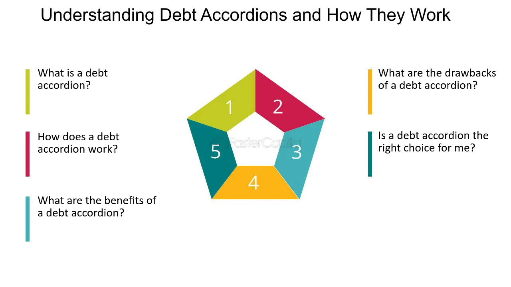

In today's dynamic financial landscape, businesses and individuals are constantly seeking innovative financial solutions to enhance flexibility and maximize opportunities. The need to efficiently manage credit lines and capitalize on market fluctuations has led to the development of financial instruments that cater to varied requirements. One such innovative instrument is the loan terms accordion feature. This feature is designed to offer a unique approach to managing credit arrangements by providing borrowers the flexibility to adjust their credit lines within predefined limits under an existing loan agreement.

The accordion feature, often regarded as a dynamic tool in loan agreements, allows borrowers to scale their financial resources according to changing business needs without undergoing the cumbersome process of renegotiating new loans. This inherent flexibility can be especially advantageous in situations where immediate access to capital is required to exploit emerging opportunities or respond to unforeseen challenges.



In financial markets, adaptability and prompt decision-making are critical. The implications of the accordion feature extend beyond traditional business applications and are increasingly relevant in areas such as algorithmic trading. The integration of this feature in algorithmic trading strategies enables traders to swiftly adjust their financial positions, manage risks effectively, and engage in strategic decision-making processes that align with evolving market conditions.

In this article, we will explore the concept of the accordion feature, its implications in loan agreements, and its relevance to algorithmic trading, providing insights into how businesses and traders can leverage this tool to optimize their financial strategies.

## Table of Contents

## Understanding the Accordion Feature

The accordion feature, often referred to as a debt accordion, provides substantial flexibility within the framework of a loan agreement. It allows borrowers to expand their line of credit or add additional loan terms as per the evolving needs of their business without undergoing the lengthy process of drafting a new credit agreement. This mechanism is especially useful for businesses that anticipate future capital requirements or wish to remain agile in responding to unforeseen opportunities or challenges.

The accordioned extension of credit typically operates by initially setting a maximum threshold for potential credit expansion. This threshold delineates the upper limit within which the borrower may increase their credit line at their discretion, thus offering a cushion of preparedness for potential growth stimuli or emergency financial requirements. Importantly, the decision to augment the credit line is non-obligatory; borrowers are not compelled to utilize the full extent of the expansion capacity, adding a layer of conservatism and flexibility to financial management.

Moreover, the continuity of original loan terms remains a cornerstone of the accordion feature. By maintaining the pre-existing conditions of the loan agreement—such as interest rates, maturity dates, and covenants—borrowers can avoid the complexities and costs typically associated with renegotiating these terms. This feature, thereby, streamlines the process of credit expansion and ensures a seamless financial operation without introducing additional uncertainties or restructuring expenses.

In essence, the accordion feature serves as a strategic tool for businesses poised for growth or those navigating uncertain markets. By affording the ability to rapidly adjust financial resources in alignment with their immediate strategic needs, businesses can sustain operational [momentum](/wiki/momentum) and capitalize on transient opportunities with greater ease and confidence.

## Benefits of Accordion Features in Loan Agreements

Accordion features in loan agreements provide a range of benefits that significantly enhance a borrower's financial operations. One of the primary advantages is increased financial flexibility. This is achieved by allowing borrowers to expand their lines of credit in response to emerging opportunities or unforeseen challenges without renegotiating existing loan agreements. Such flexibility is crucial for businesses aiming to maintain competitiveness in rapidly changing markets.

For companies with high growth potential, accordion features serve as a critical tool for executing strategic growth initiatives. These businesses often encounter fluctuating capital requirements, which could impede their ability to capitalize on growth opportunities. By using an accordion feature, they can secure the necessary funds quickly, ensuring that growth strategies are implemented efficiently and without delay. This pre-emptive access to additional capital is vital not only for expansion but also for investments in research, development, and other capital-intensive activities.

Further, the expedited access to funds afforded by accordion features reduces the administrative burden and time delays typically associated with negotiating new loan terms. In volatile markets, timing can significantly impact a business's ability to seize market opportunities. Thus, having a ready mechanism to access additional resources streamlines financial and operational decision-making processes, allowing businesses to act swiftly and decisively.

Overall, accordion features in loan agreements provide a strategic advantage by aligning financial resources with business objectives. This advantage is particularly pronounced for firms facing uncertain market conditions, where the ability to adapt rapidly to change is imperative for continued success and market positioning.

## Applications in Algorithmic Trading

Algorithmic trading, a cornerstone of modern financial markets, emphasizes rapid and strategic financial decisions. Within this context, the accordion feature emerges as a vital tool due to its ability to adjust credit lines efficiently. Traders, particularly those employing algorithmic strategies, benefit from the agility that accordion features introduce, capturing minute-to-minute fluctuations in financial markets by increasing or decreasing credit lines swiftly.

The key advantage of integrating accordion features into trading strategies lies in the ability to access increased capital at critical moments. Algorithmic traders often confront conditions where delays in capital allocation can lead to missed opportunities or increased risks. The flexibility of the accordion feature ensures that traders have immediate access to necessary funds, thereby optimizing trading positions and managing risks effectively.

For instance, consider a [volatility](/wiki/volatility-trading-strategies) [arbitrage](/wiki/arbitrage) strategy, where a trader needs additional capital to adjust positions based on sudden changes in market volatility. By utilizing an accordion feature, the trader can quickly expand their credit line, ensuring an optimal allocation of resources and adherence to trading algorithms.

The integration of accordion features into trading algorithms can be illustrated through a simple Python script that adjusts trading positions based on available credit:

```python
def adjust_positions(available_credit, current_positions, market_signals):
    max_investment_ratio = 0.1

    for signal in market_signals:
        if signal == 'buy' and available_credit > max_investment_ratio * available_credit:
            current_positions += available_credit * max_investment_ratio
            available_credit -= available_credit * max_investment_ratio
        elif signal == 'sell' and current_positions > 0:
            available_credit += current_positions * max_investment_ratio
            current_positions -= current_positions * max_investment_ratio
    return current_positions, available_credit

# Example usage
available_credit = 1000000  # $1 million available credit
current_positions = 0
market_signals = ['buy', 'hold', 'sell', 'buy']

new_positions, remaining_credit = adjust_positions(available_credit, current_positions, market_signals)
print(f"Adjusted Positions: {new_positions}, Remaining Credit: {remaining_credit}")
```

In this example, the algorithm dynamically adjusts trading positions based on the availability of credit, illustrating how accordion features can enhance trading operations. By maintaining a fluid approach to credit, traders ensure they are not constrained by rigid capital structures, thus harnessing market opportunities proactively.

In summary, the application of accordion features in [algorithmic trading](/wiki/algorithmic-trading) provides traders with an adaptable and efficient method to optimize trading strategies. By enabling quick access to expanded credit lines, traders can better manage risks and seize opportunities, thus maintaining a competitive edge in dynamic financial markets.

## Real-World Examples

Companies across various industries have successfully employed the accordion feature to enhance their operational capabilities and seize growth opportunities. A notable example is ABC Corp, a mid-sized enterprise specializing in consumer electronics. Faced with an increasingly competitive market and a desire to expand its sales division, ABC Corp leveraged the accordion feature within its existing credit agreement to bolster its financial resources.

ABC Corp's strategic use of the accordion feature began when the company identified a lucrative opportunity to increase market share by launching a new line of innovative gadgets. By negotiating an incremental increase in their credit line, ABC Corp was able to secure the necessary funds to ramp up production and marketing efforts swiftly. The additional capital enabled the company to expedite the hiring of sales personnel and enhance its distribution channels without undergoing the protracted process of arranging a new loan.

This approach was instrumental in ABC Corp's successful expansion into new geographic markets. By incrementally increasing its credit line, the company mitigated the risk of over-leverage while maintaining its existing financial covenants. This financial maneuver not only positioned ABC Corp more favorably in the market but also increased its revenue streams substantially.

The experience of XYZ Inc, a rapidly growing startup in the tech sector, further underscores the utility of the accordion feature. In anticipation of a major product launch, XYZ Inc utilized this feature to augment its credit capacity promptly. The added funds were allocated towards accelerating research and development as well as bolstering customer service capabilities. As a result, XYZ Inc experienced a 30% increase in sales within the first quarter post-launch, demonstrating how the accordion feature can be effectively harnessed to capture growth opportunities.

These cases exemplify how companies can strategically navigate financial challenges and opportunities through the smart application of the accordion feature. By allowing for flexible, incremental credit increases, businesses like ABC Corp and XYZ Inc can efficiently manage expansion plans, optimize their market positioning, and drive long-term success without the onerous burden of restructuring loan terms.

## Considerations and Risks

While the accordion feature offers notable flexibility by allowing borrowers to expand their line of credit as needed, it is critical to assess the associated costs of maintaining unused credit options. The primary cost component is the commitment fee, a charge imposed by lenders to compensate for the reserved credit capacity that remains untapped. This can impact a company's financial statements, ultimately affecting [liquidity](/wiki/liquidity-risk-premium) and profitability metrics.

Understanding financial covenants and adhering strictly to compliance requirements are essential to maximize the benefits offered by accordion features. Financial covenants are stipulations set by lenders that borrowers must meet throughout the duration of the loan agreement. These can include maintaining specific financial ratios, such as debt-to-equity and interest coverage ratios. Failing to comply with these covenants can lead to defaults, resulting in penalties or retraction of credit enhancements.

Consideration needs to be given to potential risks associated with over-leveraging. As accordion features enable easier access to additional borrowing, there is a possibility that organizations, driven by optimistic growth projections, might increase their debt levels without matching risk assessments. An over-leveraged position could strain an organization’s cash flow and impair its ability to meet future obligations, leading to financial stress.

To mitigate these risks, companies can adopt strategic measures such as:

1. **Rigorous Financial Planning**: Engage in comprehensive financial modeling and scenario analysis to predict cash flow needs and evaluate the long-term implications of utilizing accordion features.

2. **Compliance Systems**: Implement robust systems for monitoring compliance with financial covenants to provide timely alerts for potential breaches and ensure corrective actions can be initiated promptly.

3. **Risk Management Frameworks**: Develop and maintain a strong risk management framework to evaluate the borrowing capacity in alignment with the organization's overall capital structure and risk appetite.

By thoroughly understanding and anticipating these considerations and risks, organizations can collaboratively work with their lenders to tailor accordion features in a manner that aligns with their strategic financial goals while minimizing exposure to potential downsides. This balanced approach helps in maintaining financial health and seizing growth opportunities responsibly.

## Conclusion

The accordion feature in loan agreements serves as a powerful tool for businesses and traders aiming to adapt to the ever-changing financial market. This feature provides a strategic advantage by allowing firms to extend their credit lines as opportunities arise or as market conditions demand. Such adaptability is crucial in maintaining competitive advantage, where quick access to capital can mean the difference between seizing new opportunities or falling behind.

Effectively utilizing the accordion feature enables businesses to optimize their financial strategies, enabling them to align their capital resources with growth opportunities without the delays involved in negotiating entirely new loan agreements. This capability promotes efficient planning and execution of strategic initiatives, particularly in volatile industries where timing is critical.

Moreover, in today's financial landscape, the combination of flexibility and the ability to make swift strategic decisions is essential. As global markets continue to evolve at a rapid pace, those who can adapt quickly by leveraging financial instruments such as the accordion feature are better positioned to succeed. This adaptability offers a hedge against uncertainty and the potential to capitalize on market dynamics that favor the well-prepared and quick-acting entity.

By incorporating the accordion feature into their financial toolkit, businesses and traders reinforce their ability to navigate complexities and enhance their resilience, ensuring they remain poised for growth and responsive to market shifts.

## References & Further Reading

[1]: Porter, K., & Nater, J. (2019). ["The Accordion Feature: Structuring Credit Facilities to Meet Clients' Evolving Needs."](https://onlinelibrary.wiley.com/doi/full/10.1002/joe.22250) Reed Smith LLP.

[2]: Lopez de Prado, M. (2018). ["Advances in Financial Machine Learning"](https://www.amazon.com/Advances-Financial-Machine-Learning-Marcos/dp/1119482089). Wiley.

[3]: Chan, E. P. (2009). ["Quantitative Trading: How to Build Your Own Algorithmic Trading Business."](https://github.com/ftvision/quant_trading_echan_book) Wiley.

[4]: Aronson, D. R. (2007). ["Evidence-Based Technical Analysis: Applying the Scientific Method and Statistical Inference to Trading Signals."](https://www.amazon.com/Evidence-Based-Technical-Analysis-Scientific-Statistical/dp/0470008741) Wiley.

[5]: Jansen, S. (2018). ["Machine Learning for Algorithmic Trading."](https://github.com/stefan-jansen/machine-learning-for-trading) Packt Publishing.