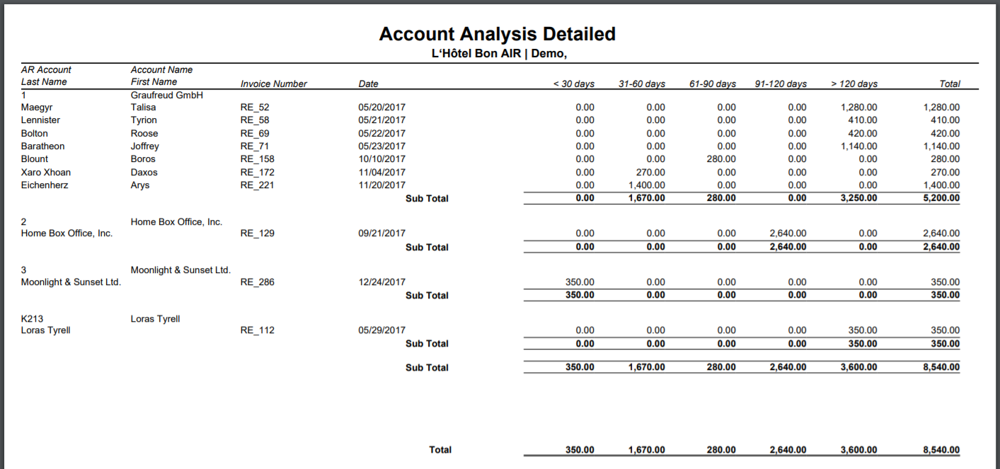

## Table of Contents

## What is account analysis and why is it important?

Account analysis is when you look closely at the money coming in and going out of a bank account or a business's finances. It helps you see where the money is coming from, where it's going, and how it's being used. This can be done for personal bank accounts, business accounts, or even for big companies to keep track of their money.

It's important because it helps people and businesses make smart choices about their money. By understanding where the money is going, you can find ways to save money, spend it better, or invest it wisely. For businesses, it can show if they are making a profit or if they need to change how they do things. It's like a health check for your finances, making sure everything is working well and helping you plan for the future.

## What are the basic components of an account?

An account has a few basic parts that help keep track of money. The first part is the account balance, which shows how much money is in the account at any time. This number goes up when you add money and goes down when you take money out. The second part is transactions, which are records of every time money moves in or out of the account. Each transaction has details like the date, the amount, and what it was for, like buying something or getting paid.

Another important part is the account statement, which is a summary of all the transactions over a certain time, usually a month. It helps you see all the money that came in and went out, and it shows the starting and ending balance for that period. The last part is the account type, which tells you what kind of account it is, like a checking account for everyday spending or a savings account for saving money over time. Knowing these parts helps you manage your money better.

## How do you perform a simple account analysis?

To do a simple account analysis, start by gathering all your account statements for the time you want to look at. This could be a month or a year. Look at the starting balance and the ending balance to see how much your money changed. Then, go through all the transactions one by one. Write down where the money came from, like your job or gifts, and where it went, like bills or shopping. This helps you see the big picture of your money.

Next, group the transactions into categories like income, spending, and savings. Add up the numbers in each group to see how much money is coming in, how much is going out, and how much you're saving. Look for any patterns or big changes. For example, if you're spending a lot on eating out, you might want to cook more at home to save money. By doing this, you can make better choices about how to use your money in the future.

## What are the common types of accounts in business?

In a business, there are different types of accounts that help keep track of money. The first type is the asset account, which shows what the business owns, like money in the bank, buildings, or equipment. Another type is the liability account, which shows what the business owes, like loans or bills that need to be paid. There's also the equity account, which shows the owner's share in the business after all debts are paid.

Another common type of account is the revenue account, which records the money coming into the business from sales or services. On the other hand, the expense account tracks the money going out for things like rent, salaries, or supplies. These accounts help business owners see if they are making a profit or if they need to make changes. By keeping these accounts organized, a business can plan better and make smart financial decisions.

## Can you explain the difference between a balance sheet and an income statement in account analysis?

A balance sheet is like a snapshot of a business's money at a certain time. It shows what the business owns, called assets, what it owes, called liabilities, and the owner's share, called equity. Think of it like a picture of your money right now. It helps you see if the business has enough money to pay its bills and how much the owner's part of the business is worth.

An income statement, on the other hand, is like a report card of the business's money over a period of time, like a month or a year. It shows how much money came in from sales or services, called revenue, and how much money went out for things like rent or salaries, called expenses. By looking at the income statement, you can see if the business made more money than it spent, which is called a profit, or if it spent more than it made, which is called a loss. It helps you understand if the business is doing well financially over time.

## How do you analyze accounts receivable and what metrics should you use?

Analyzing accounts receivable means looking at the money that customers owe your business. You want to see how quickly they are paying you and if there are any problems with getting your money. To do this, you can use a few simple metrics. One is the average collection period, which tells you how many days it takes on average for customers to pay their bills. Another is the accounts receivable turnover ratio, which shows how many times in a year you collect all the money owed to you. These numbers help you understand if your customers are paying on time or if you need to change how you handle payments.

Another important metric is the aging of accounts receivable, which breaks down how long invoices have been unpaid. This helps you see if there are any old debts that might be hard to collect. If you see a lot of money owed for a long time, you might need to be more strict about when customers pay or even think about not doing business with some customers. By keeping an eye on these metrics, you can make sure your business is getting paid on time and manage your money better.

## What role does account analysis play in budgeting and forecasting?

Account analysis is really important for making a budget and guessing what will happen with money in the future. When you look at your accounts, you see where your money is coming from and where it's going. This helps you make a plan for how to spend your money in the future. For example, if you see you're spending a lot on eating out, you might decide to cook more at home to save money. By understanding your past spending, you can make a budget that fits your needs and helps you save for things you want.

Forecasting, or guessing what will happen with money in the future, also uses account analysis. When you look at your accounts, you can see patterns in how much money you make and spend. This helps you predict how much money you'll have in the future. For example, if you see that your business makes more money in the summer, you can plan to save some of that money for slower times. By using account analysis, you can make better guesses about your money and plan for the future.

## How can account analysis help in identifying financial fraud?

Account analysis can help find financial fraud by looking closely at the money coming in and going out of an account. When you check the account regularly, you can spot strange things that might be signs of fraud. For example, if you see payments to people or companies you don't know, or if there are a lot of small transactions that don't make sense, these could be red flags. By keeping an eye on the account, you can catch these problems early and stop the fraud before it gets worse.

Another way account analysis helps is by looking at patterns in the account. If someone is trying to steal money, they might do it in a way that looks normal at first. But if you look at the account over time, you might see that the same kind of strange thing keeps happening, like money going out at the same time every month to a new account. By understanding what is normal for your account, you can quickly see when something is wrong and take action to protect your money.

## What advanced techniques can be used for deeper account analysis?

For a deeper look at accounts, you can use something called data analytics. This means using computers to look at a lot of numbers and find patterns that might be hard to see just by looking at the account statements. For example, you can use software to check for strange things like payments that happen at odd times or to new accounts. This can help you find fraud or mistakes that you might miss if you were just looking at the numbers yourself. Data analytics can also help you predict what might happen with your money in the future by looking at past patterns.

Another advanced technique is called ratio analysis. This is when you use math to compare different parts of your accounts, like how much money you make compared to how much you spend. By looking at these ratios, you can see if your business is healthy or if there are problems you need to fix. For example, if your debt is growing faster than your income, that's a warning sign. Ratio analysis can also help you compare your business to others in the same industry to see how you're doing. By using these advanced techniques, you can get a much better understanding of your money and make smarter decisions.

## How do you integrate account analysis with other financial analysis tools?

Integrating account analysis with other financial analysis tools helps you get a full picture of your money. You can start by using account analysis to look at your money coming in and going out. Then, you can use tools like cash flow analysis to see how money moves through your business over time. This helps you understand if you have enough money to pay your bills and if you need to change how you handle your money. By combining account analysis with cash flow analysis, you can make better plans for the future and make sure your business stays healthy.

Another way to integrate account analysis is by using it with budgeting and forecasting tools. Account analysis shows you where your money has been going, which helps you make a budget that fits your needs. Then, you can use forecasting tools to guess what will happen with your money in the future based on what you've seen in the past. This helps you plan for things like buying new equipment or saving for slow times. By using account analysis with budgeting and forecasting, you can make smart choices about your money and keep your business on track.

## What are some case studies or real-world examples of account analysis?

A small business owner named Sarah runs a bakery. She uses account analysis to keep track of her money. Every month, she looks at her account statements to see how much money she made from selling cakes and how much she spent on ingredients and rent. One day, she noticed that her spending on ingredients was going up a lot. By looking closer, she found out that one of her suppliers had raised their prices. Sarah used this information to find a new supplier with better prices, which helped her save money and keep her bakery profitable.

In another example, a big company called TechCo uses account analysis to find fraud. They have a lot of money coming in and going out every day, so it's hard to spot problems just by looking at the numbers. TechCo uses special software to analyze their accounts and look for strange patterns. One time, the software found a lot of small payments going to a new account every month. After looking into it, TechCo found out that an employee was stealing money. By using account analysis, they were able to stop the fraud and save a lot of money.

## How can software and technology enhance the process of account analysis?

Software and technology make account analysis a lot easier and faster. Instead of looking at numbers on paper, you can use a computer to do the work for you. Special programs can look at a lot of numbers at once and find patterns that you might miss if you were doing it by hand. For example, if you have a business, the software can show you how much money you're making and spending every month, and even help you see if there are any strange things happening, like someone stealing money. This saves you time and helps you make better decisions about your money.

Another way technology helps is by making it easy to keep track of your money over time. You can use apps on your phone or computer to see your account statements whenever you want, and the software can even make graphs and charts to show you what's happening with your money. This makes it easier to see if you're spending too much in one area or if you need to save more for the future. By using technology, you can keep your money organized and make smart choices about how to use it.

## What is account analysis?

Account analysis is a meticulous evaluation process where each transaction line item within a statement for a specific account is examined in detail. This analysis identifies trends and assesses account performance, offering vital insights for informed decision-making. By closely scrutinizing transaction data, analysts can detect patterns related to spending, revenue streams, or financial discrepancies, allowing businesses or individuals to make proactive adjustments.

The process of account analysis typically involves dissecting data to understand both the immediate and broader implications for an organization's finances. It requires a comprehensive understanding of the data and the company’s financial dynamics. Experienced accountants are often responsible for conducting this analysis due to their expertise in navigating complex financial documents and their adeptness at interpreting numbers within the context of a company's overall fiscal strategy.

For instance, consider a company's ledger with numerous entries that denote purchases, sales, or other financial activities. An accountant might track specific metrics like average transaction size or identify anomalies in spending patterns over time. This could involve calculating the variance between payments or analyzing month-to-month sales growth:

$$
\text{Variance} = \frac{\sum (X_i - \bar{X})^2}{n-1}
$$

where $X_i$ represents individual transaction values, $\bar{X}$ is the mean of these transactions, and $n$ is the number of transactions.

Furthermore, account analysis plays a crucial role in enhancing financial transparency and accountability. By meticulously auditing transaction details, accountants ensure accuracy in financial reporting, which is pivotal for strategic planning and regulatory compliance. This accuracy not only aids in steering the company’s financial direction but also strengthens stakeholders’ confidence in the financial health of the organization.

## References & Further Reading

[1]: Bergstra, J., Bardenet, R., Bengio, Y., & Kégl, B. (2011). ["Algorithms for Hyper-Parameter Optimization."](https://dl.acm.org/doi/10.5555/2986459.2986743) Advances in Neural Information Processing Systems 24.

[2]: ["Advances in Financial Machine Learning"](https://www.amazon.com/Advances-Financial-Machine-Learning-Marcos/dp/1119482089) by Marcos Lopez de Prado

[3]: ["Evidence-Based Technical Analysis: Applying the Scientific Method and Statistical Inference to Trading Signals"](https://www.amazon.com/Evidence-Based-Technical-Analysis-Scientific-Statistical/dp/0470008741) by David Aronson

[4]: ["Machine Learning for Algorithmic Trading"](https://github.com/stefan-jansen/machine-learning-for-trading) by Stefan Jansen

[5]: ["Quantitative Trading: How to Build Your Own Algorithmic Trading Business"](https://www.amazon.com/Quantitative-Trading-Build-Algorithmic-Business/dp/1119800064) by Ernest P. Chan