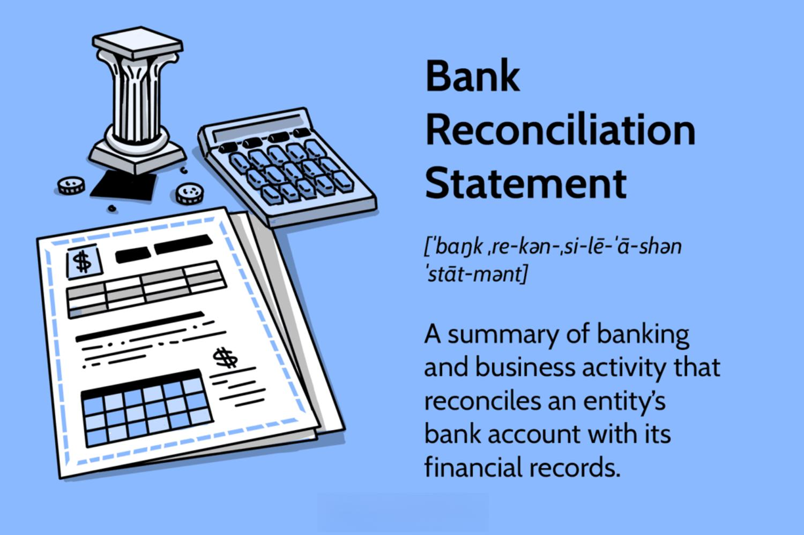

In today's fast-paced financial world, the integration of accounting, financial management, reconciliation, and algorithmic trading is essential for success. These interconnected disciplines play a critical role in enhancing financial operations and informing strategic decision-making. Accounting serves as the foundational element, offering a structured record of financial transactions, assets, and liabilities. In turn, financial management utilizes this data to plan, organize, control, and monitor a company's resources, ensuring optimized financial performance.

Reconciliation, though often overlooked, is equally vital. It rectifies discrepancies between internal records and external statements, thus safeguarding the accuracy of financial information. This process not only prevents potential fraud but also supports compliance with regulatory requirements.



Algorithmic trading represents the cutting-edge of financial practice, harnessing computational algorithms to automate trading decisions. This technology accelerates trade execution, reduces human error, and enables sophisticated market analysis. However, for algorithmic trading to function effectively, it must be supported by accurate accounting and thorough reconciliation processes.

Leveraging advanced technology alongside meticulous financial practices allows businesses to maintain compliance and drive profitability. Each component contributes uniquely to the organization's financial health, forming a cohesive system that underpins successful financial management. Adapting to and integrating these elements are imperative in navigating the complexities of digital finance.

## Table of Contents

## Accounting and Financial Management

Accounting provides the foundational structure for any financial operation, establishing clear and systematic records of transactions, assets, and liabilities. These records form the essential database from which businesses can derive critical financial insights and ensure transparency in their operations. At its core, accounting involves processes such as bookkeeping, preparing financial statements, and assessing tax liabilities, each contributing to accurate financial reporting and analysis [1].

Financial management builds on the provided accounting data to strategically plan, organize, control, and monitor a company's financial resources. It involves evaluating complex data sets to make informed decisions that align with both short-term operational goals and long-term strategic objectives. This dynamic process demands a holistic understanding of a company’s financial environment, integrating contributions from capital management, budget forecasting, and risk assessment.

Together, accounting and financial management work collaboratively to ensure optimal resource utilization, which is critical in minimizing waste and maximizing profit. By scrutinizing these financial records, organizations can identify patterns, assess performance against industry benchmarks, and develop strategies for improvement. This involves utilizing key performance indicators (KPIs) and financial metrics to gauge the efficiency and profitability of business operations.

In modern financial management, the integration of strategic planning is imperative for navigating today’s volatile markets. Data-driven insights, powered by financial analytics tools, have become indispensable in dissecting market trends, forecasting future scenarios, and enabling proactive decision-making [2]. The use of advanced analytical techniques, including [machine learning](/wiki/machine-learning) and statistical analysis, enhances a firm's ability to respond effectively to market changes and optimize its investment strategies.

Maintaining precise financial records offers businesses the ability to evaluate past performances critically and to make informed operational decisions. This continuous cycle of evaluation and strategic planning facilitates the identification of new opportunities for growth and innovation, while ensuring compliance with regulatory standards. Through meticulous record-keeping and integrated financial management practices, companies can secure robust financial health and sustainability.

References:
1. Wild, J. J., & Shaw, K. W. (2016). Fundamental Accounting Principles. McGraw-Hill Education.
2. Atrill, P., & McLaney, E. (2019). Financial Management for Decision Makers. Pearson Education Limited.

## The Importance of Reconciliation

Account reconciliation is a critical component of effective financial management. It involves comparing internal financial records against external statements from banks or other financial institutions. This practice helps ensure the accuracy of the financial records maintained by an organization. By addressing discrepancies between these records, reconciliation serves as a preventive mechanism against fraud and financial misstatements.

The process of reconciliation is essential in verifying the accuracy of transactions recorded in the general ledger. Discrepancies that remain unaddressed can lead to erroneous financial reporting, which can, in turn, mislead stakeholders and negatively impact decision-making. Regular reconciliation ensures that any misalignments are identified and corrected promptly, maintaining the integrity of the financial data.

From a regulatory perspective, reconciliation is a vital part of compliance and auditing processes. Organizations are required by financial regulations to maintain accurate records and demonstrate the validity of their financial statements. Reconciliation processes help ensure these requirements are met, thereby supporting the organization’s compliance efforts and preparing it for audits.

Reconciliation methods can differ across organizations but generally involve matching each line item in the company's balance sheet and transaction logs with corresponding entries on bank statements or external financial reports. This matching process allows for the identification of discrepancies, such as missing entries or incorrect amounts, which can then be investigated and resolved.

In summary, reconciliation is a strategic process that underpins financial integrity, compliance, and accurate reporting. By routinely reconciling accounts, organizations can avert errors and fraud while fulfilling their statutory obligations effectively.

## Algorithmic Trading in Financial Markets

Algorithmic trading employs advanced algorithms to automate and optimize trading strategies, significantly enhancing the speed and efficiency of financial transactions. By leveraging quantitative models, [algorithmic trading](/wiki/algorithmic-trading) analyzes vast amounts of market data to ensure the optimal execution of trades. These models often incorporate statistical techniques and machine learning algorithms to predict market trends and identify profitable trading opportunities.

The integration of algorithmic trading with financial management allows for rapid response to market changes, providing a strategic advantage in dynamic market environments. This integration is crucial for portfolio managers and traders who need to execute large volumes of trades quickly and at favorable prices. The rapid processing capability of algorithmic trading systems reduces execution time, thereby maximizing the potential for profit by capitalizing on short-term market inefficiencies.

Traders and financial firms increasingly rely on algorithms to achieve cost-effective trade execution. Unlike manual trading, algorithmic trading minimizes human error and emotional biases, allowing for consistent and objective decision-making. Algorithms can be programmed to execute trades based on predefined criteria, such as price levels or timing, ensuring disciplined adherence to trading strategies.

To support algorithmic trading, robust accounting systems are essential for tracking and recording financial transactions with precision. These systems must handle the high transaction volumes generated by algorithmic trading, ensuring that every trade is accurately logged and reconciled. Accurate financial records are vital for performance evaluation, regulatory compliance, and risk management.

Overall, algorithmic trading is a transformative force in financial markets, merging traditional trading practices with cutting-edge technology. As advancements in algorithmic techniques and computational power continue, the scope and impact of algorithmic trading are expected to expand, further shaping the landscape of modern finance.

## Integrating Accounting, Reconciliation, and Algorithmic Trading

Integrating accounting, reconciliation, and algorithmic trading is crucial for achieving a cohesive and efficient financial management system. The intersection of these components ensures not only the accuracy and reliability of financial data but also the strategic agility needed to thrive in competitive markets.

Combining accounting with reconciliation processes provides a solid foundation for algorithmic trading. Accounting systems must adapt to manage the voluminous and rapid transactions characteristic of algorithmic trading. This involves automating data capture and analysis to ensure that all transactions are recorded accurately and in real time. A robust accounting system capable of handling high-frequency trade data is essential for maintaining financial records' integrity and ensuring compliance with internal and external regulations.

Reconciliation plays a critical role by aligning executed trades with organizational and regulatory standards. It ensures that every transaction is accurately reflected in financial statements, reducing the risk of errors and fraud. The reconciliation process involves comparing external data, such as bank statements and broker confirmations, with internal records to detect inconsistencies. Modern reconciliation tools leverage automation and machine learning to streamline this task, enabling organizations to maintain compliance effortlessly.

Financial management strategies are enhanced by leveraging reconciled data to inform investment decisions. With access to accurate and up-to-date information, organizations can better assess financial performance and risk. This data-driven approach allows for strategic decision-making, optimizing portfolio management, asset allocation, and risk mitigation.

Integrating these elements leads to improved financial visibility and control. A seamless system enables organizations to monitor cash flows, assess [liquidity](/wiki/liquidity-risk-premium), and forecast financial trends with greater precision. Furthermore, it fosters strategic foresight by providing a comprehensive view of financial operations, aiding long-term planning and growth initiatives.

In summary, the integration of accounting, reconciliation, and algorithmic trading fosters a transparent, efficient, and responsive financial management framework. Organizations that successfully merge these disciplines will be better positioned to capitalize on opportunities and navigate the complexities of modern financial markets. As technology continues to advance, ongoing innovation and adaptation will be vital to maintain this synergy and drive financial success.

## Challenges and Best Practices

Maintaining the accuracy and integrity of large volumes of transactional data remains a significant challenge in modern financial operations. The sheer [volume](/wiki/volume-trading-strategy) and speed at which transactions occur necessitate robust systems and protocols to ensure data consistency and reliability. One effective strategy is the implementation of stringent financial controls. These controls serve as checks and balances, helping to prevent errors and fraudulent activities. Automated reconciliations further enhance system reliability by continuously comparing transactions against predefined criteria, thus reducing human intervention and potential errors.

Regular audits and reviews play a crucial role in maintaining compliance with regulatory standards. These processes allow organizations to identify discrepancies early and correct them before they result in significant financial misstatements. Audits also assess the effectiveness of existing controls and highlight areas for improvement. By maintaining a routine schedule of audits, businesses can ensure that their financial operations align with both internal policies and external regulations.

Leveraging real-time data analytics is essential in making informed and timely decisions. Real-time analytics provide immediate insights into transactional data, enabling organizations to respond quickly to emerging trends or issues. Tools that process and analyze data in real-time can significantly enhance decision-making capabilities by highlighting patterns that inform strategic planning and operational adjustments.

Continuous education and adaptation to new technologies and methodologies are crucial for maintaining a competitive edge. The financial industry is dynamic, with constant innovations in technology and best practices. To remain competitive, organizations must invest in training their workforce in the latest tools and techniques. This ongoing education facilitates adaptation to new methodologies, ensuring that teams can leverage advanced technologies effectively.

Moreover, adopting cutting-edge technologies such as machine learning and [artificial intelligence](/wiki/ai-artificial-intelligence) can automate and optimize many aspects of financial management. These technologies can process complex data sets with high precision, offering predictive insights and automating routine tasks.

Python, one of the preferred languages for data analysis, can be utilized to automate reconciliation processes and data analysis tasks. For example, using Python's pandas library, large datasets can be efficiently manipulated and analyzed. Here is a simple code snippet illustrating how Python can assist in financial data reconciliation:

```python
import pandas as pd

# Load transaction data and reconciled data
transactions = pd.read_csv("transactions.csv")
reconciled_data = pd.read_csv("reconciled_data.csv")

# Merging datasets on transaction ID to identify discrepancies
merged_data = pd.merge(transactions, reconciled_data, on='transaction_id', suffixes=('_trans', '_recon'), indicator=True)

# Identifying discrepancies where no match found in reconciled data
discrepancies = merged_data[merged_data['_merge'] != 'both']
print(discrepancies)
```

This code efficiently identifies discrepancies between two datasets, facilitating the reconciliation process. By embracing such technological solutions, organizations can enhance accuracy and reduce the time spent on manual checks. Overall, integrating these best practices helps entities navigate the complexities of modern financial landscapes while safeguarding against operational risks.

## Conclusion

The integration of accounting, financial management, reconciliation, and algorithmic trading represents a cornerstone in achieving success within today's dynamic financial environment. By meticulously harmonizing these components, businesses can significantly enhance operational efficiency, ensure rigorous compliance with financial regulations, and maintain a strategic advantage in competitive markets. The coherent interplay of these elements enables firms to optimize resource allocation, enhance decision-making processes, and execute trades with precision.

As technological innovation continues to reshape the financial landscape, it becomes imperative for organizations to embrace continuous improvement and adaptation. Technologies such as artificial intelligence and machine learning are rapidly transforming how financial data is analyzed and leveraged. Therefore, staying abreast of technological advancements allows businesses to harness these tools effectively, ensuring they remain agile and able to respond swiftly to market dynamics.

Ultimately, this integration is about merging the reliability of traditional financial practices with the agility and precision of modern technology. This synergy not only safeguards financial integrity but also empowers organizations to drive financial success through informed strategic initiatives and operational excellence. As the financial sector evolves, businesses that adeptly navigate this integration will be better positioned to thrive.

## References & Further Reading

[1]: Wild, J. J., & Shaw, K. W. (2016). ["Fundamental Accounting Principles."](https://www.mheducation.com/highered/product/fundamental-accounting-principles-wild-shaw/M9781260247985.html) McGraw-Hill Education.

[2]: Atrill, P., & McLaney, E. (2019). ["Financial Management for Decision Makers."](https://books.google.com/books/about/Financial_Management_for_Decision_Makers.html?id=Mn--DwAAQBAJ) Pearson Education Limited.

[3]: Lopez de Prado, M. (2018). ["Advances in Financial Machine Learning."](https://www.amazon.com/Advances-Financial-Machine-Learning-Marcos/dp/1119482089) Wiley.

[4]: Chan, E. P. (2008). ["Quantitative Trading: How to Build Your Own Algorithmic Trading Business."](https://github.com/ftvision/quant_trading_echan_book) Wiley.

[5]: Jansen, S. (2018). ["Machine Learning for Algorithmic Trading."](https://www.amazon.com/Hands-Machine-Learning-Algorithmic-Trading/dp/178934641X) Packt Publishing.

[6]: Aronson, D. (2007). ["Evidence-Based Technical Analysis: Applying the Scientific Method and Statistical Inference to Trading Signals."](https://www.amazon.com/Evidence-Based-Technical-Analysis-Scientific-Statistical/dp/0470008741) Wiley.