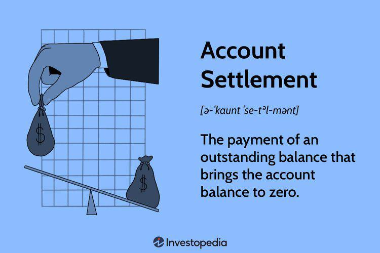

Financial transactions settlement is integral to maintaining the smooth and efficient functioning of financial markets. It comprises various mechanisms that ensure the completion of transactions, involving the transfer of funds and securities between parties. These processes are essential because settlements mitigate risks like counterparty risk, where one party might fail to fulfill its contractual obligations.

Several types of account settlements are involved in these processes, characterized by actions such as offsetting between parties or adjusting account balances to zero. Offsetting reduces the net amount of capital that needs to be transferred, allowing for more efficient fund movement. Account settlement practices are not confined solely to trading; sectors such as insurance also employ these models in dealing with reinsurers, where the balance of payments and liabilities often needs recalibration.

The advent of algorithmic trading has brought significant innovations to financial markets, driving a need for rapid and efficient clearing and settlement mechanisms. Algorithmic trading involves using algorithms to make trading decisions, execute orders, and manage risks, often at speeds beyond human capacity. This high-speed trading necessitates equally efficient settlement systems to manage the plethora of trades executed. The synergy between algorithmic trading and settlement systems is crucial; without effective clearing and settlement, the advantages of algorithmic trading could be compromised.

This article explores different settlement types, the significance of account settlements, and how algorithmic trading has influenced settlement processes. As the financial landscape continues to evolve, understanding these components is vital for sustaining market stability and efficiency.

## Table of Contents

## Understanding Financial Transactions Settlement

Settlement in financial transactions is the final step in the trade process, where the exchange of funds and securities between parties occurs to complete the transaction. This process is fundamental to ensuring that trading obligations are met, thereby maintaining the integrity and stability of financial markets. One of the primary functions of settlement is to minimize risks, particularly counterparty risk, which is the likelihood that one party involved in a trade might default before the transaction is settled.

To facilitate an efficient settlement process, several key concepts are utilized. Trade confirmation is the initial step where trade details are verified by both parties, ensuring all information aligns before transferring any assets. This step is crucial in mitigating errors and misunderstandings that could lead to settlement failures.

Netting is another essential component in settlement processes, serving to consolidate multiple trade obligations into a single net payment or delivery. By offsetting obligations, netting significantly reduces the total number of transactions and the overall credit exposure between parties. For example, if Party A owes Party B $100 but also has an obligation to receive $80, netting would reduce the transaction to a single transfer of $20 from Party A to Party B.

Collateral management is critical as it involves the use of assets pledged by one party to another to secure a trade. Collateral acts as a safety measure, protecting against potential default and ensuring that the trade will be fulfilled. Financial institutions often use sophisticated algorithms and models to assess the appropriate level of collateral required for different transactions, constantly managing and adjusting these levels based on market conditions.

Overall, the settlement process is a meticulously structured and highly regulated system ensuring that every trade is completed efficiently, safely, and in compliance with established financial standards. As a safeguard, it employs a combination of trade confirmations, netting, and collateral management to reinforce the financial system's robustness against potential risks and anomalies.

## Types of Account Settlements

Account settlements are a crucial element within financial transactions, serving as a mechanism to reconcile financial discrepancies and ensure that all involved parties achieve accurate and fair account positions. Settlements can involve either bringing account balances to zero or managing the offsetting of transactions across multiple parties.

Insurance companies frequently employ account settlements, particularly in their engagements with reinsurers. These settlements help manage risk by distributing potential losses, thus requiring precise accounting to reflect the sharing of liabilities accurately. In such arrangements, settlements ensure that the financials are balanced post-agreement, reflecting changes due to claims and premiums accurately.

Legal settlements, on the other hand, revolve around resolving financial disputes and reaching agreements on monetary claims that are typically the result of litigation or negotiation processes. These settlements effectively draw a line under disputes, involving payment agreements and confirming that both parties adhere to the settlement terms. They are instrumental in avoiding prolonged disputes and allowing involved parties to move forward post-resolution.

These settlements ensure that transactions are systematically and accurately recorded, reducing the potential for future disputes, and maintaining the integrity of financial records. The practice of account settlements is essential for maintaining fluidity and transparency in financial operations, fostering trust and reliability in economic engagements.

## Algo Trading and Its Influence on Settlement Processes

Algorithmic trading, often referred to as algo trading, employs algorithms to orchestrate trading decisions, executing orders at incredibly high speeds with minimal human intervention. This rapid execution calls for equally efficient settlement processes to manage the large [volume](/wiki/volume-trading-strategy) of trades executed within brief time frames.

The traditional settlement systems, often limited by manual processes and fragmentation, struggle to keep pace with the demands of [algorithmic trading](/wiki/algorithmic-trading). Clearing and settlement operations must therefore be optimized to handle this increased volume. Essential improvements include automation of confirmations, netting operations, and the effective management of collateral to ensure parties involved in trades meet their obligations promptly.

A pivotal aspect of enhancing these processes is the integration of advanced technologies, notably blockchain and [artificial intelligence](/wiki/ai-artificial-intelligence) (AI). Blockchain technology introduces a decentralized ledger that can facilitate real-time settlements, thereby significantly reducing the settlement period from the traditional T+2 (trade date plus two days) to potentially instantaneous settlement. This technology leverages cryptographic techniques to ensure transaction security and data integrity, reducing the reliance on intermediaries and the associated risks.

Artificial intelligence contributes extensively to the enhancement of settlement efficiency through the automation of routine processes and sophisticated risk management. AI techniques such as [machine learning](/wiki/machine-learning) models can be applied to detect fraud, predict settlement risks, and optimize the allocation of resources for better performance. For example, models can analyze historical trade data to identify patterns indicative of potential counterparty risk, enabling preemptive measures to mitigate these risks.

Algorithmic trading's impact on settlement processes necessitates a reimagining of traditional financial infrastructure, fostering an environment where transactions are processed swiftly and accurately, minimizing the associated settlement risks and costs. The convergence of advanced computing technologies heralds a new era in trading, underscoring the importance of robust and adaptive settlement solutions in the evolving financial market landscape.

## Clearinghouses and Settlement in Algo Trading

Clearinghouses play a critical role in algorithmic trading by acting as intermediaries that manage the risks inherent in high-frequency, high-volume trading environments. They ensure that each party involved in a trade can meet their financial obligations, thereby minimizing the risk of default. This is achieved through several mechanisms, including trade matching, netting, and collateral management.

Trade matching is the process where buy and sell orders are paired and executed. In algorithmic trading, where trades are executed at speeds and volumes far beyond human capability, clearinghouses employ sophisticated systems to ensure accuracy and speed in trade matching. This efficiency is crucial for maintaining market stability and investor confidence.

Netting is another essential function provided by clearinghouses. It involves offsetting multiple positions or obligations to produce a single net payment obligation, thereby reducing the number of transactions that must be settled individually. Mathematically, the net amount for each party can be represented as:

$$
\text{Net Amount} = \sum_{i=1}^{n} \text{Receipts}_i - \sum_{j=1}^{m} \text{Payments}_j
$$

where $n$ and $m$ are the number of receipts and payments, respectively. This reduction in the sheer volume of transactions lowers the operational risk and increases the efficiency of settlement processes, particularly vital in a high-frequency trading environment.

Collateral management is crucial for managing counterparty risk. Clearinghouses require parties to deposit collateral – a security deposit of sorts – to cover potential losses. This collateral requirement is dynamically adjusted based on the market's [volatility](/wiki/volatility-trading-strategies) and the creditworthiness of the participants, ensuring that adequate resources are available to cover trades.

Prominent clearinghouses such as the Depository Trust & Clearing Corporation (DTCC) and LCH.Clearnet are integral to global financial markets. DTCC, an American-based corporation, is responsible for the post-trade settlement in equities, corporate bonds, and mutual funds in the United States, handling trillions of dollars worth of transactions daily. LCH.Clearnet, on the other hand, is a leading clearinghouse for derivative and commodities markets, providing services across multiple asset classes to reduce risk and enhance market access.

The efficient functioning of clearinghouses is vital to the success of algorithmic trading, which demands rapid, reliable, and secure settlement processes. As algorithmic trading strategies continue to evolve, clearinghouses are also investing in new technologies and operational practices to meet the emerging challenges of this dynamic landscape.

## Innovations and Technologies in Settlement Processes

Blockchain technology has emerged as a transformative innovation in financial transactions and settlements. By enabling real-time settlement, blockchain significantly reduces the reliance on traditional intermediaries such as banks and clearinghouses. It offers a decentralized ledger system that records transactions transparently and securely, which helps in reducing the time required for settlement from days to mere seconds. This innovation, often referred to as Distributed Ledger Technology (DLT), has the potential to enhance the efficiency, speed, and security of the settlement process.

AI and machine learning are pivotal in advancing settlement processes, primarily through enhancing risk management, improving fraud detection, and facilitating automation. These technologies utilize vast amounts of data to identify patterns and predict potential risks, allowing financial institutions to manage counterparty risk and operational risk more effectively. Machine learning algorithms can enhance fraud detection systems by analyzing transaction patterns and flagging anomalous activities for further investigation. Furthermore, the automation of routine settlement tasks through AI reduces manual intervention, thereby minimizing the chance for human error and increasing the overall efficiency of the financial ecosystem.

The ongoing evolution of technology continues to influence the efficiency and reliability of clearing and settlement systems. Innovations such as smart contracts, which execute contract terms automatically when conditions are met, are examples of blockchain applications improving the settlement process. Additionally, developments in cloud computing provide scalable and cost-effective solutions for handling the large volumes of data associated with algorithmic trading and settlements. As technology progresses, these systems are expected to become more robust, adapting to the complex demands of global financial markets and offering enhanced transparency and security.

The integration of these technologies not only improves current settlement processes but also supports the ongoing quest for financial market integrity and growth. By addressing inefficiencies and reducing risks, these technological innovations are crucial for maintaining the stability and resilience of financial systems worldwide.

## Conclusion

Financial transactions settlement serves as a critical backbone for the global financial ecosystem, ensuring market stability and operational efficiency. The process of settlement helps mitigate risks such as counterparty risk by transferring funds and securities between parties to satisfy trade obligations. This foundational role becomes even more pronounced with the rise of algorithmic trading, which demands speed and precision in settlement due to the high volume of trades executed in fractions of a second. Algorithmic trading systems require efficient clearing and settlement mechanisms to maintain the integrity and fluidity of financial markets.

As technology continues to advance, the integration of innovations like blockchain and artificial intelligence presents opportunities to enhance settlement processes further. Blockchain technology, for example, offers the potential for real-time settlement, which can significantly reduce reliance on traditional intermediaries and improve transparency and security in transactions. Similarly, AI contributes to automation, risk management, and fraud detection, all crucial aspects of an efficient settlement system.

The evolving landscape of financial markets necessitates continuous adaptation in settlement methodologies. This ongoing evolution ensures that financial integrity is upheld, supporting sustainable market growth and fostering a robust economic environment. By leveraging technological advancements, the settlement infrastructure can transform to meet the increasingly complex demands of modern trading, promoting resilience and efficiency on a global scale.

## References & Further Reading

### References & Further Reading

1. **Publications by Major Financial Institutions**

   - The Bank for International Settlements (BIS) provides a range of reports on clearing and settlement in financial markets. Explore publications like "Principles for financial market infrastructures" which outline global standards for payment, clearing, and settlement.

   - The International Organization of Securities Commissions (IOSCO) offers reports and guidelines on market integrity and efficiency, highlighting best practices for settlement processes.

   - The European Central Bank (ECB) publishes detailed assessments and frameworks addressing settlement systems and their role in financial stability, such as the "TARGET2-Securities" initiative.

2. **Algorithmic Trading Regulations**

   - The U.S. Securities and Exchange Commission (SEC) discusses regulatory aspects of algorithmic trading, which impact settlement operations. The "SEC Regulation SCI" offers insights into operational capabilities and security practices.

   - The European Securities and Markets Authority (ESMA) outlines rules under MiFID II related to algorithmic trading, directly influencing clearing and settlement efficiency.

3. **Technological Advancements in Financial Settlements**

   - "Blockchain and the Future of Financial Services" by the World Economic Forum provides a comprehensive overview of ledger technology's impact on settlement processes.

   - The paper "Distributed Ledger Technology in Payment, Clearing, and Settlement" by the Federal Reserve discusses blockchain applications in enhancing settlement efficiency.

4. **Articles on Emerging Technologies**

   - Investigate scholarly articles like "The Role of Artificial Intelligence in Financial Markets" which explores AI-driven automation in settlement systems.

   - "Smart Contracts for Financial Instruments on Blockchain" offers insights into how blockchain-based contracts facilitate automated settlements and reduce counterparty risk.

These resources will enhance understanding of the underlying principles, regulatory landscapes, and technological innovations that drive financial transaction settlements forward.

