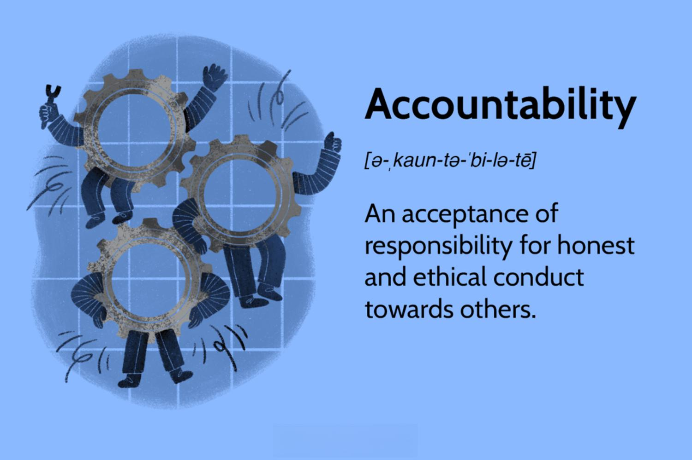

Accountability is a comprehensive concept integral to ensuring responsibility and transparency across various domains. It involves the obligation of an individual or organization to account for its activities, accept responsibility for them, and disclose the results in a transparent manner. This concept serves as a foundation in personal and professional settings, fortifying trust and reliability.

The role of accountability is paramount in the investment sector, where recent developments, particularly algorithmic trading, have introduced new aspects to consider. Algorithmic trading, defined as the use of algorithms in executing trades at speeds and frequencies beyond human capability, has revolutionized financial markets. This evolution necessitates a robust accountability framework to ensure that the algorithms operate within ethical, legal, and efficient boundaries. As trading strategies become more complex, accountability measures need to adapt, addressing the unique challenges posed by high-frequency transactions and large data processing.

This article will address the benefits of maintaining accountability, the various forms it takes, and how it specifically applies to algorithmic trading. Through understanding and implementing proper accountability mechanisms, organizations can effectively manage assets, build stakeholder trust, and enhance operational outcomes. As the financial landscape continues to evolve, maintaining and strengthening accountability will be crucial for upholding integrity and fostering sustainable trading practices.

## Table of Contents

## Benefits of Accountability

Accountability is a cornerstone of operational excellence, fostering adherence to high standards among both individuals and organizations. It serves as a catalyst for improved resource management, ensuring that assets are allocated and utilized effectively, a factor of paramount importance in the financial sector. The emphasis on responsible resource use helps mitigate wastage, optimize asset deployment, and enhance organizational efficiency. 

In financial sectors, where precision and appropriate asset allocation are critical, accountability acts as a safeguard. By establishing checks and balances, organizations prevent misuse and ensure that investments are channeled into value-generating activities. For instance, a well-structured accountability framework could involve the use of performance indicators to track asset utilization, enabling timely interventions when deviations occur.

Moreover, accountability instills confidence among external investors and stakeholders. Through transparent and ethical operations, companies can reinforce trust, facilitating stronger relationships and increased investment inflows. This is particularly crucial when stakeholders are assessing the long-term viability and integrity of an organization. Transparency in operations ensures that stakeholders are well-informed about company activities, leading to more stable and optimistic stakeholder relationships.

Enhanced accountability also leads to more accurate and effective performance outcomes. Continuous monitoring and assessment practices help organizations identify potential gaps and inefficiencies, allowing for prompt corrective actions. These efforts in maintaining accountability not only improve current performance but also build a sustainable framework for future growth. Organizations implementing regular audits, feedback loops, and performance evaluations can adapt dynamically to changing conditions, maintaining a competitive edge in their respective industries.

In summary, accountability supports operational excellence by promoting high standards, safeguarding resources, and building trust among stakeholders. It enables organizations to achieve robust performance outcomes through ongoing monitoring and adaptive strategies, ultimately contributing to their long-term success and sustainability.

## Types of Accountability

Corporate Accountability involves ensuring that companies operate with financial transparency, adhere to ethical standards, and meet their obligations to shareholders and the community. This accountability requires organizations to follow strict financial reporting guidelines, such as those set by the International Financial Reporting Standards (IFRS) or Generally Accepted Accounting Principles (GAAP). Companies are expected to engage in responsible business practices that not only focus on maximizing profits but also consider the interests of stakeholders, including employees, customers, and the broader society. These practices help in building trust, support long-term success, and mitigate risks associated with corporate scandals.

Political Accountability pertains to the mechanisms in place to ensure that political entities use resources ethically and are transparent about their actions and decisions. This accountability can be achieved through regular audits, disclosure of political donations and lobbying activities, and the implementation of checks and balances within political systems. Ensuring political accountability is essential for maintaining the integrity of democratic processes and reinforcing the public’s trust in political institutions. Measures such as freedom of information laws and anti-corruption agencies play a significant role in upholding political accountability.

Government Accountability ensures that government actions are aligned with principles of justice, human rights, and public confidence. This accountability requires governments to be transparent about their decision-making processes, expenditures, and strategic goals. Mechanisms like parliamentary inquiries, ombudsman offices, and judiciary scrutiny are established to ensure that government entities remain answerable to the public. Additionally, international agreements and watchdog organizations often oversee government accountability, ensuring compliance with global standards and conventions.

Media Accountability is crucial in an era dominated by information overload and rapid dissemination through digital platforms. Media organizations bear the responsibility of delivering accurate, balanced, and unbiased information to the public. To uphold this accountability, practices like editorial oversight, adherence to journalistic ethics, and the implementation of fact-checking procedures are essential. Social media platforms have also become influential players in the media landscape, necessitating accountability for content moderation and the management of misinformation and fake news. Establishing codes of conduct and regulatory frameworks helps in preserving the integrity and trustworthiness of media as a source of information.

## Accountability in Algorithmic Trading

Algorithmic trading, a significant advancement in the financial sector, employs complex computer algorithms to execute trades with precision and speed. This method of trading relies heavily on automation, making accountability a critical component to ensure the integrity and efficiency of operations. As [algorithmic trading](/wiki/algorithmic-trading) continues to evolve, maintaining a high level of accountability is essential to ensure compliance with regulatory mandates and mitigate inherent risks such as market [volatility](/wiki/volatility-trading-strategies).

One of the primary steps towards achieving accountability in algorithmic trading is back-testing. Back-testing involves simulating the trading strategy on historical data to evaluate its performance. This process assists in identifying potential weaknesses and ensures that the algorithm is robust under various market conditions. A well-conducted back-test provides insights into the risk and return profile of the trading strategy, helping traders and firms make informed decisions about the strategy's viability.

Rigorous risk management practices are another cornerstone of accountable algorithmic trading. Given the speed and [volume](/wiki/volume-trading-strategy) of transactions, algorithms can produce unintended outcomes if not properly managed. To address this, traders often employ risk management techniques such as stop-loss orders, position limits, and diversification strategies. These methods help minimize losses and ensure that trading activities align with the risk tolerance of investors.

Adherence to legal standards and regulations is crucial for maintaining accountability in algorithmic trading. Regulatory bodies, such as the U.S. Securities and Exchange Commission (SEC) and the European Securities and Markets Authority (ESMA), set forth guidelines to protect market integrity and investor interests. Compliance with these regulations typically includes ensuring that algorithms are transparent, auditable, and free from manipulative practices. Traders must continuously monitor regulatory changes and implement necessary updates to their trading systems to remain compliant.

In summary, accountability in algorithmic trading is achieved through meticulous back-testing, robust risk management strategies, and strict compliance with regulatory standards. These practices ensure that the benefits of algorithmic trading, such as increased efficiency and reduced costs, are realized without compromising ethical and legal responsibilities. As technology progresses, the commitment to accountability will remain a central aspect of sustainable and successful algorithmic trading practices.

## Conclusion

Accountability is a fundamental component across various sectors, driving improvements in trust, performance, and operational excellence. This is particularly evident in algorithmic trading, where the integration of technology demands a careful balance between technological advancements and ethical responsibilities. In this highly automated environment, accountability ensures that trading strategies adhere to legal standards, maintain transparency, and manage risks effectively. The evolving nature of markets underscores the expanding role of accountability, directly influencing the success and sustainability of trading and investment practices. As more sophisticated algorithms and trading platforms develop, the imperative for accountability grows, highlighting its critical role in fostering long-term stakeholder confidence and market stability.

## References & Further Reading

[1]: Bergstra, J., Bardenet, R., Bengio, Y., & Kégl, B. (2011). ["Algorithms for Hyper-Parameter Optimization."](https://proceedings.neurips.cc/paper/2011/file/86e8f7ab32cfd12577bc2619bc635690-Paper.pdf) Advances in Neural Information Processing Systems 24.

[2]: ["Advances in Financial Machine Learning"](https://www.amazon.com/Advances-Financial-Machine-Learning-Marcos/dp/1119482089) by Marcos Lopez de Prado

[3]: ["Evidence-Based Technical Analysis: Applying the Scientific Method and Statistical Inference to Trading Signals"](https://www.semanticscholar.org/paper/Evidence-Based-Technical-Analysis%3A-Applying-the-and-Aronson/3b33df8737f1772e9e14d66a08c9696f140a2ee1) by David Aronson

[4]: ["Machine Learning for Algorithmic Trading"](https://github.com/PacktPublishing/Machine-Learning-for-Algorithmic-Trading-Second-Edition) by Stefan Jansen

[5]: ["Quantitative Trading: How to Build Your Own Algorithmic Trading Business"](https://books.google.com/books/about/Quantitative_Trading.html?id=j70yEAAAQBAJ) by Ernest P. Chan