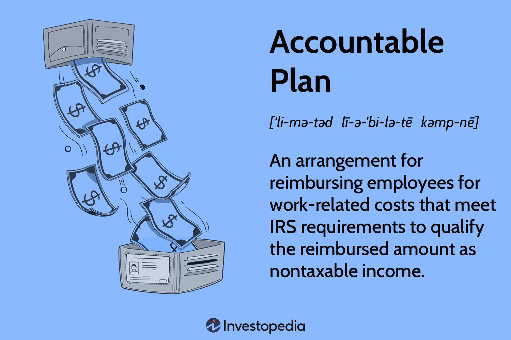

Understanding employee expenses and their tax implications is fundamental for both employers and employees within any business sector. In industries like algorithmic trading, where efficiency and precision are paramount, managing these expenses effectively becomes even more crucial. Accountable plans provide a structured approach to handling expense reimbursements, offering a mechanism for both maximizing tax benefits and ensuring compliance with relevant tax regulations.

Accountable plans, as defined by the Internal Revenue Service (IRS), present an opportunity to exclude employee expense reimbursements from taxable income, provided certain criteria are met. These plans necessitate proper documentation of expenses, adherence to substantiation requirements, and the return of any excess reimbursements. Such stipulations not only facilitate tax advantages but also streamline expense management, reducing potential financial burdens on both the employer and the employee.



Within the context of algorithmic trading, managing employee expenses efficiently can have a direct impact on a firm's financial performance. Whether it's travel expenses for attending important market conferences or costs associated with research tools and advanced technologies, how these expenses are accounted for can influence a firm’s bottom line. Precise management through accountable plans ensures that funds are appropriately allocated, thereby enhancing the overall operational efficiency of the trading firm.

This article explores the mechanics of accountable plans, examining how they function, the tax reimbursement procedures associated with them, and their specific relevance to the field of algorithmic trading. By understanding these components, firms can optimize financial efficiency and comply with necessary regulations. This introduction aims to equip readers with the necessary knowledge to effectively manage and optimize employee expenses in a manner conducive to business success, particularly in high-stakes environments like algorithmic trading.

## Table of Contents

## Understanding Accountable Plans

Accountable plans serve as a financial management tool designed to adhere to IRS regulations by excluding employee expense reimbursements from taxable income. The primary goal of these plans is to ensure that reimbursements are properly structured and documented, thus providing significant financial benefits for both the employer and the employee.

To qualify as an accountable plan, an employer's reimbursement arrangement must fulfill three primary IRS requirements:

1. **Business Connection Requirement:** Expenses reimbursed under the plan must have a business-related purpose. This means the costs incurred by employees should be necessary and incurred in their professional capacity. 

2. **Substantiation Requirement:** Employees are required to provide documentation that substantiates their expenses, typically in the form of receipts, invoices, or logs. The documentation must clearly indicate the amount, time, place, and business purpose of each expense.

3. **Return of Excess Reimbursements:** Any reimbursed amount that exceeds the substantiated expenses must be returned to the employer. This policy ensures that only genuine business expenses are reimbursed and excess funds are not retained by employees.

By meeting these criteria, businesses can reimburse their employees without additional tax liability, avoiding the filing of reimbursed amounts as W-2 income. This not only results in tax savings but also simplifies expense management by ensuring a clear understanding of which expenses qualify for reimbursement.

In industries such as [algorithmic trading](/wiki/algorithmic-trading), where the costs associated with travel, technology, and research tools can be substantial, properly implemented accountable plans ensure that reimbursements align with IRS guidelines. This is critical because the fast-paced nature of algorithmic trading requires efficient management of both financial transactions and related tax considerations.

For example, an algorithmic trading firm might reimburse an employee for international travel to attend a finance conference. Under an accountable plan, the employee would submit receipts and a travel log detailing the purpose of the trip, thereby substantiating the expense. If the employee receives a travel advancement exceeding the substantiated cost, the excess must be returned to avoid tax implications.

The implementation of accountable plans thus not only offers potential tax advantages but also ensures streamlined expense management, particularly in sectors reliant on complex financial operations.

## Tax Reimbursement Procedures in Accountable Plans

To ensure compliance with an accountable plan, employee expenses must meet specific IRS requirements. These expenses should be strictly business-related and meticulously documented to maintain the tax-favored status of the plan. The IRS mandates that for a reimbursement to be non-taxable under an accountable plan, three primary criteria must be fulfilled:

1. **Business Connection:** The expense must have a clear business purpose. In the context of algorithmic trading, this might include costs related to travel, research, and technology which support the operational goals of the firm.

2. **Substantiation:** The employee must substantiate the expense adequately. This involves providing details such as the amount, time, place, and business purpose of each expense, typically supported by receipts. For example, in algorithmic trading, records of subscription fees for data feeds or expenditures on high-frequency trading hardware should be precise and well-documented.

3. **Excess Reimbursements:** Any excess reimbursement or allowance must be returned to the employer. This necessitates clear policies and tracking mechanisms to ensure that only legitimate business expenses are reimbursed.

Businesses can establish reimbursement processes that align with these requirements by adopting structured procedures. It is advisable to create clear guidelines that delineate acceptable expenses, and implement systems that facilitate easy documentation and approval processes. Automated tools and software are particularly beneficial in this context, aiding in the tracking and reporting of expenses in real-time. For instance, algorithms can be used to validate the expense reports against organizational policies, ensuring compliance.

Compliant reporting practices include maintaining detailed records that illustrate the link between incurred expenses and business activities. Non-compliance often arises from inadequate documentation, such as missing receipts or vague descriptions that fail to justify the business purpose. Consider an algorithmic trader who reports travel expenses for a business meeting but lacks a proper itinerary or meeting agenda; such reports are prone to be deemed non-compliant.

In algorithmic trading, where precision and speed are critical, specific reimbursement practices must be employed to suit the industry's dynamics. Tools that integrate seamlessly with trading platforms can be used to capture expenses efficiently. Furthermore, technology plays a crucial role in ensuring that these reimbursement practices are streamlined and comply with IRS guidelines. Automated expense tracking systems can parse expense data, flag potential discrepancies, and provide alerts for missing documentation, thereby enhancing compliance and operational efficiency.

In conclusion, understanding and implementing the IRS substantiation requirements for accountable plans are fundamental for businesses to optimize tax savings and ensure regulatory compliance. By establishing robust reimbursement procedures tailored to their industry, particularly in sectors like algorithmic trading, firms can effectively manage employee expenses while maintaining statutory adherence.

## Employee Expenses in Algorithmic Trading

In the field of algorithmic trading, managing employee expenses is a crucial component that can significantly influence a firm's profitability. These expenses often encompass travel, research tools, and various technology costs, which are essential for the seamless functioning of trading operations. Travel expenses are incurred when employees attend conferences, training, or meet with clients and stakeholders. Research tools and technology costs include subscriptions to specialized databases, advanced analytics software, high-speed internet, and the maintenance of hardware and infrastructure critical to executing trades efficiently.

Implementing accountable plans can facilitate tax-efficient reimbursement of these expenses. Under accountable plans, expenses reimbursed to employees are not subject to income or payroll taxes, provided they meet the criteria set by the Internal Revenue Service (IRS). These criteria include having a business connection, adequate accounting of the expenses through receipts or similar documentation, and returning any amounts that exceed actual costs. By structuring reimbursements under such plans, algorithmic trading firms can optimize their tax liabilities, thereby improving net profitability.

In algorithmic trading, technology plays an intrinsic role in not only executing trades but also in recording and reporting expenses. Automated systems and software can streamline the process of tracking expenses, ensuring compliance with tax regulations, and providing real-time insights into spending patterns. For instance, expense management software can be integrated with the enterprise resource planning (ERP) systems used by trading firms to automate the capture and categorization of expenses. This can include the use of [machine learning](/wiki/machine-learning) algorithms to predict future spending trends based on historical data.

Several tools and software are specifically designed to facilitate expense tracking in the trading industry. These tools offer functionalities such as digital receipt capture, policy enforcement, and spend analytics, which help firms monitor and control expenditures effectively. Platforms that support integration with financial systems allow for seamless data flow between trading activities and accounting departments, ensuring that financial reports are accurate and up-to-date. Moreover, the use of blockchain for expense reporting can enhance transparency and security, providing an immutable record of transactions that can be audited easily.

In conclusion, appropriate management of employee expenses in algorithmic trading is not just about keeping costs in check; it's about leveraging systematic plans and cutting-edge technology to foster an environment where financial efficiency and regulatory compliance go hand in hand.

## Common Challenges and Solutions

Implementing accountable plans poses certain challenges, especially within industries characterized by intricate transactions, such as trading. One of the most prevalent hurdles is inadequate documentation. Ensuring proper record-keeping is vital, as it forms the basis for complying with IRS guidelines. Without sufficient documentation of expenses, including receipts and itemized reports, companies risk losing the tax-exempt benefits associated with accountable plans. To address this issue, implementing robust record-keeping systems is essential. Investing in expense management software that automates receipt capture and expense tracking can significantly enhance the accuracy and efficiency of documentation processes.

Another common pitfall is the failure to distinguish effectively between personal and business expenses. This is particularly relevant in algorithmic trading, where expenses related to research tools and technology costs might overlap with personal transactions. Implementing strict policies and regular audits helps in maintaining clear boundaries between personal and business expenditures. Utilizing company credit cards exclusively for business transactions can also minimize the mingling of personal and corporate expenses.

An additional challenge lies in keeping abreast with evolving IRS guidelines. Tax regulations are subject to change, and failing to update compliance procedures accordingly can render an accountable plan non-compliant. Developing a practice of regular training sessions for employees involved in finance and expense management ensures that they are aware of the latest regulatory changes. Staying connected with professional networks or subscribing to IRS update services can also provide timely information on amendments affecting accountable plans.

In the specific context of algorithmic trading, unique industry challenges must be addressed. These include tracking expenses related to high-frequency transactions and research expenditures on proprietary trading algorithms. Employing financial tools capable of handling large datasets efficiently is crucial. Additionally, incorporating data analytics software that integrates expense tracking with trading performance metrics can furnish insights into spending patterns and facilitate strategic decision-making.

Available resources and tools to facilitate compliance include specialized expense management platforms like Concur and Expensify, which offer integrated solutions for tracking, reporting, and auditing expenses. These platforms can automatically categorize expenses and generate detailed financial reports, streamlining the process of managing accountable plans.

To ensure best practices in expense management, organizations should adopt a culture of transparency and accountability. Establishing clear guidelines and communicating them effectively to all employees involved ensures uniform understanding and adherence to policies. Regular reviews of expense policies and leveraging feedback from employees can also contribute to refining reimbursement procedures, thereby enhancing overall efficiency and compliance.

## Benefits of Effective Expense Management

Effective expense management is a critical component for businesses seeking financial efficiency, particularly in industries with tight margins, such as algorithmic trading. Implementing accountable plans provides a structured approach to managing employee expenses, leading to significant tax savings for both employees and employers. These savings are achieved by ensuring expense reimbursements are excluded from taxable income, provided they comply with specific documentation and substantiation criteria set by the IRS.

In algorithmic trading, where profit margins can often be narrow due to heightened competition and volatile markets, optimizing expense management can substantially enhance overall financial performance. By categorically organizing and monitoring expenses such as travel, research tools, and technology costs, firms can reduce overhead and improve profitability. Moreover, well-organized reimbursement plans help in maintaining financial clarity and transparency, which are vital for sound financial decision-making and strategic planning.

The benefits extend beyond the financial metrics, influencing company culture and employee satisfaction. When expenses are managed efficiently and reimbursements are processed promptly and fairly, employees experience a sense of trust and satisfaction. This positive work environment can lead to increased productivity and employee retention, as staff members feel more valued and less burdened by administrative tasks.

Modern technologies and automated systems play an essential role in enhancing the efficiency of expense management. Utilization of expense management software and financial technology (FinTech) solutions streamlines the process by automating the documentation, approval, and reimbursement procedures. These technologies are adept at integrating with existing enterprise resource planning (ERP) systems to provide real-time insights into financial operations. For example, automated systems can use machine learning algorithms to categorize expenses, detect anomalies, and ensure compliance with company policies and regulatory standards.

Here is a simplified Python code example that could be used to automate expense categorization based on text recognition from receipts:

```python
import re

# Sample receipt text
receipt_text = "Travel: Uber ride $23.50; Lunch meeting $45.00; Office supplies $15.20"

# Define categories
categories = {
    'Travel': ['Uber', 'Taxi', 'Flight'],
    'Meals': ['Lunch', 'Dinner', 'Coffee'],
    'Office Supplies': ['Supplies', 'Stationery']
}

# Function to categorize expenses
def categorize_expenses(text, categories):
    categorized_expenses = {key: 0.0 for key in categories}
    for line in text.split(';'):
        for category, keywords in categories.items():
            if any(keyword in line for keyword in keywords):
                amount = float(re.search(r"\$\d+\.\d{2}", line).group()[1:])
                categorized_expenses[category] += amount
    return categorized_expenses

# Categorize the sample receipt
expense_report = categorize_expenses(receipt_text, categories)
print(expense_report)
```

This example illustrates a basic method for expense categorization that can be further expanded and integrated into comprehensive systems for accurate financial reporting and auditing. By leveraging such tools, algorithmic trading firms can ensure that they maintain compliance with accounting standards while optimizing operational efficiencies.

In conclusion, the implementation of robust expense management strategies through accountable plans results in tangible financial benefits and fosters a positive organizational culture. In the competitive world of algorithmic trading, these advantages are pivotal in maintaining a competitive edge and ensuring sustainable business practices.

## Conclusion

Accountable plans serve as crucial mechanisms for optimizing tax savings and managing employee expenses effectively across various industries. These plans enable organizations to reimburse business-related expenses without the burden of additional tax implications for employees, provided they satisfy the criteria set by tax regulations. This is particularly important for algorithmic trading firms, where precise implementation is necessary to align with both financial goals and regulatory compliance. These firms operate within highly competitive and demanding environments, where the efficient handling of employee expenses can directly influence financial outcomes.

The key insights gleaned from the effective management of employee expenses highlight the need for well-structured programs that adapt to evolving tax stipulations. Accountability in expense management ensures that firms maintain compliance while optimizing their financial strategies. As tax regulations continue to evolve, businesses must remain vigilant and proactive in updating their expense reimbursement strategies. This not only ensures ongoing compliance but also enhances operational efficiencies by minimizing unnecessary expenditure.

Furthermore, the potential of technology to revolutionize expense management cannot be understated. The integration of automated and digital solutions enables real-time tracking, accurate reporting, and streamlined processes, which contribute significantly to financial transparency and operational efficiency. Encouraging firms to incorporate such technologies into their expense management systems is essential for maintaining the benefits of accountable plans.

In conclusion, businesses must prioritize agile strategies that respond to policy updates and technological advancements. By doing so, organizations can sustain the advantages offered by accountable plans, ensuring both financial health and regulatory adherence. The successful implementation of these strategies requires continuous assessment and refinement, fostering a culture of financial prudence and employee satisfaction.

## References & Further Reading

[1]: Internal Revenue Service (IRS). ["Publication 463 (2022), Travel, Gift, and Car Expenses."](https://www.irs.gov/publications/p463) Accessed October 2023.

[2]: ["Advances in Financial Machine Learning"](https://www.amazon.com/Advances-Financial-Machine-Learning-Marcos/dp/1119482089) by Marcos Lopez de Prado

[3]: ["Understanding the IRS Accountable Plan Rules"](https://finally.com/blog/tax-hints/irs-accountable-plan/) by Nolo

[4]: ["Quantitative Trading: How to Build Your Own Algorithmic Trading Business"](https://www.amazon.com/Quantitative-Trading-Build-Algorithmic-Business/dp/1119800064) by Ernest P. Chan

[5]: ["Expense Reports: How to Monitor and Maximize Tax Opportunities"](https://greengrowthcpas.com/year-end-tax-strategies-deferring-income-accelerating-expenses/) Journal of Extension Finance, 2021

[6]: ["Algorithmic Trading: Winning Strategies and Their Rationale"](https://www.wiley.com/en-us/Algorithmic+Trading%3A+Winning+Strategies+and+Their+Rationale-p-9781118460146) by Ernie Chan

[7]: ["Expense Management for a Changing Economy"](https://www.procurify.com/blog/expense-management/) Deloitte Insights