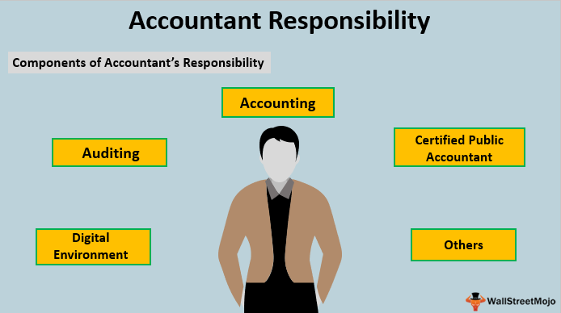

In today’s dynamic financial landscape, the role of accountants is rapidly evolving. Traditionally known for their expertise in financial statement preparation and budget management, accountants are now pivotal players in the integration of advanced financial technologies. Their duties have expanded beyond basic bookkeeping and tax preparation to encompass a broader spectrum of responsibilities that are crucial for ensuring financial accuracy, compliance, and strategic insight.

Financial duties and accountant responsibilities form the backbone of effective financial management. Accountants are tasked with maintaining public trust by adhering to ethical standards and ensuring transparent financial practices. Their responsibilities range across various accounting disciplines, including financial accounting, management accounting, tax accounting, and forensic accounting. In each domain, they are instrumental in providing financial insights, conducting audits, and ensuring adherence to legal standards, thereby safeguarding the integrity of financial information.



The intersection of technology and finance has brought forth significant developments, one of the most influential being algorithmic trading. This form of trading, which utilizes complex algorithms to execute trades at optimal conditions, has transformed traditional financial management practices. Algorithmic trading analyzes vast amounts of data to make trading decisions at speeds unattainable by human traders. As a result, it has become a cornerstone of modern financial markets, demanding accountants to adapt and integrate technological insights into their practices.

Incorporating technologies like algorithmic trading systems into traditional accounting roles highlights a pivotal shift in the financial sector. Accountants are now expected to work alongside financial analysts and technologists to harness these systems effectively. This collaboration enhances their ability to provide real-time data analysis, which is increasingly crucial for making informed financial decisions.

To remain relevant, accountants must embrace these changes by developing a robust understanding of both traditional accounting principles and contemporary technological advancements. The ongoing dialogue between accounting and emerging financial technologies underscores the need for continuous learning and adaptation, ensuring that accountants remain vital contributors to the financial success of their organizations.

## Table of Contents

## Understanding Financial Duties and Accountant Responsibilities

Accountants play a vital role in the financial health and transparency of organizations by undertaking a broad array of financial duties and responsibilities. At the core of these duties is the stewardship of financial integrity, which is fundamental to maintaining public trust. Financial duties in the accounting profession refer to the responsibilities accountants have in recording, reporting, and managing financial information accurately and honestly. These duties are crucial for creating reliable financial reports that stakeholders depend on for decision-making.

Ethical responsibilities are paramount for accountants, given their access to sensitive financial data and their obligation to report it accurately. Maintaining public trust requires adherence to ethical guidelines that govern confidentiality, integrity, and objectivity. Professional accounting bodies, such as the American Institute of Certified Public Accountants (AICPA), provide ethical standards to guide accountants in their work. Upholding these principles not only preserves public confidence but also mitigates the risk of financial scandals.

Accountants perform a variety of responsibilities across different fields, each with its unique demands. In financial accounting, the primary responsibility is to prepare financial statements such as balance sheets, income statements, and cash flow statements, which accurately reflect a company's financial position. In management accounting, accountants focus on internal financial processes, helping organizations manage resources efficiently, plan budgets, and make strategic decisions. Auditors, on the other hand, are responsible for examining financial records to ensure accuracy and compliance with laws and regulations.

Compliance with financial laws and standards is another essential aspect of an accountant's role. Accountants must be well-versed in national and international accounting standards such as the Generally Accepted Accounting Principles (GAAP) and the International Financial Reporting Standards (IFRS). They must ensure that financial reports comply with these standards to avoid legal repercussions and financial misstatements. Compliance also involves staying updated with changes in tax laws and ensuring that the organization’s tax filings are accurate and submitted timely.

In conclusion, the financial duties and responsibilities of accountants are critical to the functionality and reliability of financial systems. By maintaining ethical standards and ensuring compliance with financial laws, accountants safeguard the financial integrity necessary for economic growth and stability.

## Accounting Examples in Practice

Real-world financial statement preparation and analysis are foundational tasks in the accounting profession. Accountants meticulously prepare financial statements, including the balance sheet, income statement, and cash flow statement, to provide a comprehensive view of a company’s financial health. For instance, the income statement summarizes a company's revenues and expenses during a specific period, thus reflecting the business's operational performance. By analyzing these statements, accountants can identify trends, anomalies, and opportunities for financial improvement.

Successful budget management is another critical area where accountants demonstrate their expertise. A case study of a mid-sized manufacturing company illustrates this well. By employing zero-based budgeting, the company’s accountants managed to reduce unnecessary expenditures by 15% and reallocated those funds to areas generating higher returns on investment. This strategic allocation of resources resulted in increased operational efficiency and profitability.

Accountants are also instrumental in providing financial insights that enhance business decisions. For example, a retail chain used break-even analysis, conducted by its accounting team, to determine the minimum sales [volume](/wiki/volume-trading-strategy) needed to cover fixed and variable costs. This analysis helped the company set realistic sales targets and optimized pricing strategies, ultimately contributing to better financial outcomes.

The importance of financial audits and tax preparation in corporate accountability cannot be overstated. Regular audits, whether internal or external, ensure that a company's financial reporting is accurate and complies with statutory requirements. In a high-profile audit of a multinational corporation, discrepancies in inventory accounting were identified, leading to corrective measures that enhanced the company's credibility. Similarly, thorough tax preparation and planning by accountants save businesses significant sums of money and prevent potential legal issues, reinforcing the necessity for diligent financial oversight.

These examples highlight the critical role of accountants in financial management, extending beyond mere number-crunching to strategic advisory services that drive business success.

## Algorithmic Trading and Its Implications

Algorithmic trading, a mechanism that utilizes complex algorithms to execute orders at high speeds and frequencies, has become increasingly popular in the financial markets. It involves the use of electronic platforms, typically governed by specific rules concerning timing, price, or quantity, to manage trading transactions. This strategy leverages advanced mathematical models and algorithms to make automated trading decisions, thereby removing human intervention and emotion from the trading process.

The rise of [algorithmic trading](/wiki/algorithmic-trading) is significantly reshaping the financial landscape by increasing market efficiency and [liquidity](/wiki/liquidity-risk-premium). Due to its ability to execute trades at speeds and volumes unattainable by human traders, algorithmic trading enhances price discovery and reduces transaction costs. It plays a crucial role in high-frequency trading ([HFT](/wiki/high-frequency-trading-strategies)), where trading systems depend on algorithms to analyze multiple markets and execute trades within milliseconds. According to a report by MarketsandMarkets, the adoption of AI and data analytics in algorithmic trading is expected to drive market growth significantly over the coming years.

However, the integration of algorithmic trading into traditional accounting roles presents both opportunities and challenges. On one hand, it introduces accountants to new forms of financial data and valuation methods, enabling them to offer more analytical insights into asset management and risk evaluation. Accountants can leverage algorithmic data analytics to optimize financial reporting and strategic planning. On the other hand, accountants must adapt to the technological evolution of financial services and develop skills to interpret complex trading algorithms' outcomes.

The ethical considerations associated with algorithmic trading are also significant. The debate encompasses issues such as market fairness, transparency, and the potential for technology-induced market disruptions. Algorithmic strategies, particularly high-frequency trading, can sometimes lead to market manipulations like spoofing - where large orders are placed with the intent to cancel before execution. This raises ethical questions regarding market stability and integrity, urging the need for comprehensive regulations that govern algorithmic operations, ensuring they adhere to ethical standards and maintain public trust.

In conclusion, algorithmic trading is revolutionizing how financial markets operate and poses new challenges and opportunities for accountants and financial professionals. By addressing the ethical implications and evolving alongside technological advancements, professionals can better harness the benefits of algorithmic trading.

## The Interplay Between Accounting and Algorithmic Trading

The integration of algorithmic trading into the finance sector has reshaped the collaborative dynamics between accountants and financial analysts. The fusion of quantitative finance and traditional accounting demands a cooperative approach where accountants contribute their expertise in financial reporting, compliance, and auditing to enhance the effectiveness of algorithmic trading strategies.

Financial analysts, who design and implement trading algorithms, rely on accountants for accurate financial data and insights into market trends. Accountants play a crucial role by ensuring the data used in algorithms complies with accounting standards and financial regulations, thereby supporting the creation of robust and ethical trading systems. The synergy between these professions is exemplified in tasks such as [backtesting](/wiki/backtesting), where historical financial data is used to assess the performance of trading strategies.

Several tools and technologies facilitate the integration of accounting practices with algorithmic trading. One prominent tool is financial modeling software, which assists in simulating trading strategies and analyzing their potential impact on financial statements. Accounting software with advanced data analytics capabilities, such as Oracle Financials and SAP, allows accountants to process large datasets swiftly, enabling real-time support for trading decisions.

Python, a dominant programming language in algorithmic trading, offers packages like NumPy, pandas, and QuantLib that bolster data analysis and financial modeling. An example of its application is using pandas for time-series analysis:

```python
import pandas as pd
# Load datasets containing historical financial data
data = pd.read_csv('historical_data.csv')
# Analyze data for trends relevant to algorithmic strategies
trend_analysis = data['Close'].rolling(window=20).mean()
```

Real-time data analysis is revolutionizing accounting decision-making by providing accountants with the ability to monitor financial markets continuously. This capability enables prompt adjustments to trading strategies, asset valuations, and risk assessments, fostering more dynamic financial management.

Looking ahead, accountants must adapt to technological advancements in algorithmic trading. Familiarity with coding, [machine learning](/wiki/machine-learning), and data science is increasingly beneficial, bridging the gap between traditional accounting roles and modern financial technologies. Continuous professional development and learning initiatives focusing on technological competency will be vital for accountants aiming to remain pertinent in a rapidly evolving financial landscape. As the finance sector becomes more digital, the role of accountants will expand, necessitating a balance between their foundational skills and new technological proficiency.

## Conclusion

In the contemporary financial landscape, accountants perform pivotal roles that are foundational to the integrity and reliability of financial information. Core responsibilities include the preparation and analysis of financial statements, ensuring compliance with accounting standards, and providing strategic financial insights critical for decision-making. Accountants also [carry](/wiki/carry-trading) the ethical responsibility to uphold public trust by maintaining transparency and accuracy in financial reporting.

Algorithmic trading has transformed the financial sector through increased efficiency and speed in executing trades, altering how financial transactions are managed. This technology demands that accountants collaborate closely with IT specialists to integrate new tools that offer real-time data processing and advanced analytics. Such collaboration has opened new avenues for expanding traditional accounting roles, emphasizing the need for accountants to become proficient in financial technologies and data analysis strategies.

As financial operations continue to digitize, the importance for accountants to adapt is paramount. Embracing advanced technologies, such as [artificial intelligence](/wiki/ai-artificial-intelligence) and blockchain, will equip them to meet the heightened demands of a swiftly evolving market. Professional development through continuous learning initiatives and training in cutting-edge technology remains essential for accountants aspiring to remain relevant.

Looking forward, the future of accounting is inherently linked to digital transformation. While traditional skills remain vital, the ability to integrate technical knowledge with accounting practices will distinguish top-performing professionals. By adopting a forward-thinking approach, accountants will not only preserve the integrity of their field but also lead in shaping the next era of financial management.

## References & Further Reading

[1]: ["Advances in Financial Machine Learning"](https://www.amazon.com/Advances-Financial-Machine-Learning-Marcos/dp/1119482089) by Marcos Lopez de Prado

[2]: Bergstra, J., Bardenet, R., Bengio, Y., & Kégl, B. (2011). ["Algorithms for Hyper-Parameter Optimization."](https://dl.acm.org/doi/10.5555/2986459.2986743) Advances in Neural Information Processing Systems 24.

[3]: ["Quantitative Trading: How to Build Your Own Algorithmic Trading Business"](https://www.amazon.com/Quantitative-Trading-Build-Algorithmic-Business/dp/1119800064) by Ernest P. Chan

[4]: ["Evidence-Based Technical Analysis: Applying the Scientific Method and Statistical Inference to Trading Signals"](https://www.amazon.com/Evidence-Based-Technical-Analysis-Scientific-Statistical/dp/0470008741) by David Aronson

[5]: ["Machine Learning for Algorithmic Trading"](https://github.com/stefan-jansen/machine-learning-for-trading) by Stefan Jansen