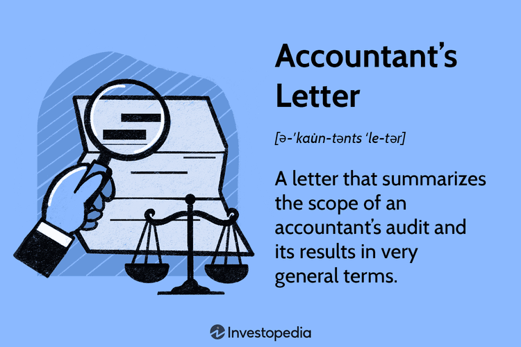

## Table of Contents

## What is an accountant's letter?

An accountant's letter is a document written by a certified public accountant (CPA) that gives information about a company's financial situation. It is often used by businesses to show their financial health to investors, banks, or other interested parties. The letter can include details like the company's income, expenses, assets, and debts. It helps these parties make decisions about whether to invest in or lend money to the company.

Sometimes, an accountant's letter is also called a comfort letter. It provides reassurance to the reader that the financial statements of the company are accurate and have been checked by a professional. This is important because it builds trust and confidence in the company's financial reports. The letter might be needed for different reasons, like when a company wants to go public or when it is involved in a merger or acquisition.

## Why is an accountant's letter important?

An accountant's letter is important because it shows that a company's financial information is correct. When a certified public accountant writes this letter, they say that they have checked the company's numbers and they are right. This makes people like investors and banks feel more sure about the company. They can trust the financial reports and feel safer about giving money to the company.

The letter also helps when a company wants to do big things like going public or joining with another company. It gives everyone involved a clear picture of how the company is doing financially. This helps them make smart choices about whether to invest or lend money. Without this letter, it would be harder for people to trust the company's financial health, which could make it tough for the company to grow or get the money it needs.

## Who typically requests an accountant's letter?

An accountant's letter is usually asked for by people or groups who want to know about a company's money situation. This can be investors who are thinking about putting their money into the company. They want to make sure the company is doing well financially before they invest. Banks also often ask for this letter when a company wants to borrow money. The bank needs to know if the company can pay back the loan.

Sometimes, a company might need an accountant's letter when it is doing big things like going public or merging with another company. In these cases, other companies or shareholders involved in the deal will request the letter. It helps them understand the financial health of the company they are dealing with. This makes the process smoother and helps everyone make better decisions.

## What are the common components of an accountant's letter?

An accountant's letter usually starts with a section that says what the letter is about. It tells the reader that the accountant has looked at the company's financial numbers and checked them. This part might also say what time period the financial information covers. Then, the letter will talk about the company's money situation. It might include details like how much money the company made, how much it spent, what it owns, and what it owes. This helps the reader understand if the company is doing well financially.

The next part of the letter often talks about any special things the accountant noticed while checking the numbers. This could be problems or risks that might affect the company's money in the future. The accountant might also say if they think the company's financial reports are correct and fair. At the end, the letter usually has a section where the accountant signs their name and gives their professional details. This shows that the letter comes from a trusted professional who knows about money and accounting.

## How does an accountant's letter differ from an audit report?

An accountant's letter and an audit report are both about a company's money, but they are different in some ways. An accountant's letter is usually shorter and less detailed than an audit report. It is written by a certified public accountant to give a quick look at the company's financial health. The letter might talk about the company's income, expenses, assets, and debts, but it does not go into as much detail as an audit report. It is often used to reassure investors, banks, or other people that the company's financial numbers are correct.

An audit report, on the other hand, is a more thorough check of a company's financial records. It is done by an independent auditor who looks at everything very closely. The audit report goes into a lot of detail about the company's financial statements and says if they are correct or not. It also talks about any problems or risks the auditor found. An audit report is usually needed for big things like when a company wants to go public or if it is required by law. So, while an accountant's letter gives a quick summary, an audit report gives a full and detailed review of the company's financial situation.

## In what situations is an accountant's letter used?

An accountant's letter is used when someone wants a quick look at a company's money situation. This can happen when investors are thinking about putting their money into the company. They want to know if the company is doing well financially before they invest. Banks also ask for this letter when a company wants to borrow money. The bank needs to make sure the company can pay back the loan. This letter helps them trust the company's financial numbers and feel safer about giving money.

The letter is also important when a company is doing big things like going public or merging with another company. In these cases, other companies or shareholders involved in the deal will want to see the letter. It helps them understand the financial health of the company they are dealing with. This makes the process smoother and helps everyone make better decisions. Without this letter, it would be harder for people to trust the company's financial health, which could make it tough for the company to grow or get the money it needs.

## What are the legal implications of an accountant's letter?

An accountant's letter can have important legal effects. When a certified public accountant writes this letter, they are saying that they have checked the company's financial numbers and believe they are correct. This means the company and the accountant can be held responsible if the numbers are wrong. If someone like an investor or a bank uses the letter to make a decision and then finds out the information was not right, they might take legal action against the company or the accountant.

The letter is often used in big business deals like going public or merging with another company. In these situations, the letter helps everyone involved trust the financial information. If there are problems with the financial numbers later, it could lead to legal trouble for the company. The letter is not a legal document itself, but it can be used in court to show what the accountant thought about the company's money situation at the time.

## How is the credibility of an accountant's letter established?

The credibility of an accountant's letter comes from the person who writes it. It is usually written by a certified public accountant (CPA). A CPA has to pass special tests and follow strict rules. When a CPA writes the letter, it means they have checked the company's money and believe the numbers are right. This makes people trust the letter because they know a professional looked at it.

People also trust the letter because it is used in important situations. When a company wants to get money from investors or a bank, they show this letter. The investors and the bank feel safer about giving money because they see the letter. If the company is doing big things like going public or merging with another company, the letter helps everyone involved feel sure about the company's money situation.

## What standards must be followed when preparing an accountant's letter?

When preparing an accountant's letter, the accountant must follow certain rules and standards. These standards are set by groups like the American Institute of Certified Public Accountants (AICPA). The main rule is that the accountant must be honest and careful when checking the company's money. They need to make sure the numbers in the letter are correct and fair. This means they have to look at the company's financial records carefully and make sure everything adds up.

Another important standard is that the accountant must be independent. This means they cannot have any personal interest in the company's money. They need to be neutral and not influenced by the company. This helps make sure the letter is trusted by people like investors and banks. The accountant also needs to follow any special rules that might be needed for the situation, like if the company is going public or merging with another company. These rules help keep the letter clear and reliable.

## Can an accountant's letter be used in court?

An accountant's letter can be used in court, but it is not a legal document by itself. It can be used as evidence to show what the accountant thought about the company's money situation at the time the letter was written. If someone like an investor or a bank used the letter to make a decision and later found out the information was wrong, they might use the letter in court to show they relied on it.

The letter's use in court depends on whether it was written honestly and carefully. If the accountant followed the right rules and standards, like being independent and checking the numbers correctly, the letter can be more trusted in court. But if the accountant did not follow these standards, the letter might not be seen as reliable evidence.

## What are the potential risks associated with issuing an accountant's letter?

When an accountant issues a letter about a company's money, there are some risks involved. One big risk is if the numbers in the letter are wrong. If someone like an investor or a bank uses the letter to make a decision and later finds out the information was not right, they might take legal action against the company or the accountant. This can lead to big problems and even lawsuits. The accountant can be held responsible for not checking the numbers carefully enough.

Another risk is that the accountant might not be seen as independent. If people think the accountant has a personal interest in the company, they might not trust the letter. This can hurt the company's chances of getting money from investors or banks. It can also make it harder for the company to do big things like going public or merging with another company. The accountant needs to be very careful and follow all the rules to make sure the letter is trusted and does not cause any problems.

## How does technology impact the preparation and delivery of accountant's letters?

Technology has made it easier and faster to prepare and deliver accountant's letters. Accountants can use special software to check a company's money numbers quickly. This software helps them make sure the numbers are correct and can even find mistakes that might be hard to see. They can also use computers to write the letter and add all the important details. This makes the letter look neat and professional. Sending the letter is also easier now. Accountants can email the letter to investors or banks right away, instead of mailing it, which saves time.

But technology also brings some challenges. There is more risk of hacking and data leaks, so accountants need to be careful to keep the company's money information safe. They might need to use special security tools to protect the information. Also, some people might not trust a letter that comes by email as much as one that comes in the mail. So, accountants need to make sure the letter is sent in a way that people will trust. Even with these challenges, technology helps make the whole process of preparing and delivering accountant's letters better and faster.

## References & Further Reading

[1]: ["Generally Accepted Accounting Principles (GAAP)."](https://en.wikipedia.org/wiki/Generally_Accepted_Accounting_Principles_(United_States)) Financial Accounting Standards Board (FASB)

[2]: ["International Financial Reporting Standards (IFRS)."](https://en.wikipedia.org/wiki/International_Financial_Reporting_Standards) International Financial Reporting Standards Foundation

[3]: American Institute of Certified Public Accountants. ["AICPA Code of Professional Conduct."](https://us.aicpa.org/content/dam/aicpa/research/standards/codeofconduct/downloadabledocuments/2014-december-15-content-asof-2020-June-20-code-of-conduct.pdf) 

[4]: Securities and Exchange Commission. ["SEC's Rules and Regulations."](https://kpmg.com/us/en/media/news/sec-cybersecurity-disclosure-rules-2024.html) 

[5]: Commodity Futures Trading Commission. ["CFTC Regulations."](https://www.cftc.gov/LawRegulation/index.htm) 

[6]: ["Auditing Standards."](https://pcaobus.org/oversight/standards/auditing-standards) by the American Institute of Certified Public Accountants (AICPA)

[7]: Knapp, M. C. (2014). ["Contemporary Auditing: Real Issues and Cases, 9th Edition."](https://www.amazon.com/Contemporary-Auditing-Michael-C-Knapp/dp/1133187897) Cengage Learning.

[8]: Lopez de Prado, M. (2018). ["Advances in Financial Machine Learning."](https://www.amazon.com/Advances-Financial-Machine-Learning-Marcos/dp/1119482089) Wiley.

[9]: Chan, E. (2009). ["Quantitative Trading: How to Build Your Own Algorithmic Trading Business."](https://github.com/ftvision/quant_trading_echan_book) Wiley Trading. 

