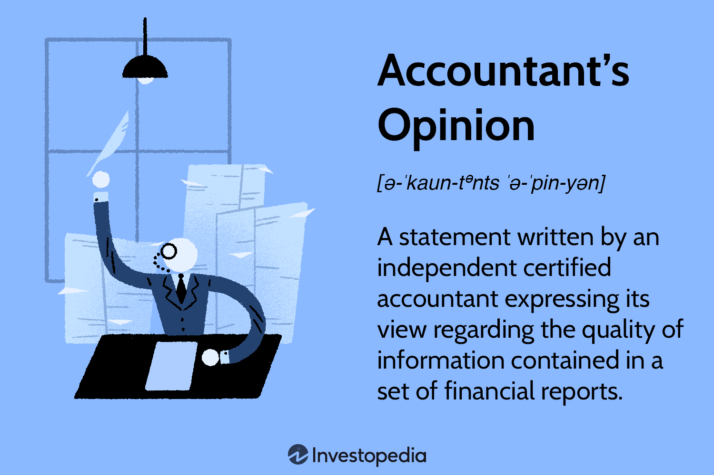

The world of finance encompasses myriad intricate elements, with complexities arising from various disciplines and practices that intersect to form the backbone of global economic activity. Among these facets, the accountant's opinion within audit reports stands as a fundamental aspect of financial analysis. This opinion provides assurance regarding the quality and reliability of financial statements, serving as a critical checkpoint for investors, analysts, and stakeholders who depend on accurate data to make informed financial decisions.

In tandem with precise financial reporting, advancements in technology have catalyzed significant changes in financial markets. Algorithmic trading, commonly referred to as algo trading, has emerged as a pivotal force, revolutionizing how trades are executed. By leveraging computer algorithms, market participants can execute transactions with enhanced speed and precision, minimizing the potential for human error and optimizing market efficiencies.



This article examines the interconnected nature of financial statements, accountant's opinions, audit reports, and algorithmic trading. By exploring these relationships, we aim to shed light on how financial markets operate and how decisions pivot on these critical evaluations. Understanding these foundational concepts is essential for comprehending the intricacies of financial market operations and the decision-making processes that underpin them.

## Table of Contents

## Understanding Financial Statements

Financial statements are integral components that provide detailed accounts of a company's business activities and its financial performance over a specific period. These documents are essential for a diverse group of users, including investors, financial analysts, and stakeholders, who rely on this data to make informed decisions regarding investments, management, and operational strategies.

The three primary components of financial statements include the balance sheet, income statement, and cash flow statement:

1. **Balance Sheet**: This financial statement provides a snapshot of a company's financial position at a specific point in time. It comprises three distinct sections: assets, liabilities, and shareholders' equity, adhering to the accounting equation:
$$
   \text{Assets} = \text{Liabilities} + \text{Shareholders' Equity}

$$

   Assets represent resources owned by the company, liabilities refer to obligations, and shareholders' equity signifies the residual interest in the assets of the company after deducting liabilities.

2. **Income Statement**: Also known as the profit and loss statement, the income statement outlines the company's financial performance over a particular period. It reports on revenues and expenses, ultimately determining the net income or loss:
$$
   \text{Net Income} = \text{Total Revenues} - \text{Total Expenses}

$$

   The income statement is crucial for assessing the company's profitability and operational efficiency.

3. **Cash Flow Statement**: This statement provides an overview of the cash inflows and outflows from a company's operating, investing, and financing activities. It helps stakeholders understand how the company generates and uses cash, thus assessing its liquidity and financial health.

   The cash flow from operations is a key indicator of a company's ability to sustain and grow its operations over time.

For financial statements to be effective and reliable, they must adhere to Generally Accepted Accounting Principles (GAAP). GAAP ensures consistency, comparability, and accuracy, enabling analysts and investors to assess a company's performance effectively across different periods and in comparison to other companies. Compliance with GAAP also enhances the credibility of the financial data provided, thereby supporting the decision-making process for all stakeholders involved.

## The Role of Accountant's Opinion

An accountant's opinion is an essential component of a company's audit report, serving as an independent evaluation of the information presented in the financial statements. This opinion is crucial for maintaining trust and transparency within the financial markets. It provides investors, analysts, and stakeholders with insights into the compliance of a company's financial statements with generally accepted accounting principles (GAAP).

The accountant's opinion is categorized into three primary types: unqualified, qualified, and adverse, each reflecting differing levels of conformity with GAAP. An unqualified opinion, often termed a "clean" opinion, indicates that the financial statements are presented fairly in all material respects, and adhere strictly to GAAP. This type of opinion is the most favorable, signaling robust financial health and sound accounting practices within the company.

A qualified opinion, however, suggests that while the financial statements are generally presented correctly, there exist certain exceptions. These exceptions might relate to specific areas or transactions that do not fully comply with GAAP. The nature and impact of these exceptions are explicitly mentioned in the audit report, allowing users of the financial statements to adjust their assessments accordingly.

Lastly, an adverse opinion denotes a significant departure from GAAP, suggesting that the financial statements do not accurately reflect the company's financial position. This opinion raises red flags for investors and analysts, as it implies potential misstatements or omissions that could undermine the reliability of the reported financial data.

These opinions are integral to the audit report, which is submitted annually alongside the company's official filings. The report provides a structured and standardized format to present the accounting firm’s findings, enhancing the comparability and consistency of financial evaluations between different entities. By relying on the accountant's opinion, investors and analysts can better assess the validity and trustworthiness of financial statements, making informed decisions grounded in accurately reported data.

## Audit Reports and Their Importance

Audit reports constitute a crucial component of the financial reporting process, providing a formal opinion or disclaimer issued by an external auditor following an evaluation of a company's financial reports. The primary objective of these assessments is to verify that the financial statements are free from material misstatement, thereby ensuring the accuracy and reliability of the information presented. An audit report enhances the credibility of the financial statements, which in turn boosts investor confidence—a vital aspect for the functioning of financial markets.

Typically prepared in accordance with established auditing standards, audit reports communicate the auditor's findings about the financial health and operational efficiency of a company. There are various types of audit opinions that an auditor can express: unqualified, qualified, adverse, and a disclaimer of opinion. An unqualified opinion, often regarded as the most favorable, indicates that the financial statements present a true and fair view in accordance with generally accepted accounting principles (GAAP). Conversely, a qualified opinion suggests exceptions to GAAP, while an adverse opinion highlights significant misrepresentations. Lastly, a disclaimer of opinion is issued when the auditor is unable to form an opinion due to substantial limitations in the scope of the audit.

The legitimacy provided by an audit report is instrumental in dispelling doubts regarding the financial statements, thus reinforcing trust among current and potential investors, creditors, and other stakeholders. This verification process also facilitates the identification of areas requiring improvement, guiding companies to enhance their financial practices and internal controls. Moreover, audit reports are indispensable tools in the financial decision-making process, as they allow investors to make informed decisions based on credible data.

In conclusion, audit reports function as both a detective and preventive measure against inaccuracies in financial reporting, fostering a transparent and efficient financial ecosystem. Their role in the financial landscape is indispensable, underscoring the importance of rigorous and objective auditing practices.

 to Algorithmic Trading

Algorithmic trading, commonly known as algo trading, employs computer algorithms to make trading decisions automatically, sidelining the need for human intervention. These algorithms are defined by a set of predetermined criteria or rules, allowing traders to execute orders with unprecedented speed and precision. The primary appeal of algo trading lies in its ability to minimize human error, a significant [factor](/wiki/factor-investing) in the fast-paced environment of financial markets. 

With the advent of high-frequency trading ([HFT](/wiki/high-frequency-trading-strategies)), a subset of [algorithmic trading](/wiki/algorithmic-trading), transactions are completed within microseconds, significantly enhancing market efficiency. This speed allows for the capitalization on small price discrepancies in the market, providing traders with opportunities that would be difficult to exploit manually. Additionally, algo trading can analyze vast arrays of market data, identifying trends and patterns that inform trading strategies. 

An essential contribution of algo trading is the [liquidity](/wiki/liquidity-risk-premium) it provides to financial markets. By facilitating a high [volume](/wiki/volume-trading-strategy) of trades, these algorithms help maintain a consistent flow of transactions, which is especially beneficial during periods of market [volatility](/wiki/volatility-trading-strategies). Furthermore, algorithmic trading can lead to lower transaction costs. By optimizing execution processes and minimizing the impact of large orders on market prices, these systems make trading cheaper and more efficient for all market participants.

Here is a simple Python example illustrating a basic framework for an algorithmic trading strategy using moving averages:

```python
def moving_average_strategy(prices, short_window=40, long_window=100):
    short_ma = prices.rolling(window=short_window, min_periods=1, center=False).mean()
    long_ma = prices.rolling(window=long_window, min_periods=1, center=False).mean()

    signals = pd.DataFrame(index=prices.index)
    signals['signal'] = 0.0
    signals['short_ma'] = short_ma
    signals['long_ma'] = long_ma

    signals['signal'][short_window:] = np.where(signals['short_ma'][short_window:] > signals['long_ma'][short_window:], 1.0, 0.0)   
    signals['positions'] = signals['signal'].diff()

    return signals

import pandas as pd
import numpy as np

# Example data
prices = pd.Series([100, 102, 101, 105, 107, 110, 115, 112])

# Apply the moving average strategy
signals = moving_average_strategy(prices)

print(signals)
```
In this example, the strategy uses two moving averages of different lengths to generate signals: when the short-term moving average crosses above the long-term moving average, a buy signal is generated. Conversely, when the short-term moving average crosses below the long-term moving average, a sell signal is generated. This simple algorithm showcases how predefined rules can automate trading decisions, highlighting the core essence of algorithmic trading.

## The Intersection of Financial Statements, Audit Reports, and Algo Trading

Algorithmic trading, or algo trading, is a dominant force in modern financial markets, executing trades at speeds and volumes that far exceed human capabilities. The success of these trading systems is intimately tied to the accuracy of financial data, which originates from company-prepared financial statements. These statements undergo rigorous scrutiny through audits, with external auditors assessing their fairness and accuracy. The accountant's opinion presented as part of an audit report underscores the degree to which these statements align with established accounting standards.

A fundamental component in this ecosystem is the reliability of the financial data supplied. Algorithmic systems analyze data such as earnings reports, profit margins, and other financial metrics to make data-driven trading decisions. Therefore, the slightest misstatement or inaccurately presented figure has the potential to skew the algorithms that depend on this data. For example, an erroneously high earnings figure could lead an algorithm to buy a stock at an inflated price, predicting profits that do not exist. Conversely, understated financial performances could prevent beneficial trades or stimulate unnecessary sell-offs, resulting in missed opportunities or financial losses.

The integrity of algorithmic trading systems, therefore, is underpinned by the robustness of audit processes and the clarity of accountant opinions. Auditors perform checks to detect any material misstatements, offering an assurance that the financial information is presented fairly. Their opinions are categorized generally into unqualified, qualified, adverse, or disclaimer opinions, each reflecting the degree of assurance about the financial statement's compliance with accounting standards. An unqualified opinion denotes no reservations, whereas a qualified or adverse opinion indicates potential issues or non-compliance with accounting standards, which could be a red flag for users of these financial statements.

Thus, a robust audit process ensures data integrity by enhancing the credibility of financial statements. It not only boosts investor and trader confidence but directly safeguards the efficacy of algorithmic trading systems. The increased transparency and accuracy fostered by comprehensive audit practices ensure that trading algorithms operate on reliable data, ultimately maintaining the stability and efficiency of financial markets at large.

In conclusion, the interplay between accurate financial reporting, rigorous auditing, and reliable algorithmic trading is fundamental to the functioning of contemporary financial markets. Each component serves to uphold the transparency and efficiency that market participants rely on, signaling a critical intersection of traditional and technological financial principles.

## Conclusion

Understanding the relationship between financial statements, accountant's opinions, audit reports, and algorithmic trading is key to navigating financial markets. Each of these components plays a crucial role in promoting transparency, accuracy, and efficiency across financial operations. Financial statements, when prepared in accordance with generally accepted accounting principles (GAAP), provide a reliable foundation of data from which investors, analysts, and algorithmic trading systems can draw insights. The accountant's opinion, delivered through audit reports, further assures stakeholders of the quality and dependability of this information, reinforcing confidence in financial disclosures.

Audit reports, by ensuring that financial statements are free from material misstatement, bolster the integrity and credibility of a company's reported financial health. This assurance is critical not only for traditional investors but also for algorithmic trading systems that rely on precise and accurate financial data to develop and execute trading strategies effectively. Even slight inaccuracies in financial data could cause algorithms to make suboptimal decisions, leading to potential financial losses. Thus, the seamless interconnection between audited financial statements and algorithmic trading outcomes underscores the importance of maintaining high standards in financial reporting and analysis.

As the financial industry continues to advance technologically, these elements will assume even greater importance. The growing sophistication of algorithmic trading demands even more reliable and timely financial data, necessitating robust auditing processes and accurate accountant insights. Investors and analysts will need to remain informed and adaptable to changes within this ecosystem to ensure successful navigation through complex financial markets. By comprehending and leveraging the synergy between these components, stakeholders can sustain efficient and transparent financial activities, fostering a more resilient financial market landscape.

## References & Further Reading

[1]: ["Understanding Financial Statements: The Meaning and Use of Key Financial Information"](https://online.hbs.edu/blog/post/how-to-read-financial-statements) by Lyn M. Fraser and Aileen Ormiston

[2]: Jensen, M. C., & Meckling, W. H. (1976). ["Theory of the firm: Managerial behavior, agency costs and ownership structure."](https://www.sciencedirect.com/science/article/pii/0304405X7690026X) Journal of Financial Economics, 3(4), 305-360.

[3]: ["Auditing and Assurance Services: Understanding the Integrated Audit"](https://www.amazon.com/Auditing-Assurance-Services-Understanding-Integrated/dp/0471726346) by Karen L. Hooks

[4]: ["Principles of Financial Regulation"](https://academic.oup.com/book/35860) by John Armour, Dan Awrey, Paul Davies, Luca Enriques, Jeffrey Gordon, Colin Mayer, and Jennifer Payne

[5]: Zakamulin, V., & Giner, J. (2021). ["Optimal Moving Average Trading Rules: A Guide to Strategies, Techniques and Trading Models."](https://www.semanticscholar.org/paper/Market-Timing-with-Moving-Averages%3A-Anatomy-and-of-Zakamulin/d2b021a050fb78327ca18d2a9401871d74c0871b) Springer.