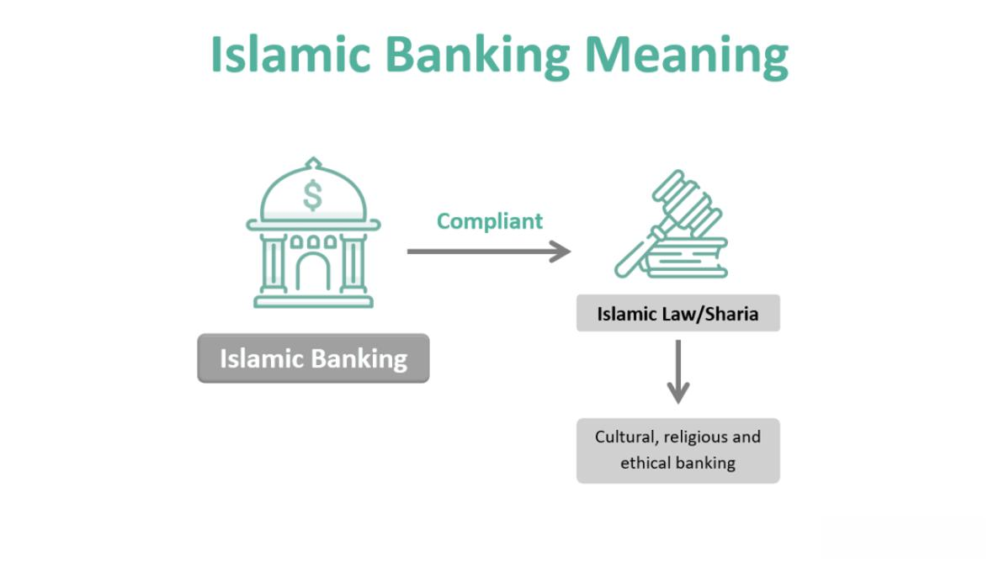

Islamic finance has experienced significant global growth, establishing itself as a vital component of the international financial system. Its principles are deeply embedded in Shari'ah law, which mandates ethical and socially responsible investing. This adherence to ethical standards differentiates Islamic finance from its conventional counterparts. The prohibition of interest (riba) and speculative transactions (gharar) signifies a commitment to equitable wealth distribution and investment in real economic activities.

Despite its ethical foundations, Islamic finance faces unique challenges, notably in financial auditing and the adaptation of modern technologies like algorithmic trading. Financial auditing within Islamic institutions necessitates strict compliance with Shari'ah standards, ensuring fairness and transparency. This process can be complex, given the intricacies of Shari'ah compliance in financial transactions.



Moreover, integrating algorithmic trading poses technological and ethical dilemmas. Algorithmic trading systems must be developed to align with Shari'ah principles, avoiding prohibited activities while optimizing financial operations. This expansion into modern financial technology reflects the sector's willingness to innovate while upholding its fundamental ethical tenets.

The article will discuss these vital aspects of Islamic finance, emphasizing the significant role of the Accounting and Auditing Organization for Islamic Financial Institutions (AAOIFI). The AAOIFI's standards are crucial for maintaining credibility and consistency in Islamic finance across the globe. Understanding these elements is essential to grasp the modern landscape of Islamic financial services and their compliance with religious guidelines, ultimately offering an ethical and sustainable alternative for global investors.

## Table of Contents

## Overview of Islamic Finance

Islamic finance is a financial system that operates in accordance with Islamic law, or Shari'ah. Unlike conventional financial systems, Islamic finance prohibits the payment or receipt of interest, known as riba. Instead, it is based on the principles of profit and loss sharing. This framework fosters a system where both parties, investors and entrepreneurs, share the risks and rewards of business ventures. 

Central to Islamic finance is the emphasis on ethical investments. Investments must adhere to certain moral and ethical guidelines, avoiding sectors such as alcohol, gambling, and gambling, which are considered haram, or forbidden. This ethical stance aligns with the broader lifestyle and values of many in the Muslim world and has garnered interest beyond these communities.

The modern journey of Islamic finance began in the latter half of the 20th century, leading to significant growth and increasing global presence. Its unique principles have fostered a demand for structured and standardized approaches akin to those in conventional banking. This structured advancement has been particularly supported by organizations such as the Accounting and Auditing Organization for Islamic Financial Institutions (AAOIFI), which was established to develop and maintain standards for Islamic financial practices. These standards provide a framework that aligns financial practices with Shari'ah law, contributing to the credibility and sustainability of the sector.

Islamic finance continues to expand its reach, integrating modern financial tools while maintaining its core principles. This balance ensures that it remains an attractive alternative for those seeking financial systems rooted in ethical considerations.

## The Role of AAOIFI in Islamic Finance

The Accounting and Auditing Organization for Islamic Financial Institutions (AAOIFI), established in 1991 and headquartered in Bahrain, plays a crucial role in the standardization and harmonization of Islamic financial practices. AAOIFI is a non-profit organization dedicated to developing and issuing standards that ensure the compliance of Islamic financial institutions with Shari'ah law. By focusing on several key areas, including accounting, auditing, governance, and ethical practices, AAOIFI aims to maintain uniformity and enhance the credibility of Islamic finance globally.

One of the primary contributions of AAOIFI is the development of rigorous standards for accounting and auditing, which are pivotal in maintaining transparency and trust across Islamic financial institutions. These standards help to ensure that financial reporting and auditing processes are aligned with ethical guidelines derived from Shari'ah law. This alignment is vital for maintaining the integrity and stability of Islamic financial transactions and operations, as it mitigates risks associated with non-compliance to religious principles.

Currently, AAOIFI has issued over 117 standards that impact several critical areas in Islamic finance, thereby fostering a robust framework for orderly growth and innovation in the sector. These standards cover a wide range of operations, from financing and investments to risk management and governance. By establishing clear guidelines, AAOIFI not only reinforces the credibility of Islamic financial services but also promotes consistency and efficiency in the application of Shari’ah principles across different jurisdictions and cultures.

AAOIFI's standards are recognized and implemented by a significant number of Islamic financial institutions and regulatory authorities worldwide, which demonstrates the organization's influence and importance in the industry. As Islamic finance continues to evolve, AAOIFI remains pivotal, providing the necessary leadership and guidance to ensure that the sector remains compliant with foundational religious values while adapting to emerging financial trends.

## Understanding Financial Auditing in Islamic Finance

Financial auditing in Islamic finance is a specialized field that requires auditors to adhere strictly to Shari'ah principles. This form of auditing is distinct from conventional auditing due to its foundational requirements to uphold Islamic ethical norms and avoid transactions based on interest, or riba.

Shari'ah principles demand not only the avoidance of interest but also the prohibition of excessive uncertainty (gharar) and unethical investments. Auditors must ensure that Islamic financial institutions (IFIs) align their operations with these guidelines. This involves a comprehensive review of all financial transactions and reporting processes to ensure they conform to Shari'ah standards. The objective is to validate that the business activities and financial practices adhere to the principles of risk-sharing, fairness, and ethical investment.

The Accounting and Auditing Organization for Islamic Financial Institutions (AAOIFI) plays a crucial role in shaping the auditing landscape within Islamic finance. AAOIFI provides a series of standards and guidelines tailored to meet Shari'ah requirements in financial practices. These standards cover various aspects such as accounting, governance, and ethical practices, ensuring a consistent approach across different Islamic financial entities globally.

AAOIFI has issued numerous standards specifically devised for auditing processes in IFIs. These standards include guidelines on how to evaluate the compliance of financial statements with Shari'ah law. They aim to promote transparency and reinforce trust within the sector. For instance, AAOIFI's auditing standards require auditors to possess a thorough understanding of Shari'ah principles, enabling them to critically assess compliance in all audit engagements.

The application of AAOIFI's standards results in a robust auditing framework that enhances the credibility and stability of Islamic financial institutions. It ensures that they maintain ethical legitimacy while fulfilling their financial objectives. As AAOIFI continues to update its standards, auditors need to remain informed about the latest developments to sustain their competency in conducting Shari'ah-compliant audits effectively.

## Algorithmic Trading in Islamic Finance

Algorithmic trading, or algo-trading, is increasingly favored for its capability to efficiently execute numerous trades at high speed, utilizing complex algorithms. This technological advancement, however, faces distinct challenges when applied to Islamic finance due to the requirement for adherence to Shari’ah laws. Shari’ah compliance prohibits elements such as interest (riba), uncertainty (gharar), and excessive speculation (maysir), necessitating that any trading system within Islamic finance operates within these ethical constraints.

To align with Shari’ah guidelines, [algorithmic trading](/wiki/algorithmic-trading) in Islamic finance must exclude financial products and activities that involve prohibited transactions. This includes ensuring that financial derivatives and margin trading, which often depend on interest and involve significant speculation, are not part of trading strategies. The primary focus is on permissible (halal) trading activities, which involve asset-backed and ethical investments. These constraints present challenges in optimizing algorithms to increase returns while strictly adhering to ethical standards.

The development and implementation of Shari’ah-compliant algorithmic trading systems require innovative approaches and continuous updates to existing algorithms. These systems must be carefully audited and reviewed by Shari’ah scholars or boards to ensure compliance with Islamic principles. The integration of Shari'ah audits into the algorithms’ operational checks is necessary to maintain transparency and trust in the financial products offered.

One potential approach is rules-based programming that automatically screens and filters investments against a defined set of Shari’ah-compliant criteria. For instance, an algorithm can be coded in Python to scrap a financial database and exclude companies from certain sectors such as alcohol, gambling, or conventional banking.

```python
def is_halal(stock):
    """
    Function to check if a stock complies with Shari'ah rules.
    Example criteria include exclusion of sectors like alcohol, gambling, etc.
    """
    haram_sectors = ['alcohol', 'gambling', 'conventional banking']
    for sector in stock['sectors']:
        if sector in haram_sectors:
            return False
    return True

stocks = get_stocks_from_database()

halal_stocks = [stock for stock in stocks if is_halal(stock)]

```

Within the framework established by the Accounting and Auditing Organization for Islamic Financial Institutions (AAOIFI), efforts are ongoing to refine Shari’ah-compliant algorithmic trading systems. The AAOIFI's standards guide financial institutions to embed ethical practices firmly into their digital trading platforms, ensuring that the principles of Islamic finance are upheld while leveraging technological advancements. This development represents a crucial intersection of traditional financial ethics and modern technological efficiency, offering a sophisticated and ethical option for investors seeking Shari’ah-compliant financial services.

## Challenges and Opportunities

The intersection of modern financial technologies, such as algorithmic trading, with traditional Islamic finance brings both significant challenges and exciting opportunities. A primary challenge is ensuring that these technologies comply fully with Shari'ah law, which demands adherence to principles such as the prohibition of interest (riba) and the emphasis on ethical investments. As financial technology evolves rapidly, maintaining this compliance requires innovative solutions and frequent updates to standards. These updates ensure that the technology is not only efficient but also in line with Islamic ethical principles.

Conversely, the opportunity lies in leveraging digital platforms to expand the reach of Islamic finance while maintaining its ethical framework. Digitalization can facilitate wider access to Islamic financial services, offering a more inclusive approach for stakeholders. Algorithmic trading, for example, can be adapted to execute trades that align with Shari'ah principles, avoiding prohibited activities while still aiming to maximize permissible returns. This dual objective maintains the sector's integrity while enhancing its competitiveness and appeal to a broader market segment.

The adaptation of Islamic finance to incorporate cutting-edge technology while preserving its core ethical considerations presents a framework for sustainable growth. This integration is essential as it enables Islamic finance institutions to remain relevant and competitive in a globalized economy. Shari’ah-compliant digital solutions can help in optimizing processes, reducing operational costs, and enhancing transparency. In turn, this can attract a wider investor base interested in ethical finance options.

Overall, while the integration of modern technology with Islamic finance comes with significant challenges, the opportunities for growth, inclusivity, and adherence to ethical practices present a promising future for the sector.

## Conclusion

Islamic finance is experiencing continuous growth and adaptation to modern financial landscapes, with the Accounting and Auditing Organization for Islamic Financial Institutions (AAOIFI) playing a crucial role in maintaining alignment with contemporary practices. AAOIFI standards ensure that Islamic finance adheres to Shari'ah principles while embracing technological advancements.

The emergence of algorithmic trading within Islamic finance exemplifies the sector's adaptability and commitment to integrating technology in ways that respect religious boundaries. This technology allows for efficient trade executions, following Shari'ah compliance by avoiding interest-based transactions and unethical investments. The development of Shari'ah-compliant algorithms is a testament to the sector's progressive approach.

As global finance continues to evolve, Islamic finance, supported by AAOIFI standards, presents an ethical and sustainable alternative for investors worldwide. By balancing traditional values with modern innovations, Islamic finance offers a robust framework for responsible investing, potentially attracting a growing number of investors seeking ethical financial solutions.

## References & Further Reading

[1]: Siddiqui, A. (2014). ["Islamic Banking and Finance in South-East Asia: Its Development and Future."](https://www.semanticscholar.org/paper/Islamic-Banking-and-Finance-in-Theory-and-Practice%3A-Siddiqi/4e5f3fa7d658016ba4e256e7eb9ebb444eec4241) Palgrave Macmillan.

[2]: El-Gamal, M. A. (2006). ["Islamic Finance: Law, Economics, and Practice."](https://archive.org/details/islamicfinancela0000elga) Cambridge University Press.

[3]: Thomas, A., Cox, S., & Kraty, B. (2005). ["Structuring Islamic Finance Transactions."](https://archive.org/details/structuringislam0000thom) Euromoney Institutional Investor PLC.

[4]: Khan, M. F., & Porzio, M. (Eds.). (2010). ["Islamic Banking and Finance in the European Union: A Challenge."](https://openmaktaba.com/wp-content/uploads/books/Islamic-English-Books/M.%20Fahim%20Khan%2C%20Mario%20Porzio%20-%20Islamic%20Banking%20and%20Finance%20in%20the%20European%20Union_%20A%20Challenge%20%28Studies%20in%20Islamic%20Finance%2C%20Accounting%20and%20Governance%29%20%282010%29.pdf) Edward Elgar Publishing.

[5]: AAOIFI. (2020). ["Shari'ah Standards."](https://aaoifi.com/standard/shariah-standards/?lang=en) Accounting and Auditing Organization for Islamic Financial Institutions. 

[6]: Obaidullah, M. (2005). ["Islamic Financial Services."](https://www.researchgate.net/publication/266149378_Islamic_Financial_Services) Islamic Economics Research Center, King Abdulaziz University. 

[7]: Ahmed, A. (2010). ["Globalization and Islamic Finance: Convergence, Prospects, and Challenges."](https://iei.kau.edu.sa/Files/121/Files/153878_IEI-VOL-24-1-09E-RB_Ahmad.pdf) Wiley Finance Series.