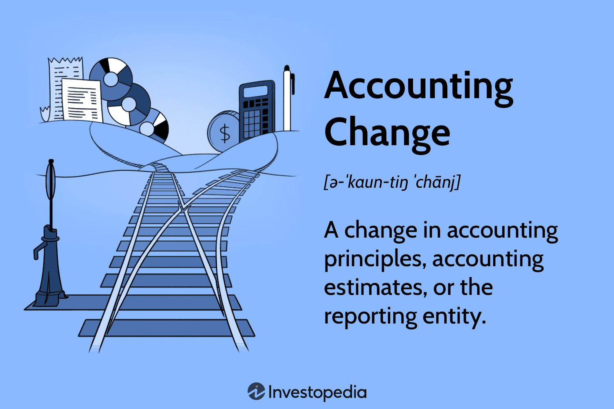

The world of finance continues to evolve with increasing complexity, driven by advancements in technology and changes in global business practices. This evolution necessitates a comprehensive understanding of financial reporting, accounting principles, and the impact of accounting changes, all of which are crucial for enterprises navigating this intricate landscape. Financial reporting comprises the preparation of vital documents such as balance sheets, income statements, and cash flow statements—tools essential for assessing a company’s fiscal health by various stakeholders, including investors and regulators. Consistency and transparency in these reports are maintained by adherence to standard accounting principles, which are the foundational guidelines for representing financial data accurately. 

In conjunction with these traditional financial concepts, algorithmic trading has emerged as a significant player in modern investing. This method employs computer algorithms to execute trades with high speed and volume, altering the financial landscape and creating new intersections with financial reporting. Understanding the synergies between algorithmic trading, accounting principles, financial reporting, and the ramifications of accounting changes allows businesses and investors to make more informed investment decisions amidst the constantly shifting dynamics of financial markets. As these elements intertwine, a robust understanding ensures that entities remain agile, knowledgeable, and well-prepared to capitalize on the opportunities within the evolving financial world.

## Table of Contents

## Understanding Financial Reporting

Financial reporting involves the preparation of financial statements that summarize a company's financial status and performance over a specific period. These statements are vital as they serve as the primary means of communicating financial information to stakeholders, including investors, regulators, and management, enabling them to make informed assessments and decisions regarding the company.

The core components of financial reporting are the balance sheet, income statement, and cash flow statement:

1. **Balance Sheet**: Also known as the statement of financial position, the balance sheet provides a snapshot of a company's assets, liabilities, and shareholders' equity at a specific point in time. It is based on the accounting equation:
$$
   \text{Assets} = \text{Liabilities} + \text{Shareholders' Equity}

$$

   This statement is crucial for understanding what the company owns and owes and the invested capital's structure.

2. **Income Statement**: The income statement, or profit and loss statement, outlines the company's revenues, expenses, and profits over a reporting period. The primary equation guiding this statement is:
$$
   \text{Net Income} = \text{Revenues} - \text{Expenses}

$$

   This report aids in assessing the company's operational efficiency and profitability.

3. **Cash Flow Statement**: This statement provides an analysis of cash inflows and outflows from operations, investing, and financing activities. The cash flow statement helps stakeholders understand how the company generates and uses cash, which is critical for assessing liquidity and solvency.

Consistency and transparency in financial reporting are achieved through adherence to standardized accounting principles such as the Generally Accepted Accounting Principles (GAAP) and International Financial Reporting Standards (IFRS). These frameworks ensure that financial information is reliable, comparable, and understandable across different companies and jurisdictions.

Effective financial reporting is essential for maintaining stakeholder confidence and supporting economic decision-making processes. Moreover, precise financial reporting aids in benchmarking a company's financial performance against industry peers and historical data.

## Key Accounting Principles

Accounting principles are foundational assumptions, rules, and guidelines that guide the preparation and presentation of financial statements. These principles ensure that the financial data presented by companies is consistent, reliable, and comparable, making it easier for stakeholders such as investors, analysts, and regulators to make informed decisions.

One of the core principles is the **Revenue Recognition Principle**. This principle dictates that revenue should be recognized in the accounting period in which it is earned, regardless of when the cash is actually received. This aligns with the accrual basis of accounting as opposed to cash accounting. For instance, if a company delivers a product or provides a service in December, the revenue is recognized in December, even if payment is received in January. This principle ensures that financial statements accurately reflect a company's financial activities within specific time periods.

Another essential principle is the **Matching Principle**, which requires that expenses be matched to the revenues they generate within the same accounting period. This principle supports the accrual basis of accounting by ensuring that each period’s profits are accurately represented. For example, if a company incurs costs to produce a product sold in the same period, those costs should be reported in the same period as the revenue from the sale of the product. This practice provides a more accurate picture of a company's financial performance during a given period.

The **Full Disclosure Principle** mandates that all significant financial information be disclosed in a company's financial statements. This encompasses any information that could influence a reader’s understanding of the financial data, including potential risks, uncertainties, or changes in accounting policies. For example, if a company changes its depreciation method, this change must be disclosed in the notes to the financial statements so that stakeholders can understand its impact on financial results.

Together, these principles form the backbone of accounting standards such as Generally Accepted Accounting Principles (GAAP) in the United States or International Financial Reporting Standards (IFRS) internationally. By promoting reliability and comparability across businesses, these principles enable stakeholders to evaluate and compare financial health and performance accurately. Such consistency is vital for maintaining the integrity and transparency of financial markets.

## Accounting Changes and Their Impact

Accounting changes encompass modifications in accounting principles, estimates, or the reporting entity, each with significant implications for how a company's financial health is perceived. Such changes need to be promptly disclosed to stakeholders to maintain transparency and trust. This disclosure ensures that stakeholders, including investors and regulators, understand the nature and financial impact of the changes being implemented.

### Types of Accounting Changes

1. **Changes in Accounting Principles:** These refer to the switch from one accepted accounting principle to another. An example is transitioning from the Last In, First Out (LIFO) to the First In, First Out (FIFO) inventory valuation method. This shift can alter the cost of goods sold and ending inventory figures, thereby impacting net income and various financial ratios. For instance, during periods of rising prices, FIFO generally results in lower cost of goods sold and higher ending inventory values compared to LIFO, leading to higher reported net income.

2. **Changes in Accounting Estimates:** These involve adjustments to the accounting estimates used in financial reporting. Estimates are inherently uncertain and could include items such as bad debt provisions, depreciation methods, and inventory obsolescence. Such changes do not require a restatement of prior financial statements, as they reflect new information or updated expectations.

3. **Changes in Reporting Entity:** This occurs when there is a reorganization of the structure through which businesses are conducted or structured, such as consolidating financial statements of subsidiaries or merging entities. This can have substantial effects on how consolidated statements appear and are interpreted by stakeholders.

### Disclosure and Impact on Financial Health

Under the relevant accounting standards, companies are mandated to disclose changes in accounting principles or estimates in their financial statements. This disclosure typically includes the nature and reason for the change, along with its financial impact. The financial impact may include a restatement of previous financial results to provide a consistent basis for comparison.

These changes have significant implications for financial health assessments:
- **Impact on Key Financial Metrics:** Changing from LIFO to FIFO affects gross margin, tax liability, and net income, thereby altering ratios such as return on assets (ROA) and current ratio.
- **Market Perception and Valuation:** Investors and analysts use financial statements to gauge a company's performance and valuation. Accounting changes can thus influence stock prices and the cost of capital.

### Monitoring and Managing Changes

Careful monitoring of accounting changes is critical. This involves analyzing the financial impact, communicating effectively with stakeholders, and ensuring compliance with accounting standards such as the International Financial Reporting Standards (IFRS) or Generally Accepted Accounting Principles (GAAP).

In summary, accounting changes can substantially alter the perceived financial health of a business. It is imperative for the management to ensure comprehensive disclosure and align these changes with the objective of providing consistent and reliable financial information to users.

## The Role of Algorithmic Trading

Algorithmic trading leverages sophisticated computer algorithms to automate and optimize the execution of trades. By utilizing predefined instructions that account for variables such as timing, price, and [volume](/wiki/volume-trading-strategy), [algorithmic trading](/wiki/algorithmic-trading) offers the potential for high-speed and high-volume transactions that are often beyond human capability. This form of trading enhances the efficiency of markets by enabling rapid execution and increased [liquidity](/wiki/liquidity-risk-premium).

From an accounting perspective, algorithmic trading demands meticulous record-keeping and precise performance measurement. The need for accuracy extends to the comprehensive documentation of each trade's parameters and outcomes, ensuring that all financial activities can be tracked and analyzed after execution. This precise record-keeping is essential not only for evaluating the performance of trading strategies but also for regulatory purposes.

Integration with financial reporting systems is a critical aspect of algorithmic trading. Financial reporting systems serve as centralized hubs that provide real-time data analysis and ensure regulatory compliance. These systems aggregate data from various sources, enabling traders and analysts to have access to up-to-date information essential for effective decision-making. For instance, there are platforms that automatically compile and reconcile transactions into financial statements, supporting transparency and accountability.

Regulatory compliance is another pivotal dimension of algorithmic trading. Laws and frameworks like the International Financial Reporting Standards (IFRS) and Generally Accepted Accounting Principles (GAAP) form the backbone of regulatory requirements in financial reporting. Compliance with these standards requires sophisticated systems that can manage large volumes of data efficiently and maintain real-time accuracy. Algorithmic trading platforms often include features to ensure that all trading activities adhere to these stringent standards, thereby reducing the risk of financial misreporting.

In summary, algorithmic trading represents a significant leap forward in the capabilities of financial markets. By combining high-speed algorithmic execution with robust accounting practices and integration with comprehensive financial reporting systems, this trading method not only improves market operations but also upholds the standards necessary for regulatory compliance and financial transparency.

## Regulatory Compliance and Challenges

Ensuring regulatory compliance in financial reporting is a fundamental aspect of financial management, especially for algorithmic trading operations. The complexity and speed associated with algorithmic trading necessitate adherence to established compliance frameworks, ensuring fair and transparent market practices. Two primary frameworks dominate global financial reporting: the International Financial Reporting Standards (IFRS) and the Generally Accepted Accounting Principles (GAAP).

### Compliance Frameworks: IFRS and GAAP

IFRS, established by the International Accounting Standards Board (IASB), provides a global language for business affairs, ensuring that company accounts are understandable and comparable across international boundaries. On the other hand, GAAP, primarily used in the United States, is a framework of accounting standards, conventions, and rules.

Both frameworks provide comprehensive guidelines covering various aspects of financial reporting, crucial for maintaining standardization in the financial statements. Algorithmic trading platforms must integrate these frameworks to ensure that their financial reporting is not only accurate but also transparent, readily meeting the scrutiny of regulators and stakeholders alike.

### Challenges in Algorithmic Trading

Algorithmic trading poses unique challenges concerning regulatory compliance. A significant challenge is maintaining real-time accuracy. The very nature of algorithmic trading involves executing a large number of transactions in fractions of a second. This [high frequency](/wiki/high-frequency-trading) of transactions makes it imperative that financial records are updated in real time to reflect the most accurate data for reporting purposes.

Another challenge is the efficient processing of large volumes of financial data. Algorithmic systems can generate vast amounts of data that need to be processed, analyzed, and reported in compliance with regulatory standards. Financial institutions must employ robust data management solutions to handle this information effectively. Technologies such as big data analytics and cloud computing play a pivotal role in managing and interpreting this data flow.

### Strategies for Ensuring Compliance

Financial institutions can utilize various strategies to ensure compliance with regulatory requirements. Implementing automated systems for real-time reporting and audit trails can enhance data accuracy and transparency. Additionally, employing [machine learning](/wiki/machine-learning) algorithms can assist in detecting anomalies or patterns that may indicate non-compliance or the need for adjustments in reporting mechanisms.

Furthermore, regular audits and system checks are essential to verify the integrity and compliance of financial systems. Training programs for staff involved in financial reporting and algorithmic trading operations can also enhance understanding and execution of compliance requirements effectively.

In conclusion, while regulatory compliance within algorithmic trading operations presents significant challenges, adopting structured frameworks such as IFRS and GAAP, combined with advanced technological solutions, can facilitate effective compliance management, ensuring that trading practices align with regulatory expectations and uphold market integrity.

## Conclusion

As financial markets continue to evolve, integrating robust accounting practices into algorithmic trading is becoming essential. Adhering to established accounting principles provides transparency and consistency, which are vital for building and maintaining stakeholder trust in increasingly automated trading environments. Accounting principles such as revenue recognition, full disclosure, and the matching principle help ensure that financial information is both reliable and comparable across different entities.

Transparency in trading operations is particularly critical in algorithmic trading due to the high speed and volume of transactions. Accurate and consistent financial reporting allows for real-time data analysis, essential for making informed decisions and ensuring regulatory compliance. By incorporating these practices, businesses can mitigate risks and improve decision-making processes, ultimately leading to enhanced financial performance and competitiveness.

Furthermore, the seamless integration of accounting systems with algorithmic trading platforms enables businesses to efficiently process and report vast amounts of trade data. This not only aids in compliance with frameworks like International Financial Reporting Standards (IFRS) and Generally Accepted Accounting Principles (GAAP) but also facilitates performance assessment and strategic planning.

In conclusion, businesses that successfully navigate the complexities of financial reporting and algorithmic trading position themselves for greater financial success. By leveraging sound accounting practices, companies can achieve operational excellence and maintain the trust of investors and regulators in dynamic financial markets.

## References & Further Reading

[1]: ["Conceptual Framework for Financial Reporting"](https://www.ifrs.org/content/dam/ifrs/publications/pdf-standards/english/2021/issued/part-a/conceptual-framework-for-financial-reporting.pdf) - International Financial Reporting Standards (IFRS)

[2]: ["Accounting Changes and Error Corrections"](https://kpmg.com/kpmg-us/content/dam/kpmg/frv/pdf/2024/handbook-accounting-changes-error-corrections-nov-2024.pdf) - Financial Accounting Standards Board (FASB)

[3]: ["GAAP: Generally Accepted Accounting Principles"](https://www.investopedia.com/terms/g/gaap.asp) - Investopedia

[4]: ["Algorithmic Trading and the Modern Investment Landscape"](https://medium.com/the-investors-handbook/the-rise-of-algorithmic-trading-how-tech-is-transforming-wall-street-d7667c6e0c1f) - J.P. Morgan

[5]: Hull, J. C. (2022). ["Options, Futures, and Other Derivatives"](https://www.pearson.com/en-us/subject-catalog/p/options-futures-and-other-derivatives/P200000005938/9780136939917). Pearson Education.

[6]: ["Financial Instruments and International Accounting"](https://www.ifrs.org/issued-standards/list-of-standards/ifrs-9-financial-instruments/) - IFRS 9 Financial Instruments