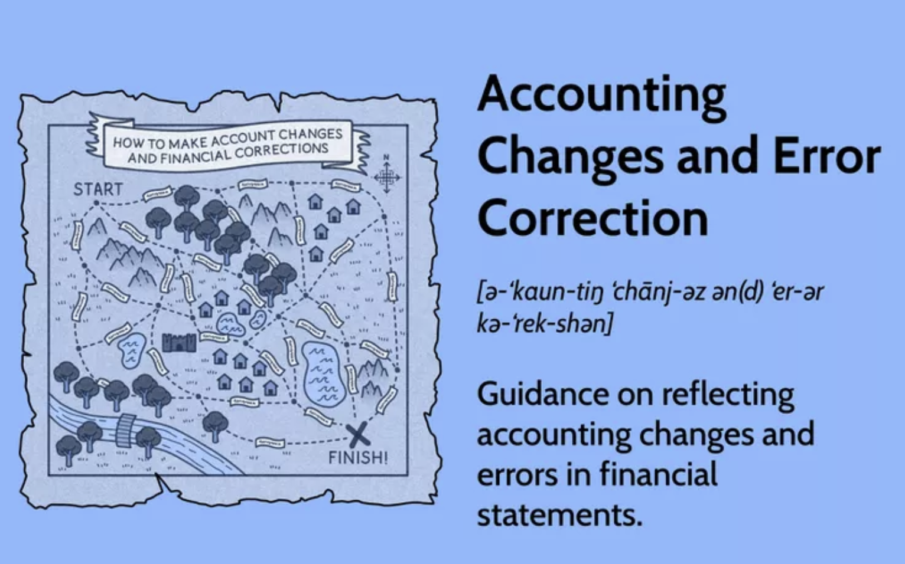

## Table of Contents

## What is accounting?

Accounting is the process of recording, summarizing, and analyzing financial transactions of a business. It helps to keep track of how much money is coming in and going out, and where it is being spent. This information is important for business owners, managers, and investors to make smart decisions about the company's future.

Accounting also involves creating financial statements, like the income statement and balance sheet, which show the financial health of the business. These statements help people outside the company, like banks and investors, understand how well the business is doing. By following accounting rules and standards, businesses can make sure their financial information is accurate and trustworthy.

## What are accounting changes?

Accounting changes happen when a business decides to do things differently with its money records. There are three main types of accounting changes: changing how you count your money (like switching from one method to another), fixing mistakes from the past, and changing how you guess future money (like how long a machine will last). These changes can affect how a business looks on paper, so it's important to tell everyone about them clearly.

When a business makes an accounting change, it needs to explain it in its financial reports. This helps people like investors and banks understand why the numbers might look different this year compared to last year. By being open about these changes, a business can keep trust with everyone who looks at its money records. It's like telling a friend why you did something different, so they don't get confused or worried.

## What types of accounting changes exist?

There are three main types of accounting changes: changing the way you count your money, fixing past mistakes, and changing how you guess future money. Changing the way you count your money means switching from one accounting method to another. For example, a business might decide to count its inventory differently. Fixing past mistakes means correcting errors that were made in earlier financial reports. This helps make sure the numbers are right. Changing how you guess future money involves updating estimates about things like how long a machine will last or how much money a customer owes.

When a business makes these changes, it's important to tell everyone about them clearly. This helps people like investors and banks understand why the numbers might look different from one year to the next. By being open about these changes, a business can keep trust with everyone who looks at its financial reports. It's like explaining to a friend why you did something different, so they don't get confused or worried.

## How are changes in accounting principles handled?

When a business decides to change how it counts its money, like switching from one accounting method to another, it's called a change in accounting principle. This might happen if a business thinks a new method will show its money situation more clearly. When this change happens, the business needs to explain it in its financial reports. This helps everyone who looks at the reports, like investors and banks, understand why the numbers might look different this year compared to last year. By being open about the change, the business keeps trust with everyone who depends on its financial information.

To handle a change in accounting principle, the business must use the new method for all future financial reports. It also needs to go back and change the old reports to match the new method, so everything looks consistent. This is called restating the financial statements. It's a bit like fixing a story you told your friend so it makes more sense. By doing this, the business makes sure that its financial information is accurate and trustworthy, helping everyone understand its true financial health.

## What is the difference between a change in accounting estimate and a change in accounting principle?

A change in accounting estimate happens when a business updates its guesses about future money. This could be about how long a machine will last or how much money a customer owes. These guesses are important because they help the business figure out how much money it has now and will have later. When these guesses change, the business doesn't go back and fix old reports. Instead, it just uses the new guess for future reports. It's like changing your mind about how long a toy will last and then planning your future playtime around that new idea.

A change in accounting principle, on the other hand, is when a business switches from one way of counting its money to another. This might happen if the business thinks the new way will show its money situation more clearly. When this happens, the business needs to explain the change in its financial reports. It also goes back and changes the old reports to match the new way, so everything looks the same. This is called restating the financial statements. It's like deciding to use a different math method to solve problems and then going back to fix all the old problems you solved with the old method.

## How should accounting changes be reported in financial statements?

When a business makes a change in how it counts its money, like switching from one accounting method to another, it needs to tell everyone about it in its financial statements. This is called a change in accounting principle. The business should explain the change clearly so that people like investors and banks understand why the numbers might look different this year compared to last year. It also needs to go back and change the old financial statements to match the new method. This is called restating the financial statements. By doing this, the business makes sure that its financial information is accurate and trustworthy.

If a business updates its guesses about future money, like how long a machine will last or how much money a customer owes, it's called a change in accounting estimate. These guesses are important for figuring out how much money the business has now and will have later. When these guesses change, the business doesn't go back and fix the old financial statements. Instead, it just uses the new guess for future reports. This way, the business keeps its financial information up to date without changing the past.

If a business finds mistakes in its old financial statements, it needs to fix them. This is called a change in accounting due to error correction. The business should explain the mistake and how it was fixed in its financial statements. It also needs to go back and change the old financial statements to correct the mistake. This helps everyone understand the true financial health of the business. By being open about these changes, the business keeps trust with everyone who looks at its financial reports.

## What is an accounting error?

An accounting error is when a business makes a mistake in its money records. This can happen if someone writes down the wrong number, forgets to record a sale, or mixes up numbers by accident. These mistakes can make the business's financial reports look wrong, which can confuse people like investors and banks who look at them.

When a business finds an accounting error, it needs to fix it. This means going back to the old financial reports and changing them to show the right numbers. The business should also explain the mistake and how it was fixed in its new financial reports. By doing this, the business makes sure that everyone understands its true financial situation and keeps trust with those who rely on its financial information.

## How are accounting errors identified?

Accounting errors are found when someone checks the money records carefully. This can happen during regular checks, called audits, where people look at all the numbers to make sure they are right. Sometimes, a business might use special computer programs to help find mistakes. These programs can spot things like numbers that don't add up or records that are missing.

Other times, errors are found when someone notices that the financial reports don't make sense. For example, if the numbers show that the business made a lot more money than expected, it might mean there's a mistake. People in the business, like accountants or managers, might also find errors when they are working on the money records every day. By keeping a close eye on the numbers and using tools to help, businesses can catch and fix errors before they cause big problems.

## What are the steps to correct an accounting error?

When a business finds a mistake in its money records, it needs to fix it right away. The first step is to figure out what the mistake is and where it happened. This might mean going back through old records or using special computer programs to help find the error. Once the mistake is found, the business needs to understand how it affected the financial reports. This helps them know what needs to be changed to make the numbers right again.

After understanding the mistake, the business goes back and changes the old financial reports to fix the error. This is called restating the financial statements. They make sure all the numbers are correct and match what really happened. The business also needs to explain the mistake and how it was fixed in its new financial reports. This way, everyone who looks at the reports, like investors and banks, knows what happened and can trust the numbers. By fixing errors quickly and clearly, the business keeps its financial information accurate and trustworthy.

## How does the correction of an error affect financial statements?

When a business finds a mistake in its money records, it needs to fix it. This means going back to the old financial reports and changing them to show the right numbers. If the business made a mistake and said it had more money than it really did, fixing the error will show that it actually had less money. On the other hand, if the mistake made it look like the business had less money, fixing it will show that it had more. These changes can make the financial reports look very different from before.

The business also needs to tell everyone about the mistake and how it was fixed in its new financial reports. This helps people like investors and banks understand what happened and why the numbers changed. By being open about the error and fixing it, the business keeps trust with everyone who looks at its financial reports. It's important for the business to make sure its financial information is accurate and trustworthy, so everyone can see its true financial health.

## What are the implications of accounting changes and error corrections for stakeholders?

When a business changes how it counts its money or fixes mistakes in its records, it can affect people who care about the business, like investors and banks. These changes can make the financial reports look different, which might make investors worried or confused. If the business switches to a new way of counting its money, it needs to explain why it made the change. This helps investors understand if the new way shows the business's money situation more clearly. If the business fixes a mistake, it needs to tell everyone about the mistake and how it was fixed. This helps keep trust with investors and banks, so they know the numbers are right.

These changes and corrections can also affect how much people trust the business. If a business is open about why it made a change or fixed a mistake, it shows that it cares about being honest and accurate. This can make investors feel more confident about the business's financial health. On the other hand, if a business doesn't explain these changes well, it might make investors think there are more problems or that the business isn't being honest. By being clear and open, the business helps everyone understand its true financial situation and keeps trust with its stakeholders.

## How do international accounting standards (IFRS) differ from U.S. GAAP in handling accounting changes and error corrections?

International Financial Reporting Standards (IFRS) and U.S. Generally Accepted Accounting Principles (GAAP) have some differences in how they handle changes in accounting and fixing mistakes. Under IFRS, if a business changes its way of counting money, it usually needs to explain the change and use the new way from that point forward. But, it doesn't always have to go back and change old financial reports like U.S. GAAP often requires. IFRS also says that if a business makes a guess about future money and that guess changes, it just uses the new guess for future reports without changing the past.

When it comes to fixing mistakes, both IFRS and U.S. GAAP say that businesses should correct them. But, U.S. GAAP is stricter about going back and changing old financial reports to fix the mistake. IFRS gives businesses a bit more flexibility and might not require them to change old reports if the mistake isn't very important. Both sets of rules want businesses to be clear about any changes or mistakes, but they do it in slightly different ways to make sure everyone understands the business's true financial health.

## References & Further Reading

[1]: Financial Accounting Standards Board. ["Accounting Standards Codification."](https://fasb.org/standards) FASB.

[2]: International Accounting Standards Board. ["IFRS Standards."](https://www.ifrs.org/groups/international-accounting-standards-board/) IFRS Foundation.

[3]: Cartea, A., Jaimungal, S., & Penalva, J. (2015). ["Algorithmic and High-Frequency Trading."](https://assets.cambridge.org/97811070/91146/frontmatter/9781107091146_frontmatter.pdf) Cambridge University Press.

[4]: SEC.gov. ["Introduction to Algorithmic Trading Strategies."](https://www.sec.gov/files/Algo_Trading_Report_2020.pdf) U.S. Securities and Exchange Commission.

[5]: European Securities and Markets Authority. ["MiFID II/MiFIR."](https://www.esma.europa.eu/publications-and-data/interactive-single-rulebook/mifid-ii) ESMA.

[6]: Pástor, Ľ., & Veronesi, P. (2006). ["Was There a Nasdaq Bubble in the Late 1990s?"](https://www.sciencedirect.com/science/article/pii/S0304405X05002163) Journal of Financial Economics.

[7]: ["The Intelligent Investor"](https://en.wikipedia.org/wiki/The_Intelligent_Investor) by Benjamin Graham