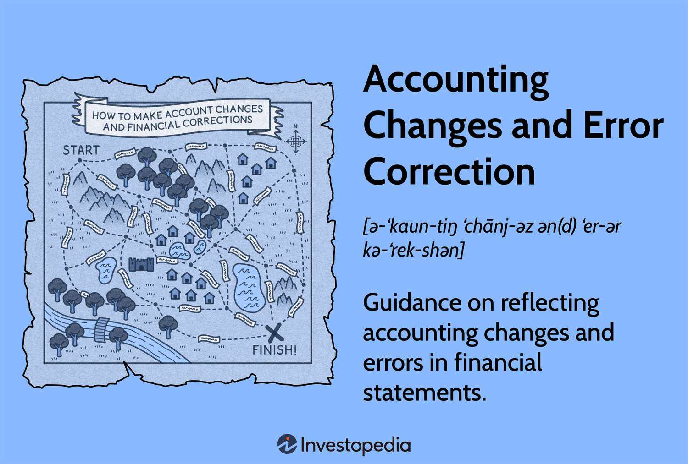

Accurate and reliable financial reporting is fundamental in the contemporary financial landscape, characterized by rapid technological advancements and evolving regulatory demands. Stakeholders, including investors, regulatory bodies, and financial analysts, rely heavily on financial reports for decision-making processes, emphasizing their critical role. This article will explore essential components of modern financial management: financial reporting, accounting changes, error correction, and algorithmic trading.

Financial reporting serves as the backbone of transparency and accountability in the corporate world. The integrity of these reports builds investor confidence and ensures adherence to regulatory standards. In contrast, inaccurate or misleading financial statements can result in severe legal repercussions and considerable financial losses, highlighting the necessity for meticulous financial documentation.



Central to financial reporting are the mechanisms of accounting changes and error corrections. Accounting changes refer to modifications in accounting principles, changes in accounting estimates, or adjustments in reporting entities. Error correction, on the other hand, involves the rectification of inaccuracies in previously issued financial statements, such as misclassifications or computational errors. The Financial Accounting Standards Board (FASB) and the International Accounting Standards Board (IASB) establish the benchmarks and standards for these processes, ensuring consistency and reliability in financial documentation.

Moreover, the article will address algorithmic trading, an influential component of modern finance that employs computational power to automate trading strategies. While effective in enhancing market liquidity and exploiting market efficiencies, algorithmic trading also introduces systemic risks necessitating stringent regulatory oversight.

In addition, insights into the regulatory frameworks that oversee these processes will be presented. As financial markets evolve, so do the regulations, seeking to balance innovation with safety nets to prevent systemic crises and protect market participants. Compliance with these frameworks is imperative for organizations wishing to maintain their reputations and avoid substantial financial penalties.

In summary, this article underscores the significance of understanding and implementing accurate financial reporting practices, accounting changes, error correction protocols, and algorithmic trading while adhering to evolving regulatory standards.

## Table of Contents

## Understanding Financial Reporting

Financial reporting represents the systematic provision of financial outcomes and pertinent data to stakeholders, acting as a cornerstone in enabling well-informed decision-making. Through financial reports, organizations offer insights into their financial health and performance, which stakeholders such as investors, regulators, and management use to make critical decisions. This process includes preparing financial statements that detail the organization's financial position, operational results, and cash flows over a specified period.

Accurate financial reporting is indispensable for maintaining investor confidence. Stakeholders rely heavily on the integrity and precision of financial reports to make decisions regarding investment, lending, and other financial engagements. When these reports are perceived as trustworthy, they reinforce investor and market confidence, fostering an environment where capital is more readily accessible to businesses.

Moreover, regulatory compliance depends on accurate financial reporting. Regulatory bodies such as the Securities and Exchange Commission (SEC) in the United States necessitate exact financial disclosures for the protection of investors and the public. These requirements ensure that companies adhere to stipulated accounting standards and principles. Noncompliance can lead to severe implications, including legal action, financial penalties, and damage to an organization’s reputation.

Conversely, inaccurate or fraudulent financial reporting can precipitate major legal and financial consequences. Accounting scandals, such as the Enron case in the early 2000s, underscore the disastrous effects of misreporting. Organizations involved in fraudulent reporting risk losing stakeholder trust, facing judicial scrutiny, and incurring steep financial losses. It exemplifies how inaccuracies in financial reporting can lead to corporate failures and economic disruption.

The implementation of robust internal controls, regular audits, and adherence to accounting standards, such as Generally Accepted Accounting Principles (GAAP) or International Financial Reporting Standards (IFRS), are crucial in safeguarding the accuracy and reliability of financial reporting. These frameworks ensure that financial reports are not only consistent and fair but also reflective of the true financial status of the entity, providing stakeholders with the assurance they need to engage with confidence.

## Accounting Changes and Error Correction

Accounting changes and error correction represent crucial elements in maintaining the integrity of financial statements. These aspects are vital for ensuring that financial reports accurately reflect an organization's financial status, thereby fostering transparency and trust among stakeholders.

**Accounting Changes**

Accounting changes refer to modifications in accounting principles, estimates, or the composition of reporting entities. Such changes are necessary to ensure that financial information remains relevant and accurately reflects changes in the business environment or operations.

1. **Change in Accounting Principle:** This type involves transitioning from one generally accepted accounting principle to another, which might be necessary if the new principle provides more reliable and relevant information. Implementation often requires retrospective adjustment, meaning previous financial statements are restated to maintain consistency over time.

2. **Change in Accounting Estimate:** Unlike changes in principle, changes in estimates impact current and future periods rather than necessitating restatement of past statements. These changes might result from new information or developments, such as adjustments in the useful life of an asset or changes in assumptions regarding future economic conditions.

3. **Change in Reporting Entity:** This involves modifications to the entities included in the consolidated financial statements. Such changes might occur due to mergers, acquisitions, or disposals, and require restatement of prior periods to reflect the new reporting entity structure.

**Error Correction**

Error correction addresses inaccuracies in previously issued financial statements. These errors can result from mathematical mistakes, mistakes in the application of accounting principles, or oversight and can significantly impact stakeholders' decision-making.

- **Identification and Rectification**: Upon discovery of an error, organizations must quantify its impact and restate affected financial statements. This involves correcting errors in previously reported figures and providing disclosures to explain the nature of the error and its financial effect.

**Regulatory Oversight**

The standards governing accounting changes and error corrections are established by authoritative bodies such as the Financial Accounting Standards Board (FASB) and the International Accounting Standards Board (IASB). These bodies provide comprehensive guidelines to promote consistency, transparency, and comparability in financial reporting. Compliance with such standards is imperative to maintain investor confidence and avoid regulatory repercussions. 

Overall, understanding and implementing accounting changes and error correction protocols are essential to uphold the quality of financial reporting, thereby supporting effective decision-making and maintaining the trust of investors and regulatory agencies.

## Types of Accounting Changes

A change in accounting principle occurs when an entity switches from one set of accounting rules to another, such as from Generally Accepted Accounting Principles (GAAP) to International Financial Reporting Standards (IFRS). This shift necessitates the restatement of prior financial statements to ensure consistency and comparability across reporting periods. Such changes require comprehensive disclosure to users of financial statements, detailing the rationale and implications of the switch. This process can involve significant adjustments in figures, as entities need to recalculate past results under the new framework to provide a consistent basis for comparison.

A change in accounting estimate is required when new information or developments necessitate an adjustment to the carrying value of an asset or liability. This change is often prospective, affecting only current and future periods, as opposed to retroactively altering past statements. Common examples include revisions to the estimated useful life of assets, bad debt percentages, or warranty obligations. Such adjustments are crucial for maintaining accurate financial statements and ensuring that they reflect the latest conditions impacting an entity's financial position.

A change in reporting entity involves modifications to the group of entities whose results are consolidated into a single set of financial statements. This can occur due to mergers, acquisitions, or restructuring activities. When such changes are made, prior period financial statements are typically restated to present the new structure consistently, allowing stakeholders to better assess performance over time. Accurate reporting of these changes ensures stakeholders have a clear understanding of the entity's financial landscape and performance trajectory.

## Algorithmic Trading in Modern Finance

Algorithmic trading is a process that employs computer algorithms to automate the execution of trading orders. It hinges on speed and computational efficiency to exploit market opportunities. This method is designed to make trading decisions at a pace and accuracy level beyond human capability, often analyzing multiple markets and executing orders at the most favorable conditions.

One of the primary advantages of [algorithmic trading](/wiki/algorithmic-trading) is the enhancement of market [liquidity](/wiki/liquidity-risk-premium). By executing large volumes of trades across various markets instantly, algorithms help maintain a fluid and responsive trading environment. They improve the price discovery process by narrowing bid-ask spreads and ensuring a continuous alignment of trades with the market's supply and demand dynamics.

However, the systemic risks associated with algorithmic trading cannot be overlooked. If improperly regulated or monitored, the rapid and autonomous nature of algorithmic transactions can lead to phenomena such as flash crashes, where market prices drop precipitously within a very short timeframe. A notable example is the May 6, 2010, Flash Crash, which saw the Dow Jones Industrial Average plunge about 1,000 points—roughly 9%—only to recover those losses within minutes.

The continuous evolution of algorithmic trading is powered by advancements in algorithm design and [artificial intelligence](/wiki/ai-artificial-intelligence) (AI). Incorporating AI and [machine learning](/wiki/machine-learning) models into trading systems enables more sophisticated pattern recognition and predictive analytics, significantly influencing decision-making processes in financial markets. These tools analyze vast datasets to identify trends and execute trades based on statistical probabilities rather than mere historical data.

To get a sense of how algorithmic trading systems may operate, consider a simple Python example using a moving average crossover strategy, a common algorithmic trading approach:

```python
import pandas as pd

def generate_signals(data_frame):
    # Calculate short and long moving averages
    short_window = 40
    long_window = 100

    signals = pd.DataFrame(index=data_frame.index)
    signals['signal'] = 0.0

    # Generate short moving average
    signals['short_mavg'] = data_frame['price'].rolling(window=short_window, min_periods=1, center=False).mean()

    # Generate long moving average
    signals['long_mavg'] = data_frame['price'].rolling(window=long_window, min_periods=1, center=False).mean()

    # Create buy/sell signals
    signals['signal'][short_window:] = np.where(
        signals['short_mavg'][short_window:] > signals['long_mavg'][short_window:], 1.0, 0.0)

    # Generate trading orders
    signals['positions'] = signals['signal'].diff()

    return signals
```

In this example, a trading signal is generated when the short-term moving average crosses above the long-term moving average, prompting a buy order. Conversely, a signal to sell is triggered when the short-term average crosses below the long-term average. This basic strategy exemplifies the type of rules-based logic applied in more advanced algorithmic systems.

As financial markets grow more complex, the necessity for stringent regulation and monitoring of algorithmic trading becomes paramount. Regulatory bodies continue to refine rules to address potential risks, ensuring that algorithms contribute positively to market stability rather than detract from it. Key regulations and measures include circuit breakers—mechanisms to temporarily halt trading during significant market [volatility](/wiki/volatility-trading-strategies)—and stringent oversight of algorithm development and deployment.

In conclusion, while algorithmic trading represents a formidable evolution in asset trading, offering immense potential for efficiency and innovation, it requires robust frameworks to mitigate inherent risks. As the integration of sophisticated algorithms and AI evolves, the impact on market dynamics and structure will continue to be profound and far-reaching.

## Regulatory Frameworks and Compliance

FASB (Financial Accounting Standards Board) and IASB (International Accounting Standards Board) are pivotal in setting the standards that govern accounting changes and error corrections. Both organizations collaborate to provide comprehensive guidelines aimed at enhancing consistency, comparability, and transparency in financial reporting. These guidelines articulate the requirements for changes in accounting principles, updates in accounting estimates, and modifications within reporting entities.

Accounting standards issued by FASB, primarily under the Generally Accepted Accounting Principles (GAAP), and by IASB under the International Financial Reporting Standards (IFRS), serve as a foundational framework for businesses worldwide. When an entity identifies an error in its financial statements, these standards dictate the procedures for correcting the error. Adjustments are typically made retrospectively by revising prior financial statements and restating the comparative figures.

The evolving landscape of algorithmic trading necessitates regulatory adaptations to manage associated risks, such as those posed by high-frequency trading ([HFT](/wiki/high-frequency-trading-strategies)). These risks include potential market volatility and system integrity issues. In response, regulatory bodies have introduced frameworks that require transparency in automated trading systems. For instance, in the United States, the Securities and Exchange Commission (SEC) and Commodity Futures Trading Commission (CFTC) have established rules requiring disclosure of algorithmic trading strategies and rigorous risk management controls.

On a global scale, the European Union’s Markets in Financial Instruments Directive II (MiFID II) imposes stringent requirements on algorithmic trading activities, mandating pre-trade and post-trade transparency and robust transaction reporting mechanisms. These initiatives aim to bolster market integrity and protect investors.

Compliance with these regulatory frameworks is crucial for businesses, as non-compliance can result in substantial reputational damage and financial penalties. Effective internal controls and continuous monitoring of regulatory developments are essential to maintaining compliance. Organizations often invest in compliance programs and technologies to aid in the accurate implementation of accounting changes and error corrections and ensure their algorithmic trading activities align with regulatory expectations.

Businesses must remain vigilant, adapting to the evolving guidelines provided by FASB, IASB, and other regulatory bodies to mitigate risks and ensure the integrity and reliability of their financial reporting and trading practices.

## Conclusion

The landscape of financial reporting and trading is continually changing, with accounting changes, error correction, and algorithmic trading being critical components that demand attention. Staying informed about new accounting standards and error correction protocols is critical for ensuring that financial reports remain accurate and trustworthy. Robust financial reporting fortifies investor confidence and ensures regulatory compliance, which is foundational for the financial health and integrity of enterprises.

Algorithmic trading stands out as a transformative development in modern finance, maximizing speed and computing capabilities to enhance market dynamism. However, with these technological advancements comes the necessity for stringent oversight. Without careful regulation, the systemic risk posed by high-frequency trading could destabilize financial markets. 

Thus, businesses and financial professionals must commit to ongoing education regarding accounting and trading regulations. Adhering to these standards is not merely a compliance issue but a strategic approach to minimize risks and capitalize on opportunities in today’s fast-evolving financial environment. By integrating education, regulatory compliance, and strategic foresight, companies can adeptly navigate the complexities and demands of contemporary finance.

## References & Further Reading

[1]: Financial Accounting Standards Board. ["Accounting Standards Codification."](https://fasb.org/standards) FASB.

[2]: International Accounting Standards Board. ["IFRS Standards."](https://www.ifrs.org/groups/international-accounting-standards-board/) IFRS Foundation.

[3]: Cartea, A., Jaimungal, S., & Penalva, J. (2015). ["Algorithmic and High-Frequency Trading."](https://assets.cambridge.org/97811070/91146/frontmatter/9781107091146_frontmatter.pdf) Cambridge University Press.

[4]: SEC.gov. ["Introduction to Algorithmic Trading Strategies."](https://www.sec.gov/files/Algo_Trading_Report_2020.pdf) U.S. Securities and Exchange Commission.

[5]: European Securities and Markets Authority. ["MiFID II/MiFIR."](https://www.esma.europa.eu/publications-and-data/interactive-single-rulebook/mifid-ii) ESMA.

[6]: Pástor, Ľ., & Veronesi, P. (2006). ["Was There a Nasdaq Bubble in the Late 1990s?"](https://www.sciencedirect.com/science/article/pii/S0304405X05002163) Journal of Financial Economics.

[7]: ["The Intelligent Investor"](https://en.wikipedia.org/wiki/The_Intelligent_Investor) by Benjamin Graham