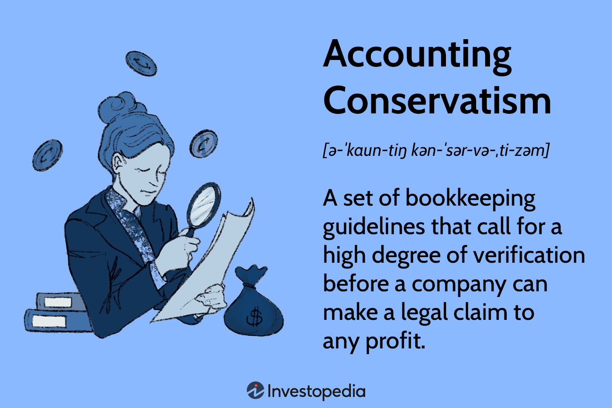

## Table of Contents

## What is accounting conservatism?

Accounting conservatism is a principle that guides accountants to be cautious when reporting financial information. It means that if there are two ways to record something, accountants should choose the one that shows less profit or a lower value of the company. This helps to avoid overstating how well the company is doing and protects investors from being misled by overly optimistic financial reports.

This principle is important because it helps to make sure that the financial statements are reliable and trustworthy. By being conservative, accountants can prevent the company from looking better than it really is. This can be especially helpful during uncertain times when it's hard to predict future outcomes. Overall, accounting conservatism helps to keep financial reporting honest and cautious.

## Why is accounting conservatism important in financial reporting?

Accounting conservatism is important in financial reporting because it helps to make sure that the numbers in a company's financial statements are honest and careful. When accountants use conservatism, they choose to show lower profits or asset values if there is any doubt. This helps to protect investors and other people who use the financial statements by making sure they don't get a false idea that the company is doing better than it really is.

This principle is especially helpful during times when it's hard to predict what will happen in the future. For example, if a company is not sure if it will get paid for a sale, conservatism says to wait until the payment is certain before counting it as income. This cautious approach helps to build trust in the financial statements because people know the numbers are not overstated. In the end, accounting conservatism helps to keep financial reporting reliable and trustworthy.

## What are the basic principles of accounting conservatism?

Accounting conservatism means being careful when making financial reports. The main idea is to choose the option that shows lower profits or lower values for the company's assets if there is any doubt. This helps to make sure that the financial statements are not too optimistic and that they show a realistic view of the company's situation. By doing this, accountants can avoid overstating how well the company is doing, which is important for keeping the trust of investors and others who use the financial statements.

For example, if a company is not sure if it will get paid for a sale, conservatism says to wait until the payment is certain before counting it as income. This cautious approach helps to build trust in the financial statements because people know the numbers are not overstated. Overall, accounting conservatism helps to keep financial reporting reliable and trustworthy, making sure that the financial statements give a fair and honest picture of the company's financial health.

## Can you explain the difference between conservative and aggressive accounting?

Conservative accounting and aggressive accounting are two different ways accountants can handle financial reporting. Conservative accounting means being careful and choosing to show lower profits or lower values for the company's assets if there is any doubt. This helps to make sure that the financial statements are not too optimistic and that they show a realistic view of the company's situation. By doing this, accountants can avoid overstating how well the company is doing, which is important for keeping the trust of investors and others who use the financial statements.

On the other hand, aggressive accounting means choosing to show higher profits or higher values for the company's assets, even if there is some uncertainty. This can make the company look better than it really is, which might attract more investors or make the company seem more successful. However, aggressive accounting can be risky because if the high values or profits don't turn out to be true, it can lead to big problems and loss of trust from investors and others who rely on the financial statements.

In simple terms, conservative accounting is like being cautious and playing it safe, while aggressive accounting is more like taking risks to make the company look better. Both approaches have their place, but conservative accounting is often seen as more reliable and trustworthy because it helps to prevent over-optimism and keeps financial reporting honest.

## What are some common examples of accounting conservatism in practice?

One common example of accounting conservatism is how companies handle revenue recognition. If a company makes a sale but isn't sure if they will get paid, they will wait until the payment is certain before counting it as income. This means they don't show the sale as profit right away, which keeps the financial statements more accurate and realistic. It's like being careful and not counting your chickens before they hatch.

Another example is how companies value their inventory. If the value of the inventory goes down, conservative accounting says to lower the value of the inventory on the financial statements right away. This is called writing down the inventory. By doing this, the company shows a lower value for its assets, which is a safer and more honest way to report their financial situation. It helps to make sure that the financial statements are not too optimistic and reflect the true value of what the company owns.

A third example is how companies deal with potential losses. If there is a chance that the company might lose money in the future, like from a lawsuit, conservative accounting says to set aside money for that possible loss right away. This is called creating a liability or a reserve. By doing this, the company shows a lower profit or higher expense, which is a cautious way to make sure the financial statements are not overstating how well the company is doing. It helps to keep the financial reporting honest and reliable.

## How does accounting conservatism affect financial statements?

Accounting conservatism affects financial statements by making them show lower profits or lower values for the company's assets if there is any doubt. This means that if a company is not sure if it will get paid for a sale, it won't count that sale as income right away. Instead, it waits until the payment is certain. This careful approach helps to make sure the financial statements are not too optimistic and give a more realistic picture of the company's situation. By being conservative, the company can avoid overstating how well it is doing, which is important for keeping the trust of investors and others who use the financial statements.

Another way accounting conservatism affects financial statements is through the valuation of inventory. If the value of the inventory goes down, conservative accounting says to lower the value of the inventory on the financial statements right away. This is called writing down the inventory. By doing this, the company shows a lower value for its assets, which is a safer and more honest way to report their financial situation. It helps to make sure that the financial statements are not too optimistic and reflect the true value of what the company owns. Overall, accounting conservatism helps to keep financial reporting reliable and trustworthy, making sure that the financial statements give a fair and honest picture of the company's financial health.

## What are the advantages of applying accounting conservatism in businesses?

Applying accounting conservatism in businesses helps to make sure that the financial statements are honest and reliable. When a company uses conservative accounting, it chooses to show lower profits or lower values for its assets if there is any doubt. This careful approach helps to prevent the company from looking better than it really is. By doing this, the company can build trust with investors and other people who use the financial statements. They know that the numbers are not overstated and are a realistic view of the company's situation.

Another advantage of accounting conservatism is that it helps to protect the company during uncertain times. For example, if a company is not sure if it will get paid for a sale, conservative accounting says to wait until the payment is certain before counting it as income. This helps to make sure that the financial statements are not too optimistic and reflect the true financial health of the company. By being cautious, the company can avoid big problems if things don't go as planned. Overall, accounting conservatism helps to keep financial reporting honest and reliable, which is important for the long-term success of the business.

## What are the potential disadvantages or criticisms of accounting conservatism?

One potential disadvantage of accounting conservatism is that it can make a company look less profitable than it really is. If a company always chooses to show lower profits or lower values for its assets, it might miss out on showing how well it is really doing. This can make it harder for the company to attract investors or get loans because the financial statements might look too cautious. Investors might think the company is not doing as well as it could be, which can affect the company's growth and opportunities.

Another criticism of accounting conservatism is that it can lead to less accurate financial reporting over time. If a company is always conservative, it might keep lowering the value of its assets or delaying the recognition of income. This can make it hard to see the true financial health of the company because the numbers might not reflect what is really happening. Over time, this can lead to a buildup of reserves or lower values that might not be necessary, which can make the financial statements less useful for making decisions.

## How does accounting conservatism impact decision-making by stakeholders?

Accounting conservatism can affect how stakeholders make decisions by making a company's financial statements look more cautious. When a company uses conservative accounting, it shows lower profits or lower values for its assets if there is any doubt. This can make investors think the company is not doing as well as it could be. They might decide not to invest in the company or to invest less because the financial statements look less promising. This cautious approach can also make it harder for the company to get loans or attract new business because stakeholders might see the company as less successful than it really is.

On the other hand, accounting conservatism can help build trust with stakeholders. When a company is careful with its financial reporting, it shows that it is trying to be honest and realistic. This can make investors and others feel more confident in the company's financial statements. They know the numbers are not overstated, and they can trust that the company is giving a fair view of its financial health. This trust can lead to better long-term relationships with stakeholders, even if the short-term financial statements look less impressive.

## In what ways can accounting conservatism influence a company's tax obligations?

Accounting conservatism can affect a company's tax obligations by showing lower profits on the financial statements. When a company uses conservative accounting, it waits until it's sure it will get paid before counting a sale as income. This means the company might report less income for tax purposes in the current year. By delaying the recognition of income, the company can lower its taxable income, which can lead to paying less in taxes for that year. This can be helpful for the company's cash flow, especially if it's facing uncertain times.

However, this approach can also have long-term effects on the company's tax situation. If the company keeps delaying the recognition of income, it might end up paying more taxes in future years when the income is finally recognized. This is because the income that was delayed will eventually have to be reported and taxed. So, while accounting conservatism can help reduce taxes in the short term, it might lead to higher tax payments later on. Companies need to think about these effects when deciding how to handle their financial reporting.

## How do international accounting standards address conservatism?

International accounting standards, like those set by the International Accounting Standards Board (IASB), do not directly promote conservatism in financial reporting. Instead, these standards aim for neutrality and fairness, trying to give a balanced view of a company's financial situation. The idea is to avoid being too optimistic or too pessimistic, so the financial statements are as accurate and unbiased as possible. This means that if there's a choice between showing higher or lower profits or asset values, the standards suggest [picking](/wiki/asset-class-picking) the option that best reflects the true situation, rather than always choosing the lower one.

However, some specific standards do have elements of conservatism built into them. For example, the rule for recognizing revenue says to wait until it's certain you'll get paid before counting it as income. This is a conservative approach because it keeps the financial statements from being too optimistic. Also, when it comes to valuing inventory, if the value goes down, the standards say to lower the value on the financial statements right away. This helps to make sure the numbers are not overstated. So, while international standards don't push for conservatism overall, certain rules within them can lead to more cautious financial reporting.

## What are the latest research findings on the effects of accounting conservatism on firm performance?

Recent research on accounting conservatism and its impact on firm performance shows mixed results. Some studies suggest that being conservative in financial reporting can help companies perform better in the long run. When a company uses conservative accounting, it shows lower profits or lower values for its assets if there is any doubt. This careful approach can build trust with investors and other stakeholders. They know the numbers are not overstated, which can make them more willing to invest in the company or do business with it. This trust can lead to better long-term performance because the company has more stable relationships with its stakeholders.

On the other hand, other research findings indicate that accounting conservatism can have negative effects on firm performance. When a company always chooses to show lower profits or lower values for its assets, it might miss out on showing how well it is really doing. This can make it harder for the company to attract investors or get loans because the financial statements might look too cautious. Investors might think the company is not doing as well as it could be, which can affect the company's growth and opportunities. So, while conservatism can build trust, it can also make it harder for the company to show its true potential and achieve short-term goals.

## References & Further Reading

[1]: Basu, S. (1977). ["Investment Performance of Common Stocks in Relation to Their Price-Earnings Ratios: A Test of the Efficient Market Hypothesis."](https://www.jstor.org/stable/2326304) The Journal of Finance, 32(3), 663-682.

[2]: Bushman, R. M., & Piotroski, J. D. (2006). ["Financial Reporting Incentives for Conservative Accounting: The Influence of Legal and Political Institutions."](https://www.sciencedirect.com/science/article/abs/pii/S0165410106000255) Journal of Accounting and Economics, 42(1-2), 107-148.

[3]: Ball, R., & Kothari, S. P. (2000). ["The Effects of International Institutional Factors on Properties of Accounting Earnings."](https://www.sciencedirect.com/science/article/abs/pii/S0165410100000124) Journal of Accounting and Economics, 29(1), 1-51.

[4]: "Financial Reporting and Analysis" by Charles H. Gibson

[5]: "Accounting for Managers: Interpreting Accounting Information for Decision-Making" by Paul M. Collier

[6]: Beaver, W. H., & Ryan, S. G. (2000). ["Biases and Lags in Book Value and Their Effects on the Ability of the Book-to-Market Ratio to Predict Book Return on Equity."](https://www.jstor.org/stable/2672925) Journal of Accounting Research, 38(1), 127-148.

[7]: "Principles of Accounting" by Belverd E. Needles